# KrakenD Operator — Proposed Architecture

> **Version:** 0.1.0-draft
> **Date:** 2026-04-03
> **Status:** Proposal
> **API Group:** `gateway.krakend.io/v1alpha1`

---

## Table of Contents

1. [Goals and Non-Goals](#1-goals-and-non-goals)
2. [High-Level Architecture](#2-high-level-architecture)
3. [Custom Resource Definitions](#3-custom-resource-definitions)
4. [CRD Interaction Model](#4-crd-interaction-model)
5. [Reconciliation Data Flow](#5-reconciliation-data-flow)
6. [Dragonfly Integration](#6-dragonfly-integration)
7. [External Secrets Integration](#7-external-secrets-integration)
8. [Istio Integration](#8-istio-integration)
9. [License Lifecycle Management](#9-license-lifecycle-management)
10. [Configuration Rendering Pipeline](#10-configuration-rendering-pipeline)
11. [Plugin Management](#11-plugin-management)
12. [Zero-Downtime Deployment Strategy](#12-zero-downtime-deployment-strategy)
13. [Security Model](#13-security-model)
14. [Operator RBAC Requirements](#14-operator-rbac-requirements)
15. [Status and Observability](#15-status-and-observability)
16. [OpenAPI Auto-Configuration](#16-openapi-auto-configuration)
17. [Directory Structure](#17-directory-structure)

---

## 1. Goals and Non-Goals

### Goals

- Declaratively manage KrakenD CE and EE API Gateway deployments via Kubernetes CRDs
- Allow multiple teams to independently publish endpoints to a shared gateway
- Render KrakenD Flexible Configuration from CRD state and trigger zero-downtime rolling deployments
- Optionally render a `Dragonfly` CR (via the [Dragonfly Operator](https://github.com/dragonflydb/dragonfly-operator)) for stateful EE features (cluster rate limiting, quota, token revocation)
- Integrate with External Secrets Operator for EE license provisioning from external secret stores
- Optionally create Istio VirtualService resources targeting a user-defined Istio Gateway for TLS/connection termination
- Monitor EE license expiry and proactively alert or fall back to CE before processes shut down
- Mount custom KrakenD plugins (`.so` files) via Kubernetes volumes without requiring custom image builds
- Automatically generate KrakenDEndpoint CRDs from OpenAPI (Swagger) specifications via the `KrakenDAutoConfig` CRD
- Validate generated KrakenD configurations before deployment (`krakend check -tlc`)

### Non-Goals

- **Not an Istio Gateway controller** — the operator does NOT create or manage Istio Gateway resources; it only creates VirtualService resources targeting an existing Gateway
- **Not a secret store** — the operator delegates secret storage to External Secrets Operator, Vault, or native K8s Secrets
- **Not a Dragonfly lifecycle manager** — the operator renders a `Dragonfly` CR (`dragonflydb.io/v1alpha1`); the [Dragonfly Operator](https://github.com/dragonflydb/dragonfly-operator) must be installed in the cluster to reconcile it into a running instance. Dragonfly Operator handles StatefulSet, Service, PVC, failover, and scaling.

---

## 2. High-Level Architecture

```mermaid
graph TB
    subgraph "Kubernetes Cluster"
        subgraph "Operator Namespace"
            OP[KrakenD Operator<br/>Controller Manager]
        end

        subgraph "Gateway Namespace"
            KG[KrakenDGateway CR]
            KE1[KrakenDEndpoint CR<br/>Team A]
            KE2[KrakenDEndpoint CR<br/>Team B]
            KE3[KrakenDEndpoint CR<br/>Team C]
            KBP[KrakenDBackendPolicy CR<br/>Shared Policies]

            CM[ConfigMap<br/>krakend.json]
            SEC[Secret<br/>LICENSE]
            DEP[Deployment<br/>KrakenD Pods]
            SVC[Service<br/>ClusterIP]
            SA[ServiceAccount]
            PDB[PodDisruptionBudget]
            HPA[HorizontalPodAutoscaler]

            DF[Dragonfly CR<br/>dragonflydb.io/v1alpha1]

            VS[Istio VirtualService]
            ES[ExternalSecret CR]

            AC[KrakenDAutoConfig CR]
        end

        subgraph "External Secrets Namespace"
            ESO[External Secrets<br/>Operator]
        end

        subgraph "Dragonfly Operator Namespace"
            DFO[Dragonfly Operator]
        end

        subgraph "Istio System"
            IG[Istio Gateway<br/>user-managed]
            IP[Istio IngressGateway<br/>Pods]
        end

        subgraph "Backend Namespaces"
            BE1[Backend Service A]
            BE2[Backend Service B]
            BE3[Backend Service C]
        end
    end

    subgraph "External"
        VAULT[Secret Store<br/>Vault / AWS SM / GCP SM]
        IDP[Identity Provider<br/>Auth0 / Keycloak]
    end

    OP -->|watches| KG
    OP -->|watches| KE1
    OP -->|watches| KE2
    OP -->|watches| KE3
    OP -->|watches| KBP
    OP -->|creates/updates| CM
    OP -->|creates/updates| DEP
    OP -->|creates/updates| SVC
    OP -->|creates/updates| SA
    OP -->|creates/updates| PDB
    OP -->|creates/updates| HPA
    OP -->|creates/updates| DF
    OP -->|creates/updates| VS
    OP -->|creates/updates| ES

    OP -->|watches| AC
    AC -->|generates| KE1
    AC -->|generates| KE2

    ESO -->|syncs| VAULT
    ESO -->|creates/updates| SEC
    ES -->|references| VAULT

    DEP -->|mounts| CM
    DEP -->|mounts| SEC
    DEP -->|redis protocol| DF
    DEP -->|routes to| BE1
    DEP -->|routes to| BE2
    DEP -->|routes to| BE3

    VS -->|targets| IG
    VS -->|routes to| SVC
    IP -->|routes via VS| SVC

    DEP -->|validates JWT| IDP

    KE1 -->|references| KG
    KE2 -->|references| KG
    KE3 -->|references| KG
    KE1 -.->|references| KBP
    KE2 -.->|references| KBP

    DFO -.->|reconciles| DF
```

---

## 3. Custom Resource Definitions

### 3.1 KrakenDGateway

The primary resource representing a KrakenD API Gateway deployment. One KrakenDGateway produces exactly one Deployment, one Service, one ConfigMap, and optionally a Dragonfly CR, Istio VirtualService, and ExternalSecret.

```yaml
apiVersion: gateway.krakend.io/v1alpha1
kind: KrakenDGateway
metadata:
  name: production-gateway
  namespace: api-gateway
spec:
  # --- Deployment ---
  edition: EE                          # CE or EE
  version: "2.13"                      # KrakenD version tag
  image: ""                            # Override: full image reference (ignores edition/version for image selection only; `edition` still controls config rendering)
  ceImage: ""                          # CE fallback image override (default: krakend/krakend:{version}); used when fallbackToCE=true and the operator switches from EE to CE
  replicas: 3                          # omitted from Deployment when autoscaling.enabled=true (HPA owns scaling)
  autoscaling:
    enabled: false
    minReplicas: 2
    maxReplicas: 10
    targetCPUUtilizationPercentage: 70

  resources:
    requests:
      cpu: "500m"
      memory: "256Mi"
    limits:
      cpu: "2"
      memory: "1Gi"

  # --- KrakenD Service-Level Configuration ---
  config:
    port: 8080
    timeout: "3s"
    cacheTTL: "0s"
    outputEncoding: json               # json, negotiate, no-op, etc.
    dnsCacheTTL: "30s"

    cors:
      allowOrigins: ["https://app.example.com"]
      allowMethods: ["GET", "POST", "PUT", "DELETE"]
      allowHeaders: ["Authorization", "Content-Type"]
      maxAge: "12h"

    security:
      sslRedirect: false               # false when behind Istio
      sslProxyHeaders:
        X-Forwarded-Proto: "https"     # trust Istio's header
      frameOptions: DENY
      contentTypeNosniff: true
      browserXssFilter: true
      hstsSeconds: 31536000
      contentSecurityPolicy: "default-src 'self';"

    logging:
      level: INFO                      # DEBUG, INFO, WARNING, ERROR, CRITICAL
      format: logstash                 # default, logstash
      stdout: true

    router:
      returnErrorMsg: true
      healthPath: /health
      autoOptions: true
      disableAccessLog: false

    telemetry:
      serviceName: krakend-gateway
      exporters:
        otlp:
          - host: otel-collector.monitoring
            port: 4317
        prometheus:
          - port: 9091
      layers:
        global:
          disableMetrics: false
          disableTraces: false

  # --- TLS (only when NOT using Istio) ---
  tls:
    enabled: false
    # publicKey: /path/to/cert.pem
    # privateKey: /path/to/key.pem
    # minVersion: "TLS13"

  # --- Plugin Management ---
  plugins:
    # Plugins are Go shared-object files (.so) mounted into the KrakenD pod.
    # They do NOT need to be compiled into the KrakenD image.
    sources:
      - name: custom-auth-plugin
        configMapRef:
          name: krakend-plugins-auth     # ConfigMap containing .so file(s) as binary data keys
        # --- OR from a PersistentVolumeClaim ---
        # persistentVolumeClaimRef:
        #   name: krakend-plugins         # PVC containing plugin .so files
        # --- OR from a container image (OCI artifact) ---
        # imageRef:
        #   image: registry.example.com/krakend-plugins:v1.2.0
        #   pullPolicy: IfNotPresent
        #   imagePullSecrets:            # for private registries
        #     - name: registry-creds
    # KrakenD plugin directory (mounted read-only into all KrakenD pods)
    mountPath: /opt/krakend/plugins      # default KrakenD plugin search path

  # --- Dragonfly / Redis ---
  # Requires: Dragonfly Operator (https://github.com/dragonflydb/dragonfly-operator) installed in the cluster
  dragonfly:
    enabled: true                      # operator renders a Dragonfly CR; Dragonfly Operator reconciles it
    image: "docker.dragonflydb.io/dragonflydb/dragonfly:v1.25.2"
    replicas: 2                        # total instances (1 primary + N-1 replicas); managed by Dragonfly Operator
    resources:
      requests:
        cpu: "250m"
        memory: "512Mi"
      limits:
        cpu: "1"
        memory: "2Gi"
    snapshot:
      cron: "*/30 * * * *"             # optional snapshot schedule
      persistentVolumeClaimSpec:
        accessModes: ["ReadWriteOnce"]
        resources:
          requests:
            storage: "10Gi"
        # storageClassName: ""         # default storage class
    args: []                           # additional Dragonfly server flags
    authentication:
      passwordFromSecret:
        name: dragonfly-auth
        key: password
    # --- OR skip CR creation (use external Redis/Dragonfly via redis.connectionPool) ---
    # enabled: false

  # --- Redis Connection Pool (maps to KrakenD EE `redis` extra_config) ---
  redis:
    connectionPool:
      addresses: []                    # user-set for external Redis only; when dragonfly.enabled=true, operator derives address internally — leave empty
      password:                          # only used when dragonfly.enabled=false (external Redis/Dragonfly)
        secretRef:
          name: ""
          key: ""
      poolSize: 50
      minIdleConns: 10
      dialTimeout: "5s"
      readTimeout: "3s"
      writeTimeout: "3s"
      tls:                             # only used when dragonfly.enabled=false (external Redis/Dragonfly)
        enabled: false
        secretName: ""               # Opaque Secret containing ca.crt, tls.crt, tls.key (cert-manager adds ca.crt automatically; create manually if not using cert-manager)

  # --- Istio Integration ---
  istio:
    enabled: true
    virtualService:
      gateways: ["istio-system/main-gateway"]  # references to existing Istio Gateway(s)
      hosts: ["api.example.com"]
      httpRoutes:
        - match:
            - uri:
                prefix: /
          timeout: "30s"

  # --- Enterprise License (EE only) ---
  license:
    externalSecret:
      enabled: true
      secretStoreRef:
        name: vault-backend
        kind: ClusterSecretStore
      remoteRef:
        key: secret/data/krakend/license
        property: license
      refreshInterval: "1h"
    # --- OR use a pre-existing Secret ---
    # secretRef:
    #   name: krakend-license
    #   key: LICENSE
    expiryWarningDays: 30
    fallbackToCE: true                 # switch to CE image on license expiry

status:
  phase: Running                       # Pending, Rendering, Validating, Deploying, Running, Degraded, Error
  configChecksum: "sha256:abc123..."
  observedGeneration: 5
  replicas: 3
  readyReplicas: 3
  conditions:
    - type: ConfigValid
      status: "True"
      lastTransitionTime: "2026-04-03T10:00:00Z"
      reason: ValidationPassed
      message: "krakend check -tlc passed"
    - type: Available
      status: "True"
      lastTransitionTime: "2026-04-03T10:00:05Z"
      reason: DeploymentAvailable
      message: "3/3 replicas ready"
    - type: LicenseValid
      status: "True"
      lastTransitionTime: "2026-04-01T00:00:00Z"
      reason: LicenseOK
      message: "License valid for 89 days"
    - type: DragonflyReady
      status: "True"
      lastTransitionTime: "2026-04-03T10:00:10Z"
      reason: DragonflyPhaseReady
      message: "Dragonfly CR reports ready phase"
    - type: IstioConfigured
      status: "True"
      lastTransitionTime: "2026-04-03T10:00:02Z"
      reason: VirtualServiceCreated
      message: "VirtualService production-gateway created"
    - type: Progressing
      status: "False"
      lastTransitionTime: "2026-04-03T10:00:15Z"
      reason: DeploymentComplete
      message: "Rolling update completed"
    - type: LicenseDegraded
      status: "False"
      lastTransitionTime: "2026-04-03T10:00:00Z"
      reason: EEActive
      message: "Running with EE license"
    - type: LicenseExpired
      status: "False"
      lastTransitionTime: "2026-04-03T10:00:00Z"
      reason: EEActive
      message: "License is not expired"
    - type: LicenseSecretUnavailable
      status: "False"
      lastTransitionTime: "2026-04-03T09:59:55Z"
      reason: SecretAvailable
      message: "License Secret is available"
  licenseExpiry: "2026-07-01T00:00:00Z"
  activeImage: "krakend/krakend-ee:2.13"   # currently deployed container image
  endpointCount: 42
  dragonflyAddress: "production-gateway-dragonfly.api-gateway.svc.cluster.local:6379"
```

### 3.2 KrakenDEndpoint

Represents a single endpoint (or group of related endpoints) exposed by the gateway. Multiple teams create KrakenDEndpoints targeting the same KrakenDGateway.

```yaml
apiVersion: gateway.krakend.io/v1alpha1
kind: KrakenDEndpoint
metadata:
  name: users-api
  namespace: api-gateway
  labels:
    team: platform
    domain: users
spec:
  gatewayRef:
    name: production-gateway            # must be in the same namespace

  endpoints:
    - endpoint: /api/v1/users/{id}
      method: GET
      timeout: "800ms"
      cacheTTL: "60s"
      concurrentCalls: 1
      outputEncoding: json
      inputHeaders:
        - Authorization
        - Content-Type
        - Accept-Language
      inputQueryStrings:
        - fields
        - include

      extraConfig:
        auth:
          validator:
            alg: RS256
            jwkURL: https://idp.example.com/.well-known/jwks.json
            cache: true
            audience: ["https://api.example.com"]
            issuer: https://idp.example.com
            rolesKey: realm_access.roles
            rolesKeyIsNested: true
            roles: ["user", "admin"]
            propagateClaims:
              - ["sub", "x-user-id"]
              - ["email", "x-user-email"]
        rateLimit:
          maxRate: 1000
          clientMaxRate: 50
          strategy: ip
        # Arbitrary extra_config pass-through for namespaces not modeled above
        raw:
          "validation/cel":
            - check_expr: "req_headers['X-Tenant-ID'].size() > 0"

      backends:
        - host: ["http://user-service.users.svc.cluster.local:8080"]
          urlPattern: /users/{id}
          encoding: json
          allow: ["id", "name", "email", "role"]
          mapping:
            id: user_id
          extraConfig:
            circuitBreaker:
              interval: 60
              timeout: 15
              maxErrors: 5
              logStatusChange: true
            rateLimit:
              maxRate: 200
              capacity: 200
            # backend-scoped raw pass-through
            raw: {}
          # optional: reference a shared policy (merged with inline extraConfig; inline fields take precedence on collision)
          policyRef:
            name: standard-backend-policy

    - endpoint: /api/v1/users
      method: POST
      timeout: "2s"
      inputHeaders:
        - Authorization
        - Content-Type
      backends:
        - host: ["http://user-service.users.svc.cluster.local:8080"]
          urlPattern: /users
          method: POST
          policyRef:
            name: standard-backend-policy

status:
  phase: Active                        # Pending, Active, Invalid, Conflicted, Detached
  observedGeneration: 3
  endpointCount: 2
  conditions:
    - type: Accepted
      status: "True"
      lastTransitionTime: "2026-04-03T10:00:00Z"
      reason: GatewayFound
      message: "Attached to gateway production-gateway"
    - type: Valid
      status: "True"
      lastTransitionTime: "2026-04-03T10:00:00Z"
      reason: SchemaValidPassed
      message: "Schema validation passed"
```

### 3.3 KrakenDBackendPolicy

Reusable backend-level configurations that can be referenced by name from any KrakenDEndpoint.

```yaml
apiVersion: gateway.krakend.io/v1alpha1
kind: KrakenDBackendPolicy
metadata:
  name: standard-backend-policy
  namespace: api-gateway
spec:
  circuitBreaker:
    interval: 60
    timeout: 15
    maxErrors: 5
    logStatusChange: true

  rateLimit:
    maxRate: 100
    capacity: 100

  cache:
    shared: false

  # Arbitrary extra_config namespaces
  raw: {}

status:
  referencedBy: 3
  conditions:
    - type: Valid
      status: "True"
      lastTransitionTime: "2026-04-03T10:00:00Z"
      reason: PolicyValid
      message: "All fields within valid ranges"
```

### 3.4 KrakenDAutoConfig

Defines an OpenAPI specification watcher that auto-generates KrakenDEndpoint resources. The full CRD specification with all fields, status, and examples is in [§16 OpenAPI Auto-Configuration](#16-openapi-auto-configuration).

---

## 4. CRD Interaction Model

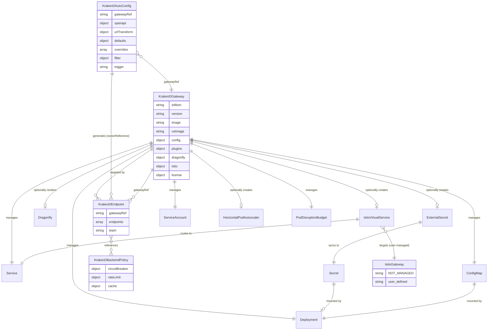

### Ownership Model

| Resource | Owner | Lifecycle |
|---|---|---|
| **KrakenDGateway** | User | User creates/updates/deletes |
| **KrakenDEndpoint** | User (teams) or KrakenDAutoConfig | User creates/updates/deletes; or auto-generated by autoconfig controller with ownerReference to KrakenDAutoConfig |
| **KrakenDBackendPolicy** | User (platform team) | User creates/updates/deletes |
| **KrakenDAutoConfig** | User | User creates/updates/deletes; owns generated KrakenDEndpoints via ownerReference |
| **Deployment** | KrakenDGateway | Operator-managed; garbage-collected via ownerReference |
| **Service** | KrakenDGateway | Operator-managed; garbage-collected via ownerReference |
| **ConfigMap** | KrakenDGateway | Operator-managed; garbage-collected via ownerReference |
| **ServiceAccount** | KrakenDGateway | Operator-managed; garbage-collected via ownerReference |
| **HorizontalPodAutoscaler** | KrakenDGateway | Operator-managed (when `autoscaling.enabled=true`); `spec.replicas` omitted from Deployment when HPA is active |
| **PodDisruptionBudget** | KrakenDGateway | Operator-managed; garbage-collected via ownerReference |
| **Dragonfly CR** | KrakenDGateway | Operator-managed (when `dragonfly.enabled=true`); Dragonfly Operator reconciles into StatefulSet, Service, PVC |
| **ExternalSecret** | KrakenDGateway | Operator-managed (when `license.externalSecret.enabled=true`) |
| **Secret (LICENSE)** | ExternalSecret / User | External Secrets Operator, or user-managed |
| **Istio VirtualService** | KrakenDGateway | Operator-managed (when `istio.enabled=true`) |
| **Istio Gateway** | **User** | **NOT managed by operator** — referenced only |

---

## 5. Reconciliation Data Flow

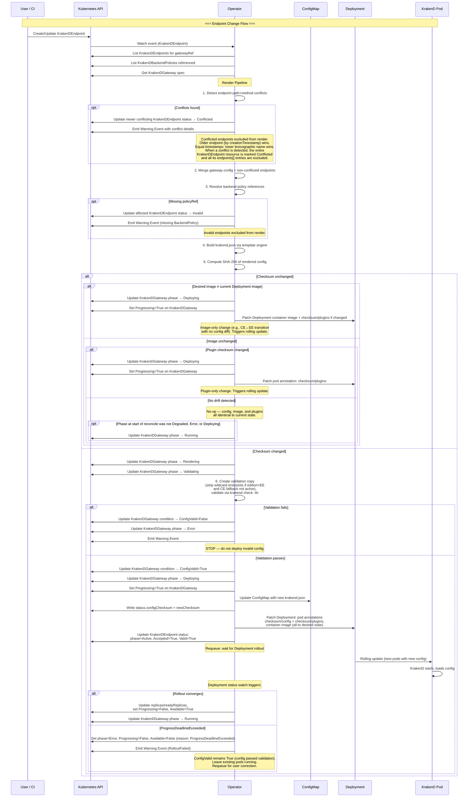

### Reconciliation Triggers

| Event | Controller | Action |
|---|---|---|
| KrakenDGateway created | Gateway controller | Set initial phase to `Pending`. Create Deployment, Service, ConfigMap, SA; optionally Dragonfly CR, VS, ExternalSecret. Re-attach any KrakenDEndpoints in `Detached` phase with matching `gatewayRef`; trigger config render. |
| KrakenDGateway updated | Gateway controller | Re-render config, update child resources, rolling restart |
| KrakenDGateway deleted | Kubernetes GC | ownerReference cascade deletes all child resources |
| KrakenDEndpoint created/updated/deleted | Endpoint controller | Set initial phase to `Pending` on creation. Re-render config for the target gateway, validate, rolling restart. Conflict detection re-evaluates all endpoints; previously `Conflicted` endpoints may be promoted to `Active` if the conflict is resolved. |
| KrakenDBackendPolicy created/updated/deleted | Policy controller | Re-render config for all gateways with endpoints referencing this policy. If deleted while referenced, affected endpoints are marked `Invalid` (defense-in-depth: the admission webhook rejects such deletions, but this path handles cases where the webhook is in `failurePolicy: Ignore` mode, is temporarily unavailable, or is not deployed). |
| KrakenDAutoConfig created/updated/deleted | AutoConfig controller | Fetch OpenAPI spec from configured source, parse operations, apply URL transforms and filters, generate/update/delete owned KrakenDEndpoint resources. Generated endpoints trigger the endpoint controller watch → gateway reconciler. On deletion, all owned KrakenDEndpoints are garbage-collected via ownerReference. |
| AutoConfig periodic timer | AutoConfig controller | When `trigger: Periodic`, re-fetch the OpenAPI spec on the configured `periodic.interval`. Compare spec checksum against `status.specChecksum`; if unchanged, no-op. If changed, regenerate endpoints as in the create/update path. |
| KrakenDGateway deleted | Endpoint controller | Orphaned KrakenDEndpoints (no ownerReference) are set to `Detached` phase. They remain in the cluster but are excluded from all rendering. Re-attachment occurs automatically if a new KrakenDGateway with the same name is created. |
| Secret (LICENSE) created or updated | Gateway controller | Re-parse X.509 `notAfter` from new Secret; run license validation state machine (`ValidateLicense` → `EERunning`/`EEWarning`/`PreExpiry`/`LicenseExpired`); trigger rolling restart if the license has not expired and the parsed `notAfter` has changed from the last observed value. Also trigger EE recovery (rolling restart) if `expiry > now+1h` AND the gateway is currently in Degraded or Error state (license-caused only) |
| Dragonfly CR status updated | Gateway controller | Reflect `DragonflyReady` condition on KrakenDGateway; emit `DragonflyNotReady` Warning event if phase regresses |
| Deployment status updated | Gateway controller | Update `status.replicas`, `status.readyReplicas`, `Available` and `Progressing` conditions on KrakenDGateway. When rollout converges (`updatedReplicas == status.replicas AND availableReplicas == status.replicas`), set `Progressing=False` and transition gateway phase from `Deploying` to `Running`. If the Deployment reports `ProgressDeadlineExceeded`, set `phase=Error`, `Progressing=False`, `Available=False` (reason: `ProgressDeadlineExceeded`), and emit `RolloutFailed` Warning event. `ConfigValid` remains `True` (config passed validation). Existing pods are left running to preserve availability. |
| License approaching expiry | License monitor (periodic) | Emit warning events; if within the expiry warning window (`now+1h < expiry ≤ now+warningDays`), set `LicenseValid=False` (reason: `ExpiringSoon`) and emit `LicenseExpiringSoon` Warning event (rate-limited to once per 24h). If `expiry > now+1h` AND currently Degraded or Error (license-caused only), trigger EE recovery (even within the warning window). If PreExpiry (`now < expiry ≤ now+1h`) AND `fallbackToCE=true`, switch to CE image. If expired AND `fallbackToCE=true`, switch to CE image. If PreExpiry AND `fallbackToCE=false`, set `phase=Error`, `LicenseValid=False` (reason: `LicensePreExpiry`), and emit `LicenseExpiredNoFallback` Warning event; leave Deployment running. If expired AND `fallbackToCE=false`, set `phase=Error`, `LicenseValid=False` (reason: `LicenseExpired`), `LicenseExpired=True`, and emit `LicenseExpiredNoFallback` Warning event; leave Deployment running. If license is healthy (`expiry > now+warningDays`), set `LicenseValid=True`; if currently Degraded or Error (license-caused only), trigger EE recovery. |

### Reconciliation Queueing

All reconciliation events for the same gateway are **serialized** via the controller-runtime work queue, keyed by the target KrakenDGateway’s `namespace/name`. When multiple KrakenDEndpoints targeting the same gateway are updated simultaneously, the events collapse into a single reconciler run that processes the latest state of all endpoints. This prevents race conditions on the ConfigMap and Deployment, and ensures the rendered config always reflects a consistent snapshot of all endpoint CRDs.

---

## 6. Dragonfly Integration

Dragonfly is a modern, multi-threaded, Redis-compatible in-memory datastore. It provides the Redis protocol compatibility required by KrakenD EE features while delivering significantly higher throughput and lower memory overhead than Redis.

> **Prerequisite:** The [Dragonfly Operator](https://github.com/dragonflydb/dragonfly-operator) (`>= v1.5.0`) must be installed in the cluster before enabling Dragonfly integration. The KrakenD Operator renders a `Dragonfly` CR (`dragonflydb.io/v1alpha1`) and the Dragonfly Operator is responsible for reconciling it into running infrastructure (StatefulSet, Service, PVC, NetworkPolicy, etc.).

### Why Dragonfly over Redis

- **Multi-threaded** — uses all available CPU cores (Redis is single-threaded)
- **Lower memory** — Dragonfly uses ~30% less memory than Redis for equivalent datasets
- **Redis protocol compatible** — drop-in replacement for KrakenD's `redis` connection pool
- **Supports `HEXPIRE`** — required by KrakenD EE Quota (minimum Redis 7.4 equivalent)

### Rendered Dragonfly CR Example

When `dragonfly.enabled=true`, the operator renders the following `Dragonfly` CR with an `ownerReference` back to the KrakenDGateway:

```yaml
apiVersion: dragonflydb.io/v1alpha1
kind: Dragonfly
metadata:
  name: production-gateway-dragonfly
  namespace: api-gateway
  ownerReferences:
    - apiVersion: gateway.krakend.io/v1alpha1
      kind: KrakenDGateway
      name: production-gateway
      uid: <gateway-uid>
      controller: true
      blockOwnerDeletion: true
  labels:
    app.kubernetes.io/name: dragonfly
    app.kubernetes.io/instance: production-gateway-dragonfly
    app.kubernetes.io/part-of: krakend-operator
    app.kubernetes.io/managed-by: krakend-operator
spec:
  replicas: 2
  image: "docker.dragonflydb.io/dragonflydb/dragonfly:v1.25.2"
  resources:
    requests:
      cpu: "250m"
      memory: "512Mi"
    limits:
      cpu: "1"
      memory: "2Gi"
  snapshot:
    cron: "*/30 * * * *"
    persistentVolumeClaimSpec:
      accessModes: ["ReadWriteOnce"]
      resources:
        requests:
          storage: "10Gi"
  authentication:
    passwordFromSecret:
      name: dragonfly-auth
      key: password
  args: []                             # populated from spec.dragonfly.args
```

### Deployment Topology

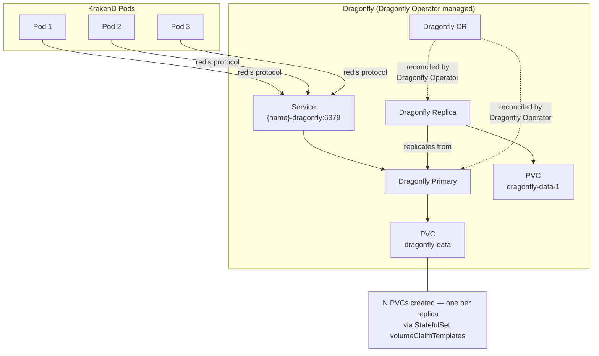

### EE Features Requiring Dragonfly/Redis

| Feature | KrakenD Namespace | Description |
|---|---|---|
| Cluster Rate Limiting | `qos/ratelimit/service` | Shared rate limit counters across all KrakenD instances |
| Usage Quota | `governance/quota` | Persistent quota counters (hourly/daily/weekly/monthly/yearly) |
| Token Revocation | `auth/revoker` | Distributed bloom filter for token blacklisting |
| Stateful Rate Limiting | `qos/ratelimit/router` + Redis | Per-client persistent counters across instances |

### Auto-Configuration

When `dragonfly.enabled=true` and `edition=EE` (and not CE fallback active), the operator:

1. Renders a `Dragonfly` CR (`dragonflydb.io/v1alpha1`) with an `ownerReference` to the KrakenDGateway
2. Sets the Dragonfly service DNS as `{gateway-name}-dragonfly.{namespace}.svc.cluster.local:6379`
3. Derives `redis.connectionPool.addresses` from the Dragonfly Service DNS convention (users should leave `redis.connectionPool.addresses` empty)
4. Injects the `redis` namespace into the rendered `krakend.json` `extra_config`. The Dragonfly authentication password is **not** embedded in the ConfigMap; instead, the operator injects it via a Secret-backed environment variable (e.g., `REDIS_PASSWORD`) and uses KrakenD's `$ENV_VAR` substitution in the rendered config. This ensures the password stays in a Kubernetes Secret and is never stored in plaintext in the ConfigMap
5. Watches the `Dragonfly` CR status and reports `DragonflyReady` on the KrakenDGateway when the Dragonfly Operator reports the instance as `ready`

> **Note:** Steps 3–4 (redis address derivation and `extra_config` injection) apply only when `edition=EE` and CE fallback is not active. Steps 1, 2, and 5 apply whenever `dragonfly.enabled=true`, regardless of edition or CE fallback state, so the Dragonfly instance is available when EE is restored.

> **Password handling:** When `dragonfly.enabled=true`, the password is derived from `dragonfly.authentication.passwordFromSecret` and the `redis.connectionPool.password` field is ignored. When `dragonfly.enabled=false` (external Redis/Dragonfly), use `redis.connectionPool.addresses` and `redis.connectionPool.password.secretRef` to configure the connection.

### Dragonfly Unavailability Behavior

When Dragonfly becomes unavailable while KrakenD EE is running:

- **Cluster rate limiting** — KrakenD falls back to per-instance in-memory counters (fail-open: requests are not rejected, but rate limits are no longer coordinated across pods)
- **Usage quota** — quota enforcement fails; behavior depends on KrakenD’s `governance/quota` error handling configuration. This should be tested and documented per-deployment.
- **Token revocation** — revocation checks fail; previously-revoked tokens may be accepted until Dragonfly recovers

The operator sets `DragonflyReady=False` and emits a `DragonflyNotReady` warning event. KrakenD pods are **not** restarted — they continue serving traffic with degraded stateful features. Because the Dragonfly Operator manages the actual pods, failover and recovery are handled automatically when `replicas >= 2`.

---

## 7. External Secrets Integration

The operator integrates with [External Secrets Operator (ESO)](https://external-secrets.io/) (`>= v0.10.0`, required for `external-secrets.io/v1` API) to provision the KrakenD EE license from external secret stores without embedding secrets in Kubernetes manifests.

### Flow

```mermaid
sequenceDiagram
    participant User as User
    participant Op as Operator
    participant K8s as Kubernetes API
    participant ESO as External Secrets Operator
    participant Vault as Secret Store<br/>(Vault / AWS SM)

    User->>K8s: Create KrakenDGateway with<br/>license.externalSecret.enabled=true
    K8s->>Op: Watch event
    Op->>K8s: Create ExternalSecret CR

    Note over ESO: ESO reconciliation loop
    ESO->>Vault: Fetch license from remote ref
    Vault-->>ESO: Return license content
    ESO->>K8s: Create/Update Secret<br/>"production-gateway-license"

    Op->>K8s: Wait for Secret to exist
    Op->>K8s: Check ExternalSecret status conditions
    alt ExternalSecret Ready=False
        Op->>K8s: Set condition LicenseSecretUnavailable=True
        Op->>K8s: Emit Warning Event (ESO sync error)
        Note over Op: Re-queue reconciliation.
        Note over Op: STOP — do not create Deployment without license.
    else ExternalSecret Ready=True
        Op->>K8s: Read Secret, parse X.509 notAfter
        Op->>Op: Run license validation (§9 ValidateLicense)
        alt EERunning (expiry > now+warningDays)
            Op->>K8s: Create Deployment with<br/>Secret volume mount at /etc/krakend/LICENSE<br/>using EE image
            Op->>K8s: Set condition LicenseValid=True (reason=LicenseOK)
        else EEWarning (now+1h < expiry ≤ now+warningDays)
            Op->>K8s: Create Deployment with<br/>Secret volume mount at /etc/krakend/LICENSE<br/>using EE image
            Op->>K8s: Set condition LicenseValid=False (reason=ExpiringSoon)
            Op->>K8s: Emit LicenseExpiringSoon Warning event
        else PreExpiry or Expired AND fallbackToCE=true
            Op->>K8s: Create Deployment with<br/>Secret volume mount at /etc/krakend/LICENSE<br/>using CE image (ceImage or krakend/krakend:version)
            Op->>K8s: Set condition LicenseValid=False (reason per entry path: LicensePreExpiry or LicenseExpired)
            Op->>K8s: Set condition LicenseDegraded=True (reason per entry path: LicensePreExpiry or LicenseExpired)
            Op->>K8s: Update KrakenDGateway phase → Degraded
            Op->>K8s: Emit LicenseFallbackCE Warning Event
            Note over Op: CE fallback on cold start —<br/>no intermediate EE Deployment created.
        else PreExpiry AND fallbackToCE=false
            Op->>K8s: Set phase=Error, LicenseValid=False (reason=LicensePreExpiry)
            Op->>K8s: Emit LicenseExpiredNoFallback Warning Event
            Note over Op: STOP — license within pre-expiry safety window,<br/>no fallback configured.
        else Expired AND fallbackToCE=false
            Op->>K8s: Set condition LicenseValid=False (reason=LicenseExpired)
            Op->>K8s: Set phase=Error, LicenseExpired=True
            Op->>K8s: Emit LicenseExpiredNoFallback Warning Event
            Note over Op: STOP — license expired, no fallback configured.
        end
    end

    Note over Op: /etc/krakend is KrakenD's default working<br/>directory. LICENSE at this path is the default<br/>lookup location. No KRAKEND_LICENSE_PATH needed.

    Note over Op: Periodic license check
    Op->>K8s: Read Secret, parse X.509 notAfter
    alt now < expiry ≤ now+1h (PreExpiry) AND fallbackToCE=true
        Op->>Op: Strip wildcard endpoints from rendered config
        Op->>K8s: Switch Deployment image to CE (ceImage or krakend/krakend:version)
        Op->>K8s: Set condition LicenseValid=False (reason=LicensePreExpiry)
        Op->>K8s: Set condition LicenseDegraded=True (reason=LicensePreExpiry)
        Op->>K8s: Emit LicenseFallbackCE Warning Event
    else now < expiry ≤ now+1h (PreExpiry) AND fallbackToCE=false
        Op->>K8s: Set phase=Error, LicenseValid=False (reason=LicensePreExpiry)
        Op->>K8s: Emit LicenseExpiredNoFallback Warning Event
    else now+1h < expiry AND expiry ≤ now+warningDays (EEWarning)
        Op->>K8s: Set condition LicenseValid=False (reason=ExpiringSoon)
        Op->>K8s: Emit LicenseExpiringSoon Warning event (rate-limited to once per 24h)
        opt Currently in Degraded or Error state (license-caused only)
            Op->>Op: Trigger EE Recovery (re-render, switch to EE image)
            Op->>K8s: Clear LicenseDegraded (if set), set LicenseExpired=False (if set)
            Op->>K8s: Emit LicenseRestored
        end
    else expiry ≤ now AND fallbackToCE=true
        Op->>Op: Strip wildcard endpoints from rendered config
        Op->>K8s: Switch Deployment image to CE (ceImage or krakend/krakend:version)
        Op->>K8s: Set condition LicenseValid=False (reason=LicenseExpired)
        Op->>K8s: Set condition LicenseDegraded=True (reason=LicenseExpired)
        Op->>K8s: Emit LicenseFallbackCE Warning Event
    else expiry ≤ now AND fallbackToCE=false
        Op->>K8s: Set condition LicenseValid=False (reason=LicenseExpired)
        Op->>K8s: Set phase=Error, LicenseExpired=True
        Op->>K8s: Emit LicenseExpiredNoFallback Warning Event
    else expiry > now+warningDays (EERunning — license healthy)
        Op->>K8s: Set condition LicenseValid=True, reason=LicenseOK
        opt Currently in Degraded or Error state (license-caused only)
            Op->>Op: Trigger EE Recovery (re-render, switch to EE image)
            Op->>K8s: Clear LicenseDegraded (if set), set LicenseExpired=False (if set)
            Op->>K8s: Emit LicenseRestored
        end
    end
```

### Generated ExternalSecret

```yaml
apiVersion: external-secrets.io/v1
kind: ExternalSecret
metadata:
  name: production-gateway-license
  namespace: api-gateway
  ownerReferences:
    - apiVersion: gateway.krakend.io/v1alpha1
      kind: KrakenDGateway
      name: production-gateway
      uid: <gateway-uid>
      controller: true
      blockOwnerDeletion: true
spec:
  refreshInterval: "1h"
  secretStoreRef:
    name: vault-backend
    kind: ClusterSecretStore
  target:
    name: production-gateway-license
    creationPolicy: Owner
    template:
      type: Opaque
      data:
        LICENSE: "{{ .license }}"
  data:
    - secretKey: license
      remoteRef:
        key: secret/data/krakend/license
        property: license
```

### Alternative: Pre-Existing Secret

When `license.secretRef` is used instead of `externalSecret`, the operator skips ExternalSecret creation and directly mounts the referenced Secret. The user is responsible for managing rotation. If the referenced Secret does not exist, the operator sets `LicenseSecretUnavailable=True`, emits a `LicenseSecretMissing` Warning event, sets the gateway phase to `Error`, and requeues the reconciliation. The operator resumes normal license processing once the Secret becomes available.

---

## 8. Istio Integration

When `istio.enabled=true`, the operator creates an Istio VirtualService that routes traffic to the KrakenD Service. The Istio Gateway is **not** created or managed by the operator — it must already exist and is referenced by name in the spec.

> **Prerequisite:** Istio `>= 1.22` is required for the `networking.istio.io/v1` API used by the generated VirtualService.

### Traffic Routing — Without Istio

When `istio.enabled=false`, the operator creates a standard Kubernetes Service (ClusterIP). External traffic reaches KrakenD via any ingress mechanism the cluster provides (Kubernetes Ingress, cloud load balancer, NodePort, etc.). TLS termination is handled by KrakenD itself when `tls.enabled=true`, or by an external load balancer.

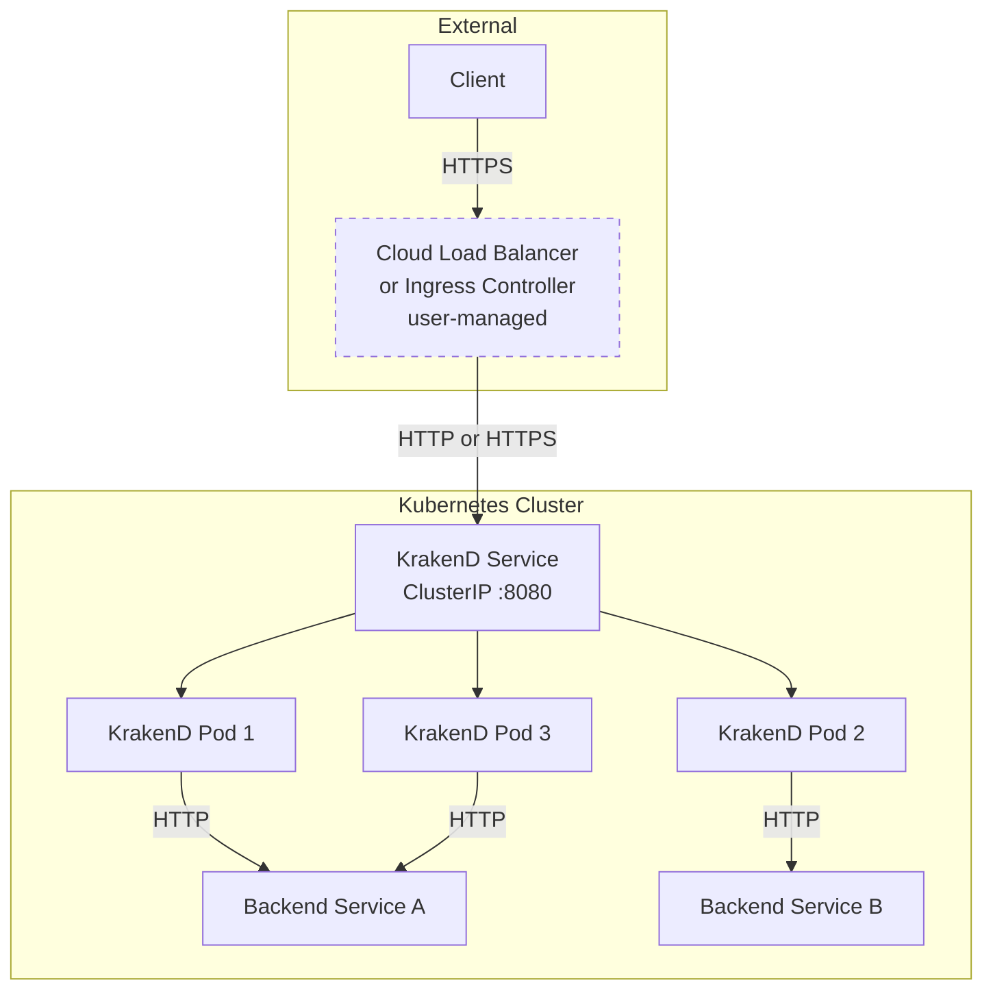

#### Key Behaviors Without Istio

1. **TLS on KrakenD (optional)** — when `tls.enabled=true`, KrakenD terminates TLS directly; configure `tls.publicKey`, `tls.privateKey`, and `tls.minVersion` in the spec
2. **`ssl_redirect` as configured** — the operator respects the user's `config.security.sslRedirect` setting
3. **No VirtualService created** — the operator skips all Istio resource creation
4. **Service type** — the Service is always `ClusterIP`; exposing it externally is the user's responsibility (Ingress, LoadBalancer wrapper, etc.)

### Traffic Routing — With Istio

When `istio.enabled=true`, the Istio IngressGateway terminates TLS and routes traffic through an operator-managed VirtualService to the KrakenD Service.

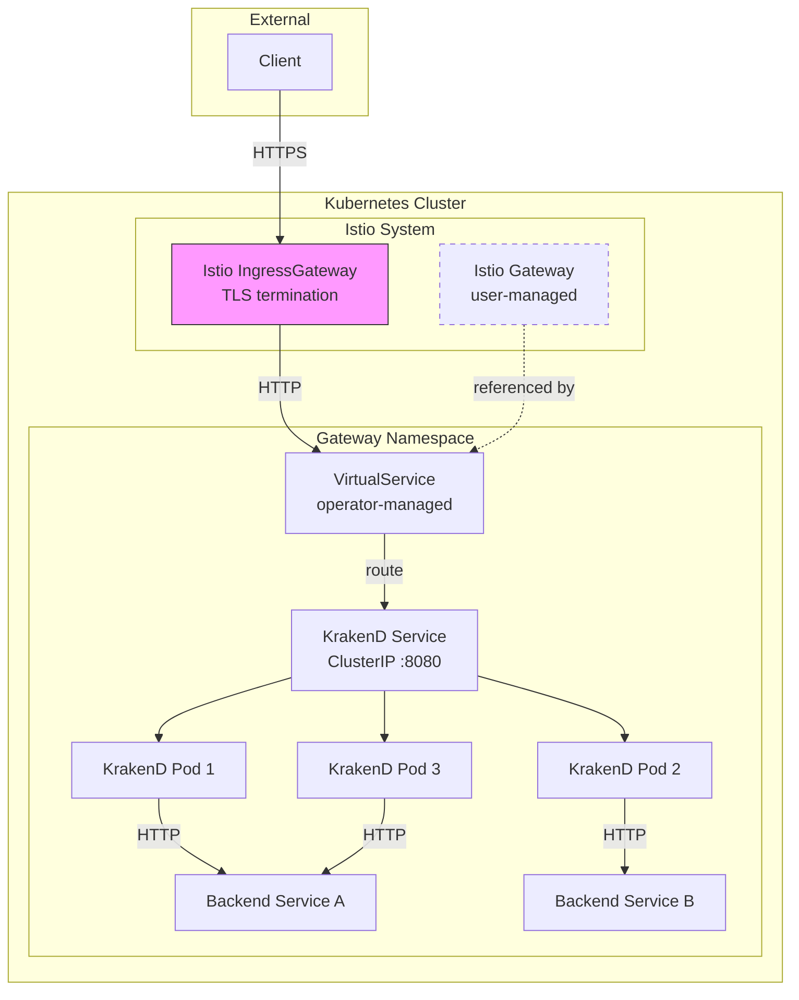

### Key Behaviors When Istio Is Enabled

1. **TLS is disabled on KrakenD** — Istio Gateway handles TLS termination; KrakenD listens on plain HTTP (port 8080)
2. **`ssl_redirect` is set to `false`** — KrakenD must not redirect to HTTPS since it receives plain HTTP from the Istio sidecar
3. **`ssl_proxy_headers` is configured** — `{"X-Forwarded-Proto": "https"}` tells KrakenD the original client connection was HTTPS
4. **No `tls` block in KrakenD config** — The operator omits the root-level `tls` key entirely
5. **VirtualService references existing Gateway(s)** — from `spec.istio.virtualService.gateways[]`

### Generated VirtualService

```yaml
apiVersion: networking.istio.io/v1
kind: VirtualService
metadata:
  name: production-gateway
  namespace: api-gateway
  ownerReferences:
    - apiVersion: gateway.krakend.io/v1alpha1
      kind: KrakenDGateway
      name: production-gateway
      uid: <gateway-uid>
      controller: true
      blockOwnerDeletion: true
spec:
  hosts:
    - api.example.com
  gateways:
    - istio-system/main-gateway         # user-defined, NOT operator-managed
  http:
    - match:
        - uri:
            prefix: /
      route:
        - destination:
            host: production-gateway.api-gateway.svc.cluster.local
            port:
              number: 8080    # from spec.config.port
      timeout: 30s
```

> **Important:** The default `match: prefix: /` VirtualService will absorb all HTTP traffic for the configured host entering through the referenced Gateway. Each KrakenDGateway should own its own dedicated host(s). If multiple services share the same Gateway and host, customize `spec.istio.virtualService.httpRoutes[].match` with more specific path prefixes to avoid routing conflicts.

### What the Operator Does NOT Do

- Does **not** create, update, or delete Istio Gateway resources
- Does **not** manage TLS certificates for Istio (use cert-manager or Istio's built-in SDS)
- Does **not** configure Istio sidecar injection (managed by Istio's namespace labels)
- Does **not** create DestinationRule, PeerAuthentication, or AuthorizationPolicy resources

---

## 9. License Lifecycle Management

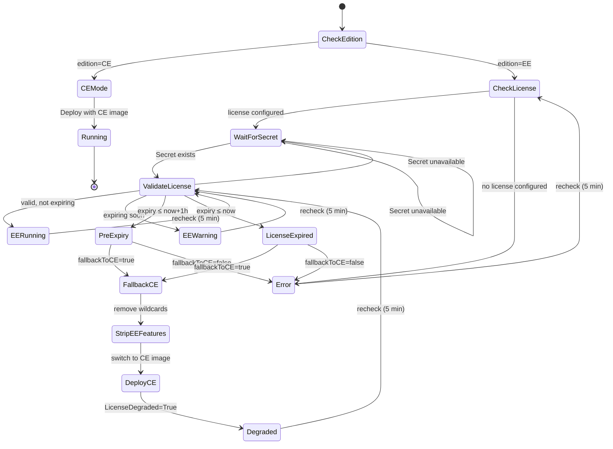

**State behavior notes:**

- **PreExpiry** takes precedence over EEWarning when `expiry ≤ now+1h`.
- **EERunning** — Sets `LicenseValid=True` (reason: `LicenseOK`). If currently Degraded or Error (license-caused only): triggers EE recovery (re-renders EE config, switches to EE image). From Degraded: clears `LicenseDegraded`. From Error: sets `LicenseExpired=False` (if previously set). Emits `LicenseRestored`.
- **EEWarning** — Sets `LicenseValid=False` (reason: `ExpiringSoon`). Emits `LicenseExpiringSoon` Warning event, rate-limited to once per 24h. If currently Degraded or Error (license-caused only): triggers EE recovery (re-renders EE config, switches to EE image). From Degraded: clears `LicenseDegraded`. From Error: sets `LicenseExpired=False` (if previously set). Emits `LicenseRestored`.
- **FallbackCE → StripEEFeatures → DeployCE** — CE fallback is executed via the §10 rendering pipeline. The checksum comparison and image-drift check (§10) prevent redundant rolling restarts when config and image are already at the desired CE state. Periodic rechecks that re-enter FallbackCE while the gateway is already running CE are no-ops.
- **DeployCE → Degraded** — Sets `LicenseValid=False`, `LicenseDegraded=True` (reason per entry path: `LicensePreExpiry` or `LicenseExpired`).

### License Check Frequency and Safety Buffer

The license monitor runs on a **5-minute period** independent of the main reconciliation loop. Because KrakenD EE processes terminate immediately upon license expiry, the operator triggers the CE fallback **1 hour before the actual expiry time** (not at T-0). This safety buffer ensures the rolling deployment to CE completes well before any EE pod would self-terminate.

> **Note:** In steady-state operation, `PreExpiry` fires first (1 hour before T-0). The `LicenseExpired` state is most commonly reached on cold-start (e.g., the operator is deployed into a cluster where the license has already expired), but is also reachable via the `Error → CheckLicense → WaitForSecret → ValidateLicense` recheck path if the monitor was in `Error` state when T-0 passed.

### Error State Behavior

When `fallbackToCE=false` and the license is expired or approaching expiry, the operator transitions to the `Error` state:

1. **Set KrakenDGateway phase to `Error`** — set `LicenseValid=False`; if `expiry ≤ now`, also set `LicenseExpired=True` (reason: `LicenseExpired`); otherwise (PreExpiry path) set reason `LicensePreExpiry`. Emit `LicenseExpiredNoFallback` Warning event
2. **Leave the existing Deployment running** — the operator does not scale down or delete the Deployment. EE pods will self-terminate at the actual license expiry time (T-0), entering `CrashLoopBackOff` as KrakenD refuses to start without a valid license
3. **Continuously re-check** — the license monitor continues its 5-minute periodic recheck. If a renewed license becomes available, the operator transitions through `CheckLicense` back to `ValidateLicense` and recovers normally

This is a conscious design choice: the operator provides maximum observability (error phase + events + metrics) without destructively interfering with a running workload. Cluster operators are expected to monitor `LicenseExpiredNoFallback` events and take corrective action.

> **Cold-start without an existing Deployment (`fallbackToCE=false`):** If no Deployment exists yet and `fallbackToCE=false`, the operator skips Deployment creation and halts in `Error` phase in both the **expired** (`expiry ≤ now`) and **pre-expiry** (`now < expiry ≤ now+1h`) scenarios, until a valid license is available. When `fallbackToCE=true`, the operator deploys CE immediately in either case, transitioning to `Degraded` phase.

### CE Fallback Behavior

When falling back from EE to CE:

1. **Strip structural EE features** — remove wildcard endpoints (`/*`) which CE's router rejects
2. **Switch container image** — use `spec.ceImage` if set; otherwise fall back to `krakend/krakend:{spec.version}`. The `spec.image` field (EE override) is ignored during CE fallback
3. **Keep EE `extra_config` namespaces** — CE silently ignores unknown namespaces like `security/policies`, `auth/api-keys`, etc.
4. **Disable Dragonfly-dependent features** — cluster rate limiting, quota, and token revocation won't function without the EE binary, even with Redis available
5. **Set `LicenseValid=False`** — reason `LicensePreExpiry` if entering from the PreExpiry path; reason `LicenseExpired` if entering from the LicenseExpired path
6. **Set status condition** — `LicenseDegraded=True` (reason: `LicensePreExpiry` or `LicenseExpired`) with message explaining the degradation
7. **Emit Kubernetes event** — `Warning` event on the KrakenDGateway for alerting

### EE Recovery (from Degraded or Error back to EE)

When a valid license becomes available again (e.g., Secret updated by ESO with a renewed certificate):

1. **License monitor detects valid license** — reads the Secret, parses X.509 `notAfter`, confirms validity
2. **Re-render config from original CRD spec** — the KrakenDGateway and KrakenDEndpoint CRDs retain the full EE configuration (including wildcard endpoints); re-render restores all EE features
3. **Switch container image back to EE** — restore `spec.image` if set (user override); otherwise use `krakend/krakend-ee:{spec.version}`
4. **Rolling deployment** — new EE pods start with the full config and valid license (if recovering from `Error` with no existing Deployment, create the Deployment)
5. **Clear `LicenseDegraded` condition** — set `LicenseDegraded=False` (only applicable when recovering from `Degraded`). If recovering to `EERunning` state (`expiry > now+warningDays`), set `LicenseValid=True` (reason: `LicenseOK`). If recovering to `EEWarning` state (`now+1h < expiry ≤ now+warningDays`), set `LicenseValid=False` (reason: `ExpiringSoon`) — the license is still approaching expiry, so the reason is updated from the prior fallback reason to `ExpiringSoon`. If recovering from `Error`, set `LicenseExpired` to `False` (if previously set) and set `LicenseValid` per the applicable state
6. **Emit Normal event** — `LicenseRestored` on the KrakenDGateway

---

## 10. Configuration Rendering Pipeline

The operator renders the final `krakend.json` from CRD state through a deterministic pipeline:

```mermaid
flowchart TD
    A[Collect KrakenDGateway spec] --> B[List all KrakenDEndpoints<br/>matching gatewayRef]
    B --> BA[Detect endpoint path+method<br/>conflicts across all endpoints]
    BA --> BB{conflicts?}
    BB -->|Yes| BC[Mark conflicting endpoints<br/>as Conflicted<br/>Emit Warning Events]
    BB -->|No| C
    BC --> C[Resolve KrakenDBackendPolicy<br/>references]
    C --> CA{Missing policyRef?}
    CA -->|Yes| CB[Mark affected endpoints<br/>as Invalid]
    CA -->|No| D
    CB --> D[Build internal config model<br/>excluding Conflicted and Invalid endpoints]

    D --> DA{CE fallback active?}
    DA -->|Yes| DB[Strip wildcard endpoints<br/>from deployed config]
    DA -->|No| E
    DB --> E
    E{edition == EE<br/>and not CE fallback?}
    E -->|Yes| EA{dragonfly.enabled?}
    EA -->|true| F[Derive redis connection pool<br/>from Dragonfly Service DNS convention]
    EA -->|false| FB[Use user-provided<br/>redis.connectionPool.addresses]
    E -->|No| G[Skip EE service-level<br/>namespace injection]
    F --> H[Merge service-level extra_config]
    FB --> H
    G --> H

    H --> I[Build endpoints array<br/>from non-conflicted KrakenDEndpoints]
    I --> J[Apply backend policies<br/>merge extraConfig + policyRef<br/>inline extraConfig takes precedence on key collision]
    J --> K[Inject TLS config<br/>if tls.enabled and NOT istio]
    K --> K1[Inject plugin block<br/>if plugins configured]
    K1 --> K2[Select container image:<br/>if CE fallback: use ceImage or<br/>krakend/krakend:version<br/>else: use image or edition default]
    K2 --> L[Serialize to JSON<br/>— this is the deploy config]
    L --> M[Compute SHA-256 checksum]
    M --> N{checksum changed?}

    N -->|No| N1{Desired image ≠<br/>current Deployment image?}
    N1 -->|No| N3{checksum/plugins<br/>changed?}
    N3 -->|No| O[No-op: skip deployment<br/>Set phase=Running if phase<br/>at start of reconcile was not<br/>Degraded, Error, or Deploying]
    N3 -->|Yes| N4[Set phase=Deploying<br/>Set Progressing=True<br/>Patch pod annotation: checksum/plugins]
    N4 --> U
    N1 -->|Yes| N2[Set phase=Deploying<br/>Set Progressing=True<br/>Patch Deployment container image +<br/>checksum/plugins if changed]
    N2 --> U
    N -->|Yes| D0[Set phase=Rendering]
    D0 --> N0[Set phase=Validating]
    N0 --> PW[Create validation copy:<br/>strip wildcard endpoints<br/>if edition=EE AND CE fallback not active]
    PW --> P[Run krakend check -tlc<br/>on validation copy]

    P --> Q{Valid?}
    Q -->|Yes| R[Set ConfigValid=True<br/>Set phase=Deploying<br/>Set Progressing=True<br/>Update ConfigMap<br/>Write status.configChecksum]
    Q -->|No| S[Set ConfigValid=False<br/>Set phase=Error<br/>Emit Warning Event<br/>STOP]

    R --> T[Patch Deployment<br/>pod annotation: checksum/config +<br/>checksum/plugins + container image]
    T --> U[Kubernetes Rolling Update]

    style S fill:#f66,stroke:#333
    style U fill:#6f6,stroke:#333
    style BC fill:#ff6,stroke:#333
```

### Deterministic Ordering

To ensure consistent JSON output (and avoid unnecessary rolling restarts from non-semantic changes), the operator:

- Sorts endpoints alphabetically by `endpoint` path, then by `method`
- Sorts `extra_config` keys alphabetically
- Sorts backend `host` arrays alphabetically
- Uses canonical JSON serialization (no trailing commas, consistent indentation)

### Validation Strategy

The operator runs `krakend check -tlc` against the rendered configuration before deploying. The KrakenD CE binary must be embedded in the operator's container image (via multi-stage Docker build). Validation is executed by invoking the binary as a subprocess against the rendered JSON file.

> **EE wildcard endpoints and CE validation:** The CE binary's router rejects wildcard endpoint patterns (`/*`). To validate EE configurations containing wildcards (when CE fallback is not active), the operator **strips wildcard endpoints from the validation copy** before running `krakend check -tlc`, then includes them in the final deployed ConfigMap. When CE fallback is active, wildcards are already stripped from the deployed config itself (the "Strip wildcard endpoints from deployed config" step earlier in the pipeline), so the validation copy inherits this stripped state. The CE validator thus validates all non-wildcard structural and semantic aspects. Wildcard routing correctness is only fully validated at EE runtime. This approach avoids requiring an EE license in the operator image.

Alternatively, for environments where embedding the binary is impractical:

- **Via init container** — a short-lived container running the check command against the mounted ConfigMap
- **Via a Kubernetes Job** — a Job that validates the config and reports success/failure

The embedded-binary approach is preferred for latency and simplicity.

> **Note:** The CE validator's `-l` (lint) flag validates against the CE JSON schema. EE-only `extra_config` namespaces (e.g., `governance/quota`, `security/policies`) pass lint if structurally valid JSON but are not semantically validated. EE-specific configuration errors may only surface at runtime. This is an accepted limitation — the CE validator still catches structural errors, unknown root keys, and router conflicts.

---

## 11. Plugin Management

KrakenD supports custom Go plugins (`.so` shared-object files) that extend gateway functionality — custom authentication, request/response modifiers, rate limiting strategies, and more. Rather than requiring plugins to be compiled into a custom KrakenD image, the operator mounts them via Kubernetes volumes, enabling plugin updates independently of the KrakenD image lifecycle.

### How It Works

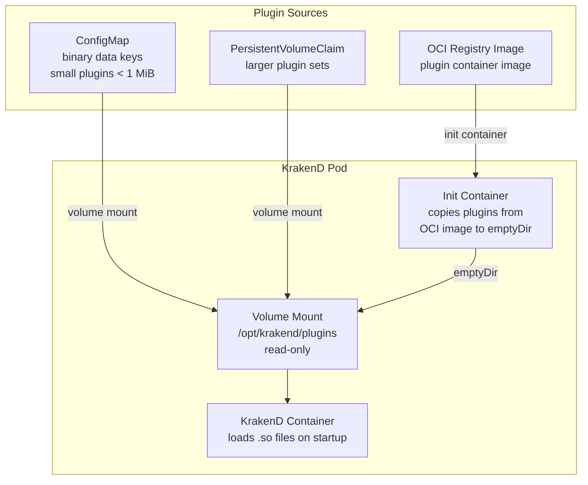

### Plugin Source Types

| Source | Use Case | Size Limit | Update Mechanism |
|---|---|---|---|
| `configMapRef` | Small plugins (< 1 MiB per ConfigMap) | 1 MiB (Kubernetes limit) | Update ConfigMap → rolling restart via checksum annotation |
| `persistentVolumeClaimRef` | Larger plugin sets, shared across pods | PVC-dependent | Update PVC contents + manually trigger rollout (PVC content changes are not automatically detected by the operator) |
| `imageRef` | CI/CD-built plugin images (OCI artifacts) | Image-dependent | Update image tag → rolling restart via init container image change |

### Volume Assembly

The operator assembles the plugin volume mount from all configured sources using a two-strategy approach:

**Single-source strategy** (only ConfigMap sources, or only a PVC source):
- ConfigMap-only: uses a Kubernetes `projected` volume merging all ConfigMaps flat into the mount path
- PVC-only: mounts the PVC directly at the plugin path

**Multi-source strategy** (any combination of ConfigMap, PVC, and/or OCI sources):
The operator uses an `emptyDir` volume at the plugin mount path and init containers to assemble all plugin files into it:

1. **ConfigMap sources** — an init container copies `.so` files from each projected ConfigMap volume into the emptyDir
2. **PVC sources** — an init container copies `.so` files from the PVC mount into the emptyDir (only one PVC source supported per gateway; the admission webhook rejects multiple PVC sources)
3. **OCI image sources** — an init container pulls the image and copies plugin files into the emptyDir

This strategy avoids the Kubernetes limitation that prevents mounting a `projected` volume and a `persistentVolumeClaim` at the same `mountPath`. KrakenD's plugin loader does not recurse into subdirectories, so all files must be flat in the mount path.

All sources are mounted **read-only** into the KrakenD container. The operator adds a `checksum/plugins` annotation to the pod template (computed from the ConfigMap data hashes and OCI image tags) to trigger rolling restarts when plugins change. PVC content changes are not automatically detected — users must manually trigger a rollout (e.g., by annotating the KrakenDGateway spec) when PVC-hosted plugins are updated.

### KrakenD Plugin Configuration

The operator injects the `plugin` root key into the rendered `krakend.json` when plugins are configured:

```json
{
  "plugin": {
    "pattern": ".so",
    "folder": "/opt/krakend/plugins"
  }
}
```

Individual plugin activation is configured per-endpoint or per-service via `extra_config` in the KrakenDEndpoint or KrakenDGateway CRDs — the operator does not manage which plugins are active, only that the plugin files are available at the expected path.

### Security Considerations

- Plugin `.so` files execute **arbitrary code** inside the KrakenD process. Only mount plugins from trusted sources
- The plugin volume is mounted read-only to prevent runtime modification
- When using `imageRef`, use the `imagePullSecrets` field on the image source to configure registry credentials for private registries
- The `readOnlyRootFilesystem: true` security context is preserved — plugins are mounted via volumes, not written to the container filesystem

---

## 12. Zero-Downtime Deployment Strategy

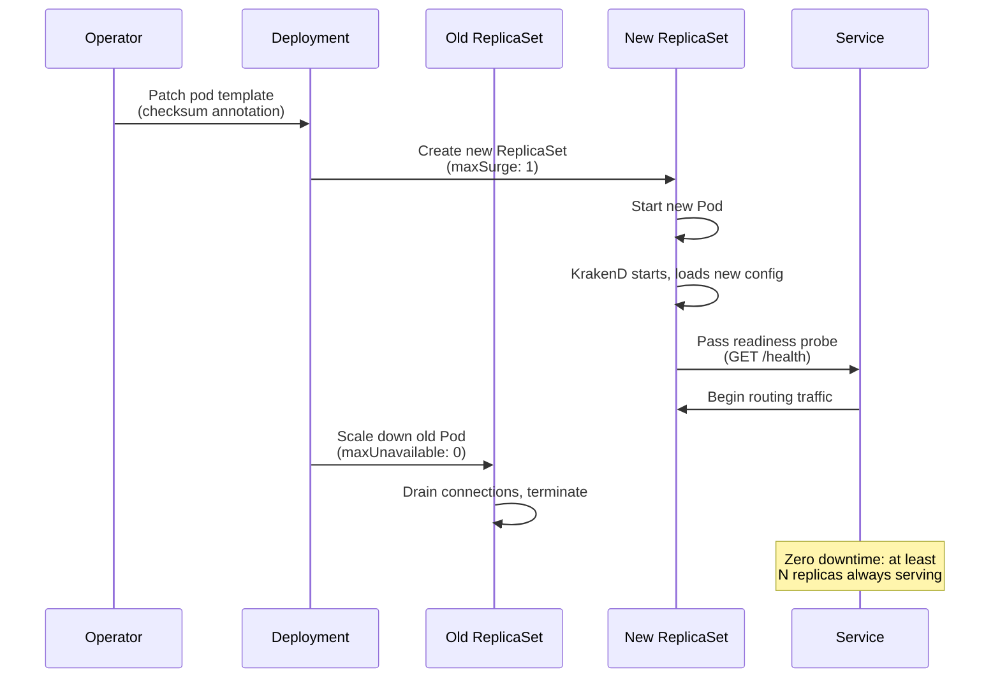

### Deployment Configuration

The operator configures the Deployment's rolling update strategy:

```yaml
strategy:
  type: RollingUpdate
  rollingUpdate:
    maxSurge: 1          # add 1 new pod before removing old
    maxUnavailable: 0    # never reduce below desired replicas
```

The pod template must also specify:

```yaml
# spec.template.spec
terminationGracePeriodSeconds: 60   # must exceed max backend timeout + connection drain time
```

### PodDisruptionBudget

To protect against voluntary disruptions (node drains, cluster autoscaler scale-down), the operator creates a `PodDisruptionBudget` for each KrakenD Deployment:

```yaml
apiVersion: policy/v1
kind: PodDisruptionBudget
metadata:
  name: production-gateway
  namespace: api-gateway
  ownerReferences:
    - apiVersion: gateway.krakend.io/v1alpha1
      kind: KrakenDGateway
      name: production-gateway
      uid: <gateway-uid>
      controller: true
      blockOwnerDeletion: true
spec:
  maxUnavailable: 1
  selector:
    matchLabels:
      app.kubernetes.io/instance: production-gateway
      app.kubernetes.io/managed-by: krakend-operator
```

> **Note:** The zero-downtime guarantee requires `replicas >= 2`. With a single replica, `maxUnavailable: 1` permits the pod to be evicted during voluntary disruptions. For production, always set `replicas >= 2`. Alternatively, use `minAvailable: 1` to prevent eviction of single-replica deployments; this blocks node drains until a second replica is added.

### Health Probes

```yaml
livenessProbe:
  httpGet:
    path: /health        # from spec.config.router.healthPath
    port: 8080           # from spec.config.port
  initialDelaySeconds: 5
  periodSeconds: 10
  failureThreshold: 3

readinessProbe:
  httpGet:
    path: /health
    port: 8080           # from spec.config.port
  initialDelaySeconds: 10
  periodSeconds: 5
  failureThreshold: 3

startupProbe:
  httpGet:
    path: /health
    port: 8080           # from spec.config.port
  initialDelaySeconds: 5
  periodSeconds: 3
  failureThreshold: 10              # allows up to 35s for initial startup
```

---

## 13. Security Model

### Pod Security

All KrakenD pods are deployed with a restrictive security context:

```yaml
# Pod-level security context (spec.securityContext)
podSecurityContext:
  runAsNonRoot: true
  runAsUser: 1000
  runAsGroup: 1000
  fsGroup: 1000
  seccompProfile:
    type: RuntimeDefault

# Container-level security context (spec.containers[].securityContext)
containerSecurityContext:
  readOnlyRootFilesystem: true
  allowPrivilegeEscalation: false
  capabilities:
    drop: ["ALL"]
```

Because `readOnlyRootFilesystem: true` prevents writes to the container's filesystem, the operator must mount a writable `emptyDir` at `/tmp` (required by Go's standard library and KrakenD's internal operations):

```yaml
volumes:
  - name: tmp
    emptyDir:
      sizeLimit: "64Mi"
volumeMounts:
  - name: tmp
    mountPath: /tmp
```

### Secret Handling

- The LICENSE file is mounted as a read-only volume from a Kubernetes Secret — never embedded in ConfigMaps
- The operator never logs secret contents or license file data
- ExternalSecret refresh intervals ensure license rotation is picked up automatically

> **Security note:** While `KRAKEND_LICENSE_BASE64` is supported by KrakenD as an alternative injection method, **the file-mount approach is preferred**. Environment variables are exposed via `/proc/PID/environ`, visible to all processes running as the same UID, and may be captured in pod spec audit logs. The operator defaults to the volume-mount strategy.

### Operator Pod Security

The operator's own Deployment should be hardened with the same restrictive security context:

```yaml
# Operator pod security context
podSecurityContext:
  runAsNonRoot: true
  runAsUser: 65532                     # nonroot user (distroless convention)
  runAsGroup: 65532
  fsGroup: 65532
  seccompProfile:
    type: RuntimeDefault

containerSecurityContext:
  readOnlyRootFilesystem: true
  allowPrivilegeEscalation: false
  capabilities:
    drop: ["ALL"]
```

The operator container also requires a writable `/tmp` emptyDir mount (for the embedded `krakend check` binary's temporary files during validation):

```yaml
volumes:
  - name: tmp
    emptyDir:
      sizeLimit: "64Mi"
volumeMounts:
  - name: tmp
    mountPath: /tmp
```

### Network Policy (Recommended)

```yaml
apiVersion: networking.k8s.io/v1
kind: NetworkPolicy
metadata:
  name: krakend-network-policy
spec:
  podSelector:
    matchLabels:
      app.kubernetes.io/managed-by: krakend-operator
      app.kubernetes.io/component: gateway    # applied by the operator's Deployment builder to distinguish KrakenD pods from Dragonfly pods
  policyTypes: [Ingress, Egress]
  ingress:
    - from:
        - namespaceSelector: {}         # allow from all namespaces (via Service)
      ports:
        - port: 8080
    - from:
        - namespaceSelector:
            matchLabels:
              kubernetes.io/metadata.name: monitoring
      ports:
        - port: 9091                    # KrakenD Prometheus exporter port — must match telemetry config
  egress:
    - {}                                # allow all egress (backends, IdP, Dragonfly)
```

---

## 14. Operator RBAC Requirements

The operator uses a two-tier RBAC model:

- **`ClusterRole` (cluster-scoped)** — bound via `ClusterRoleBinding` to the operator’s ServiceAccount. Covers: CRD watching/status updates, leader election leases, and cluster-level resources.
- **Namespaced resources** — the same `ClusterRole` includes permissions for namespaced resources (Deployments, Services, ConfigMaps, etc.). This allows the operator to manage gateways in any namespace. For stricter isolation, a `Role` + `RoleBinding` per gateway namespace can be used instead.

### Core Resources

```yaml
# ClusterRole: krakend-operator-manager
rules:
  # Manage owned resources
  - apiGroups: ["apps"]
    resources: ["deployments"]
    verbs: ["get", "list", "watch", "create", "update", "patch", "delete"]
  - apiGroups: [""]
    resources: ["services", "configmaps", "serviceaccounts"]
    verbs: ["get", "list", "watch", "create", "update", "patch", "delete"]
  - apiGroups: [""]
    resources: ["secrets"]
    verbs: ["get", "list", "watch"]    # watch needed for license Secret change detection; scope to gateway namespaces via Role if stricter isolation required

  # Dragonfly CRD (rendered by operator, reconciled by Dragonfly Operator)
  - apiGroups: ["dragonflydb.io"]
    resources: ["dragonflies"]
    verbs: ["get", "list", "watch", "create", "update", "patch", "delete"]
  - apiGroups: ["dragonflydb.io"]
    resources: ["dragonflies/status"]
    verbs: ["get"]

  # Watch CRDs
  - apiGroups: ["gateway.krakend.io"]
    resources: ["krakendgateways", "krakendendpoints", "krakendbackendpolicies", "krakendautoconfigs"]
    verbs: ["get", "list", "watch"]
  - apiGroups: ["gateway.krakend.io"]
    resources: ["krakendgateways/status", "krakendendpoints/status", "krakendbackendpolicies/status", "krakendautoconfigs/status"]
    verbs: ["get", "update", "patch"]
  - apiGroups: ["gateway.krakend.io"]
    resources: ["krakendgateways/finalizers", "krakendendpoints/finalizers", "krakendbackendpolicies/finalizers", "krakendautoconfigs/finalizers"]
    verbs: ["update"]                  # kubebuilder convention; finalizers used for pre-deletion cleanup when ownerReference GC is insufficient

  # Autoconfig: create/update/delete generated KrakenDEndpoints
  - apiGroups: ["gateway.krakend.io"]
    resources: ["krakendendpoints"]
    verbs: ["create", "update", "patch", "delete"]

  # Leader election
  - apiGroups: ["coordination.k8s.io"]
    resources: ["leases"]
    verbs: ["get", "list", "watch", "create", "update", "patch", "delete"]

  # Events
  - apiGroups: [""]
    resources: ["events"]
    verbs: ["create", "patch"]

  # HPA (optional)
  - apiGroups: ["autoscaling"]
    resources: ["horizontalpodautoscalers"]
    verbs: ["get", "list", "watch", "create", "update", "patch", "delete"]

  # PodDisruptionBudget
  - apiGroups: ["policy"]
    resources: ["poddisruptionbudgets"]
    verbs: ["get", "list", "watch", "create", "update", "patch", "delete"]
```

### External Secrets (Conditional)

```yaml
  # Only when ExternalSecret integration is enabled
  - apiGroups: ["external-secrets.io"]
    resources: ["externalsecrets"]
    verbs: ["get", "list", "watch", "create", "update", "patch", "delete"]
  - apiGroups: ["external-secrets.io"]
    resources: ["externalsecrets/status"]
    verbs: ["get"]
```

### Istio (Conditional)

```yaml
  # Only when Istio integration is enabled
  - apiGroups: ["networking.istio.io"]
    resources: ["virtualservices"]
    verbs: ["get", "list", "watch", "create", "update", "patch", "delete"]
```

---

## 15. Status and Observability

### Gateway Status Conditions

| Condition | Meaning |
|---|---|
| `ConfigValid` | Last rendered krakend.json passed `krakend check -tlc` |
| `Available` | Desired number of KrakenD pods are ready and serving traffic |
| `LicenseValid` | EE license exists and is not within the expiry warning window |
| `LicenseDegraded` | Gateway is actively running in CE mode as a fallback because the EE license expired or entered the pre-expiry safety window (only **True** when `fallbackToCE=true` and CE image is deployed; `False` with reason `EEActive` during normal EE operation) |
| `DragonflyReady` | Dragonfly CR status reports `ready` phase (watched from Dragonfly Operator) |
| `IstioConfigured` | VirtualService was successfully created/updated |
| `LicenseSecretUnavailable` | License Secret is not available — either the ExternalSecret failed to sync or the referenced Secret (`secretRef`) does not exist |
| `LicenseExpired` | License has expired and `fallbackToCE=false`; if a Deployment exists, gateway pods will self-terminate at T-0; on cold-start, Deployment creation is skipped. `False` with reason `EEActive` during normal EE operation |
| `Progressing` | A rolling deployment is in progress |

### Operator Metrics (Prometheus)

| Metric | Type | Description |
|---|---|---|
| `krakend_operator_gateway_info` | Gauge | Gateway metadata labels (edition, version, namespace) |
| `krakend_operator_config_renders_total` | Counter | Total config render attempts |
| `krakend_operator_config_validation_failures_total` | Counter | Validation failures (broken configs blocked) |
| `krakend_operator_rolling_restarts_total` | Counter | Rolling deployments triggered |
| `krakend_operator_license_expiry_days` | Gauge | Days until EE license expiry |
| `krakend_operator_endpoint_count` | Gauge | Number of KrakenDEndpoints per gateway |
| `krakend_operator_reconcile_duration_seconds` | Histogram | Reconciliation loop latency |
| `krakend_operator_dragonfly_ready` | Gauge | 1 if Dragonfly is ready, 0 otherwise |

### Kubernetes Events

The operator emits events on KrakenDGateway resources:

| Event | Type | Reason |
|---|---|---|
| Config rendered and deployed | Normal | `ConfigDeployed` |
| Config validation failed | Warning | `ConfigValidationFailed` |
| License expiring soon | Warning | `LicenseExpiringSoon` |
| License expired or entering pre-expiry safety window, falling back to CE | Warning | `LicenseFallbackCE` |
| License expired or entering pre-expiry safety window, CE fallback not configured | Warning | `LicenseExpiredNoFallback` |
| Dragonfly not ready | Warning | `DragonflyNotReady` |
| VirtualService created | Normal | `IstioVirtualServiceCreated` |
| Endpoint path+method conflict | Warning | `EndpointConflict` |
| ESO sync failure | Warning | `LicenseSecretSyncFailed` |
| Referenced license Secret missing (`secretRef` path) | Warning | `LicenseSecretMissing` |
| License renewed, EE restored | Normal | `LicenseRestored` |
| OpenAPI spec fetched successfully | Normal | `SpecFetched` |
| OpenAPI spec fetch failed | Warning | `SpecFetchFailed` |
| CUE evaluation failed | Warning | `CUEEvaluationFailed` |
| Endpoints generated/updated from OpenAPI spec | Normal | `EndpointsGenerated` |
| OpenAPI operation skipped (filtered) | Normal | `OperationFiltered` |
| OpenAPI operation missing operationId | Warning | `MissingOperationId` |
| Duplicate operationId in OpenAPI spec | Warning | `DuplicateOperationId` |
| Deployment rollout exceeded progress deadline | Warning | `RolloutFailed` |

### Admission Validation

The operator should deploy a `ValidatingAdmissionWebhook` with `failurePolicy: Fail` (or use Kubernetes' CEL-based `ValidatingAdmissionPolicy` on clusters >= 1.30 where the API is GA; available as beta in 1.28-1.29) to reject invalid CRs at submission time, before they enter etcd:

> **Operational note:** `failurePolicy: Fail` means webhook pod outages will block CRD mutations cluster-wide. The operator Deployment should run with `replicas >= 2` and a PDB to minimize webhook downtime. For less strict environments, `failurePolicy: Ignore` allows bypass during outages at the cost of deferred validation.

- **KrakenDEndpoint** — reject if `gatewayRef` references a non-existent KrakenDGateway
- **KrakenDEndpoint** — reject if `policyRef` references a non-existent KrakenDBackendPolicy
- **KrakenDEndpoint** — warn (but allow) if an endpoint path+method already exists on the target gateway (conflict detection)
- **KrakenDGateway** — reject if `edition: EE` but neither `license.externalSecret.enabled=true` nor `license.secretRef` is set
- **KrakenDGateway** — reject if both `license.externalSecret.enabled=true` and `license.secretRef` are set (mutually exclusive)
- **KrakenDGateway** — reject if `edition: CE` and either `license.externalSecret.enabled=true` or `license.secretRef` is set (CE requires no license)
- **KrakenDBackendPolicy** — validate field ranges (e.g., `circuitBreaker.maxErrors > 0`)
- **KrakenDBackendPolicy (DELETE)** — reject deletion if any KrakenDEndpoint references this policy via `policyRef`; emit a descriptive error listing the referencing endpoints
- **KrakenDAutoConfig** — reject if `gatewayRef` references a non-existent KrakenDGateway
- **KrakenDAutoConfig** — reject if both `openapi.url` and `openapi.configMapRef` are set (mutually exclusive)
- **KrakenDAutoConfig** — reject if neither `openapi.url` nor `openapi.configMapRef` is set
- **KrakenDAutoConfig** — reject if `openapi.configMapRef` is used and `urlTransform.hostMapping` is not provided (no URL to infer backend host from)
- **KrakenDAutoConfig** — reject if `trigger: Periodic` but `periodic.interval` is absent
- **KrakenDAutoConfig** — reject if both `auth.bearerTokenSecret` and `auth.basicAuthSecret` are set (mutually exclusive)
- **KrakenDGateway** — reject if multiple `plugins.sources[]` entries use `persistentVolumeClaimRef` (only one PVC source supported)

This provides fast feedback to users at `kubectl apply` time rather than waiting for reconciliation.

> **Ordering note:** When applying KrakenDGateway and KrakenDEndpoint resources simultaneously (e.g., `kubectl apply -f config/`), the webhook may reject endpoints if their target gateway has not yet been admitted. Apply KrakenDGateway resources first, then apply KrakenDEndpoints. In CI/CD pipelines, enforce this ordering explicitly (e.g., `kubectl apply -f gateways/` followed by `kubectl apply -f endpoints/`).

---

## 16. OpenAPI Auto-Configuration

The operator includes an auto-configuration service that watches OpenAPI (Swagger) specification endpoints and automatically generates `KrakenDEndpoint` CRDs from the discovered API operations. This replaces manual endpoint authoring for services that publish OpenAPI specs, internalizing and evolving the [CUE](https://github.com/cue-lang/cue)-based transformation approach previously used via [KrakenD-SwaggerParse](https://github.com/MyCarrier-DevOps/KrakenD-SwaggerParse).

### CUE Transformation Engine

The autoconfig pipeline uses CUE as its transformation engine rather than hardcoded Go logic. CUE definitions describe **how** OpenAPI operations map to `KrakenDEndpoint` CRD specs — `gatewayRef`, `endpoint` path, `method`, `backends[]` with host resolution, `inputHeaders`, `inputQueryStrings`, `timeout`, `policyRef`, and `extraConfig`. The CUE output is the operator's CRD structure, not raw KrakenD JSON; the normal rendering pipeline (§10) handles CRD → `krakend.json` conversion. This makes the transformation rules declarative, versionable, and customizable without recompiling the operator.

**Default CUE definitions** are embedded in the operator container image and deployed as a ConfigMap (`krakend-cue-definitions`) by the Helm chart during installation. These defaults encode the transformation logic inspired by KrakenD-SwaggerParse's `endpoints.cue`: iterating OpenAPI paths and operations, building `KrakenDEndpoint` specs with backend host resolution, extracting query/header parameters into `inputHeaders` and `inputQueryStrings`, and populating `extraConfig` with rate-limit and documentation namespaces. The output schema is the `KrakenDEndpointSpec` type — not the KrakenD JSON endpoint format.

**Custom CUE definitions** can be provided by creating a ConfigMap containing `.cue` files and referencing it from the `KrakenDAutoConfig` CR. Custom definitions are **unified** with the defaults — CUE's native constraint system allows users to extend, restrict, or override specific transformation behaviors without replacing the entire definition set. For example, a team can add a custom `extraConfig` injection for all their endpoints, override the default `policyRef`, or customize per-environment host resolution.

The operator evaluates CUE definitions using the embedded `cuelang.org/go/cue` Go library (no external CUE CLI dependency). The evaluation pipeline:

1. **Load default CUE definitions** from the operator's embedded ConfigMap
2. **Load custom CUE definitions** from the user-provided ConfigMap (if referenced)
3. **Unify** defaults + customs + the fetched OpenAPI spec data (imported as CUE values)
4. **Apply per-operation overrides** from the `KrakenDAutoConfig` CR
5. **Evaluate** the unified CUE value to produce concrete `KrakenDEndpointSpec` objects
6. **Validate** the output against the CUE endpoint schema constraints (catches CRD-invalid configurations before creating resources)

> **Why CUE over Go templates or pure Go code?** CUE provides type-safe schema validation, declarative constraints, and hermetic evaluation. Users can customize transformation behavior without writing Go code, and the CUE constraint system catches invalid configurations at evaluation time rather than during reconciliation. CUE's unification model (rather than override/merge semantics) ensures that custom definitions cannot produce output that violates the `KrakenDEndpointSpec` schema constraints.

### KrakenDAutoConfig CRD

A new CRD `KrakenDAutoConfig` defines an OpenAPI spec watcher. Each `KrakenDAutoConfig` resource **owns** the `KrakenDEndpoint` resources it generates via `ownerReference`. Deleting the `KrakenDAutoConfig` cascades to all generated endpoints.

```yaml
apiVersion: gateway.krakend.io/v1alpha1
kind: KrakenDAutoConfig
metadata:
  name: users-service-autoconfig
  namespace: api-gateway
  labels:
    team: platform
    domain: users
spec:
  # Target gateway for generated endpoints
  gatewayRef:
    name: production-gateway

  # OpenAPI spec source
  openapi:
    url: http://user-service.users.svc.cluster.local:8080/swagger/v1/swagger.json
    # --- OR from a ConfigMap ---
    # configMapRef:
    #   name: users-openapi-spec
    #   key: openapi.json
    format: json                       # json or yaml (auto-detected if omitted)
    allowClusterLocal: true            # allow fetching from cluster-internal (RFC 1918) addresses; set false to restrict to public URLs only
    # Optional: authentication for the spec endpoint
    auth:
      bearerTokenSecret:
        name: openapi-fetch-token
        key: token
      # --- OR basic auth ---
      # basicAuthSecret:
      #   name: openapi-basic-auth
      #   usernameKey: username
      #   passwordKey: password

  # CUE transformation definitions
  # The operator ships default CUE definitions (deployed as ConfigMap krakend-cue-definitions
  # by the Helm chart). Custom definitions are unified with defaults — CUE constraints
  # allow extending, restricting, or overriding specific transformation behaviors.
  cue:
    # Optional: custom CUE definitions ConfigMap. When omitted, only the operator's
    # default CUE definitions are used. When provided, custom definitions are unified
    # with defaults (CUE unification, not replacement).
    definitionsConfigMapRef:
      name: users-service-cue-overrides  # ConfigMap containing .cue files as data keys
    # Environment value injected into CUE evaluation via FillPath("_env", ...).
    # Controls per-environment host resolution and other env-specific CUE branches.
    environment: "prod"                  # dev, preprod, prod, etc.

  # URL transformation: rewrite public-facing paths/hosts to internal service addresses
  urlTransform:
    # Optional: explicitly map OpenAPI server URLs to internal cluster DNS.
    # If omitted, the operator derives the backend host from the openapi.url base address
    # (scheme + host + port), replacing any publicly routable server URL in the spec.
    # Explicit mappings take precedence when provided.
    hostMapping:
      - from: "https://api.example.com"
        to: "http://user-service.users.svc.cluster.local:8080"
      - from: "https://staging-api.example.com"
        to: "http://user-service.users-staging.svc.cluster.local:8080"
    # Path prefix manipulation
    pathPrefix:
      strip: "/api/v1"                # remove this prefix from backend urlPattern
      add: ""                          # add this prefix to the KrakenD endpoint path (empty = use OpenAPI paths as-is)

  # Endpoint generation defaults (applied to all generated endpoints unless overridden)
  defaults:
    timeout: "3s"
    cacheTTL: "0s"
    outputEncoding: json
    concurrentCalls: 1
    inputHeaders:
      - Authorization
      - Content-Type
      - Accept
      - Accept-Language
      - X-Request-ID
    inputQueryStrings: ["*"]           # pass all query strings by default
    policyRef:
      name: standard-backend-policy    # applied to every backend in the generated endpoint's backends[] array (see §3.2)

  # Per-operation overrides (keyed by OpenAPI operationId)
  overrides:
    - operationId: getUserById
      timeout: "800ms"
      cacheTTL: "60s"
      extraConfig:
        rateLimit:
          maxRate: 1000
          clientMaxRate: 50
          strategy: ip
    - operationId: deleteUser
      timeout: "5s"
      policyRef:
        name: destructive-ops-policy

  # Filtering: control which operations are included
  filter:
    includePaths: []                   # empty = include all paths
    excludePaths:
      - /internal/*                    # exclude internal endpoints
      - /health
      - /ready
    includeMethods: ["GET", "POST", "PUT", "PATCH", "DELETE"]
    excludeOperationIds: []            # empty = no exclusions
    includeTags: []                    # empty = include all tags; if non-empty, only include operations matching these tags
    excludeTags:
      - internal
      - deprecated

  # Execution policy
  trigger: OnChange                   # OnChange (run once on create, re-run on spec update) or Periodic
  # periodic:
  #   interval: "1h"                   # re-fetch spec on this interval (only when trigger=Periodic)

status:
  phase: Synced                        # Pending, Fetching, Rendering, Synced, Error
  lastSyncTime: "2026-04-03T10:00:00Z"
  specChecksum: "sha256:def456..."
  generatedEndpoints: 15
  skippedOperations: 3                 # operations excluded by filters or skipped due to duplicate operationId
  conditions:
    - type: SpecAvailable
      status: "True"
      lastTransitionTime: "2026-04-03T10:00:00Z"
      reason: FetchSuccess
      message: "OpenAPI spec fetched from http://user-service..."
    - type: Synced
      status: "True"
      lastTransitionTime: "2026-04-03T10:00:00Z"
      reason: EndpointsGenerated
      message: "15 KrakenDEndpoints generated, 3 operations skipped"
```

### Architecture

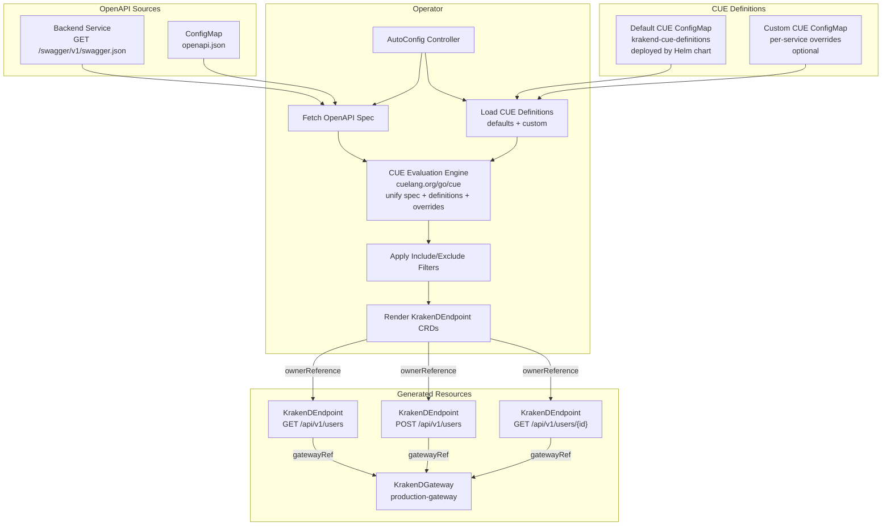

### Execution Model

The autoconfig controller runs **exactly once per change** (when `trigger: OnChange`):

1. **On `KrakenDAutoConfig` creation** — fetch the OpenAPI spec, load CUE definitions, evaluate CUE to generate endpoints, set status to `Synced`
2. **On `KrakenDAutoConfig` update** — re-fetch the spec, re-evaluate CUE, diff against existing generated endpoints, create/update/delete as needed
3. **On `KrakenDAutoConfig` deletion** — all generated `KrakenDEndpoint` resources are garbage-collected via `ownerReference`
4. **On CUE definitions ConfigMap update** — the controller watches the referenced ConfigMap(s) and re-evaluates when definitions change

When `trigger: Periodic`, the controller additionally re-fetches the spec on the configured interval and reconciles changes. The spec checksum (`status.specChecksum`) prevents unnecessary endpoint churn when the spec hasn't changed. A CUE definitions change (detected via ConfigMap resourceVersion) triggers re-evaluation even when the spec checksum is unchanged.

### CUE Evaluation Detail

The CUE evaluation pipeline replaces the discrete parse → transform → merge stages with a single declarative evaluation that outputs `KrakenDEndpointSpec` objects:

1. **Import OpenAPI spec as CUE data** — the fetched JSON/YAML spec is converted to a CUE value using `cue.Context.CompileBytes()`, placed under a named label (e.g., the service name from the `KrakenDAutoConfig` metadata)
2. **Load default definitions** — the operator's default CUE definitions (from `krakend-cue-definitions` ConfigMap) define the iteration pattern: for each path+verb in the spec, produce a `KrakenDEndpointSpec` struct with `endpoint`, `method`, `backends[]` (host, urlPattern, policyRef), `inputHeaders`, `inputQueryStrings`, `timeout`, and `extraConfig`
3. **Load custom definitions** — if `cue.definitionsConfigMapRef` is set, custom `.cue` files are loaded and unified with defaults. Custom definitions can:
   - Override `#internalHost` mappings per environment (equivalent to KrakenD-SwaggerParse's `swagger_overrides.cue`)
   - Set per-path `enabled`, `rewrite`, `timeout`, `policyRef` overrides
   - Add or restrict `extraConfig` injections on generated endpoints
   - Define custom rate-limit parameters per path or per operation
4. **Apply CR overrides as CUE values** — the `defaults`, `overrides`, and `filter` fields from the `KrakenDAutoConfig` spec are converted to CUE values and unified with the evaluation context
5. **Set environment value** — `cue.environment` is injected into the CUE evaluation context via `FillPath("_env", ...)`, populating a hidden CUE field `_env` that definitions reference for per-environment branches (host resolution, namespace selection, etc.). This uses `FillPath` rather than CUE `@tag()` because the operator evaluates CUE via `cue/cuecontext` (not `cue/load`), and `@tag()` injection is only supported by `cue/load`.
6. **Evaluate and export** — the unified CUE value is evaluated to concrete JSON matching the `KrakenDEndpointSpec` schema, producing an array of endpoint specs. CUE constraint violations (e.g., missing `gatewayRef`, invalid `method`, type mismatches against the CRD schema) surface as evaluation errors, reported in the `KrakenDAutoConfig` status. The generator (§13 in the application architecture) wraps each evaluated spec in a `KrakenDEndpoint` CR with appropriate metadata, labels, and owner references.

> **Relationship to KrakenD-SwaggerParse:** The default CUE definitions encode the same transformation *logic* as KrakenD-SwaggerParse's `endpoints.cue` but target the `KrakenDEndpointSpec` CRD schema rather than raw KrakenD JSON. The iteration pattern (for each path+verb, produce an endpoint), host resolution via `#internalHost` per environment, parameter extraction from OpenAPI `parameters[]`, and per-path override mechanism (`enabled`, `rewrite`, `timeout`, `api_rate_limit`) are preserved. The output structure changes: instead of producing KrakenD JSON fields (`url_pattern`, `input_headers`, `extra_config`), the CUE definitions produce CRD fields (`backends[].urlPattern`, `inputHeaders`, `extraConfig`). The rendering pipeline (§10) handles the CRD → `krakend.json` conversion. The `swagger_overrides.cue` pattern is supported via custom CUE definitions ConfigMaps. The shell-script import pipeline (`import_oas.sh`) is replaced by the operator's HTTP fetcher.

### URL Transformation Pipeline

The URL transformation pipeline converts public-facing OpenAPI paths and server URLs to internal Kubernetes service addresses:

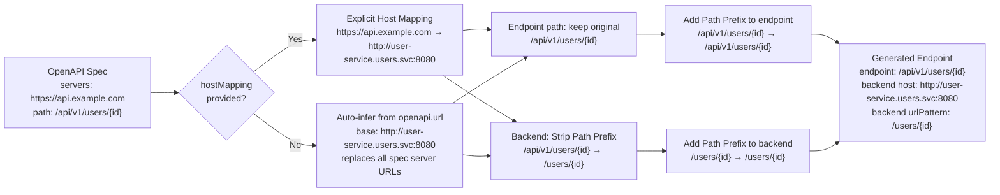

**Host resolution:** When `urlTransform.hostMapping` is provided, each OpenAPI server URL is matched against the `from` values and replaced with the corresponding `to` value. When `hostMapping` is omitted, the operator extracts the base address (scheme + host + port) from `openapi.url` and uses it as the backend host for all generated endpoints, replacing any server URL in the spec. This is the common case — the service serving the OpenAPI spec is typically the same service that handles the API traffic. When `openapi.configMapRef` is used instead of `openapi.url`, `hostMapping` is required (there is no URL to infer from).

The **KrakenD endpoint path** (what clients call) uses the original OpenAPI path, optionally prefixed by `pathPrefix.add`. The **backend urlPattern** (what the backend receives) uses the transformed path after strip/add prefix operations. This separation allows the gateway to present a stable public API while internal routing adapts to service-internal paths.

### Generated Endpoint Naming Convention

Generated `KrakenDEndpoint` names follow the pattern:

```
{autoconfig-name}-{operationId}
```

If no `operationId` is present in the OpenAPI spec, the name is derived from:

```
{autoconfig-name}-{method}-{sanitized-path}
```

Where `sanitized-path` replaces `/` with `-`, removes leading dashes, and converts `{param}` to `param`. Example: `users-autoconfig-get-api-v1-users-id`.

All generated endpoints carry the label `gateway.krakend.io/auto-generated: "true"` and `gateway.krakend.io/autoconfig: {autoconfig-name}` for easy identification and querying.

### Interaction with Manual Endpoints

- Generated endpoints are standard `KrakenDEndpoint` resources and participate in the normal conflict detection pipeline (§5)
- If a manually-created `KrakenDEndpoint` conflicts with a generated one, the standard tie-breaking rules apply (older by `creationTimestamp` wins)
- Users can override generated endpoints by creating manual endpoints with the same path+method — the manual endpoint wins if it was created first
- To exclude specific operations from auto-generation, use the `filter.excludeOperationIds` or `filter.excludePaths` fields

### Runtime Model

The autoconfig controller runs as part of the main operator process (same binary, same Deployment). It watches `KrakenDAutoConfig` resources and reconciles them independently of the gateway controller. The controller:

- Uses a separate work queue keyed by `KrakenDAutoConfig` namespace/name
- Does NOT trigger gateway reconciliation directly — generated `KrakenDEndpoint` creates/updates trigger the normal endpoint controller watch, which in turn triggers the gateway reconciler
- Runs with the same RBAC permissions as the gateway controller (it creates `KrakenDEndpoint` resources, which requires `create/update/patch/delete` on `krakendendpoints`)

### SSRF Mitigation

The `openapi.url` field accepts arbitrary HTTP URLs, which introduces a server-side request forgery (SSRF) risk: the operator pod could be directed to fetch cluster-internal endpoints (Kubernetes API, cloud metadata services, etc.). Mitigations:

1. **URL scheme restriction** — the operator only allows `http://` and `https://` schemes; rejects `file://`, `ftp://`, etc.
2. **IP blocklist** — the operator always rejects URLs resolving to loopback addresses (`127.0.0.0/8`, `::1`), link-local addresses (`169.254.0.0/16`, `fe80::/10`), and IPv6 ULA addresses (`fc00::/7` — includes `fd00::/8` covering AWS `fd00:ec2::254`, GCP, and similar provider-assigned metadata endpoints; the `fc00::/8` half is reserved by RFC 4193 but blocked preventively). When `openapi.allowClusterLocal: false`, RFC 1918 private ranges (`10.0.0.0/8`, `172.16.0.0/12`, `192.168.0.0/16`) are also blocked. Resolved addresses MUST be normalized prior to CIDR matching: if an IPv6 address is an IPv4-mapped address (`::ffff:0:0/96`), it must be converted to its IPv4 form before applying the RFC 1918 rules. The default `allowClusterLocal: true` permits fetching from cluster-internal services (the primary use case). Cloud metadata endpoints (`169.254.169.254` and IPv6 equivalents) are always blocked regardless of this setting
3. **DNS resolution validation** — the operator resolves the hostname before making the request and applies the IP blocklist to the resolved address (prevents DNS rebinding)
4. **Redirect validation** — the operator applies the same IP blocklist to HTTP redirect `Location` headers before following them, preventing redirect-based SSRF bypasses. Maximum redirect depth: 5
5. **HTTP timeout** — all spec fetches use a configurable timeout (default: 30 seconds) to prevent resource exhaustion from slow endpoints
6. **RBAC gating** — `KrakenDAutoConfig` creation should be restricted via Kubernetes RBAC to trusted operators/CI systems, not arbitrary namespace users

### Duplicate operationId Handling

If an OpenAPI spec contains duplicate `operationId` values (technically invalid per the OpenAPI specification but common in practice), the autoconfig controller:

1. Uses the **first** occurrence and skips subsequent duplicates
2. Emits a `DuplicateOperationId` Warning event on the `KrakenDAutoConfig` resource
3. Increments the `status.skippedOperations` counter

### Events and Conditions

| Event | Type | Reason |
|---|---|---|
| OpenAPI spec fetched successfully | Normal | `SpecFetched` |
| OpenAPI spec fetch failed | Warning | `SpecFetchFailed` |
| CUE evaluation failed | Warning | `CUEEvaluationFailed` |
| Endpoints generated/updated | Normal | `EndpointsGenerated` |
| Operation skipped (filtered) | Normal | `OperationFiltered` |
| Operation has no operationId | Warning | `MissingOperationId` |
| Duplicate operationId in OpenAPI spec | Warning | `DuplicateOperationId` |

| Condition | Meaning |
|---|---|
| `SpecAvailable` | OpenAPI spec was fetched and parsed successfully |
| `Synced` | Generated endpoints are in sync with the latest spec |

---

## 17. Directory Structure

Go project layout following [Standard Go Project Layout](https://github.com/golang-standards/project-layout) conventions. The `operator/` directory is the Go module root; all Go imports, build commands, and `make` targets run from this directory.

```
.
├── architecture/                           # Architecture documentation (not part of Go module)
│   ├── README.md                           # Operator architecture (this document)
│   └── application/
│       └── application-architecture.md     # Application architecture
├── operator/                               # Go module root (all paths below are relative to here)
│   ├── api/
│   │   └── v1alpha1/
│   │       ├── krakendgateway_types.go        # KrakenDGateway CRD types
│   │       ├── krakendendpoint_types.go        # KrakenDEndpoint CRD types
│   │       ├── krakendbackendpolicy_types.go   # KrakenDBackendPolicy CRD types
│   │       ├── krakendautoconfig_types.go      # KrakenDAutoConfig CRD types
│   │       ├── groupversion_info.go            # API group registration
│   │       └── zz_generated.deepcopy.go        # Generated deep copy methods
│   ├── cmd/
│   │   └── main.go                             # Entrypoint
│   ├── internal/
│   │   ├── controller/
│   │   │   ├── gateway_controller.go           # KrakenDGateway reconciler
│   │   │   ├── endpoint_controller.go          # KrakenDEndpoint reconciler
│   │   │   ├── policy_controller.go            # KrakenDBackendPolicy reconciler
│   │   │   ├── autoconfig_controller.go        # KrakenDAutoConfig reconciler (OpenAPI watcher)
│   │   │   └── license_monitor.go              # Periodic license expiry checker
│   │   ├── autoconfig/
│   │   │   ├── fetcher.go                      # OpenAPI spec fetcher (HTTP + ConfigMap sources)
│   │   │   ├── cue_evaluator.go                # CUE evaluation engine (cuelang.org/go/cue)
│   │   │   ├── filter.go                       # Include/exclude filter engine
│   │   │   └── generator.go                    # EndpointEntry → KrakenDEndpoint CRD renderer
│   │   ├── renderer/
│   │   │   ├── config.go                       # KrakenD JSON config builder
│   │   │   ├── endpoints.go                    # Endpoint array builder
│   │   │   ├── extra_config.go                 # extra_config namespace builder
│   │   │   ├── plugins.go                      # Plugin volume + krakend.json plugin block builder
│   │   │   └── validator.go                    # krakend check -tlc wrapper
│   │   ├── resources/
│   │   │   ├── deployment.go                   # Deployment builder (includes plugin volume assembly)
│   │   │   ├── service.go                      # Service builder
│   │   │   ├── configmap.go                    # ConfigMap builder
│   │   │   ├── serviceaccount.go               # ServiceAccount builder
│   │   │   ├── pdb.go                          # PodDisruptionBudget builder
│   │   │   ├── hpa.go                          # HorizontalPodAutoscaler builder
│   │   │   ├── dragonfly.go                    # Dragonfly CR builder (dragonflydb.io/v1alpha1)
│   │   │   ├── virtualservice.go               # Istio VirtualService builder
│   │   │   └── externalsecret.go               # ExternalSecret builder
│   │   ├── webhook/
│   │   │   └── validation.go                   # ValidatingAdmissionWebhook handlers
│   │   └── util/
│   │       ├── hash.go                         # SHA-256 config checksumming
│   │       └── license.go                      # X.509 license parsing
│   ├── config/
│   │   ├── crd/
│   │   │   └── bases/                          # Generated CRD YAML manifests
│   │   ├── cue/
│   │   │   └── defaults/                       # Default CUE transformation definitions (deployed as ConfigMap by Helm)
│   │   │       ├── endpoints.cue               # Core transformation: OpenAPI paths → KrakenDEndpointSpec CRDs
│   │   │       ├── schema.cue                  # KrakenDEndpointSpec output schema constraints
│   │   │       └── defaults.cue                # Default rate limits, headers, timeouts, policyRef, extraConfig
│   │   ├── rbac/                               # RBAC manifests
│   │   ├── webhook/                            # Webhook manifests (ValidatingWebhookConfiguration)
│   │   ├── manager/                            # Operator Deployment manifests
│   │   └── samples/                            # Example CR YAML files
│   ├── test/
│   │   └── e2e/                                # End-to-end tests
│   ├── go.mod
│   ├── go.sum
│   ├── Makefile
│   ├── Dockerfile
│   └── PROJECT                                 # operator-sdk project metadata
└── .github/                                # CI, linting, and AI development instructions
```
