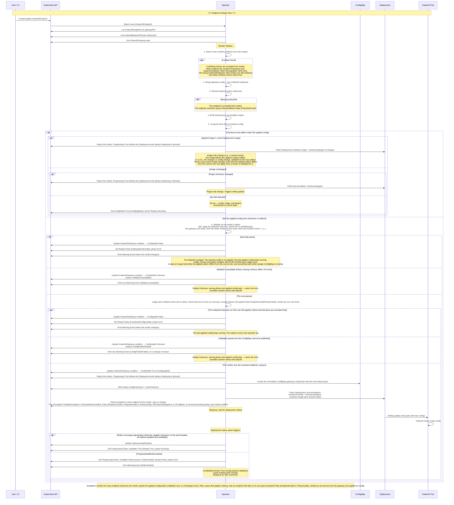
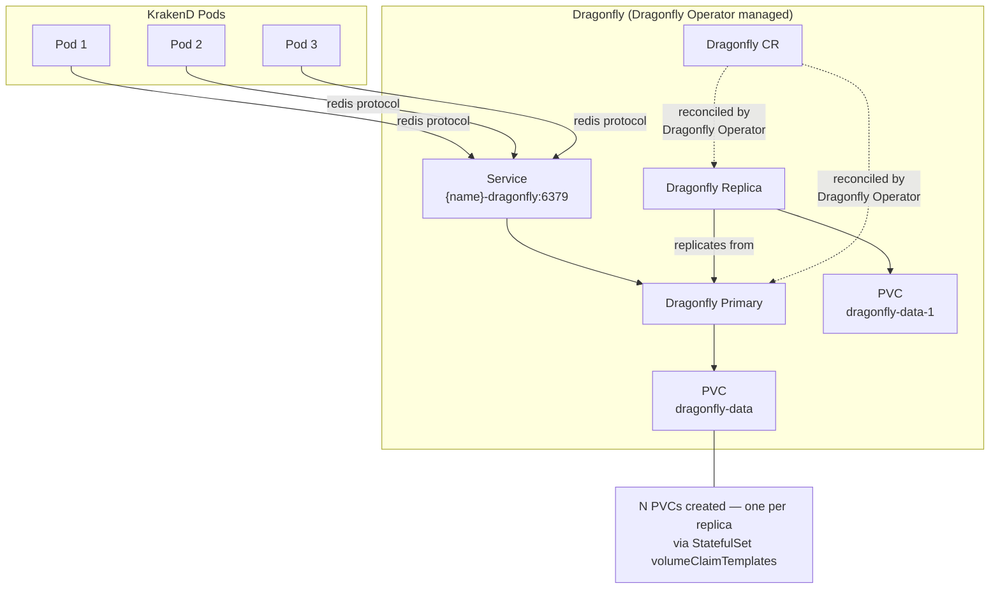
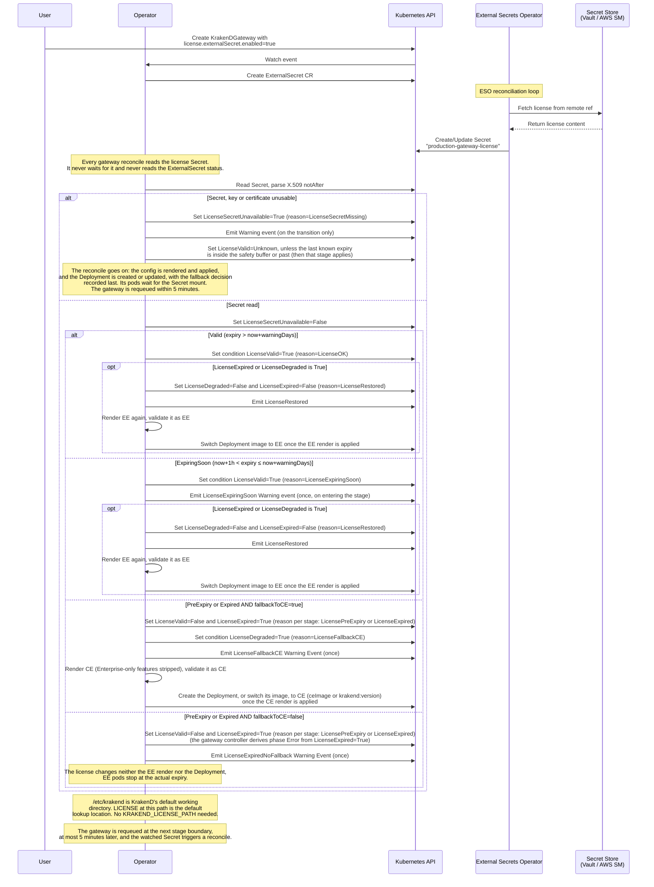
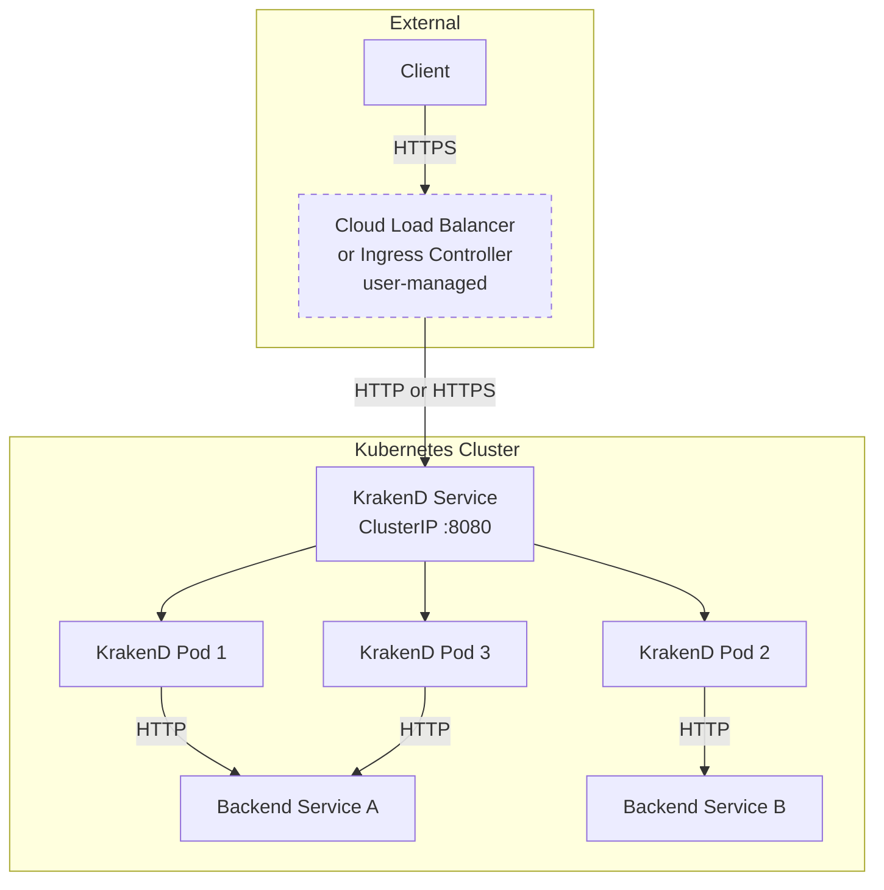
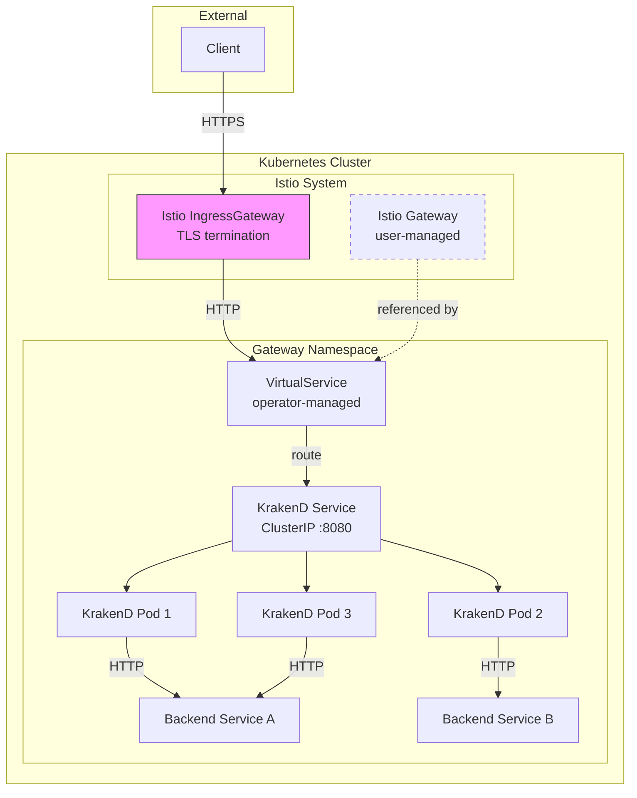
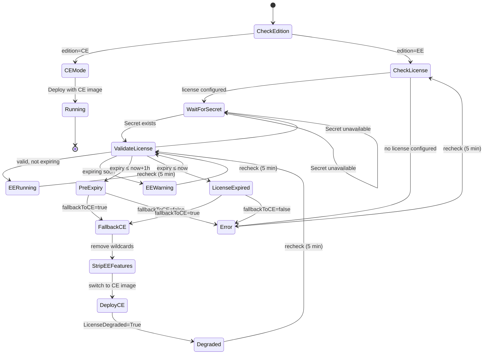
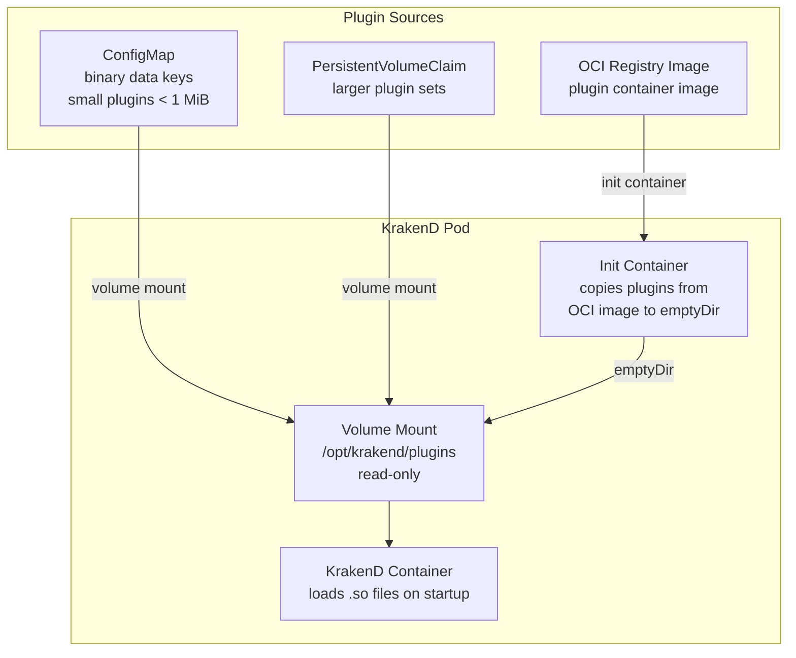
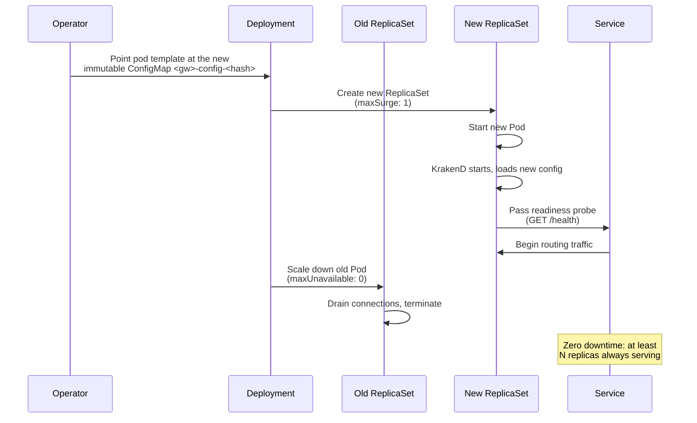
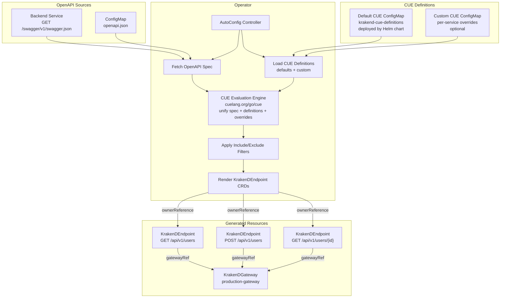
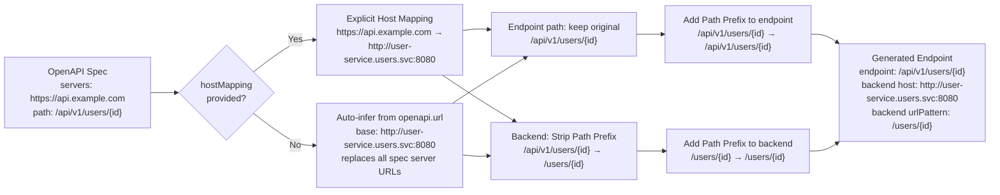

# KrakenD Operator — Proposed Architecture

> **Version:** 0.1.0-draft
> **Date:** 2026-04-03
> **Status:** Proposal
> **API Group:** `gateway.krakend.io/v1alpha1`

---

## Table of Contents

1. [Goals and Non-Goals](#1-goals-and-non-goals)
2. [High-Level Architecture](#2-high-level-architecture)
3. [Custom Resource Definitions](#3-custom-resource-definitions)
4. [CRD Interaction Model](#4-crd-interaction-model)
5. [Reconciliation Data Flow](#5-reconciliation-data-flow)
6. [Dragonfly Integration](#6-dragonfly-integration)
7. [External Secrets Integration](#7-external-secrets-integration)
8. [Istio Integration](#8-istio-integration)
9. [License Lifecycle Management](#9-license-lifecycle-management)
10. [Configuration Rendering Pipeline](#10-configuration-rendering-pipeline)
11. [Plugin Management](#11-plugin-management)
12. [Zero-Downtime Deployment Strategy](#12-zero-downtime-deployment-strategy)
13. [Security Model](#13-security-model)
14. [Operator RBAC Requirements](#14-operator-rbac-requirements)
15. [Status and Observability](#15-status-and-observability)
16. [OpenAPI Auto-Configuration](#16-openapi-auto-configuration)
17. [Directory Structure](#17-directory-structure)

---

## 1. Goals and Non-Goals

### Goals

- Declaratively manage KrakenD CE and EE API Gateway deployments via Kubernetes CRDs
- Allow multiple teams to independently publish endpoints to a shared gateway
- Render KrakenD Flexible Configuration from CRD state and trigger zero-downtime rolling deployments
- Optionally render a `Dragonfly` CR (via the [Dragonfly Operator](https://github.com/dragonflydb/dragonfly-operator)) for stateful EE features (cluster rate limiting, quota, token revocation)
- Integrate with External Secrets Operator for EE license provisioning from external secret stores
- Optionally create Istio VirtualService resources targeting a user-defined Istio Gateway for TLS/connection termination
- Monitor EE license expiry and proactively alert or fall back to CE before processes shut down
- Mount custom KrakenD plugins (`.so` files) via Kubernetes volumes without requiring custom image builds
- Automatically generate KrakenDEndpoint CRDs from OpenAPI (Swagger) specifications via the `KrakenDAutoConfig` CRD
- Validate generated KrakenD configurations before deployment (`krakend check -t -n -c`)

### Non-Goals

- **Not an Istio Gateway controller** — the operator does NOT create or manage Istio Gateway resources; it only creates VirtualService resources targeting an existing Gateway
- **Not a secret store** — the operator delegates secret storage to External Secrets Operator, Vault, or native K8s Secrets
- **Not a Dragonfly lifecycle manager** — the operator renders a `Dragonfly` CR (`dragonflydb.io/v1alpha1`); the [Dragonfly Operator](https://github.com/dragonflydb/dragonfly-operator) must be installed in the cluster to reconcile it into a running instance. Dragonfly Operator handles StatefulSet, Service, PVC, failover, and scaling.

---

## 2. High-Level Architecture


```mermaid
graph TB
    subgraph "Kubernetes Cluster"
        subgraph "Operator Namespace"
            OP[KrakenD Operator<br/>Controller Manager]
        end

        subgraph "Gateway Namespace"
            KG[KrakenDGateway CR]
            KE1[KrakenDEndpoint CR<br/>Team A]
            KE2[KrakenDEndpoint CR<br/>Team B]
            KE3[KrakenDEndpoint CR<br/>Team C]
            KBP[KrakenDBackendPolicy CR<br/>Shared Policies]

            CM[ConfigMap<br/>krakend.json]
            SEC[Secret<br/>LICENSE]
            DEP[Deployment<br/>KrakenD Pods]
            SVC[Service<br/>ClusterIP]
            SA[ServiceAccount]
            PDB[PodDisruptionBudget]
            HPA[HorizontalPodAutoscaler]

            DF[Dragonfly CR<br/>dragonflydb.io/v1alpha1]

            VS[Istio VirtualService]
            ES[ExternalSecret CR]

            AC[KrakenDAutoConfig CR]
        end

        subgraph "External Secrets Namespace"
            ESO[External Secrets<br/>Operator]
        end

        subgraph "Dragonfly Operator Namespace"
            DFO[Dragonfly Operator]
        end

        subgraph "Istio System"
            IG[Istio Gateway<br/>user-managed]
            IP[Istio IngressGateway<br/>Pods]
        end

        subgraph "Backend Namespaces"
            BE1[Backend Service A]
            BE2[Backend Service B]
            BE3[Backend Service C]
        end
    end

    subgraph "External"
        VAULT[Secret Store<br/>Vault / AWS SM / GCP SM]
        IDP[Identity Provider<br/>Auth0 / Keycloak]
    end

    OP -->|watches| KG
    OP -->|watches| KE1
    OP -->|watches| KE2
    OP -->|watches| KE3
    OP -->|watches| KBP
    OP -->|creates/updates| CM
    OP -->|creates/updates| DEP
    OP -->|creates/updates| SVC
    OP -->|creates/updates| SA
    OP -->|creates/updates| PDB
    OP -->|creates/updates| HPA
    OP -->|creates/updates| DF
    OP -->|creates/updates| VS
    OP -->|creates/updates| ES

    OP -->|watches| AC
    AC -->|generates| KE1
    AC -->|generates| KE2

    ESO -->|syncs| VAULT
    ESO -->|creates/updates| SEC
    ES -->|references| VAULT

    DEP -->|mounts| CM
    DEP -->|mounts| SEC
    DEP -->|redis protocol| DF
    DEP -->|routes to| BE1
    DEP -->|routes to| BE2
    DEP -->|routes to| BE3

    VS -->|targets| IG
    VS -->|routes to| SVC
    IP -->|routes via VS| SVC

    DEP -->|validates JWT| IDP

    KE1 -->|references| KG
    KE2 -->|references| KG
    KE3 -->|references| KG
    KE1 -.->|references| KBP
    KE2 -.->|references| KBP

    DFO -.->|reconciles| DF
```

---

## 3. Custom Resource Definitions

### 3.1 KrakenDGateway

The primary resource representing a KrakenD API Gateway deployment. One KrakenDGateway produces exactly one Deployment, one Service, one ConfigMap, and optionally a Dragonfly CR, Istio VirtualService, and ExternalSecret.

```yaml
apiVersion: gateway.krakend.io/v1alpha1
kind: KrakenDGateway
metadata:
  name: production-gateway
  namespace: api-gateway
spec:
  # --- Deployment ---
  edition: EE                          # CE or EE
  version: "2.13"                      # KrakenD version tag
  image: ""                            # Override: full image reference (ignores edition/version for image selection only; `edition` still controls config rendering)
  ceImage: ""                          # CE fallback image override (default: krakend:{version}); used when fallbackToCE=true and the operator switches from EE to CE
  replicas: 3                          # ignored when autoscaling is set; a new Deployment starts at minReplicas and the HPA owns the count
  # Omit the autoscaling block to disable autoscaling (there is no `enabled` field).
  autoscaling:
    minReplicas: 2
    maxReplicas: 10
    targetCPUUtilizationPercentage: 70

  resources:
    requests:
      cpu: "500m"
      memory: "256Mi"
    limits:
      cpu: "2"
      memory: "1Gi"

  # --- KrakenD Service-Level Configuration ---
  config:
    port: 8080
    timeout: "3s"
    cacheTTL: "0s"
    outputEncoding: json               # json, negotiate, no-op, etc.
    dnsCacheTTL: "30s"

    cors:
      allowOrigins: ["https://app.example.com"]
      allowMethods: ["GET", "POST", "PUT", "DELETE"]
      allowHeaders: ["Authorization", "Content-Type"]
      maxAge: "12h"

    security:
      sslRedirect: false               # false when behind Istio
      sslProxyHeaders:
        X-Forwarded-Proto: "https"     # trust Istio's header
      frameOptions: DENY
      contentTypeNosniff: true
      browserXssFilter: true
      hstsSeconds: 31536000
      contentSecurityPolicy: "default-src 'self';"

    logging:
      level: INFO                      # DEBUG, INFO, WARNING, ERROR, CRITICAL
      format: logstash                 # default, logstash
      stdout: true

    router:
      returnErrorMsg: true
      healthPath: /health
      autoOptions: true
      disableAccessLog: false

    telemetry:
      serviceName: krakend-gateway
      exporters:
        otlp:
          - host: otel-collector.monitoring
            port: 4317
        prometheus:
          - port: 9091
      layers:
        global:
          disableMetrics: false
          disableTraces: false

  # --- TLS (only when NOT using Istio) ---
  tls:
    enabled: false
    # publicKey: /path/to/cert.pem
    # privateKey: /path/to/key.pem
    # minVersion: "TLS13"

  # --- Plugin Management ---
  plugins:
    # Plugins are Go shared-object files (.so) mounted into the KrakenD pod.
    # They do NOT need to be compiled into the KrakenD image.
    sources:
      - name: custom-auth-plugin
        configMapRef:
          name: krakend-plugins-auth     # ConfigMap containing .so file(s) as binary data keys
        # --- OR from a PersistentVolumeClaim ---
        # persistentVolumeClaimRef:
        #   name: krakend-plugins         # PVC containing plugin .so files
        # --- OR from a container image (OCI artifact) ---
        # imageRef:
        #   image: registry.example.com/krakend-plugins:v1.2.0
        #   pullPolicy: IfNotPresent
        #   imagePullSecrets:            # for private registries
        #     - name: registry-creds
    # KrakenD plugin directory (mounted read-only into all KrakenD pods)
    mountPath: /opt/krakend/plugins      # default KrakenD plugin search path

  # --- Dragonfly / Redis ---
  # Requires: Dragonfly Operator (https://github.com/dragonflydb/dragonfly-operator) installed in the cluster
  dragonfly:
    enabled: true                      # operator renders a Dragonfly CR; Dragonfly Operator reconciles it
    image: "docker.dragonflydb.io/dragonflydb/dragonfly:v1.25.2"
    replicas: 2                        # total instances (1 primary + N-1 replicas); managed by Dragonfly Operator
    resources:
      requests:
        cpu: "250m"
        memory: "512Mi"
      limits:
        cpu: "1"
        memory: "2Gi"
    snapshot:
      cron: "*/30 * * * *"             # optional snapshot schedule
      persistentVolumeClaimSpec:
        accessModes: ["ReadWriteOnce"]
        resources:
          requests:
            storage: "10Gi"
        # storageClassName: ""         # default storage class
    args: []                           # additional Dragonfly server flags
    # authentication is rejected on EE gateways, because the operator does not render the password into KrakenD's pool:
    # authentication:
    #   passwordFromSecret:
    #     name: dragonfly-auth
    #     key: password
    # --- OR skip CR creation (use external Redis/Dragonfly via redis.connectionPool) ---
    # enabled: false

  # --- Redis Connection Pool (maps to KrakenD EE `redis` extra_config) ---
  redis:
    connectionPool:
      addresses: []                    # user-set for external Redis only; when dragonfly.enabled=true, operator derives address internally — leave empty
      # password and tls are rejected when set or changed, because the operator has never rendered them:
      # password:
      #   name: ""
      #   key: ""
      poolSize: 50
      minIdleConns: 10
      dialTimeout: "5s"
      readTimeout: "3s"                # deprecated: no effect, KrakenD's redis pools have no such setting
      writeTimeout: "3s"               # deprecated: no effect, KrakenD's redis pools have no such setting
      # tls:
      #   enabled: false
      #   secretName: ""               # Opaque Secret containing ca.crt, tls.crt, tls.key (cert-manager adds ca.crt automatically; create manually if not using cert-manager)

  # --- Istio Integration ---
  istio:
    enabled: true
    virtualService:
      gateways: ["istio-system/main-gateway"]  # references to existing Istio Gateway(s)
      hosts: ["api.example.com"]
      httpRoutes:
        - match:
            - uri:
                prefix: /
          timeout: "30s"

  # --- Enterprise License (EE only) ---
  license:
    externalSecret:
      enabled: true
      secretStoreRef:
        name: vault-backend
        kind: ClusterSecretStore
      remoteRef:
        key: secret/data/krakend/license
        property: license
      refreshInterval: "1h"
    # --- OR use a pre-existing Secret ---
    # secretRef:
    #   name: krakend-license
    #   key: LICENSE
    expiryWarningDays: 30
    fallbackToCE: true                 # switch to CE image on license expiry

status:
  phase: Running                       # derived from Ready: Pending, Deploying, Running, Degraded, Error
  configChecksum: "sha256:abc123..."
  configEdition: EE                    # the edition configChecksum was validated for
  observedGeneration: 5
  replicas: 3
  readyReplicas: 3
  conditions:
    - type: Ready
      status: "True"
      lastTransitionTime: "2026-04-03T10:00:15Z"
      reason: Ready
      message: "Configuration applied and all replicas available"
    - type: ConfigValid
      status: "True"
      lastTransitionTime: "2026-04-03T10:00:00Z"
      reason: ConfigApplied
      message: "Configuration passed validation and is applied"
    - type: Available
      status: "True"
      lastTransitionTime: "2026-04-03T10:00:05Z"
      reason: DeploymentAvailable
      message: "3/3 replicas ready"
    - type: LicenseValid
      status: "True"
      lastTransitionTime: "2026-04-01T00:00:00Z"
      reason: LicenseOK
      message: "License valid for 89 days"
    - type: DragonflyReady
      status: "True"
      lastTransitionTime: "2026-04-03T10:00:10Z"
      reason: DragonflyReady
      message: "Dragonfly instance is ready"
    - type: IstioConfigured
      status: "True"
      lastTransitionTime: "2026-04-03T10:00:02Z"
      reason: VirtualServiceCreated
      message: "VirtualService production-gateway created"
    - type: Progressing
      status: "False"
      lastTransitionTime: "2026-04-03T10:00:15Z"
      reason: RolloutComplete
      message: "Deployment rollout completed successfully"
    - type: LicenseSecretUnavailable
      status: "False"
      lastTransitionTime: "2026-04-03T09:59:55Z"
      reason: SecretAvailable
      message: "License Secret is available"
  licenseExpiry: "2026-07-01T00:00:00Z"
  activeImage: "krakend/krakend-ee:2.13"   # currently deployed container image
  endpointCount: 42
  dragonflyAddress: "production-gateway-dragonfly.api-gateway.svc.cluster.local:6379"
```

**Schema rules.** The CRD enforces what the object alone decides, as it does for KrakenDEndpoint, so the API server rejects a violation before any webhook runs:

- `config.timeout`, `cacheTTL`, `dnsCacheTTL`, `cors.maxAge` and `redis.connectionPool.dialTimeout` are KrakenD durations (one integer and one unit). `timeout`, `cacheTTL`, `dnsCacheTTL` and `dialTimeout` also carry a CEL duration-parse rule and `MaxLength` 64, because the pattern admits values such as `99999999999h` that KrakenD rejects. `postRestartJob.tmpSizeLimit` carries `isQuantity` and a 64-character bound, because the quantity pattern admits values such as `1e99999999999999999999` that Go's quantity decode rejects. A strict pattern (a decimal or binary SI suffix, or an `e`/`E` exponent of at most two digits) is checked first, so `isQuantity` never parses a pathological exponent such as `1e2147483648`, which takes seconds. `config.port` is 1-65535, `config.outputEncoding` an enum of KrakenD 2.13's values, and `router.healthPath` starts with `/`.
- CEL rules on the spec: an Enterprise gateway needs `license.externalSecret.enabled` or a `license.secretRef` with a non-empty name, a Community gateway has neither, the two sources are mutually exclusive, and the OpenAPI port differs from the listen port (defaults 8090 and 8080). At most one plugin source uses a PVC, and `plugins.sources` holds at most 32 items, which also bounds the rule's cost. An enabled `postRestartJob` needs a script.
- `redis.connectionPool.password` and `.tls` are rejected when set or changed, because the operator has never rendered them. `dragonfly.authentication.passwordFromSecret` is rejected on an Enterprise gateway for the same reason. The Dragonfly rule reads `edition`, so it uses `optionalOldSelf` to admit an update whose stored object already had the same password on an Enterprise gateway (a changed password is rejected); the field-level rules rely on native ratcheting.

The webhook keeps what needs the default-image context or quantity arithmetic: the probe rules, the runAs ratchets, the `tmpSizeLimit` sign check and the warnings.

### 3.2 KrakenDEndpoint

Represents a single endpoint (or group of related endpoints) exposed by the gateway. Multiple teams create KrakenDEndpoints targeting the same KrakenDGateway.

```yaml
apiVersion: gateway.krakend.io/v1alpha1
kind: KrakenDEndpoint
metadata:
  name: users-api
  namespace: api-gateway
  labels:
    team: platform
    domain: users
spec:
  gatewayRef:
    name: production-gateway            # must be in the same namespace

  endpoints:
    - endpoint: /api/v1/users/{id}
      method: GET
      timeout: "800ms"
      cacheTTL: "60s"
      concurrentCalls: 1
      outputEncoding: json
      inputHeaders:
        - Authorization
        - Content-Type
        - Accept-Language
      inputQueryStrings:
        - fields
        - include

      extraConfig:
        auth:
          validator:
            alg: RS256
            jwkURL: https://idp.example.com/.well-known/jwks.json
            cache: true
            audience: ["https://api.example.com"]
            issuer: https://idp.example.com
            rolesKey: realm_access.roles
            rolesKeyIsNested: true
            roles: ["user", "admin"]
            propagateClaims:
              - ["sub", "x-user-id"]
              - ["email", "x-user-email"]
        rateLimit:
          maxRate: 1000
          clientMaxRate: 50
          strategy: ip
        # Arbitrary extra_config pass-through for namespaces not modeled above
        raw:
          "validation/cel":
            - check_expr: "req_headers['X-Tenant-ID'].size() > 0"

      backends:
        - host: ["http://user-service.users.svc.cluster.local:8080"]
          urlPattern: /users/{id}
          encoding: json
          allow: ["id", "name", "email", "role"]
          mapping:
            id: user_id
          extraConfig:
            circuitBreaker:
              interval: 60
              timeout: 15
              maxErrors: 5
              logStatusChange: true
            rateLimit:
              maxRate: 200
              capacity: 200
            # backend-scoped raw pass-through
            raw: {}
          # optional: reference a shared policy (merged with inline extraConfig; inline fields take precedence on collision)
          policyRef:
            name: standard-backend-policy

    - endpoint: /api/v1/users
      method: POST
      timeout: "2s"
      inputHeaders:
        - Authorization
        - Content-Type
      backends:
        - host: ["http://user-service.users.svc.cluster.local:8080"]
          urlPattern: /users
          method: POST
          policyRef:
            name: standard-backend-policy

status:
  phase: Active                        # derived from Ready: Pending, Active, Invalid, Conflicted, Detached
  observedGeneration: 3
  endpointCount: 2
  methods: GET,POST
  conditions:
    - type: ResolvedRefs               # endpoint controller
      status: "True"
      observedGeneration: 3
      lastTransitionTime: "2026-04-03T10:00:00Z"
      reason: RefsResolved
      message: "Gateway and all policy references resolved"
    - type: Accepted                   # gateway controller
      status: "True"
      observedGeneration: 3
      lastTransitionTime: "2026-04-03T10:00:01Z"
      reason: Accepted
      message: "Included in the configuration of gateway api-gateway/production-gateway"
    - type: Ready                      # endpoint controller, derived from the two above
      status: "True"
      observedGeneration: 3
      lastTransitionTime: "2026-04-03T10:00:01Z"
      reason: Ready
      message: "References resolved and accepted by the gateway"
```

**Schema rules.** The CRD enforces what the object alone decides, so the API server rejects a violation before any webhook runs and the same rules apply to GitOps tools that bypass the webhook:

- `spec.endpoints` is a map list keyed on (`endpoint`, `method`) with at least one entry. A repeated pair is rejected (`Duplicate value`), and server-side apply merges entries by key instead of replacing the list.
- Every entry has at least one backend. `endpoint` starts with `/` and has no `*`, `?`, `&`, `%`, whitespace or control character, except a trailing `/*` wildcard. A backend `host` is non-empty and holds no whitespace or control character: `krakend check` prints both verbatim in its errors.
- `timeout` and `cacheTTL` match Go's `time.ParseDuration` grammar without a sign. A malformed value would otherwise break decoding of the whole `KrakenDEndpointList` in every informer. A CEL rule also requires that they parse as a duration that fits in 64 bits of nanoseconds, with a `maxLength` of 64: the pattern alone admits overflowing values such as `2562048h`. The rule runs only on values that match the pattern, so a stored non-duration fails the pattern alone and ratchets, and a spec holds at most 1024 entries, which keeps the rules inside the CEL cost budget.
- `outputEncoding`, a backend's `encoding`, `sd` and `method` are enums taken from KrakenD 2.13's own schema. `gatewayRef.name` and `policyRef.name` have a minimum length of 1.

**Entry rules at admission.** The webhook checks the rules the operator enforces that the entry and its gateway decide, on the entries an update adds or changes (every entry when the object moves to another gateway), and names the field. The operator validates every render, Enterprise included, with the embedded CE `krakend` binary, so these checks also refuse features only the Enterprise binary accepts (`{input_headers.X}` and `{input_query_strings.x}` placeholders, reserved-path variants).

- A path equal to or under `/__debug`, `/__echo` or `/__health` is reserved by KrakenD.
- `GET` on the gateway's health path is rejected. The path follows the route check (`renderer.ParseRouterOptions`): a `router` block in `spec.config.extraConfig` replaces the typed `spec.config.router`, `disable_health` frees the path, and a block that does not decode reads as the defaults.
- The root wildcard `/*` is rejected in both editions. `/prefix/*` wildcards need an EE gateway and are rejected on CE.
- Every backend `urlPattern` placeholder must be a parameter of the endpoint path, `respN_...` or `JWT....`.
- On a CE gateway, what a CE render drops from an entry's or backend's `extraConfig` is rejected (`renderer.CEDrops`): an Enterprise-only namespace, or the Enterprise-only keys of `backend/http/client` (CE honors `send_body_on_redirect`). KrakenD CE passes `krakend check` and drops them silently. An entry's `documentation/openapi` is not on the list: AutoConfig generates it on every endpoint and a CE render drops it.

Kubernetes 1.33 is the supported floor because it ratchets CRD validation: an update that leaves an already-invalid field unchanged is admitted, so objects stored before a rule existed keep accepting unrelated changes. A list without per-item keys is the exception: an entry's `backends` (atomic), and the AutoConfig `overrides[]` and `additionalEndpoints[].backends`, ratchet only while the whole list is unchanged, so any edit to the list re-checks every item. CEL evaluation errors are never ratcheted either: a stored duration that matches the pattern but overflows (for example `2562048h`) fails its parse rule on every update to that object until it is corrected. On the gateway's string durations the parse rule applies only to pattern-valid values, so a stored value that breaks the pattern still ratchets. Rules that need other objects (reference existence, cross-object conflicts, the rendered configuration) stay in the webhooks.

### 3.3 KrakenDBackendPolicy

Reusable backend-level configurations that can be referenced by name from any KrakenDEndpoint.

```yaml
apiVersion: gateway.krakend.io/v1alpha1
kind: KrakenDBackendPolicy
metadata:
  name: standard-backend-policy
  namespace: api-gateway
spec:
  circuitBreaker:
    interval: 60
    timeout: 15
    maxErrors: 5
    logStatusChange: true

  rateLimit:
    maxRate: 100
    capacity: 100

  cache:
    shared: false

  # Arbitrary extra_config namespaces
  raw: {}

status:
  observedGeneration: 1
  referencedBy: 3
  conditions:
    - type: Ready
      status: "True"
      observedGeneration: 1
      lastTransitionTime: "2026-04-03T10:00:00Z"
      reason: Ready
      message: "Policy configuration is valid"
```

**Admission.** A policy write is rendered, not only range-checked: on its own, and in every gateway whose endpoints reference it. A change that makes an endpoint fail that passed with the stored policy is refused with `breaks gateway <namespace>/<name>`, naming the endpoints and quoting none of their output. A new or changed `raw` with Enterprise-only namespaces is refused while a CE gateway uses the policy, because KrakenD CE accepts it in `krakend check` and then ignores it. See the admission rules in the webhook section below.

**Deletion.** The policy controller puts the finalizer `gateway.krakend.io/policy-protection` on every policy that is not being deleted (an `Update` of the object, so RBAC needs `update` on `krakendbackendpolicies`). A `kubectl delete` is always accepted: the policy webhook is not registered for DELETE. While any KrakenDEndpoint references a terminating policy, the controller keeps it, keeps reporting `referencedBy`, and emits a `DeletionBlocked` warning event that names up to five of the endpoints; the policy stays rendered in its gateways. A new reference to a terminating policy is rejected at admission. The endpoint watch (creates, deletes and spec changes, old and new references) enqueues the policy when its last reference goes, and the controller then removes the finalizer. The cache can lag a reference created just before, so the controller lists the endpoints uncached (`APIReader`, since a field index exists only in the cache) before it releases a policy its cache shows unreferenced. A version without this finalizer cannot remove it, so a downgrade removes it first (see the upgrade guide, Rollback).

### 3.4 KrakenDAutoConfig

Defines an OpenAPI specification watcher that auto-generates KrakenDEndpoint resources. The full CRD specification with all fields, status, and examples is in [§16 OpenAPI Auto-Configuration](#16-openapi-auto-configuration).

---

## 4. CRD Interaction Model


```mermaid
erDiagram
    KrakenDGateway ||--o{ KrakenDEndpoint : "targeted by"
    KrakenDGateway ||--o| Dragonfly : "optionally renders"
    KrakenDGateway ||--o| IstioVirtualService : "optionally creates"
    KrakenDGateway ||--o| ExternalSecret : "optionally creates"
    KrakenDGateway ||--|| Deployment : "manages"
    KrakenDGateway ||--|| Service : "manages"
    KrakenDGateway ||--|| ConfigMap : "manages"
    KrakenDGateway ||--|| ServiceAccount : "manages"
    KrakenDGateway ||--o| HorizontalPodAutoscaler : "optionally creates"
    KrakenDGateway ||--|| PodDisruptionBudget : "manages"

    KrakenDEndpoint }o--o{ KrakenDBackendPolicy : "references"
    KrakenDEndpoint }o--|| KrakenDGateway : "gatewayRef"

    KrakenDAutoConfig ||--o{ KrakenDEndpoint : "generates (ownerReference)"
    KrakenDAutoConfig }o--|| KrakenDGateway : "gatewayRef"

    ExternalSecret ||--|| Secret : "syncs to"
    Secret ||--o| Deployment : "mounted by"
    ConfigMap ||--|| Deployment : "mounted by"

    IstioVirtualService }o--|| IstioGateway : "targets (user-managed)"
    IstioVirtualService ||--|| Service : "routes to"

    KrakenDGateway {
        string edition
        string version
        string image
        string ceImage
        object config
        object plugins
        object dragonfly
        object istio
        object license
    }

    KrakenDEndpoint {
        string gatewayRef
        array endpoints
        string team
    }

    KrakenDBackendPolicy {
        object circuitBreaker
        object rateLimit
        object cache
    }

    KrakenDAutoConfig {
        string gatewayRef
        object openapi
        object urlTransform
        object defaults
        array overrides
        object filter
        string trigger
    }

    IstioGateway {
        string NOT_MANAGED
        string user_defined
    }
```

### Ownership Model

| Resource | Owner | Lifecycle |
|---|---|---|
| **KrakenDGateway** | User | User creates/updates/deletes |
| **KrakenDEndpoint** | User (teams) or KrakenDAutoConfig | User creates/updates/deletes; or auto-generated by autoconfig controller with a controller ownerReference to KrakenDAutoConfig |
| **KrakenDBackendPolicy** | User (platform team) | User creates/updates/deletes |
| **KrakenDAutoConfig** | User | User creates/updates/deletes; owns generated KrakenDEndpoints via ownerReference |
| **Deployment** | KrakenDGateway | Operator-managed; garbage-collected via ownerReference |
| **Service** | KrakenDGateway | Operator-managed; garbage-collected via ownerReference |
| **ConfigMap** | KrakenDGateway | Operator-managed; garbage-collected via ownerReference |
| **ServiceAccount** | KrakenDGateway | Operator-managed; garbage-collected via ownerReference |
| **HorizontalPodAutoscaler** | KrakenDGateway | Operator-managed (when `autoscaling` is set); the operator sets Deployment `spec.replicas` only when creating it (to `minReplicas`) |
| **PodDisruptionBudget** | KrakenDGateway | Operator-managed; garbage-collected via ownerReference |
| **Dragonfly CR** | KrakenDGateway | Operator-managed (when `dragonfly.enabled=true`); Dragonfly Operator reconciles into StatefulSet, Service, PVC |
| **ExternalSecret** | KrakenDGateway | Operator-managed (when `license.externalSecret.enabled=true`) |
| **Secret (LICENSE)** | ExternalSecret / User | External Secrets Operator, or user-managed |
| **Istio VirtualService** | KrakenDGateway | Operator-managed (when `istio.enabled=true`) |
| **Istio Gateway** | **User** | **NOT managed by operator** — referenced only |

When a feature is disabled, the gateway deletes the child it created for it
(HPA, Dragonfly, ExternalSecret, VirtualService) under its deterministic
name, only if the gateway is its controller, and removes that feature's
conditions.

---

## 5. Reconciliation Data Flow


```mermaid
sequenceDiagram
    participant User as User / CI
    participant K8s as Kubernetes API
    participant Op as Operator
    participant CM as ConfigMap
    participant Dep as Deployment
    participant Pod as KrakenD Pod

    Note over User,Pod: === Endpoint Change Flow ===

    User->>K8s: Create/Update KrakenDEndpoint
    K8s->>Op: Watch event (KrakenDEndpoint)
    Op->>K8s: List KrakenDEndpoints for gatewayRef
    Op->>K8s: List KrakenDBackendPolicies referenced
    Op->>K8s: Get KrakenDGateway spec

    Note over Op: Render Pipeline
    Op->>Op: 1. Detect route conflicts (method and route shape)

    opt Conflicts found
        Note over Op: Conflicting entries are excluded from render.<br/>Older endpoint (by creationTimestamp) wins.<br/>Equal timestamps: lower lexicographic name wins.<br/>The losing KrakenDEndpoint's other entries are still rendered,<br/>and status.conflicts names what it lost.
    end

    Op->>Op: 2. Merge gateway config + non-conflicted endpoints
    Op->>Op: 3. Resolve backend policy references

    opt Missing policyRef
        Note over Op: The endpoint is excluded from render.<br/>The endpoint controller reports ResolvedRefs=False (PolicyNotFound).
    end

    Op->>Op: 4. Build krakend.json via template engine
    Op->>Op: 5. Compute SHA-256 of rendered config

    alt Checksum and edition match the applied config
        alt Applied image ≠ current Deployment image
            Op->>K8s: Report the rollout, Progressing=True follows the Deployment write (phase Deploying is derived)
            Op->>Dep: Patch Deployment container image + checksum/plugins if changed
            Note over Op: Image-only change (e.g., a version bump).<br/>The image follows the applied config's edition,<br/>so a CE↔EE change is a config change, validated as the new edition.<br/>Version and custom-image changes wait while the applied edition differs<br/>from the current one, and apply once a render is validated for it.
        else Image unchanged
            alt Plugin checksum changed
                Op->>K8s: Report the rollout, Progressing=True follows the Deployment write (phase Deploying is derived)
                Op->>Dep: Patch pod annotation: checksum/plugins
                Note over Op: Plugin-only change. Triggers rolling update.
            else No drift detected
                Note over Op: No-op — config, image, and plugins<br/>all identical to current state.
                Op->>K8s: Set ConfigValid=True (ConfigApplied), derive Ready and phase
            end
        end
    else Not the applied config (new checksum or edition)
        Op->>Op: 6. Validate as the render's edition<br/>(EE: apply the wildcard route rule, rewrite /p/* to /p/{Wildcard}),<br/>the gateway root alone, then the whole render via the route check and krakend check -t -n -c
        alt Root fails alone
            Op->>K8s: Update KrakenDGateway condition → ConfigValid=False
            Op->>K8s: Set Ready=False (GatewayRootInvalid), phase Error
            Op->>K8s: Emit Warning Event (when the verdict changes)
            Note over Op: No endpoint is judged. The rejected config is not applied: the last applied config keeps serving.<br/>Image, version and plugin changes still roll (the infrastructure stage runs),<br/>except an image held while the applied edition differs from the current one, and everything held while a plugin ConfigMap is missing
        else Validator unavailable (binary missing, timeout, killed, I/O error)
            Op->>K8s: Update KrakenDGateway condition → ConfigValid=Unknown<br/>(reason ValidatorUnavailable)
            Op->>K8s: Emit one Warning Event (ValidatorUnavailable)
            Note over Op: Ready=Unknown, serving phase and applied config kept — return the error,<br/>controller-runtime retries with backoff
        else The root passes
            Op->>Op: Judge each endpoint alone (all on failure, those that lost an entry on success), exclude failures (Accepted=False EndpointInvalid/PolicyInvalid), render the rest, full check
            alt The endpoints that pass on their own fail together (those that fail alone are excluded first)
                Op->>K8s: Update KrakenDGateway condition → ConfigValid=False
                Op->>K8s: Set Ready=False (CombinedConfigInvalid), phase Error
                Op->>K8s: Emit Warning Event (when the verdict changes)
                Note over Op: The last applied config keeps serving. The output is only in the operator log
            else Validation passes but the ConfigMap cannot be published
                Op->>K8s: Update KrakenDGateway condition → ConfigValid=Unknown<br/>(reason ConfigPublishFailed)
                Op->>K8s: Emit one Warning Event (ConfigPublishFailed), on a change of reason
                Note over Op: Ready=Unknown, serving phase and applied config kept — return the error,<br/>controller-runtime retries with backoff
            else The render, less the excluded endpoints, passes
                Op->>K8s: Update KrakenDGateway condition → ConfigValid=True (ConfigApplied)
                Op->>K8s: Report the rollout, Progressing=True follows the Deployment write (phase Deploying is derived)
                Op->>CM: Create the immutable ConfigMap gateway-config-hash with the new krakend.json
                Op->>K8s: Write status.configChecksum = newChecksum
                Op->>Dep: Patch Deployment: pod annotations<br/>checksum/config + checksum/plugins,<br/>container image (all to desired state)
                Op->>K8s: Patch Accepted on each endpoint of the render, only on change:<br/>True (Accepted, PartiallyAccepted or SchemaNameConflict), False (EndpointConflict, EndpointInvalid or PolicyInvalid), EEFeaturesStripped in a CE fallback, or removed (missing policy), plus status.conflicts
                Note over Op: Requeue: wait for Deployment rollout
                Dep->>Pod: Rolling update (new pods with new config)
                Pod->>Pod: KrakenD starts, loads config
                Note over Op: Deployment status watch triggers:

                alt Rollout converges (generation observed, applied checksum on the pod template,<br/>all replicas updated and available)
                    Op->>K8s: Update replicas/readyReplicas
                    Op->>K8s: Set Progressing=False, Available=True (Ready=True, phase Running)
                else ProgressDeadlineExceeded
                    Op->>K8s: Set Progressing=False, Available=False (reason: RolloutFailed), Ready=False, phase Error
                    Op->>K8s: Emit Warning Event (RolloutFailed)
                    Note over Op: ConfigValid remains True (config passed validation).<br/>Leave existing pods running.<br/>Requeue for user correction.
                end
            end
        end
    end
    Note over Op: Accepted is written for every endpoint whenever the render equals the applied configuration (validated now, or unchanged since). After a pass that applies nothing, only an endpoint that fails on its own gets Accepted=False (EndpointInvalid or PolicyInvalid), worded as not served once the gateway next applies its config.
```

### Reconciliation Triggers

| Event | Controller | Action |
|---|---|---|
| KrakenDGateway created | Gateway controller | The first reconcile writes one status with the derived phase (no separate `Pending` write). The config stage renders, validates and publishes the first config ConfigMap (`<gateway>-config-<hash>`); the infrastructure stage creates the ServiceAccount, Service and PDB, the Deployment once a config has been applied, and, when configured, the HPA, post-restart Job, Dragonfly CR, VirtualService and ExternalSecret. The endpoint controller's gateway watch re-resolves the references of endpoints with a matching `gatewayRef`, which re-attaches `Detached` endpoints. |
| KrakenDGateway updated | Gateway controller | Re-render config, update child resources, rolling restart |
| KrakenDGateway deleted | Kubernetes GC | ownerReference cascade deletes all child resources. A KrakenDGateway with a deletionTimestamp is not reconciled: garbage collection removes its children, and the operator does not recreate them. |
| KrakenDEndpoint created, spec changed, or its `Accepted` changed | Endpoint controller | Resolve gateway and policy references into `ResolvedRefs`; derive `Ready` and `phase` from `ResolvedRefs` and `Accepted`; patch status (optimistic lock) only when it changed. The gateway controller re-renders the target gateway on spec changes and records `Accepted` on every endpoint of an applied render. A resolved conflict flips `Accepted` back to `True`. |
| KrakenDBackendPolicy created/updated/deleted | Policy controller | Set `Ready` from the policy's fields and `observedGeneration`. The gateway controller re-renders every gateway with endpoints referencing the policy. The endpoint controller re-resolves references only when the policy is created or deleted. Deleting a policy that endpoints still reference is accepted and held by the protection finalizer (see section 3.3), so a referenced policy keeps rendering; if the finalizer is removed by hand while endpoints still reference the policy, each referencing endpoint gets `ResolvedRefs=False`/`PolicyNotFound` and phase `Invalid`, and the gateway excludes the endpoint from the rendered config and removes its `Accepted` condition. `referencedBy` is recounted when an endpoint is created, deleted, or has its spec changed. |
| KrakenDAutoConfig created, or spec generation/label/annotation changed | AutoConfig controller | Fetch OpenAPI spec from configured source, parse operations, apply URL transforms and filters, and converge owned KrakenDEndpoint resources to the desired state (create/update/delete). A status-only update (the phase/condition writes the reconciler itself makes) does not re-trigger this — only generation, label, and annotation changes do. Generated endpoints trigger the endpoint controller watch → gateway reconciler. |
| KrakenDAutoConfig deleted | Kubernetes GC | All owned KrakenDEndpoints are garbage-collected via ownerReference. The AutoConfig controller doesn't reconcile a terminating AutoConfig, so under foreground deletion it doesn't recreate endpoints as they are collected. |
| Owned KrakenDEndpoint spec changed, labels changed, deleted, or `Ready` condition changed, or the `openapi.configMapRef`/CUE definitions ConfigMap changed | AutoConfig controller | Re-run the full pipeline. A generated endpoint that was hand-edited, relabelled or deleted out of band is restored to the desired spec and labels (endpoint specs are compared by decoded JSON value, so re-encoding/formatting differences alone don't cause a write), and `EndpointsReady` is refreshed, on failure paths too. Endpoints the AutoConfig does not control are not watched, so a label-matched orphan is adopted on the next reconcile. |
| AutoConfig resync timer | AutoConfig controller | `trigger: OnChange` AutoConfigs are additionally re-polled every 5 minutes (`defaultResyncInterval`); `trigger: Periodic` AutoConfigs at `spec.periodic.interval`. Every reconcile — resync or watch-triggered — runs the full pipeline; a reconcile that changes nothing writes no status and emits no event. A spec/CUE/unmatched- or ambiguous-override/scope failure — including a failed external `$ref` fetch/decode, which now fails closed the same way instead of falling back to the raw spec — retries at `spec.periodic.interval` (`Periodic`) or via exponential backoff capped at 5 minutes (`OnChange`); a transient endpoint write failure (`EndpointReconcileFailed`) or an unavailable config check (`ValidatorUnavailable`) always retries with backoff, on either trigger; held operations (`OperationsFailed`) are not errors and wait for the resync interval or an input change; a status or endpoint write `Conflict` (this reconcile read a stale cache) requeues quietly a second later with no error, event, or status change. |
| KrakenDGateway or KrakenDBackendPolicy created or deleted | Endpoint controller | Re-resolve references of the endpoints that reference it (`ResolvedRefs` `GatewayNotFound`/`PolicyNotFound` → phase `Detached`/`Invalid`). Gateway and policy updates are ignored: only their existence matters. Re-attachment occurs automatically when the gateway is created again. |
| Secret (LICENSE) created or updated | Gateway controller | Re-evaluate the license inside the reconcile: re-parse X.509 `notAfter` from the Secret and set the `License*` conditions for its stage (below). A renewed license that clears `LicenseExpired`/`LicenseDegraded` re-renders EE and rolls the Deployment back to the EE image; a changed license (any change to the bytes in the Secret, whether or not `notAfter` moves) also changes the pod template's `krakend.io/checksum-license` annotation, so the Deployment rolls and every pod starts with the new license file; an unchanged license rolls nothing. |
| Dragonfly, ExternalSecret or VirtualService owned by a gateway changed or deleted | Gateway controller | Re-run the gateway reconcile, which restores the object and refreshes `DragonflyReady`/`IstioConfigured`. Watched only for kinds whose CRD existed at operator startup; restart the operator after installing one later. |
| Dragonfly CR status updated | Gateway controller | Reflect `DragonflyReady` condition on KrakenDGateway; emit `DragonflyNotReady` Warning event if phase regresses. Watched when the Dragonfly CRD existed at operator startup. |
| Deployment status updated | Gateway controller | Update `status.replicas`, `status.readyReplicas`, `Available` and `Progressing` conditions on KrakenDGateway, from the Deployment the reconcile just wrote (the object CreateOrUpdate returns, not the cache; a pass whose Deployment step failed, such as a stale-object Conflict, leaves `Progressing` and `Available` untouched) or, on a pass that holds the Deployment, from the cached one. `Progressing=True` while the pass created the Deployment, its write changed the pod template, the template is not the wanted one, or old pods remain beside updated ones; a bare generation the Deployment controller has not observed (an HPA scale) does not raise it. The rollout counts as converged only when the Deployment has observed its latest generation (`observedGeneration >= generation`), its pod template carries the applied config checksum, image, plugin checksum and license checksum and mounts the applied config's ConfigMap, and `replicas == updatedReplicas == availableReplicas ==` the desired count; then `Progressing=False`, `Available=True`, and the derived phase becomes `Running`. Until then `Ready` stays `False`, because the cached Deployment can still describe the previous ReplicaSet. If the Deployment reports `Available=False` (for example `MinimumReplicasUnavailable`) and no rollout is in flight, that condition is mirrored into the gateway's `Available`, so `Ready` goes `False` with phase `Error`. If the Deployment reports `ProgressDeadlineExceeded` for the generation it has observed and the wanted template, set `Progressing=False`, `Available=False` (reason: `RolloutFailed`), and emit `RolloutFailed` Warning event; a deadline on an older generation or template is ignored and the `Available=False`/`RolloutFailed` it caused is reset. `ConfigValid` remains `True` (config passed validation). Existing pods are left running to preserve availability. |
| License stage boundary | Gateway controller (requeued at the license's next boundary, at least every 5 min) | The reconcile evaluates the license stage on every run, and requeues itself at the next boundary (start of the warning window, start of the 1 h safety buffer, expiry). Stage `LicenseExpiringSoon` (`now+1h < expiry ≤ now+warningDays`): `LicenseValid=True` (reason: `LicenseExpiringSoon`) and one `LicenseExpiringSoon` Warning event on entering the window. Stage `LicensePreExpiry` (`now < expiry ≤ now+1h`) or expired: `LicenseValid=False` and `LicenseExpired=True` (reason: `LicensePreExpiry` or `LicenseExpired`). With `fallbackToCE=true` it also sets `LicenseDegraded=True` (reason: `LicenseFallbackCE`) and emits one `LicenseFallbackCE` Warning event. The CE render is validated as CE, and the image switches to CE once that render is applied; the gateway controller derives phase `Degraded`. With `fallbackToCE=false` it emits one `LicenseExpiredNoFallback` Warning event and leaves the Deployment running; the gateway controller derives phase `Error` from `LicenseExpired=True` without `LicenseDegraded`. Healthy (`expiry > now+warningDays`): `LicenseValid=True` (reason: `LicenseOK`). Back in a healthy or warning stage while `LicenseExpired` or `LicenseDegraded` is True, both become `False` (reason: `LicenseRestored`), one `LicenseRestored` event is emitted, and the EE render is validated as EE and the EE image returns once it is applied. Events fire on condition transitions only, so a steady state repeats nothing. |

### Reconciliation Queueing

All reconciliation events for the same gateway are **serialized** via the controller-runtime work queue, keyed by the target KrakenDGateway’s `namespace/name`. When multiple KrakenDEndpoints targeting the same gateway are updated simultaneously, the events collapse into a single reconciler run that processes the latest state of all endpoints. This prevents race conditions on the ConfigMap and Deployment, and ensures the rendered config always reflects a consistent snapshot of all endpoint CRDs.

---

## 6. Dragonfly Integration

Dragonfly is a modern, multi-threaded, Redis-compatible in-memory datastore. It provides the Redis protocol compatibility required by KrakenD EE features while delivering significantly higher throughput and lower memory overhead than Redis.

> **Prerequisite:** The [Dragonfly Operator](https://github.com/dragonflydb/dragonfly-operator) (`>= v1.5.0`) must be installed in the cluster before enabling Dragonfly integration. The KrakenD Operator renders a `Dragonfly` CR (`dragonflydb.io/v1alpha1`) and the Dragonfly Operator is responsible for reconciling it into running infrastructure (StatefulSet, Service, PVC, NetworkPolicy, etc.).

### Why Dragonfly over Redis

- **Multi-threaded** — uses all available CPU cores (Redis is single-threaded)
- **Lower memory** — Dragonfly uses ~30% less memory than Redis for equivalent datasets
- **Redis protocol compatible** — drop-in replacement for KrakenD's `redis` connection pool
- **Supports `HEXPIRE`** — required by KrakenD EE Quota (minimum Redis 7.4 equivalent)

### Rendered Dragonfly CR Example

When `dragonfly.enabled=true`, the operator renders the following `Dragonfly` CR with an `ownerReference` back to the KrakenDGateway:

```yaml
apiVersion: dragonflydb.io/v1alpha1
kind: Dragonfly
metadata:
  name: production-gateway-dragonfly
  namespace: api-gateway
  ownerReferences:
    - apiVersion: gateway.krakend.io/v1alpha1
      kind: KrakenDGateway
      name: production-gateway
      uid: <gateway-uid>
      controller: true
      blockOwnerDeletion: true
  labels:
    app.kubernetes.io/name: dragonfly
    app.kubernetes.io/instance: production-gateway-dragonfly
    app.kubernetes.io/part-of: krakend-operator
    app.kubernetes.io/managed-by: krakend-operator
spec:
  replicas: 2
  image: "docker.dragonflydb.io/dragonflydb/dragonfly:v1.25.2"
  resources:
    requests:
      cpu: "250m"
      memory: "512Mi"
    limits:
      cpu: "1"
      memory: "2Gi"
  snapshot:
    cron: "*/30 * * * *"
    persistentVolumeClaimSpec:
      accessModes: ["ReadWriteOnce"]
      resources:
        requests:
          storage: "10Gi"
  # authentication is omitted: a gateway that renders KrakenD's EE pool cannot set passwordFromSecret
  args: []                             # populated from spec.dragonfly.args
```

### Deployment Topology


```mermaid
graph TB
    subgraph "KrakenD Pods"
        P1[Pod 1]
        P2[Pod 2]
        P3[Pod 3]
    end

    subgraph "Dragonfly (Dragonfly Operator managed)"
        DF_CR[Dragonfly CR]
        DF_SVC["Service<br/>{name}-dragonfly:6379"]
        DF_PRIMARY[Dragonfly Primary]
        DF_REPLICA[Dragonfly Replica]
        PVC[PVC<br/>dragonfly-data]
        PVC2[PVC<br/>dragonfly-data-1]
    end

    P1 -->|redis protocol| DF_SVC
    P2 -->|redis protocol| DF_SVC
    P3 -->|redis protocol| DF_SVC
    DF_SVC --> DF_PRIMARY
    DF_PRIMARY --> PVC
    DF_REPLICA --> PVC2
    DF_REPLICA -->|replicates from| DF_PRIMARY
    DF_CR -.->|reconciled by<br/>Dragonfly Operator| DF_PRIMARY
    DF_CR -.->|reconciled by<br/>Dragonfly Operator| DF_REPLICA

    note1[N PVCs created — one per replica<br/>via StatefulSet volumeClaimTemplates]
    PVC --- note1
```

### EE Features Requiring Dragonfly/Redis

| Feature | KrakenD Namespace | Description |
|---|---|---|
| Cluster Rate Limiting | `qos/ratelimit/service` | Shared rate limit counters across all KrakenD instances |
| Usage Quota | `governance/quota` | Persistent quota counters (hourly/daily/weekly/monthly/yearly) |
| Token Revocation | `auth/revoker` | Distributed bloom filter for token blacklisting |
| Stateful Rate Limiting | `qos/ratelimit/router` + Redis | Per-client persistent counters across instances |

### Auto-Configuration

When `dragonfly.enabled=true`, the operator:

1. Renders a `Dragonfly` CR (`dragonflydb.io/v1alpha1`) with an `ownerReference` to the KrakenDGateway
2. Sets the Dragonfly service DNS as `{gateway-name}-dragonfly.{namespace}.svc.cluster.local:6379`
3. Derives `redis.connectionPool.addresses` from the Dragonfly Service DNS convention (users should leave `redis.connectionPool.addresses` empty)
4. Injects the EE service-level `redis` namespace: one `connection_pools` entry named `default` (a single address) or one `clusters` entry named `default` (several addresses), which EE components reference with `"connection_name": "default"`.
5. Watches the `Dragonfly` CR status and reports `DragonflyReady` on the KrakenDGateway when the Dragonfly Operator reports the instance as `ready`

> **Note:** Steps 3–4 (redis address derivation and `extra_config` injection) apply whenever the config is rendered, but only an EE binary uses the `redis` namespace: a CE-edition gateway renders it and KrakenD CE ignores it, and a CE fallback strips it and lists it as a dropped feature. Steps 1, 2, and 5 apply whenever `dragonfly.enabled=true`, regardless of edition or CE fallback state, so the Dragonfly instance is available when EE is restored.

> **Password and TLS:** rejected when set or changed (`passwordFromSecret` on EE gateways only), because they were never rendered. KrakenD's redis pool is rendered without a password or TLS settings, and Dragonfly requires its password, so KrakenD's connections to it would be refused (NOAUTH). A value stored before the rule keeps being accepted on unrelated updates, and the gateway webhook warns about it.

### Dragonfly Unavailability Behavior

When Dragonfly becomes unavailable while KrakenD EE is running:

- **Cluster rate limiting** — KrakenD falls back to per-instance in-memory counters (fail-open: requests are not rejected, but rate limits are no longer coordinated across pods)
- **Usage quota** — quota enforcement fails; behavior depends on KrakenD’s `governance/quota` error handling configuration. This should be tested and documented per-deployment.
- **Token revocation** — revocation checks fail; previously-revoked tokens may be accepted until Dragonfly recovers

The operator sets `DragonflyReady=False` and emits a `DragonflyNotReady` warning event. KrakenD pods are **not** restarted — they continue serving traffic with degraded stateful features. Because the Dragonfly Operator manages the actual pods, failover and recovery are handled automatically when `replicas >= 2`.

---

## 7. External Secrets Integration

The operator integrates with [External Secrets Operator (ESO)](https://external-secrets.io/) (`>= v0.10.0`, required for `external-secrets.io/v1` API) to provision the KrakenD EE license from external secret stores without embedding secrets in Kubernetes manifests.

### Flow


```mermaid
sequenceDiagram
    participant User as User
    participant Op as Operator
    participant K8s as Kubernetes API
    participant ESO as External Secrets Operator
    participant Vault as Secret Store<br/>(Vault / AWS SM)

    User->>K8s: Create KrakenDGateway with<br/>license.externalSecret.enabled=true
    K8s->>Op: Watch event
    Op->>K8s: Create ExternalSecret CR

    Note over ESO: ESO reconciliation loop
    ESO->>Vault: Fetch license from remote ref
    Vault-->>ESO: Return license content
    ESO->>K8s: Create/Update Secret<br/>"production-gateway-license"

    Note over Op: Every gateway reconcile reads the license Secret.<br/>It never waits for it and never reads the ExternalSecret status.
    Op->>K8s: Read Secret, parse X.509 notAfter
    alt Secret, key or certificate unusable
        Op->>K8s: Set LicenseSecretUnavailable=True (reason=LicenseSecretMissing)
        Op->>K8s: Emit Warning event (on the transition only)
        Op->>K8s: Set LicenseValid=Unknown, unless the last known expiry<br/>is inside the safety buffer or past (then that stage applies)
        Note over Op: The reconcile goes on: the config is rendered and applied,<br/>and the Deployment is created or updated, with the fallback decision<br/>recorded last. Its pods wait for the Secret mount.<br/>The gateway is requeued within 5 minutes.
    else Secret read
        Op->>K8s: Set LicenseSecretUnavailable=False
        alt Valid (expiry > now+warningDays)
            Op->>K8s: Set condition LicenseValid=True (reason=LicenseOK)
            opt LicenseExpired or LicenseDegraded is True
                Op->>K8s: Set LicenseDegraded=False and LicenseExpired=False (reason=LicenseRestored)
                Op->>K8s: Emit LicenseRestored
                Op->>Op: Render EE again, validate it as EE
                Op->>K8s: Switch Deployment image to EE once the EE render is applied
            end
        else ExpiringSoon (now+1h < expiry ≤ now+warningDays)
            Op->>K8s: Set condition LicenseValid=True (reason=LicenseExpiringSoon)
            Op->>K8s: Emit LicenseExpiringSoon Warning event (once, on entering the stage)
            opt LicenseExpired or LicenseDegraded is True
                Op->>K8s: Set LicenseDegraded=False and LicenseExpired=False (reason=LicenseRestored)
                Op->>K8s: Emit LicenseRestored
                Op->>Op: Render EE again, validate it as EE
                Op->>K8s: Switch Deployment image to EE once the EE render is applied
            end
        else PreExpiry or Expired AND fallbackToCE=true
            Op->>K8s: Set LicenseValid=False and LicenseExpired=True (reason per stage: LicensePreExpiry or LicenseExpired)
            Op->>K8s: Set condition LicenseDegraded=True (reason=LicenseFallbackCE)
            Op->>K8s: Emit LicenseFallbackCE Warning Event (once)
            Op->>Op: Render CE (Enterprise-only features stripped), validate it as CE
            Op->>K8s: Create the Deployment, or switch its image, to CE (ceImage or krakend:version)<br/>once the CE render is applied
        else PreExpiry or Expired AND fallbackToCE=false
            Op->>K8s: Set LicenseValid=False and LicenseExpired=True (reason per stage: LicensePreExpiry or LicenseExpired)<br/>(the gateway controller derives phase Error from LicenseExpired=True)
            Op->>K8s: Emit LicenseExpiredNoFallback Warning Event (once)
            Note over Op: The license changes neither the EE render nor the Deployment,<br/>EE pods stop at the actual expiry.
        end
    end

    Note over Op: /etc/krakend is KrakenD's default working<br/>directory. LICENSE at this path is the default<br/>lookup location. No KRAKEND_LICENSE_PATH needed.
    Note over Op: The gateway is requeued at the next stage boundary,<br/>at most 5 minutes later, and the watched Secret triggers a reconcile.
```

### Generated ExternalSecret

```yaml
apiVersion: external-secrets.io/v1
kind: ExternalSecret
metadata:
  name: production-gateway-license
  namespace: api-gateway
  ownerReferences:
    - apiVersion: gateway.krakend.io/v1alpha1
      kind: KrakenDGateway
      name: production-gateway
      uid: <gateway-uid>
      controller: true
      blockOwnerDeletion: true
spec:
  refreshInterval: "1h"
  secretStoreRef:
    name: vault-backend
    kind: ClusterSecretStore
  target:
    name: production-gateway-license
    creationPolicy: Owner
    template:
      type: Opaque
      data:
        LICENSE: "{{ .license }}"
  data:
    - secretKey: license
      remoteRef:
        key: secret/data/krakend/license
        property: license
```

### Alternative: Pre-Existing Secret

When `license.secretRef` is used instead of `externalSecret`, the operator skips ExternalSecret creation and directly mounts the referenced Secret. The user is responsible for managing rotation. If the referenced Secret does not exist, the operator sets `LicenseSecretUnavailable=True`, emits a `LicenseSecretMissing` Warning event (once), sets `LicenseValid=Unknown` and requeues within 5 minutes. The gateway phase is not set to `Error` for the missing Secret alone (if the last known expiry has passed and `fallbackToCE` is off, `LicenseExpired=True` still gives phase `Error`): the Deployment and its last fallback decision are kept, and the pods keep the license checksum they already carry, so a missing Secret never rolls them. If the last known expiry (`status.licenseExpiry`) is already inside the 1 h safety buffer or past, the stage verdict applies instead of `Unknown` (`LicenseValid=False`, reason `LicensePreExpiry` or `LicenseExpired`, and the CE fallback when `fallbackToCE` is set). The operator resumes normal license processing once the Secret becomes available.

---

## 8. Istio Integration

When `istio.enabled=true`, the operator creates an Istio VirtualService that routes traffic to the KrakenD Service. The Istio Gateway is **not** created or managed by the operator — it must already exist and is referenced by name in the spec.

> **Prerequisite:** Istio `>= 1.22` is required for the `networking.istio.io/v1` API used by the generated VirtualService.

### Traffic Routing — Without Istio

When `istio.enabled=false`, the operator creates a standard Kubernetes Service (ClusterIP). External traffic reaches KrakenD via any ingress mechanism the cluster provides (Kubernetes Ingress, cloud load balancer, NodePort, etc.). TLS termination is handled by KrakenD itself when `tls.enabled=true`, or by an external load balancer.


```mermaid
graph TB
    subgraph "External"
        Client[Client]
        LB[Cloud Load Balancer<br/>or Ingress Controller<br/>user-managed]
    end

    subgraph "Kubernetes Cluster"
        SVC[KrakenD Service<br/>ClusterIP :8080]
        P1[KrakenD Pod 1]
        P2[KrakenD Pod 2]
        P3[KrakenD Pod 3]
        BE1[Backend Service A]
        BE2[Backend Service B]
    end

    Client -->|HTTPS| LB
    LB -->|HTTP or HTTPS| SVC
    SVC --> P1
    SVC --> P2
    SVC --> P3
    P1 -->|HTTP| BE1
    P2 -->|HTTP| BE2
    P3 -->|HTTP| BE1

    style LB stroke-dasharray: 5 5
```

#### Key Behaviors Without Istio

1. **TLS on KrakenD (optional)** — when `tls.enabled=true`, KrakenD terminates TLS directly; configure `tls.publicKey`, `tls.privateKey`, and `tls.minVersion` in the spec
2. **`ssl_redirect` as configured** — the operator respects the user's `config.security.sslRedirect` setting
3. **No VirtualService created** — the operator skips all Istio resource creation
4. **Service type** — the Service is always `ClusterIP`; exposing it externally is the user's responsibility (Ingress, LoadBalancer wrapper, etc.)

### Traffic Routing — With Istio

When `istio.enabled=true`, the Istio IngressGateway terminates TLS and routes traffic through an operator-managed VirtualService to the KrakenD Service.


```mermaid
graph TB
    subgraph "External"
        Client[Client]
    end

    subgraph "Kubernetes Cluster"
        subgraph "Istio System"
            IG[Istio Gateway<br/>user-managed]
            IP[Istio IngressGateway<br/>TLS termination]
        end

        subgraph "Gateway Namespace"
            VS[VirtualService<br/>operator-managed]
            SVC[KrakenD Service<br/>ClusterIP :8080]
            P1[KrakenD Pod 1]
            P2[KrakenD Pod 2]
            P3[KrakenD Pod 3]
            BE1[Backend Service A]
            BE2[Backend Service B]
        end
    end

    Client -->|HTTPS| IP
    IP -->|HTTP| VS
    VS -->|route| SVC
    SVC --> P1
    SVC --> P2
    SVC --> P3
    P1 -->|HTTP| BE1
    P2 -->|HTTP| BE2
    P3 -->|HTTP| BE1
    IG -.->|referenced by| VS

    style IG stroke-dasharray: 5 5
    style IP fill:#f9f,stroke:#333
```

### Key Behaviors When Istio Is Enabled

1. **TLS is disabled on KrakenD** — Istio Gateway handles TLS termination; KrakenD listens on plain HTTP (port 8080)
2. **`ssl_redirect` is set to `false`** — KrakenD must not redirect to HTTPS since it receives plain HTTP from the Istio sidecar
3. **`ssl_proxy_headers` is configured** — `{"X-Forwarded-Proto": "https"}` tells KrakenD the original client connection was HTTPS
4. **No `tls` block in KrakenD config** — The operator omits the root-level `tls` key entirely
5. **VirtualService references existing Gateway(s)** — from `spec.istio.virtualService.gateways[]`
6. **The VirtualService is watched when its CRD exists at operator startup**, so edits and deletions are corrected at once. If Istio is installed after the operator, restart the operator.

### Generated VirtualService

```yaml
apiVersion: networking.istio.io/v1
kind: VirtualService
metadata:
  name: production-gateway
  namespace: api-gateway
  ownerReferences:
    - apiVersion: gateway.krakend.io/v1alpha1
      kind: KrakenDGateway
      name: production-gateway
      uid: <gateway-uid>
      controller: true
      blockOwnerDeletion: true
spec:
  hosts:
    - api.example.com
  gateways:
    - istio-system/main-gateway         # user-defined, NOT operator-managed
  http:
    - match:
        - uri:
            prefix: /
      route:
        - destination:
            host: production-gateway.api-gateway.svc.cluster.local
            port:
              number: 8080    # from spec.config.port
      timeout: 30s
```

> **Important:** The default `match: prefix: /` VirtualService will absorb all HTTP traffic for the configured host entering through the referenced Gateway. Each KrakenDGateway should own its own dedicated host(s). If multiple services share the same Gateway and host, customize `spec.istio.virtualService.httpRoutes[].match` with more specific path prefixes to avoid routing conflicts.

### What the Operator Does NOT Do

- Does **not** create, update, or delete Istio Gateway resources
- Does **not** manage TLS certificates for Istio (use cert-manager or Istio's built-in SDS)
- Does **not** configure Istio sidecar injection (managed by Istio's namespace labels)
- Does **not** create DestinationRule, PeerAuthentication, or AuthorizationPolicy resources

---

## 9. License Lifecycle Management


```mermaid
stateDiagram-v2
    direction TB
    [*] --> CheckEdition

    CheckEdition --> CEMode: edition=CE
    CheckEdition --> CheckLicense: edition=EE

    CEMode --> Running: Deploy with CE image
    Running --> [*]

    CheckLicense --> WaitForSecret: license configured
    CheckLicense --> Error: no license configured

    WaitForSecret --> ValidateLicense: Secret exists
    WaitForSecret --> WaitForSecret: Secret unavailable

    ValidateLicense --> EERunning: valid, not expiring
    ValidateLicense --> EEWarning: expiring soon
    ValidateLicense --> PreExpiry: expiry ≤ now+1h
    ValidateLicense --> LicenseExpired: expiry ≤ now
    ValidateLicense --> WaitForSecret: Secret unavailable

    EERunning --> ValidateLicense: recheck (5 min)
    EEWarning --> ValidateLicense: recheck (5 min)

    PreExpiry --> FallbackCE: fallbackToCE=true
    PreExpiry --> Error: fallbackToCE=false
    LicenseExpired --> FallbackCE: fallbackToCE=true
    LicenseExpired --> Error: fallbackToCE=false

    FallbackCE --> StripEEFeatures: remove wildcards
    StripEEFeatures --> DeployCE: switch to CE image
    DeployCE --> Degraded: LicenseDegraded=True

    Error --> CheckLicense: recheck (5 min)
    Degraded --> ValidateLicense: recheck (5 min)
```

**State behavior notes:**

- **PreExpiry** takes precedence over EEWarning when `expiry ≤ now+1h`.
- **EERunning** — Sets `LicenseValid=True` (reason: `LicenseOK`). If `LicenseExpired` or `LicenseDegraded` is True (license-caused only): triggers EE recovery (re-renders EE config, switches to EE image), sets both to `False` (reason: `LicenseRestored`) and emits `LicenseRestored`.
- **EEWarning** — Sets `LicenseValid=True` (reason: `LicenseExpiringSoon`). Emits one `LicenseExpiringSoon` Warning event when the license enters the warning window; later reconciles in the window emit nothing. Recovery is the same as for EERunning.
- **FallbackCE → StripEEFeatures → DeployCE** — CE fallback is executed via the §10 rendering pipeline. The checksum comparison and image-drift check (§10) prevent redundant rolling restarts when config and image are already at the desired CE state. Periodic rechecks that re-enter FallbackCE while the gateway is already running CE are no-ops.
- **DeployCE → Degraded** — Sets `LicenseValid=False` and `LicenseExpired=True` (reason per entry path: `LicensePreExpiry` or `LicenseExpired`) and `LicenseDegraded=True` (reason: `LicenseFallbackCE`).

### License Check Frequency and Safety Buffer

License evaluation runs inside the gateway reconcile, so gateway status has a single writer. The reconcile requeues itself at the license's next stage boundary (warning window, safety buffer, expiry) and at least every **5 minutes**, and the watched license Secret triggers it on change. Because KrakenD EE processes terminate immediately upon license expiry, the operator triggers the CE fallback **1 hour before the actual expiry time** (not at T-0). This safety buffer ensures the rolling deployment to CE completes well before any EE pod would self-terminate. The reconcile writes the License* conditions, `status.licenseExpiry` and the `krakend_operator_license_expiry_seconds` metric, and nothing on the user's KrakenDGateway object; the metric series is removed when the gateway is deleted or terminating.

> **Note:** In steady-state operation, `PreExpiry` fires first (1 hour before T-0). The `LicenseExpired` state is most commonly reached on cold-start (e.g., the operator is deployed into a cluster where the license has already expired), but is also reachable via the `Error → CheckLicense → WaitForSecret → ValidateLicense` recheck path if the gateway was in `Error` state when T-0 passed.

### Error State Behavior

When `fallbackToCE=false` and the license is expired or approaching expiry, the operator transitions to the `Error` state:

1. **Record the failed license** — set `LicenseValid=False` and `LicenseExpired=True` with reason `LicenseExpired` (`expiry ≤ now`) or `LicensePreExpiry` (PreExpiry path). Emit one `LicenseExpiredNoFallback` Warning event, on the transition only. The gateway controller derives phase `Error` from `LicenseExpired=True`
2. **Leave the existing Deployment running** — the operator does not scale down or delete the Deployment. EE pods will self-terminate at the actual license expiry time (T-0), entering `CrashLoopBackOff` as KrakenD refuses to start without a valid license
3. **Continuously re-check** — each reconcile re-evaluates the license, and the gateway is requeued at least every 5 minutes. If a renewed license becomes available, the operator transitions through `CheckLicense` back to `ValidateLicense` and recovers normally

This is a conscious design choice: the operator provides maximum observability (error phase + events + metrics) without destructively interfering with a running workload. Cluster operators are expected to monitor `LicenseExpiredNoFallback` events and take corrective action.

> **Cold start without an existing Deployment:** The license stage never holds the Deployment. Once a config has been validated and applied, the Deployment is created whatever the license says. With `fallbackToCE=true` and an expired or pre-expiry license, it runs the CE render and image from the start and the phase is `Degraded`. With `fallbackToCE=false` it is created from the EE render, the phase is `Error` (`LicenseExpired=True` without `LicenseDegraded`), and its EE pods stop at, or refuse to start after, the license's expiry; a license that cannot be read leaves `LicenseSecretUnavailable=True` and the pods wait for the Secret mount.

### CE Fallback Behavior

When falling back from EE to CE:

1. **Strip every Enterprise-only feature and list it.** The CE
   render drops EE wildcard endpoints (`/prefix/*`) and every Enterprise-only
   `extra_config` namespace at service, endpoint and backend level. The list
   is taken from the KrakenD 2.13 Enterprise documentation, because the CE
   and EE 2.13 binaries embed the same schema and CE lint accepts them all.
   The gateway reports `CEFallbackApplied=True/EEFeaturesStripped` listing
   each removal, and each affected endpoint reports `Accepted` reason
   `EEFeaturesStripped`; docs-only namespaces are dropped without being listed
   on the endpoints, so they never make an endpoint not Ready. On every CE
   render (CE edition or CE fallback) the OpenAPI export init container and
   sidecar are omitted, because the CE binary has no `openapi` command.
2. **Switch container image — only once the CE render is applied.** The CE
   render is validated as CE: verdicts are keyed on (checksum, edition), and
   `status.configEdition` records the edition of the applied config. The
   image follows the applied edition, so while a CE render is rejected the
   pods stay on EE with the EE-validated config. The CE image is
   `spec.ceImage` if set, otherwise `krakend:{spec.version}`;
   `spec.image` (EE override) is ignored during CE fallback. While the
   applied edition differs from the current one (a CE fallback whose render is
   rejected), version and custom-image changes wait too, and take effect once a
   render is validated for the new edition.
3. **Disable Dragonfly-dependent features** — cluster rate limiting, quota, and token revocation won't function without the EE binary, even with Redis available
4. **Set `LicenseValid=False` and `LicenseExpired=True`** — reason `LicensePreExpiry` if entering from the PreExpiry path; reason `LicenseExpired` if entering from the LicenseExpired path
5. **Set status condition** — `LicenseDegraded=True` (reason: `LicenseFallbackCE`) with message explaining the degradation
6. **Emit Kubernetes event** — `Warning` event on the KrakenDGateway for alerting

### EE Recovery (from Degraded or Error back to EE)

When a valid license becomes available again (e.g., Secret updated by ESO with a renewed certificate):

1. **The gateway reconcile detects a valid license** — reads the Secret, parses X.509 `notAfter`, confirms validity
2. **Re-render config from original CRD spec** — the KrakenDGateway and KrakenDEndpoint CRDs retain the full EE configuration (including wildcard endpoints); re-render restores all EE features
3. **Switch container image back to EE** — once the EE render is validated as EE and applied, restore `spec.image` if set (user override); otherwise use `krakend/krakend-ee:{spec.version}`
4. **Rolling deployment** — new EE pods start with the full config and valid license
5. **Clear `LicenseDegraded` and `LicenseExpired`** — set both to `False` (reason: `LicenseRestored`). If recovering to `EERunning` state (`expiry > now+warningDays`), set `LicenseValid=True` (reason: `LicenseOK`). If recovering to `EEWarning` state (`now+1h < expiry ≤ now+warningDays`), set `LicenseValid=True` (reason: `LicenseExpiringSoon`) — the license is still approaching expiry
6. **Emit Normal event** — `LicenseRestored` on the KrakenDGateway

---

## 10. Configuration Rendering Pipeline

The operator renders the final `krakend.json` from CRD state through a deterministic pipeline:


```mermaid
flowchart TD
    A[Collect KrakenDGateway spec] --> B[List all KrakenDEndpoints<br/>matching gatewayRef]
    B --> BA[Detect route conflicts<br/>keyed on method and route shape]
    BA --> BB{conflicts?}
    BB -->|Yes| BC[Record each lost entry<br/>PartiallyAccepted or EndpointConflict<br/>Emit Warning Events]
    BB -->|No| C
    BC --> C[Resolve KrakenDBackendPolicy<br/>references]
    C --> CA{Missing policyRef?}
    CA -->|Yes| CB[Exclude the endpoint and drop its Accepted<br/>the endpoint controller reports ResolvedRefs=False]
    CA -->|No| D
    CB --> D[Build internal config model<br/>without the lost entries and the<br/>endpoints with a missing policy]

    D --> E{dragonfly.enabled?}
    E -->|true| F[Derive redis connection pool<br/>from Dragonfly Service DNS convention]
    E -->|false| FB[Use user-provided<br/>redis.connectionPool.addresses]
    F --> H[Merge service-level extra_config]
    FB --> H

    H --> I[Build endpoints array<br/>from the entries that won their route]
    I --> J[Apply backend policies<br/>merge extraConfig + policyRef<br/>inline extraConfig takes precedence on key collision]
    J --> K[Inject TLS config<br/>if tls.enabled and NOT istio]
    K --> K1[Inject plugin block<br/>if plugins configured]
    K1 --> KA{CE fallback active?}
    KA -->|Yes| KB[Strip wildcard endpoints and Enterprise-only<br/>extra_config, listing each removal]
    KA -->|No| L
    KB --> L[Serialize to JSON<br/>— this is the deploy config]
    L --> M[Compute SHA-256 checksum]
    M --> N{checksum and edition<br/>match the applied config?}

    N -->|Yes| N1{Applied image ≠<br/>current Deployment image?}
    N1 -->|No| N3{checksum/plugins<br/>changed?}
    N3 -->|No| O[No new config: republish the ConfigMap if it is missing<br/>or its payload does not hash to the checksum<br/>Then set ConfigValid=True, or ConfigPublishFailed if that fails<br/>Derive Ready and phase]
    N3 -->|Yes| N4[Patch pod annotation: checksum/plugins<br/>Progressing=True follows the Deployment write]
    N4 --> U
    N1 -->|Yes| N2[Patch Deployment container image +<br/>checksum/plugins if changed<br/>Progressing=True follows the Deployment write]
    N2 --> U
    N -->|No| RJ{Same render and edition<br/>already rejected?}
    RJ -->|Yes| S
    RJ -->|No| P[Validate as the render's edition:<br/>EE wildcard rules and the route check in Go,<br/>then krakend check -t -n -c on the copy]

    P --> Q{Verdict?}
    Q -->|Yes| Q2{Publish ConfigMap gw-config-hash:<br/>created, or the existing one<br/>verified by its payload hash?}
    Q2 -->|Published| R[Set ConfigValid=True<br/>Write status.configChecksum and configEdition]
    Q2 -->|Failed| W[Set ConfigValid=Unknown<br/>reason ConfigPublishFailed<br/>Ready=Unknown, keep the serving phase and applied config<br/>One Warning Event, on a change of reason<br/>Continue with the infrastructure stage,<br/>then return the error: retry with backoff]
    Q -->|No| S[Set ConfigValid=False<br/>Keep the applied config<br/>Emit a Warning Event only if the verdict changed<br/>Continue with the infrastructure stage]
    Q -->|Unavailable| V[Set ConfigValid=Unknown<br/>reason ValidatorUnavailable<br/>Ready=Unknown, keep the serving phase and applied config<br/>One Warning Event, on entering the state<br/>Continue with the infrastructure stage,<br/>then return the error: retry with backoff]

    R --> T[Patch Deployment: mount the new ConfigMap,<br/>pod annotation: checksum/config +<br/>checksum/plugins + checksum/license + container image]
    T --> U[Kubernetes Rolling Update]

    style S fill:#f66,stroke:#333
    style V fill:#fc6,stroke:#333
    style W fill:#fc6,stroke:#333
    style U fill:#6f6,stroke:#333
    style BC fill:#ff6,stroke:#333
```

### Config stage and infrastructure stage

Each reconcile runs two stages. The config stage (render → validate →
publish) is the only code that decides the applied config
(`status.configChecksum`, with the edition it was validated for in
`status.configEdition`) or writes config content. The infrastructure stage
then always runs. It converges the ServiceAccount, Service, PDB, Deployment,
HPA, post-restart Job and optional resources on the *applied* config, so a
rejected or unjudged render never stops drift correction. The Deployment is
created only once a config has been applied, and is left as it is only while
no ConfigMap holds the applied config or a plugin ConfigMap is missing. The
gateway status is written once, after both stages.

### Conflict reporting

Conflicts are resolved per route entry, keyed on the method and the route
shape (`renderer.ConflictKey`: parameter names erased and the path cleaned),
not the literal path, so `/users/{id}` and `/users/{name}` are one route. The
oldest KrakenDEndpoint's entry is rendered, and between two entries of one
KrakenDEndpoint the earlier spec entry is (the winner is then the endpoint
itself). A KrakenDEndpoint that lost some but not
all of its entries is `Accepted=True/PartiallyAccepted`; one that lost all of
them is `Accepted=False/EndpointConflict`. In both cases `status.conflicts`
lists each lost entry once for every KrakenDEndpoint it loses to (the winner:
an older endpoint, or this one when an earlier entry of it won), and the
winner's entry may itself be left out. The gateway
writes it in the same optimistic-lock status patch as `Accepted`.

Admission stops new conflicts before the renderer sees them. The
KrakenDEndpoint webhook rejects each changed entry whose method and route
shape another entry on the same gateway already has (`Duplicate value`,
naming the owner and the clashing path; it names the endpoint the renderer
serves). Against other KrakenDEndpoints it checks only routes new to the
stored object, so a stored conflict never blocks an edit to the body of the
entry that is served. Same-shape entries inside one KrakenDEndpoint are always
checked when an entry changes. Endpoints with the same controller (two
endpoints one KrakenDAutoConfig generated while it renames an operation) are
exempt: the
renderer serves the older one until the AutoConfig deletes it, so same-shape
entries of one AutoConfig are caught by no admission rule. The AutoConfig
controller itself holds all but the one the renderer serves among its
desired endpoints, written or not (see §16, *Per-Operation Failures and
Status*). Oldest-wins
stays as the fallback for concurrent applies and for conflicts stored before
the rule. Router clashes and EE wildcard overlaps between two endpoints are reported the same way: the newer endpoint's entry is left out, and `EntryConflict.Detail` carries the router's
refusal. The newer entry stays out while any older entry it clashes with exists,
served or not, and it is recorded once for every older endpoint it clashes with. Routes that share a parameterized prefix (`/users/{id}` and
`/users/{id}/orders`) must name the parameter alike. When they live in
different KrakenDEndpoints no intermediate state is valid, so keep them in one
KrakenDEndpoint and rename them in one apply.

### Deterministic Ordering

To ensure consistent JSON output (and avoid unnecessary rolling restarts from non-semantic changes), the operator:

- Sorts endpoints alphabetically by `endpoint` path, then by `method`
- Sorts `extra_config` keys alphabetically
- Sorts backend `host` arrays alphabetically
- Uses canonical JSON serialization (no trailing commas, consistent indentation)

Status is written only when it changes, so a reconcile with nothing to do makes no API write, and a gateway whose config stays rejected settles instead of re-validating on every event. The operator remembers, in memory, per gateway and per check unit, every verdict of its last pass, acceptances included, keyed by content (the render's checksum, the edition and the check); it checks again when the content changes (any input, or a switch to or from CE fallback) and once after an operator restart.

### Validation Strategy

The operator runs `krakend check -t -n -c` against the rendered configuration before deploying. The KrakenD CE binary must be embedded in the operator's container image (via multi-stage Docker build). Validation is executed by invoking the binary as a subprocess against the rendered JSON file.

The gateway controller does not gather and validate on its own: it uses the same `configcheck.Checker` the admission webhooks use. It reads the gateway's endpoints and their policies through `Checker.Gather`, replaces the CE fallback `Gather` read from status with the verdict of its own license evaluation in the same reconcile, renders, and validates the whole render through `CheckRendered` (the route check, then `krakend check -t -n`); it lints the root and each endpoint on its own with `krakend check -n`, as admission does for the objects it judges. One pod-wide pool of 3 validation slots serves both, so at most three krakend processes run at once; that is why the operator's memory limit is 512Mi.

> **EE wildcard endpoints and CE validation:** The operator validates with
> the embedded CE binary, whose router refuses unnamed wildcards and cannot
> model EE's. The EE router registers `/p/*` as the catch-all `/p/*Wildcard`
> in its method's tree, so no other route of that method may start with
> `/p/`. For an EE render the validator therefore does two things:
> 1. It applies that rule in Go. A conflict is reported as two
>    `/endpoints/<i>` findings, one per endpoint. Like the route check
>    below, it stops after 21 conflicts with a notice line, so nested
>    wildcards over many routes cannot grow the findings or the work
>    without bound.
> 2. It checks, with the CE binary, a copy in which each wildcard's trailing
>    `*` is rewritten to the path parameter `{Wildcard}`. This only models the
>    route: EE has no such parameter, so a backend `url_pattern` that
>    references `{Wildcard}` on a wildcard endpoint is rejected.
>
> The copy keeps every endpoint at its index. Between two endpoints the same rule
> is applied at render time, oldest first (below). A root `/*` is left as is and refused by the route check below, as EE
> does. No EE license is needed in the operator image.

After those rules, and before `krakend check`, the validator registers every
route of the edition's copy in an in-process gin engine (the gin version
KrakenD 2.13 embeds), in the order the KrakenD runtime registers them. That
reproduces what `krakend check -t` catches, and adds the routes `-t` never
registers and the runtime panics on: the gateway's health endpoint (a custom
`health_path`) and the per-path `OPTIONS` routes `router.auto_options` adds. A
refused route is a verdict on what was checked, and `krakend check` is not run. The check runs for both `Validate`
(`krakend check -t -n`) and `Lint` (`krakend check -n`). Its cost is bounded: it
stops after 21 refused routes with a notice line (a refusal rebuilds the engine,
so unbounded refusals would cost refusals times routes), and it, like the EE
wildcard rules, ends with the context's error, not a verdict, when the request's
context ends, so a config cannot hold a validation slot past the admission
budget.

The embedded binary is pinned by digest (`KRAKEND_IMAGE` in the operator's
`Dockerfile`, KrakenD CE 2.13.11), and `configcheck.ValidatorVersion` names its
minor version, 2.13. Admission and the gateway controller validate every gateway
with that binary, whatever its `spec.version`; admission warns when a gateway's
`spec.version` is another minor. An integration test runs the
pinned binary against the route check, including that the gin version in the
binary equals the one in `go.mod`, so the pin, `ValidatorVersion` and gin change
together.

Alternatively, for environments where embedding the binary is impractical:

- **Via init container** — a short-lived container running the check command against the mounted ConfigMap
- **Via a Kubernetes Job** — a Job that validates the config and reports success/failure

The embedded-binary approach is preferred for latency and simplicity.

> **Note:** The `-n` flag lints against the JSON schema built into the embedded binary, so validation needs no network access and its verdict changes only with an operator upgrade. EE-only `extra_config` namespaces (e.g., `governance/quota`, `security/policies`) pass lint if structurally valid JSON but are not semantically validated. EE-specific configuration errors may only surface at runtime. This is an accepted limitation — the CE validator still catches structural errors, unknown root keys, and router conflicts.

Each run is limited to 30 seconds. Only a run that completes and exits non-zero is a verdict ("the config is invalid"); a missing binary, a timeout or a killed process means the config was not judged, and the controller retries.

**Each object is judged on its own.** `configcheck.Checker` has one check per
unit, and every caller (admission, the gateway controller, the AutoConfig
precheck) uses the same ones, so all of them blame the same object:

| Unit | Rendered | Check | Its output goes to |
|---|---|---|---|
| root | the gateway with no endpoint (the controller adds the Dragonfly Redis address; admission renders none) | `krakend check -n` after the EE and route rules | the gateway (ConfigValid, gateway admission) |
| policy | a synthetic CE gateway whose one backend references it | `-n` | policy admission only |
| endpoint | root + the endpoint + its policies, each policy checked alone first; when it fails and references a policy of another namespace, again with that policy rendered empty | `-n` | the endpoint (Accepted, endpoint admission) and, in a hold, the AutoConfig operation |
| group | root + a set of endpoints (+ one policy override) | `-n` | nobody: a pass vouches for each endpoint that lost no entry in it |
| full | the controller's render | `-t -n` | the operator log only |

krakend check's output is never parsed to decide blame. Rules that span
objects are decided in Go by identity:
- route uniqueness: oldest wins, by creation time and then namespace/name;
- router clashes and EE wildcard overlaps between two endpoints: oldest wins,
  at render time, entry by entry. `RenderOutput.EntryConflicts` gets the
  losing entry once for every older endpoint it clashes with (the winner, which
  may itself be left out), with the router's refusal in `Detail`. A newer entry loses to
  any older entry it clashes with, whether or not that older entry is served,
  so a delete can only bring entries back, and a write can push an entry out
  only through a clash its own entries take part in. Entries that the router refuses on their own, that clash only
  with their own endpoint's entries, or that clash with the gateway's own
  routes, are left in for that endpoint's own check, as is an entry whose
  clash needs several older routes together. After 21 entries the router
  refuses next to older ones (the left-in clash of several routes counts too) the render stops resolving
  (`RenderOutput.RouteResolutionCapped`), and every consumer then fails closed:
  endpoint admission denies, gateway admission denies an update that changes the
  config (a create or a `SameConfig` update is not refused), the AutoConfig
  precheck holds every write;
- missing policies and Enterprise features on CE: unchanged.

Admission and the AutoConfig controller refuse a write that would create a new
router clash in either direction (`configcheck.NewClashes`, which compares
clashes by loser, winner, method and path).

A passing group or full check vouches only for the entries it rendered. An
endpoint that lost an entry in it (`configcheck.MaskedEndpoints`) is judged on
its own as well, so a stored endpoint whose losing entry fails on its own is
excluded however the rest of the gateway fares, and endpoint admission and the
gateway controller give it the same verdict.

**The gateway controller** applies a new render in this order: the root alone;
the whole render (`-t -n`); each endpoint alone, for every endpoint when the
whole render fails and for each endpoint that lost an entry in it when it
passes; then the render without the endpoints that fail, `-t -n` again (not
run when that render is the config the gateway already applies). When
the render equals the applied config, the root and whole-render checks are
skipped, but the endpoints that lost an entry are still judged first, from the
memo when their content is unchanged. If one of them fails, the controller goes
on to the root, the whole render, each endpoint and the safety re-check, and then
publishes. The checks also run whenever the memo misses, for example after a
restart, or after an edit of a left-out entry (it does not change the render's
checksum).
- An endpoint that fails on its own is excluded with `Accepted=False`
  (`EndpointInvalid`, or `PolicyInvalid` naming the policy), and the rest is
  applied. Its message says it is not served, or, when the pass applies
  nothing, that it will not be served when the gateway next applies its config.
- A root that fails alone (`GatewayRootInvalid`) or a failure that needs
  several endpoints together (`CombinedConfigInvalid`) keeps the last applied
  config and blames no endpoint. The latter's message quotes nothing; the
  output is logged (cut at 16 KiB). The endpoints that pass on their own fail
  together, and any that fail on their own were excluded first, so the safety
  re-check can return it after exclusions.
- An unavailable validator excludes nothing and lifts no exclusion: each endpoint keeps its verdict. The exception is a gateway that has never applied a config: a pass that applies nothing removes every `Accepted`, outage included.
- `EndpointsExcluded` and `krakend_operator_gateway_excluded_endpoints` are
  derived from the endpoints' `Accepted` reasons by every pass that reaches
  the report; an early return skips it, so after a restart the gauge returns
  with the first pass that gets that far. A Warning event `InvalidEndpointsExcluded`
  marks the condition appearing or its message changing.
- `config_validation_failures_total` counts the gateway controller's fresh
  rejections of the root, of a policy alone and of an endpoint alone, once per
  change of what it checks; the full checks, the AutoConfig precheck and
  admission do not count.

**Policy and gateway admission** check every gateway first (its root, then its
endpoints together), and name afterwards. When the endpoints fail together, or
some lost an entry, each such endpoint is checked with the new object and,
when it fails, with the stored one. A write is denied when any endpoint fails
with it and passed before, whatever other endpoints already fail; it draws only
a warning when every failing endpoint already failed. A gateway update whose
stored root fails on its own compares nothing for the endpoints its last
applied config served (`Accepted` True or `PartiallyAccepted` for their
current generation), since every stored check fails with that root: one of
them failing with the new root is denied, and any other endpoint only draws the
warning. The stored group is not compared either, so a failure that appears
only with the endpoints together is denied. On a policy create
nothing was stored, so the baseline is the policy with its name and namespace
and no content: an endpoint that fails anyway only draws a warning, and a
failure that appears only with the endpoints together is still denied. Naming
stops at 20 endpoints or at the 12 s admission budget; a denial found by then
stands, and the names are bounded by bytes, with the not-checked counts always
kept. No denial and an unfinished scan is a `500` (a gateway create only warns), which a large gateway with
many failing, not yet recorded endpoints can return until the controller
records their exclusions.

Both check an endpoint that already fails on its own before they check the
endpoints together. While such an endpoint is not yet recorded as excluded, a
write that makes the other endpoints fail only together is therefore admitted
with a warning, and the gateway then reports `CombinedConfigInvalid`.

**Memos.** Every check is keyed by content: `<sha256 of the render>/<edition>/<lint|validate>`.
- Per gateway, and per AutoConfig: the verdicts of the last pass. A failed pass
  keeps the earlier ones too. The memo is dropped with its owner, so an
  unchanged gateway runs no check, even while it excludes endpoints.
- Admission: the 256 most recent verdicts, shared by the pod.
- A remembered verdict keeps at most 16 KiB of krakend output. A memo is
  untrusted: an entry that is not exactly one of an acceptance and a
  rejection is a miss, and the check runs again.

Messages that carry krakend output are bounded: `ConfigValid`, its event and an
endpoint's `Accepted` carry at most 4 KiB. The gateway controller logs krakend
output only for a failure that needs the endpoints together, and then only the
copy cut at 16 KiB; a root failure goes only into `ConfigValid` and its event,
and an endpoint failure only into its `Accepted` message.

**Cost** (krakend runs; each holds one of the pod's 3 slots; M is the number
of endpoints that lost an entry, P the policies, N the endpoints):

| Path | Runs |
|---|---|
| gateway, render applied | M endpoints, usually remembered; when one fails, as in the next two rows |
| gateway, new render passes | ≤ 2 (root, full) + M endpoints; + 1 safety re-check when one of them is excluded |
| gateway, new render fails | ≤ 2 + P policies + N endpoints + 1, minus what the memo knows |
| AutoConfig sync with C candidates | ≤ 2 (root, group) + the candidates that lost an entry; + P + C when the group fails |
| endpoint write | ≤ 2 + P (root, its policies alone, unit); + 1 stub, + the stored version's, on failure |
| policy write over G gateways | 1 + 2G; + 1 per endpoint judged on its own (all of a gateway's endpoints that use it when its group fails, else M) and 1 more for each that fails; + 1 stored group when none fails alone. An endpoint check runs each referenced policy alone, the endpoint, and, when it fails and references a policy of another namespace, again with that policy emptied; the stored baseline repeats these |
| gateway write | 2; + 1 stored root when the root fails or endpoints are judged on their own; + the endpoint checks as for a policy write; + 1 stored group when none fails alone and the stored root passes |

On the pinned binary (KrakenD CE 2.13.11) one run takes:

| Check | Unthrottled | At the chart's 500m CPU limit |
|---|---|---|
| `krakend check -n`, root + 1 endpoint | 0.05 s | 0.10 s |
| `krakend check -n`, 500 endpoints | 0.07 s | 0.17 s |
| `krakend check -t -n` | about 1.05 s | 1.1–1.2 s |

So an admission request stays far inside the 15 s webhook timeout; waiting for
a slot is what can delay it. The memos live in the operator's memory. After a
restart or a leader failover, or after an edit of a gateway's root or edition,
a gateway whose whole render fails checks every endpoint once more, one at a
time on the gateway controller's single worker: about 50–60 s for 500
endpoints, during which other gateways wait. A gateway whose render passes
pays its root, its full check and its M endpoints. The units are not split
into groups to find the failing ones faster, not run in parallel (the
controllers hold at most 2 of the 3 slots, so admission always has one, and
the krakend processes share the operator's CPU limit), and not stored in the
cluster (that needs a CRD change, and a stored verdict is only as trustworthy
as the RBAC on the status subresource).

**Where admission and the controller can differ.** Both run the same checks,
with two inputs read differently:
- CE fallback: admission reads it from the gateway's status
  (`LicenseDegraded`); the controller decides it from the license in the same
  reconcile. Around a license change, an endpoint can be admitted and then
  excluded, or the reverse, until the status catches up.
- Dragonfly: the controller renders the Redis address Dragonfly provides into
  the root and each endpoint check; admission renders none. A root that fails
  only with it is reported by the controller as `GatewayRootInvalid` but not
  refused by gateway admission.

---

## 11. Plugin Management

KrakenD supports custom Go plugins (`.so` shared-object files) that extend gateway functionality — custom authentication, request/response modifiers, rate limiting strategies, and more. Rather than requiring plugins to be compiled into a custom KrakenD image, the operator mounts them via Kubernetes volumes, enabling plugin updates independently of the KrakenD image lifecycle.

### How It Works


```mermaid
graph TB
    subgraph "Plugin Sources"
        CM_P[ConfigMap<br/>binary data keys<br/>small plugins < 1 MiB]
        PVC_P[PersistentVolumeClaim<br/>larger plugin sets]
        OCI[OCI Registry Image<br/>plugin container image]
    end

    subgraph "KrakenD Pod"
        INIT[Init Container<br/>copies plugins from<br/>OCI image to emptyDir]
        VOL[Volume Mount<br/>/opt/krakend/plugins<br/>read-only]
        KD[KrakenD Container<br/>loads .so files on startup]
    end

    CM_P -->|volume mount| VOL
    PVC_P -->|volume mount| VOL
    OCI -->|init container| INIT
    INIT -->|emptyDir| VOL
    VOL --> KD
```

A `configMapRef` source whose ConfigMap does not exist sets `PluginsResolved=False/ConfigMapNotFound` and holds the Deployment until the ConfigMap exists; the plugin ConfigMap watch reconciles the gateway when it appears.

### Plugin Source Types

| Source | Use Case | Size Limit | Update Mechanism |
|---|---|---|---|
| `configMapRef` | Small plugins (< 1 MiB per ConfigMap) | 1 MiB (Kubernetes limit) | Update ConfigMap → rolling restart via checksum annotation |
| `persistentVolumeClaimRef` | Larger plugin sets, shared across pods | PVC-dependent | Update PVC contents + manually trigger rollout (PVC content changes are not automatically detected by the operator) |
| `imageRef` | CI/CD-built plugin images (OCI artifacts) | Image-dependent | Update image tag → rolling restart via init container image change |

### Volume Assembly

The operator assembles the plugin volume mount from all configured sources using a two-strategy approach:

**Single-source strategy** (only ConfigMap sources, or only a PVC source):
- ConfigMap-only: uses a Kubernetes `projected` volume merging all ConfigMaps flat into the mount path
- PVC-only: mounts the PVC directly at the plugin path

**Multi-source strategy** (any combination of ConfigMap, PVC, and/or OCI sources):
The operator uses an `emptyDir` volume at the plugin mount path and init containers to assemble all plugin files into it:

1. **ConfigMap sources** — an init container copies `.so` files from each projected ConfigMap volume into the emptyDir
2. **PVC sources** — an init container copies `.so` files from the PVC mount into the emptyDir (only one PVC source supported per gateway; the CRD rejects multiple PVC sources)
3. **OCI image sources** — an init container pulls the image and copies plugin files into the emptyDir

This strategy avoids the Kubernetes limitation that prevents mounting a `projected` volume and a `persistentVolumeClaim` at the same `mountPath`. KrakenD's plugin loader does not recurse into subdirectories, so all files must be flat in the mount path.

All sources are mounted **read-only** into the KrakenD container. The operator adds a `checksum/plugins` annotation to the pod template (computed from the ConfigMap data hashes and OCI image tags) to trigger rolling restarts when plugins change. PVC content changes are not automatically detected — users must manually trigger a rollout (e.g., by annotating the KrakenDGateway spec) when PVC-hosted plugins are updated.

### KrakenD Plugin Configuration

The operator injects the `plugin` root key into the rendered `krakend.json` when plugins are configured:

```json
{
  "plugin": {
    "pattern": ".so",
    "folder": "/opt/krakend/plugins"
  }
}
```

Individual plugin activation is configured per-endpoint or per-service via `extra_config` in the KrakenDEndpoint or KrakenDGateway CRDs — the operator does not manage which plugins are active, only that the plugin files are available at the expected path.

### Security Considerations

- Plugin `.so` files execute **arbitrary code** inside the KrakenD process. Only mount plugins from trusted sources
- The plugin volume is mounted read-only to prevent runtime modification
- When using `imageRef`, use the `imagePullSecrets` field on the image source to configure registry credentials for private registries
- The `readOnlyRootFilesystem: true` security context is preserved — plugins are mounted via volumes, not written to the container filesystem

---

## 12. Zero-Downtime Deployment Strategy


```mermaid
sequenceDiagram
    participant Op as Operator
    participant Dep as Deployment
    participant RS1 as Old ReplicaSet
    participant RS2 as New ReplicaSet
    participant SVC as Service

    Op->>Dep: Point pod template at the new<br/>immutable ConfigMap <gw>-config-<hash>
    Dep->>RS2: Create new ReplicaSet<br/>(maxSurge: 1)
    RS2->>RS2: Start new Pod
    RS2->>RS2: KrakenD starts, loads new config
    RS2->>SVC: Pass readiness probe<br/>(GET /health)
    SVC->>RS2: Begin routing traffic
    Dep->>RS1: Scale down old Pod<br/>(maxUnavailable: 0)
    RS1->>RS1: Drain connections, terminate

    Note over SVC: Zero downtime: at least<br/>N replicas always serving
```

Each applied config revision is an immutable ConfigMap,
`<gw>-config-<first 10 hex of the checksum>`, and the pod template mounts it
by name. The template's `krakend.io/checksum-config` annotation still
carries the full checksum, and the post-restart Job gate keys on it. A
rollout therefore changes which ConfigMap new pods mount and never rewrites
the one old pods mount, so a stalled rollout cannot take down pods that
restart on the previous ReplicaSet.

The license is mounted with `subPath`, which never receives Secret updates,
and KrakenD reads its license at startup. The pod template therefore also
carries `krakend.io/checksum-license`, the SHA-256 of the license bytes the
operator read. It tracks the mounted license, so it is present for every EE gateway with a readable license, CE fallback or not (the license stays mounted under fallback, so a fallback toggle alone never changes the pod template), and absent on a Community gateway.
Changing the license in the Secret changes the annotation, rolls the
Deployment (`Progressing=True`, reason `DeploymentUpdated`, or
`ConfigDeployed` when a config applied during a plugin ConfigMap hold rolls
out with it) and holds `Ready` until the new pods are available. When the
Secret cannot be read, the annotation the Deployment already carries is
kept, so nothing rolls. The post-restart Job's identity does not include the
license, so a renewal does not re-run it.

A config ConfigMap is garbage-collected once nothing can mount it. The
operator keeps the three most recently created revisions, the applied one
included (revisions created in the same second are ordered by name), and any
revision a live ReplicaSet (one with or wanting pods) still mounts.
ReplicaSets are read uncached, and only when there is something to collect.
Old revisions keep whatever the rendered config embeds, credentials included,
so a credential embedded in the rendered config outlives its rotation by up to
two config changes.

### Deployment Configuration

The operator configures the Deployment's rolling update strategy:

```yaml
strategy:
  type: RollingUpdate
  rollingUpdate:
    maxSurge: 1          # add 1 new pod before removing old
    maxUnavailable: 0    # never reduce below desired replicas
```

The pod template must also specify:

```yaml
# spec.template.spec
terminationGracePeriodSeconds: 60   # must exceed max backend timeout + connection drain time
```

### PodDisruptionBudget

To protect against voluntary disruptions (node drains, cluster autoscaler scale-down), the operator creates a `PodDisruptionBudget` for each KrakenD Deployment:

```yaml
apiVersion: policy/v1
kind: PodDisruptionBudget
metadata:
  name: production-gateway
  namespace: api-gateway
  ownerReferences:
    - apiVersion: gateway.krakend.io/v1alpha1
      kind: KrakenDGateway
      name: production-gateway
      uid: <gateway-uid>
      controller: true
      blockOwnerDeletion: true
spec:
  maxUnavailable: 1
  selector:
    matchLabels:
      app.kubernetes.io/instance: production-gateway
      app.kubernetes.io/managed-by: krakend-operator
```

> **Note:** The zero-downtime guarantee requires `replicas >= 2`. With a single replica, `maxUnavailable: 1` permits the pod to be evicted during voluntary disruptions. For production, always set `replicas >= 2`. Alternatively, use `minAvailable: 1` to prevent eviction of single-replica deployments; this blocks node drains until a second replica is added.

### Health Probes

```yaml
livenessProbe:
  httpGet:
    path: /health        # from spec.config.router.healthPath
    port: 8080           # from spec.config.port
  initialDelaySeconds: 5
  periodSeconds: 10
  failureThreshold: 3

readinessProbe:
  httpGet:
    path: /health
    port: 8080           # from spec.config.port
  initialDelaySeconds: 10
  periodSeconds: 5
  failureThreshold: 3

startupProbe:
  httpGet:
    path: /health
    port: 8080           # from spec.config.port
  initialDelaySeconds: 5
  periodSeconds: 3
  failureThreshold: 10              # allows up to 35s for initial startup
```

---

## 13. Security Model

### Pod Security

All KrakenD pods are deployed with a restrictive security context:

```yaml
# Pod-level security context (spec.securityContext)
podSecurityContext:
  runAsNonRoot: true
  runAsUser: 1000
  runAsGroup: 1000
  fsGroup: 1000
  seccompProfile:
    type: RuntimeDefault

# Container-level security context (spec.containers[].securityContext)
containerSecurityContext:
  readOnlyRootFilesystem: true
  allowPrivilegeEscalation: false
  capabilities:
    drop: ["ALL"]
```

Because `readOnlyRootFilesystem: true` prevents writes to the container's filesystem, the operator must mount a writable `emptyDir` at `/tmp` (required by Go's standard library and KrakenD's internal operations):

```yaml
volumes:
  - name: tmp
    emptyDir:
      sizeLimit: "64Mi"
volumeMounts:
  - name: tmp
    mountPath: /tmp
```

### Secret Handling

- The LICENSE file is mounted as a read-only volume from a Kubernetes Secret — never embedded in ConfigMaps
- The operator never logs secret contents or license file data
- ExternalSecret refresh intervals ensure license rotation is picked up automatically

> **Security note:** While `KRAKEND_LICENSE_BASE64` is supported by KrakenD as an alternative injection method, **the file-mount approach is preferred**. Environment variables are exposed via `/proc/PID/environ`, visible to all processes running as the same UID, and may be captured in pod spec audit logs. The operator defaults to the volume-mount strategy.

### Operator Pod Security

The operator's own Deployment should be hardened with the same restrictive security context:

```yaml
# Operator pod security context
podSecurityContext:
  runAsNonRoot: true
  runAsUser: 65532                     # nonroot user (distroless convention)
  runAsGroup: 65532
  fsGroup: 65532
  seccompProfile:
    type: RuntimeDefault

containerSecurityContext:
  readOnlyRootFilesystem: true
  allowPrivilegeEscalation: false
  capabilities:
    drop: ["ALL"]
```

The operator container also requires a writable `/tmp` emptyDir mount (for the embedded `krakend check` binary's temporary files during validation):

```yaml
volumes:
  - name: tmp
    emptyDir:
      sizeLimit: "64Mi"
volumeMounts:
  - name: tmp
    mountPath: /tmp
```

### Trusted operator writes

The endpoint webhook skips its render check (and only that check) for a request
whose `UserInfo.Username` equals `--operator-username` exactly, when the
endpoint's controller owner reference is a `KrakenDAutoConfig` of this API
group. Labels never grant it, and no prefix, substring or group match does. The
username defaults to `system:serviceaccount:$POD_NAMESPACE:$POD_SERVICE_ACCOUNT`,
built from downward API variables the manifests set. When either is unset, or
the flag is empty, nobody is trusted. The exemption widens no trust: that
ServiceAccount can already write these objects, and the AutoConfig controller
validates the endpoints it is about to write with the shared checker before it
writes them. The audience rule, the entry rules and the duplicate-route rule
apply to every writer.

Anyone who can impersonate the operator's ServiceAccount, create its tokens
(`serviceaccounts/token`), or run a pod as it in the operator namespace gets
the skip, just as they already get its full RBAC. The impact stays bounded: the
gateway controller excludes an endpoint that fails on its own and keeps
serving the rest, and the AutoConfig controller overwrites the spec on its next sync.

### Cross-namespace policy references

A KrakenDEndpoint may reference a KrakenDBackendPolicy of any namespace, and
the policy's owner is not asked. A policy owner therefore gives every tenant
that can create endpoints two levers:
- a policy update that would make a referencing endpoint fail on its own is
  refused by admission, so a referencing tenant can block the policy's updates;
- whether the referencing endpoint reports `EndpointInvalid` or
  `PolicyInvalid` tells its owner whether the policy is what breaks it: one bit
  about the policy's content.

An endpoint's own check also renders the gateway root with the endpoint, so
output from a failure that occurs only with a root setting can reveal that
setting to the endpoint's author.

The policy's content is never quoted to the endpoint's owner: a check that
fails with another namespace's policy is repeated with that policy rendered
empty, and only that output is shown. Limiting which namespaces may reference
a policy needs an API change and is not done; restrict who may create
KrakenDEndpoints instead.

### Network Policy (Recommended)

```yaml
apiVersion: networking.k8s.io/v1
kind: NetworkPolicy
metadata:
  name: krakend-network-policy
spec:
  podSelector:
    matchLabels:
      app.kubernetes.io/managed-by: krakend-operator
      app.kubernetes.io/component: gateway    # applied by the operator's Deployment builder to distinguish KrakenD pods from Dragonfly pods
  policyTypes: [Ingress, Egress]
  ingress:
    - from:
        - namespaceSelector: {}         # allow from all namespaces (via Service)
      ports:
        - port: 8080
    - from:
        - namespaceSelector:
            matchLabels:
              kubernetes.io/metadata.name: monitoring
      ports:
        - port: 9091                    # KrakenD Prometheus exporter port — must match telemetry config
  egress:
    - {}                                # allow all egress (backends, IdP, Dragonfly)
```

---

## 14. Operator RBAC Requirements

The operator uses a two-tier RBAC model:

- **`ClusterRole` (cluster-scoped)** — bound via `ClusterRoleBinding` to the operator’s ServiceAccount. Covers the CRDs, their status subresources, and the namespaced resources the controllers manage (Deployments, Services, ConfigMaps, and so on), so the operator can manage gateways in any namespace. For stricter isolation, a `Role` + `RoleBinding` per gateway namespace can be used instead.
- **`Role` (namespaced)** — the leader-election Role in the operator's own namespace. Covers the leader-election leases and events; see below.

### Manager ClusterRole

A verb is granted only when a call site needs it. `get`/`list`/`watch` are needed for every kind the controllers watch (informers list and watch) or read through the client (`get`). Status subresources need only `update`/`patch`: reads go through the main resource. `<kind>/finalizers: update` is kept only for owners that set `blockOwnerDeletion` on a controller reference (`SetControllerReference`), which the `OwnerReferencesPermissionEnforcement` admission plugin checks.

| group/resource | verbs | consumer |
|---|---|---|
| `""/configmaps` | get list watch create delete | immutable config ConfigMaps via `Create` (never updated); garbage collection of unreferenced config ConfigMaps (delete, label-selected list); plugin ConfigMaps and AutoConfig spec/CUE ConfigMaps (get); metadata watches (list/watch) |
| `""/secrets` | get list watch | license Secret reads, AutoConfig auth Secret reads (get); the gateway controller's license-Secret metadata watch (list/watch) |
| `""/serviceaccounts`, `""/services` | get list watch create update delete | gateway `CreateOrUpdate` + `Owns`; `delete` is never called: the `OwnerReferencesPermissionEnforcement` admission plugin requires it on an object whose `ownerReferences` an update changes (adopting a same-named object) |
| `""/events` | create patch | every `EventRecorder` |
| `apps/deployments` | get list watch create update delete | gateway `CreateOrUpdate` + `Owns`; `delete` is never called: the `OwnerReferencesPermissionEnforcement` admission plugin requires it on an object whose `ownerReferences` an update changes (adopting a same-named object) |
| `apps/replicasets` | list | config ConfigMap garbage collection: live ReplicaSets that still mount a config ConfigMap, listed through the uncached `APIReader` (no watch, no cache) |
| `policy/poddisruptionbudgets` | get list watch create update delete | gateway `CreateOrUpdate` + `Owns` (always built, never deleted); `delete` is never called: the `OwnerReferencesPermissionEnforcement` admission plugin requires it on an object whose `ownerReferences` an update changes (adopting a same-named object) |
| `autoscaling/horizontalpodautoscalers` | get list watch create update delete | `CreateOrUpdate` + `Owns`; delete when autoscaling is removed |
| `batch/jobs` | get list watch create delete | post-restart Job `Create`; failed-revision recreate `Delete` |
| `authorization.k8s.io/subjectaccessreviews` | create | the gateway webhook's check that a requester who sets a post-restart Job's ServiceAccount, Secret references or a relaxed security context may create pods in the namespace |
| `dragonflydb.io/dragonflies`, `external-secrets.io/externalsecrets`, `networking.istio.io/virtualservices` | get list watch create update delete | `CreateOrUpdate`; watches; delete when the feature is disabled |
| `gateway.krakend.io/krakendgateways` | get list watch | all controllers read and watch gateways (the operator never writes the user's object) |
| `gateway.krakend.io/krakendgateways/status` | update | gateway controller `Status().Update`, the only status writer |
| `gateway.krakend.io/krakendgateways/finalizers` | update | `blockOwnerDeletion` on every gateway child |
| `gateway.krakend.io/krakendendpoints` | get list watch create update delete | AutoConfig `CreateOrUpdate`, adoption `Update` and stale-endpoint `Delete`; watches |
| `gateway.krakend.io/krakendendpoints/status` | patch | the gateway controller (`Accepted`) and the endpoint controller (`ResolvedRefs`/`Ready`) each patch their own condition with `Status().Patch` and an optimistic lock; nothing updates endpoint status |
| `gateway.krakend.io/krakendbackendpolicies` | get list watch update | protection finalizer add/remove |
| `gateway.krakend.io/krakendbackendpolicies/status` | update | policy controller status |
| `gateway.krakend.io/krakendautoconfigs` | get list watch | AutoConfig controller |
| `gateway.krakend.io/krakendautoconfigs/status` | update | AutoConfig controller `Status().Update` |
| `gateway.krakend.io/krakendautoconfigs/finalizers` | update | `blockOwnerDeletion` on generated endpoints |

Not granted: `create`/`update`/`patch`/`delete` on the four CRDs' main resources except where listed; `patch` everywhere except events and the endpoint status subresource; `update` on configmaps and on the endpoint status subresource; `get` on every status subresource; `krakendendpoints/finalizers` and `krakendbackendpolicies/finalizers` (neither kind owns anything).

Secrets and ConfigMaps are watched as metadata only (`builder.OnlyMetadata`) and read live from the API server (`client.CacheOptions.DisableFor`), so no Secret data or ConfigMap payload is cached; the grants stay `get`/`list`/`watch` because metadata watches still list and watch. The cached metadata also loses its annotations and `managedFields` (`controller.CacheByObject`), because an object applied client-side repeats its body in the `kubectl.kubernetes.io/last-applied-configuration` annotation. The residual: the names, labels and owner references of every Secret and ConfigMap in the cluster stay cached. Per reconcile pass the live reads are: gateway, the plugin ConfigMaps and the license Secret in full, and the config ConfigMap's owner and checksum annotation and the garbage-collection list as metadata (a config ConfigMap's payload is read in full once per stored version, to hash it against the checksum: `verifiedConfigMaps` remembers each UID and resource version, and the ConfigMaps this process created, per gateway, in memory); the children of disabled optional features come from the informer cache for a kind whose CRD was installed at startup, and otherwise from API discovery, with an absent CRD remembered for `absentKindWindow` (one minute) in the delete path only; AutoConfig, the namespace's `krakend-cue-definitions` ConfigMap once in full (falling back to the embedded definitions), the `cue.definitionsConfigMapRef` ConfigMap once in full when set (a missing one fails the sync with `CUEEvaluationFailed`), and the spec and auth sources in full.

### Leader election (namespaced Role)

`coordination.k8s.io/leases`: `get`, `create`, `update`; `events`: `create`, `patch`. controller-runtime uses a Lease; no ConfigMap lock.

The ClusterRole is generated from the `+kubebuilder:rbac` markers into `operator/config/rbac/role.yaml`. `TestManagerRoleGrantsOnlyUsedVerbs` pins it to the table above, and the integration suite runs its manager as a ServiceAccount bound to exactly that role, so a verb the role lacks fails the integration suite on the paths it runs, while the golden test pins the role to the hand-kept table. The suite runs against K3s with the `OwnerReferencesPermissionEnforcement` admission plugin enabled, and the VirtualService CRD is installed there. Four paths stay outside it: the admission webhooks run only in the end-to-end tests, the Dragonfly and ExternalSecret CRDs are not installed, and the optional kinds' `delete` is not exercised, so those verbs are pinned by the table alone, and a Lease election is not contested.

---

## 15. Status and Observability

### Summary condition and columns

Every kind has a `Ready` condition written only by its own controller, a
top-level `status.observedGeneration`, and `status.conditions` keyed by
`type` (`+listType=map`). `kubectl get` shows `Ready` and `Reason` (the
reason of `Ready`); `Phase`, where the kind has one, is derived from the
conditions and shown with `-o wide`.

| Kind | `Ready` is True when |
|---|---|
| KrakenDGateway | the configuration is validated and applied, the Deployment is available and the applied config is rolled out to all replicas, and the EE license (if any) is valid |
| KrakenDEndpoint | `ResolvedRefs` and `Accepted` are True, `Accepted` for the current generation |
| KrakenDAutoConfig | `SpecAvailable`, `Synced` and `EndpointsReady` are True |
| KrakenDBackendPolicy | its fields are in range |

A gateway's `status.observedGeneration`, and the `observedGeneration` of its
`Ready` condition, name the generation whose spec the operator has applied in
full. Both stay at their previous value, with the rest of the status written
as usual, while the pass has an infrastructure error (a child resource that
could not be reconciled, or old config ConfigMaps that could not be
collected) or holds the Deployment because no ConfigMap can hold the applied
config although the render is the applied config (a ConfigMap that is not the
gateway's sits at the content-addressed name). The error is returned, so the
gateway is requeued with backoff, and kstatus and Flux report it as in
progress, not current, until the error clears. A rejected config, an
unavailable validator and a missing plugin ConfigMap are verdicts on the
current generation and do not hold it back. The infrastructure stage attempts
every independent child and joins the errors; the post-restart Job, ConfigMap
collection and the deletion of an unwanted HPA wait for a successful
Deployment step.

### Gateway Status Conditions

| Condition | Meaning |
|---|---|
| `Ready` | Summary condition written only by the gateway controller, derived from ConfigValid, PluginsResolved, Available, Progressing, LicenseExpired, LicenseDegraded and CEFallbackApplied (`Unknown` while the validator is unavailable); phase is derived from the same rules |
| `EndpointsExcluded` | `True` (`InvalidEndpointsExcluded`) while the gateway leaves out endpoints that fail validation on their own (`Accepted=False`, `EndpointInvalid` or `PolicyInvalid`); the message counts them and names the first 10, and says they will not be served when the gateway next applies its config while it cannot apply its newest one. Absent otherwise; it does not change `ConfigValid` or `Ready` |
| `ConfigValid` | Last rendered krakend.json passed validation as the edition it was rendered for: `krakend check -t -n -c`, after the route check (see Validation Strategy), which runs for every edition on the edition's validation copy, and after the EE wildcard route rules for an EE render (`Unknown` with reason `ValidatorUnavailable` while krakend check cannot run, and with reason `ConfigPublishFailed` while a render that passed validation cannot be published, or the applied config's ConfigMap does not hold the config; `False` with reason `GatewayRootInvalid` when the gateway root fails on its own, or `CombinedConfigInvalid` when the endpoints that pass on their own fail together (any that fails on its own is excluded first), and the last applied config keeps serving in both) |
| `Available` | The Deployment is available: it mirrors the Deployment's `Available` condition once a rollout is not in flight, and is `False` with reason `RolloutFailed` when the Deployment exceeds its progress deadline for the rollout it is running now (the Deployment has observed its latest generation and carries the wanted template). A fix pushed while a rollout is stuck replaces `RolloutFailed` with `Progressing=True`, and `Available` is reset until the new rollout settles |
| `LicenseValid` | EE license state: `True`/`LicenseOK`, `True`/`LicenseExpiringSoon` inside the warning window, `False`/`LicensePreExpiry` or `False`/`LicenseExpired`, and `Unknown`/`LicenseSecretMissing` while the license cannot be read or parsed. While unreadable, the stage is judged from the last known expiry (`status.licenseExpiry`): once that is inside the safety buffer or past, the stage verdict (`False`) replaces `Unknown` |
| `LicenseDegraded` | Gateway is actively running in CE mode as a fallback because the EE license expired or entered the pre-expiry safety window (**True** when the fallback decision is made, before the CE rollout has finished, and only when `fallbackToCE=true`; `False` with reason `LicenseRestored` after recovery, or `False` with reason `LicenseExpiredNoFallback` when the license expired and `fallbackToCE` is off while the condition was already present; absent otherwise) |
| `CEFallbackApplied` | The applied config is the CE-fallback render (reason `EEFeaturesStripped`); the message lists the Enterprise-only features it removed. Absent otherwise |
| `PluginsResolved` | Every plugin ConfigMap the gateway mounts exists (`ConfigMapsFound`), or `False`/`ConfigMapNotFound` naming the missing ones, while the Deployment is held. Absent without ConfigMap plugin sources |
| `DragonflyReady` | Dragonfly CR status reports `ready` phase (watched from Dragonfly Operator); `False`/`CRDNotInstalled` when the feature is enabled but its CRD is not installed |
| `IstioConfigured` | VirtualService was successfully created/updated; `False`/`CRDNotInstalled` when the feature is enabled but its CRD is not installed |
| `LicenseSecretUnavailable` | `True` while the license cannot be read: the ExternalSecret failed to sync, the referenced Secret (`secretRef`) or its key does not exist, or the certificate does not parse. `LicenseValid` is `Unknown` meanwhile, unless the last known expiry (`status.licenseExpiry`) is already inside the safety buffer or past, in which case the stage verdict applies. `False` with reason `SecretAvailable` once it can be read; `True`/`CRDNotInstalled` when the license comes from an ExternalSecret whose CRD is not installed |
| `LicenseExpired` | License has expired or is inside the 1 h safety buffer (reason `LicenseExpired` or `LicensePreExpiry`), whether or not `fallbackToCE` is set; without `fallbackToCE` (no `LicenseDegraded`) the gateway reports phase `Error`, and its pods self-terminate at T-0. `False` with reason `LicenseRestored` after recovery, and absent otherwise |
| `Progressing` | A rolling deployment is in progress. It is derived from the Deployment the reconcile just wrote, not from the detection of a change: it is `True` when the Deployment was created, the write changed its pod template (annotated or not), the template is not the wanted one, or old pods remain beside updated ones (`updatedReplicas < replicas`). A replica change alone (an HPA scale) is not a rollout. The reason is the detected change (`ConfigDeployed` or `DeploymentUpdated`), else the reason already reported, else `DeploymentUpdated`. It ends (`RolloutComplete`) only when the Deployment has observed the change, its pods carry the applied config checksum, image, plugin checksum and license checksum and mount the applied config's ConfigMap, and every replica is updated and available. A pass that holds the Deployment starts no rollout and never raises it |

### Endpoint Status Conditions

| Condition | Writer | Meaning |
|---|---|---|
| `ResolvedRefs` | endpoint controller | The gateway and every referenced policy exist (`RefsResolved`, `GatewayNotFound`, `PolicyNotFound`) |
| `Accepted` | gateway controller | Part of the gateway's validated configuration (`Accepted`), `PartiallyAccepted` (True; `status.conflicts` lists the lost entries) when a conflict cost it some entries, or `EndpointConflict` (False) when it cost it all of them; `EndpointInvalid` (False) when it fails `krakend check` on its own, or `PolicyInvalid` (False) when a policy it references fails on its own or it fails only together with a policy of another namespace (in both the gateway leaves it out and serves the rest); removed while a referenced policy is missing; `EEFeaturesStripped` when a CE-fallback render removed Enterprise-only features from it (True while some entry is still served, False when every entry was an EE wildcard; the message lists them); a conflict reason wins over it, and that message appends the removals; `SchemaNameConflict` (True) when it defines a component schema differently from the endpoint the published documentation takes that name from (the first definition in namespace/name order of the gateway's endpoints, not the oldest endpoint), only while the gateway publishes docs (EE, not in CE fallback, `spec.openapi.enabled`), and only in place of plain `Accepted`: every other verdict outranks it. The endpoint is still served, and no event is emitted for it, except the usual recovery event when the endpoint was not accepted before |
| `Ready` | endpoint controller | Derived by `api/v1alpha1.EndpointReady`: `Unknown`/`Pending` until the gateway accepts the current generation. A docs-only `SchemaNameConflict` on `Accepted` keeps `Ready=True`, with that reason: schema defects never affect whether a route renders or serves |

Both writers patch status with an optimistic lock (`MergeFromWithOptimisticLock`),
so neither can overwrite the other's condition; a writer that lost the race
re-reads and retries.

### Operator Metrics

The metrics are OpenTelemetry instruments (`telemetry.OperatorMetrics`), exported to `/metrics` by OpenTelemetry's Prometheus exporter in controller-runtime's registry, with names, labels and help text unchanged (pinned by `TestMetricsExposition_MatchesGolden`). Gauges are observable, so a deleted object's series disappears. The reconcile-duration histogram keeps a deleted gateway's series until restart. Scrapes are authenticated and authorized: the operator creates a TokenReview
and a SubjectAccessReview for each one, and the scraper needs `get` on the
non-resource URL `/metrics` (the `metrics-reader` ClusterRole). The Helm chart
and the kustomize manifests carry the same two ClusterRoles, and the chart
render test pins the chart's copies to `config/rbac`. The chart's optional
`ServiceMonitor` selects the metrics Service by its
`app.kubernetes.io/component: metrics` label, so the webhook Service, which
shares the other selector labels, is never scraped.

| Metric | Type | Description |
|---|---|---|
| `krakend_operator_gateway_info` | Gauge | Gateway metadata labels (edition, version, namespace) |
| `krakend_operator_config_renders_total` | Counter | Total config render attempts |
| `krakend_operator_config_validation_failures_total` | Counter | Fresh rejections of a gateway root, a backend policy or an endpoint checked on its own, counted once per change of what the gateway controller checks, not once per reconcile; content that comes back, the same policy on another gateway and an operator restart each count again. Only the gateway controller counts, and its full check of a whole render is not counted: a config that fails only with its endpoints together shows as gateway_config_valid 0 (ConfigValid=False, CombinedConfigInvalid) instead |
| `krakend_operator_rolling_restarts_total` | Counter | Rolling deployments triggered |
| `krakend_operator_license_expiry_seconds` | Gauge | Seconds until EE license expiry (labels: `namespace`, `name`) |
| `krakend_operator_endpoints` | Gauge | Number of KrakenDEndpoints per gateway |
| `krakend_operator_reconcile_duration_seconds` | Histogram | Reconciliation loop latency |
| `krakend_operator_dragonfly_ready` | Gauge | 1 if Dragonfly is ready, 0 otherwise |
| `krakend_operator_gateway_config_valid` | Gauge | 1 while the gateway's newest config passed validation, 0 otherwise (labels: `namespace`, `name`); removed when the gateway is deleted |
| `krakend_operator_gateway_excluded_endpoints` | Gauge | KrakenDEndpoints a gateway leaves out because they fail validation on their own, by `Accepted` reason (`EndpointInvalid`, `PolicyInvalid`) (labels: `namespace`, `gateway`, `reason`); absent while none; removed with the gateway |
| `krakend_operator_autoconfig_synced` | Gauge | 1 after a `KrakenDAutoConfig`'s last reconcile synced successfully, 0 while it is failing or any of its operations is held (labels: `namespace`, `name`); the series is removed when the AutoConfig is deleted |

Per-gateway gauge series (`namespace`, `name` labels) are removed when the gateway is deleted or starts terminating (`GatewayMetrics.ForgetGateway`). The reconcile-duration histogram's series is not: an OpenTelemetry synchronous instrument cannot drop a series, so a deleted gateway's series stays until the operator restarts. The meter provider sets no cardinality limit, so a long-lived operator never folds new gateways into an overflow series.

### Telemetry (OpenTelemetry)

`internal/telemetry` builds the providers and is used only by `cmd`; the rest of the operator depends on the OpenTelemetry API alone, through `internal/tracing` (`Start`, `End`, `Object`) and the `GatewayMetrics` and `AutoConfigMetrics` ports of the controller package. Every component gets its tracer and recorder by injection.

1. **Providers.** `telemetry.Setup` builds the tracer, meter and logger providers from the standard `OTEL_*` variables and a resource (`service.name`, `service.version`, `k8s.pod.name` and `k8s.namespace.name` from the downward API). A signal is exported over OTLP only when an endpoint is configured for it and `OTEL_<SIGNAL>_EXPORTER` is not `none`; without one, traces use a no-op provider, metrics are still served on `/metrics` and logs still go to stdout. An unsupported exporter or protocol stops startup. A malformed OTLP header or endpoint variable stops that signal's export instead, because the OTLP exporters would log its value, which can hold a credential: the operator keeps running, and the startup warning names the variable and never quotes its value.
2. **The span tree.** The runbook's Tracing table lists every span. Each reconcile is a new root; each admission request is a root, or a child of the API server's span. A config rejected by `krakend check` is an answer: its span records `configcheck.ok=false` and no error. A content check answered from the verdict memo is marked `configcheck.memo_hit=true` and runs no krakend. Spans identify objects (kind, namespace, name, generation) and record no spec values: a denied admission records `admission.allowed` and `admission.code` but no status, no event and no text, no span carries a denial, a warning or krakend's output, and the CUE and generation spans, and the AutoConfig reconcile root, carry a fixed description. A failed step's own error text is recorded.
3. **Kubernetes client spans.** `telemetry.TraceKubeAPI` wraps the `rest.Config` transport so a request sent under an active span is a client span of it, named `k8s <verb> <resource>`, with the trace context passed on. Not traced, because they run under no span: informer list and watch, leader-election renewals, the metrics endpoint's TokenReview and SubjectAccessReview, RESTMapper discovery (client-go sends it without a span context, so only the operator's own `crdAvailable` lookups are recorded) and events (raised inside a reconcile, written asynchronously without a span, since the event recorder takes no context). Reads through the manager's client are span events (`k8s.client.get`, `k8s.client.list`), because the cache answers without a request. Lookups of an optional CRD during a reconcile are `k8s.discovery` spans, since client-go sends the discovery request without a context.
4. **Admission.** `telemetry.TraceWebhookServer` makes each request a server span that continues the API server's trace when it sends one. The sampler is parent-based by default, so an unsampled API server trace leaves the admission subtree unrecorded; `OTEL_TRACES_SAMPLER` changes that. `client.address` is the first `X-Forwarded-For` value, which a caller can set.
5. **AutoConfig fetches.** The spec and `$ref` requests send no trace header. Each request, and each redirect hop, is an `HTTP GET` client span under `autoconfig.fetch`. A URL is recorded, and shown in errors and status, without user information and fragment, with every query value replaced by `REDACTED` (`redact.URL`, which the Kubernetes client spans share).
6. **Logs.** Every logger goes through one `otellogr` bridge: logr (and so controller-runtime and the operator), klog, the standard library's `log`, grpc-go's `grpclog` and the OpenTelemetry SDK's own diagnostics (on a logger that writes to stdout only, so a failing OTLP exporter cannot queue records for itself). A level processor sets a severity floor from `--zap-log-level` and `--zap-devel`, fills in the timestamp and severity text, and exports with a context that is never cancelled, so a timed-out reconcile's records are not dropped. Stdout is a synchronous JSON exporter (`--log-format=pretty` indents it); OTLP is batched. Errors are the `exception.message` and `exception.type` attributes; there are no stack traces.
7. **Process-wide settings.** `InstallGRPCLogging` (the first call of `run()`, because grpc-go requires its logger before any gRPC call) and `InstallLogging` (controller-runtime, klog, `log` and the SDK's error handler) are the only places a global is set. Nothing else in the operator reads a global logger, tracer or meter provider.
8. **Shutdown and the stderr exceptions.** `run()` sets telemetry up after parsing flags, because the log level and format come from them, and defers a flush of all three signals that waits at most 5 seconds, so manager stop plus flush fit the pod's 10 second grace period. Stdout is synchronous; only batched OTLP data can be cut off. These are written to stderr, because the log pipeline is not available or is what failed: flag errors and `--help`, an invalid logging flag, an unusable `OTEL_*` setting (exit status 1), the SDK's warnings about its `OTEL_*` variables while the exporters start, a failed flush, and Go runtime crashes.

### Kubernetes Events

The operator emits events on the resource a condition or action concerns. Events on a KrakenDEndpoint are `EndpointConflict`, `PartiallyAccepted`, `EndpointInvalid`, `PolicyInvalid`, `Accepted` (emitted by the gateway controller), and `GatewayNotFound`, `PolicyNotFound` and `RefsResolved` (emitted by the endpoint controller). Events on a KrakenDBackendPolicy are `InvalidCircuitBreaker`, `InvalidRateLimit` and `Ready`. Events on a KrakenDAutoConfig are the AutoConfig rows (`SpecFetched` through `DuplicateOperationId`) and `ValidatorUnavailable`. All other rows are emitted on the KrakenDGateway. Condition-transition events (endpoint `ResolvedRefs`, policy `Ready`) fire on the transition only: a Warning when the condition becomes `False` or changes reason, and a Normal event when it recovers.

A gateway event backed by a condition (`RolloutFailed`,
`IstioVirtualServiceCreated`, `DragonflyNotReady`, `DragonflyReady`, the license
events and `CRDNotInstalled`) is recorded only when that condition changes
status or reason. A steady state emits no events. `GatewayRootInvalid`, `CombinedConfigInvalid`, `InvalidEndpointsExcluded` and
`ValidatorUnavailable` fire when the recorded verdict (or, for `InvalidEndpointsExcluded`, the message) changes, and `ConfigPublishFailed` when the reason changes. `ConfigMapTampered` fires on each deletion of a ConfigMap for a payload mismatch.

| Event | Type | Reason |
|---|---|---|
| Config rendered and deployed | Normal | `ConfigDeployed` |
| Config validation failed: the gateway root fails on its own, or the endpoints that pass on their own fail together, with any that fail alone excluded first | Warning | `GatewayRootInvalid`, `CombinedConfigInvalid` |
| The gateway leaves out endpoints that fail validation on their own | Warning | `InvalidEndpointsExcluded` |
| An endpoint fails validation on its own (or through a policy it references) and is left out, on the KrakenDEndpoint | Warning | `EndpointInvalid`, `PolicyInvalid` |
| krakend check could not run (retried with backoff): a gateway's config check, or an AutoConfig's check before its writes | Warning | `ValidatorUnavailable` |
| A render passed validation but its ConfigMap could not be published (retried with backoff) | Warning | `ConfigPublishFailed` |
| A config ConfigMap whose payload does not hash to the checksum its name addresses was deleted (whoever owned it) and is published again | Warning | `ConfigMapTampered` |
| License expiring soon | Warning | `LicenseExpiringSoon` |
| License expired or entering pre-expiry safety window, falling back to CE | Warning | `LicenseFallbackCE` |
| License expired or entering pre-expiry safety window, CE fallback not configured | Warning | `LicenseExpiredNoFallback` |
| Dragonfly not ready | Warning | `DragonflyNotReady` |
| Dragonfly ready again | Normal | `DragonflyReady` |
| Dragonfly, Istio or the license ExternalSecret is enabled but its CRD is not installed (on the transition only) | Warning | `CRDNotInstalled` |
| VirtualService created | Normal | `IstioVirtualServiceCreated` |
| A plugin ConfigMap is missing and the Deployment is held (on the transition only) | Warning | `ConfigMapNotFound` |
| Every plugin ConfigMap exists again | Normal | `ConfigMapsFound` |
| The applied config is the CE-fallback render (on the transition only; the message lists the Enterprise-only features removed, or says it uses none) | Warning | `EEFeaturesStripped` |
| Endpoint newly loses all its entries to a route conflict (on the transition only) | Warning | `EndpointConflict` |
| Endpoint newly loses some of its entries to a route conflict (on the transition only) | Warning | `PartiallyAccepted` |
| Previously conflicted (fully or partly) endpoint included again | Normal | `Accepted` |
| Endpoint's gateway does not exist (`ResolvedRefs` False) | Warning | `GatewayNotFound` |
| Endpoint references a policy that does not exist (`ResolvedRefs` False) | Warning | `PolicyNotFound` |
| Endpoint references resolve again | Normal | `RefsResolved` |
| Policy circuit breaker fields out of range (`Ready` False) | Warning | `InvalidCircuitBreaker` |
| Policy rate limit fields out of range (`Ready` False) | Warning | `InvalidRateLimit` |
| Invalid policy corrected | Normal | `Ready` |
| Referenced license Secret missing (`secretRef` path) | Warning | `LicenseSecretMissing` |
| License renewed, EE restored | Normal | `LicenseRestored` |
| OpenAPI spec fetched successfully | Normal | `SpecFetched` |
| OpenAPI spec fetch failed, including a failed external `$ref` fetch/decode | Warning | `SpecFetchFailed` |
| CUE evaluation failed as a whole, outside any one operation's entry (sync fails) | Warning | `CUEEvaluationFailed` |
| Override operationId not present in the OpenAPI spec, or backend index out of range (sync fails, last-good endpoints kept) | Warning | `UnmatchedOverride` |
| Override operationId that more than one operation declares (sync fails, last-good endpoints kept) | Warning | `AmbiguousOverride` |
| No base path could be derived for `additionalEndpoints` (sync fails) | Warning | `AdditionalEndpointScopeFailed` |
| Generated endpoints could not be created, updated or deleted for a transient reason (sync fails, retried with backoff) | Warning | `EndpointReconcileFailed` |
| Operations are held: CUE evaluation, the gateway config check or an API rejection of their endpoint (on a change of the status) | Warning | `OperationsFailed` |
| A spec problem that does not stop the sync (on a change of the inputs: with `DuplicateOperationId` and `AdditionalEndpointOverride`, at most 20 per sync, besides the failure or `OperationsFailed` event) | Warning | `SpecWarning` |
| An `additionalEndpoints` entry replaced a spec-derived endpoint | Warning | `AdditionalEndpointOverride` |
| Endpoints generated/updated from OpenAPI spec | Normal | `EndpointsGenerated` |
| Duplicate operationId in OpenAPI spec | Warning | `DuplicateOperationId` |
| Deployment rollout exceeded progress deadline | Warning | `RolloutFailed` |

### Admission Validation

The operator deploys four `ValidatingAdmissionWebhook`s, one per kind, with `failurePolicy: Fail` on CREATE and UPDATE, to reject invalid CRs at submission time, before they enter etcd. The CRD schema and CEL carry the rules an object decides on its own (§3 and §16), so the API server enforces them even for clients that bypass the webhook. The webhooks keep what needs other objects, a rendered config, or the default-image context. Every validator accepts an update that leaves the spec alone, and applies its rules to what an update changes (the ratchet below).

> **Operational note:** `failurePolicy: Fail` means webhook pod outages block CRD mutations cluster-wide. The Helm chart therefore runs two operator replicas by default, with a PodDisruptionBudget, soft anti-affinity and a readiness check on the webhook server; leader election keeps a single active controller. For less strict environments, `failurePolicy: Ignore` allows bypass during outages at the cost of deferred validation.

> **Deletion:** updates to an object that is being deleted (it has a `deletionTimestamp`) are admitted when they don't change its spec (for example, removing a finalizer); a spec change is still validated. Rejecting a finalizer removal would leave the object stuck in `Terminating`.

> **Responses:** a rejected field is `422 Invalid` with one status cause per field error, so `kubectl` prints each rejected path. A failed lookup (a gateway, a policy or the endpoint list), or a config check that cannot run or get a validation slot within the 12 s budget, is `500 Internal Error`, a transient server error (`kubectl` does not retry it; controllers and GitOps tools retry on their own); it is never reported as a rejected field. Every webhook sets `timeoutSeconds: 15`. The webhook configuration in `config/webhook/manifests.yaml` is generated from the `+kubebuilder:webhook` markers in `internal/webhook/webhook.go`, and the Helm chart template carries the same values.

> **Ratchet:** an update is judged only on what it changes. An unchanged spec skips every rule. A reference (`gatewayRef`, `policyRef`) is checked only when it is added or changed. A field rule rejects the update only for an error the stored object did not have, matched on the error's field, type, value and detail. A sidecar probe that changed is checked in full, because an error without a value (`Forbidden`) would otherwise read the same before and after. KrakenDEndpoint entries are matched on (endpoint, method), so a reorder is not a change, and a move to another gateway puts every entry through the new gateway's rules. A changed `runAsUser` security context is checked in full, because its errors read the same for every violating shape.

- **KrakenDEndpoint** — reject a `gatewayRef` that names no KrakenDGateway, and a `policyRef` that names no KrakenDBackendPolicy or one that is being deleted; each is checked only when added or changed. Just before admitting, the validator re-reads the newly referenced policies uncached (`APIReader`), because a deletion can land while the render check runs
- **KrakenDEndpoint** — reject a changed entry whose method and route shape (paths that differ only in parameter names or repeated slashes) another entry on the target gateway already has, in this or another KrakenDEndpoint (`Duplicate value`); against other KrakenDEndpoints only routes new to the stored object are checked; endpoints with the same controller are exempt, and the renderer keeps oldest-wins as the fallback
- **KrakenDEndpoint** — apply the entry rules (`validateEntries` in `internal/webhook/endpoint_rules.go`) to each changed entry, naming the field: paths under `/__debug`, `/__echo` and `/__health` are reserved; `GET` on the gateway's health path (read as the route check reads it: a raw `router` block in `spec.config.extraConfig` replaces the typed one); the root wildcard `/*` in either edition; unnamed wildcards (`/prefix/*`) on a CE gateway; Enterprise-only `extra_config` namespaces in an entry or its backends on a CE gateway (`renderer.CEDrops`: a block that holds only keys CE honors is admitted); and a backend `urlPattern` placeholder that is neither a path parameter nor one KrakenD fills itself. On a CE gateway a backend `policyRef` the stored object did not already hold (every one on a create or a move) is also rejected, at `spec.endpoints[i].backends[j].policyRef`, when the policy's `raw` carries what a CE render drops (`validatePolicyNamespaces`; the operator's own writes included). The `documentation/openapi.audience` shape check runs with them
- **KrakenDEndpoint** — judge the endpoint on its own (`checkRender` in `internal/webhook/endpoint.go`): refuse a write that would newly clash in KrakenD's router with another endpoint (`refuseNewClashes`), then check the gateway root alone and the endpoint with that root and the policies it references (`Checker.CheckEndpoint`, each policy alone first), and deny it quoting only the output of its own check (a policy that fails on its own is named, never quoted). That check renders the gateway root together with the endpoint, so output from a failure that occurs only with a root setting can reveal that setting to the endpoint's author; when the gateway root fails on its own the write is admitted with a warning that names the gateway, and so is an update whose stored version already fails on its own, since the gateway leaves that endpoint out either way. The entry rules and the `documentation/openapi.audience` shape check run first; a write they reject is not rendered, and the audience check stays because a CE render drops an entry's `documentation/openapi`. The checks run in the operator pod through the one `configcheck.Checker` the gateway controller also uses (`wireValidation` in `cmd/` builds it, the AutoConfig reconciler and the validators `SetupWebhooks` registers, three slots for the whole pod: the AutoConfig controller holds at most one and the gateway controller at most one, so together they never hold more than 2 of the 3 slots); each request stops its work after a 12 s budget, and a check that cannot run or cannot get a slot is a transient `500`
- **KrakenDEndpoint** — the render check above is skipped for the operator's own writes to endpoints a `KrakenDAutoConfig` controls: the request username must equal `--operator-username` (default: the pod's ServiceAccount from `POD_NAMESPACE` and `POD_SERVICE_ACCOUNT`) and the controller owner reference must be a `KrakenDAutoConfig`. Schema, reference, audience, entry and duplicate-route rules still apply. The startup log names the trusted username
- **KrakenDGateway** — keep the rules that need the default-image context or quantity arithmetic: the OpenAPI sidecar probe rules (when `spec.openapi.enabled`), the `runAsUser: 0` rules of `spec.postRestartJob` and `spec.dragonfly` (each ratcheted on the stored security context and rejected unless acknowledged with `runAsNonRoot: false`), and a negative `spec.postRestartJob.tmpSizeLimit`. A new or changed enabled `spec.postRestartJob` that runs as a ServiceAccount other than the gateway's own, takes `envFrom` from a Secret or an `env` `secretKeyRef`, or sets a security-context field outside an allow-list of settings that grant no privilege (or a non-`runtime/default` AppArmor annotation; `podLabels` and other `podAnnotations` are not reviewed), is refused with `403` unless a SubjectAccessReview (`authorizePostRestartJob`, created through the manager client) says the requester may `create` `pods` in the gateway's namespace: the operator creates the Job with its own grant, so the requester's rights are checked instead. A review that cannot be made is a transient `500`. The license sources, the OpenAPI port, the single PVC plugin source and the post-restart script rules are CEL in the CRD
- **KrakenDGateway** — judge the root on its own and then with the endpoints it serves (`checkGatewayRender` in `internal/webhook/gateway.go`, over the same `ConfigChecker`): the root must pass alone (the denial quotes it, and an update whose stored root fails too only warns); an update that would make two endpoints' routes clash in the router is refused (`refuseNewGatewayClashes`); and the root with the endpoints it serves is judged as for a policy write (`judgeServed`: an update is denied, naming the endpoints and quoting nothing, when an endpoint fails with it and passed with the stored root, or, when the stored root fails on its own, when an endpoint the last applied config served fails with it: that root fails every stored check, so it never turns such a break into a warning, and a failure only together is denied without comparing the stored group; a create only warns about waiting endpoints, `warnWaiting`, and on a CE gateway their Enterprise-only namespaces and `/prefix/*` wildcards are refused instead, by `eeNamespacesOnCE`). An update that renders the same config for the same edition as the stored object (`Checker.SameConfig`, compared in process: an image, version, replica, resource, probe or `postRestartJob` edit) is not checked at all, so it is not refused with a `500` while the checker is unavailable. A `spec.version` whose minor differs from `configcheck.ValidatorVersion` gets a warning when set or changed
- **KrakenDGateway** — on a CE gateway, reject what KrakenD CE accepts in `krakend check` and then ignores: what a CE render drops from `spec.config.extraConfig` (`renderer.CEDrops`, when it is new, changed or newly on CE), the typed fields `spec.redis`, `spec.config.documentation`, `spec.openapi.enabled` and `spec.dragonfly.enabled` (`eeFieldsOnCE`, `Forbidden`), and a CE gateway create or an `edition: EE` to `CE` switch while the gateway's KrakenDEndpoints or the KrakenDBackendPolicies they reference use an Enterprise-only namespace (`eeNamespacesInUse`, listing each object, field and namespace within a bounded message). Each rule ratchets: `spec.redis` and `spec.config.documentation` are judged when set or changed, `spec.openapi` and `spec.dragonfly` are keyed on `enabled` (enabling one is rejected, turning one off is admitted), and the switch judges every such field the gateway keeps. Editing the settings of an export or Dragonfly stored enabled on a CE gateway is admitted with a warning (`openAPIOnCEWarning`, `dragonflyOnCEWarning`). The switch denial names the dropped keys of a partly honored block (`backend/http/client: proxy_address`)
- **KrakenDGateway** — warnings, which never reject: `spec.replicas` with `spec.autoscaling` (the HorizontalPodAutoscaler owns the count); the Redis and Dragonfly settings that never reach KrakenD (`redis.connectionPool.readTimeout` and `writeTimeout`, which KrakenD's pool has no setting for, the pool's stored `password` and `tls`, and `dragonfly.authentication.passwordFromSecret` on EE, where Dragonfly requires a password KrakenD is never given); an enabled `spec.openapi` or `spec.dragonfly` kept on a CE gateway (`openAPIOnCEWarning`, `dragonflyOnCEWarning`: admitted when stored, refused when new); a `spec.postRestartJob.workingDir` outside `/tmp` while the root filesystem is read-only; and a `spec.version` whose minor differs from `configcheck.ValidatorVersion`, when set or changed
- **KrakenDGateway (DELETE)** — not registered: deleting a gateway needs no validation, and with `failurePolicy: Fail` a registration would make gateway and namespace deletion depend on a reachable operator
- **KrakenDBackendPolicy** — the circuit breaker and rate limit ranges are CRD minimums, not webhook rules
- **KrakenDBackendPolicy** — check the policy on its own (`lintPolicyAlone`, `ConfigChecker.CheckPolicy`: one synthetic endpoint on a default CE gateway whose only backend references it) and reject it when `krakend check -n` fails, unless the stored policy already failed too. For a change to a policy that endpoints reference, find the gateways of the referencing endpoints through the `fieldindex.EndpointPolicy` index and screen every gateway first (`screenPolicyUse`: the root alone, then the root with the endpoints that use the policy and that the gateway serves); only then name the endpoints the change breaks, gateway by gateway (`judgePolicyUse`, `failingEndpoints`): each endpoint the group leaves unjudged is checked on its own with the new policy and, when it fails, with the stored one, and the write is denied, naming it, when it fails only with the new policy. The scan stops at `maxEntryCauses` (20) names or at the 12 s budget, and a denial it found stands. A new or changed `raw` that holds what a CE render drops (`renderer.CEDrops` at the backend level) is rejected while a CE gateway uses the policy. Warnings name at most 5 gateways that already fail (`maxPolicyWarnings`) with the rest counted, and together take at most 4096 bytes (`policyWarningBytes`, the API server's warning budget, past which it cuts every warning of a response to 256 characters). A metadata-only update, or one that leaves the spec alone, is not validated
- **KrakenDBackendPolicy (DELETE)** — not registered: a delete is accepted without the webhook and the protection finalizer holds a referenced policy until nothing references it, so policy and namespace deletion complete once the operator removes the finalizer
- **KrakenDAutoConfig** — reject a `gatewayRef` that names no KrakenDGateway; it is checked when the object is created or the reference changes. The exclusive OpenAPI sources, `hostMapping`, the Periodic interval, the auth secrets and the path rules are CRD schema and CEL
- **KrakenDAutoConfig** / **KrakenDEndpoint** — reject a non-list `documentation/openapi.audience` value inside `extraConfig` (`spec.overrides[].extraConfig`, `spec.defaults.endpoint.extraConfig`, and `spec.additionalEndpoints[].extraConfig` on KrakenDAutoConfig; `spec.endpoints[].extraConfig` on KrakenDEndpoint) — KrakenD's OpenAPI documentation plugin requires a list of strings, and a malformed value would otherwise pass validation here but fail `krakend check -t -n -c`, blocking config updates for every service on that gateway
- **KrakenDAutoConfig** — reject two `spec.overrides` for one operation: an `operationId` listed twice, or two that generate one endpoint name (`autoconfig.OperationEndpointName`; `get_a` and `get-a`), on `spec.overrides[i].operationId`
- **KrakenDAutoConfig** — warn, on create and on a spec change, for each `policyRef` (`spec.defaults`, `spec.overrides[]`, `spec.additionalEndpoints[].backends[]`) that names no KrakenDBackendPolicy; a release may create the policy later, and the generated endpoints are refused until it exists

This provides fast feedback to users at `kubectl apply` time rather than waiting for reconciliation.

> **Ordering note:** When applying KrakenDGateway and KrakenDEndpoint resources simultaneously (e.g., `kubectl apply -f config/`), the webhook may reject endpoints if their target gateway has not yet been admitted. Apply KrakenDGateway resources first, then apply KrakenDEndpoints. In CI/CD pipelines, enforce this ordering explicitly (e.g., `kubectl apply -f gateways/` followed by `kubectl apply -f endpoints/`).

---

## 16. OpenAPI Auto-Configuration

The operator includes an auto-configuration service that watches OpenAPI (Swagger) specification endpoints and automatically generates `KrakenDEndpoint` CRDs from the discovered API operations. This replaces manual endpoint authoring for services that publish OpenAPI specs, internalizing and evolving the [CUE](https://github.com/cue-lang/cue)-based transformation approach previously used via [KrakenD-SwaggerParse](https://github.com/MyCarrier-DevOps/KrakenD-SwaggerParse).

### CUE Transformation Engine

The autoconfig pipeline uses CUE as its transformation engine rather than hardcoded Go logic. CUE definitions describe **how** OpenAPI operations map to `KrakenDEndpoint` CRD specs — `gatewayRef`, `endpoint` path, `method`, `backends[]` with host resolution, `inputHeaders`, `inputQueryStrings`, `timeout`, `policyRef`, and `extraConfig`. The CUE output is the operator's CRD structure, not raw KrakenD JSON; the normal rendering pipeline (§10) handles CRD → `krakend.json` conversion. This makes the transformation rules declarative, versionable, and customizable without recompiling the operator.

**Default CUE definitions** are embedded in the operator container image and deployed as a ConfigMap (`krakend-cue-definitions`) by the Helm chart during installation. These defaults encode the transformation logic inspired by KrakenD-SwaggerParse's `endpoints.cue`: iterating OpenAPI paths and operations, building `KrakenDEndpoint` specs with backend host resolution, extracting query/header parameters into `inputHeaders` and `inputQueryStrings`, and populating `extraConfig` with rate-limit and documentation namespaces. The output schema is the `KrakenDEndpointSpec` type — not the KrakenD JSON endpoint format.

**Custom CUE definitions** can be provided by creating a ConfigMap containing `.cue` files and referencing it from the `KrakenDAutoConfig` CR. Custom definitions are **unified** with the defaults — CUE's native constraint system allows users to extend, restrict, or override specific transformation behaviors without replacing the entire definition set. For example, a team can add a custom `extraConfig` injection for all their endpoints, override the default `policyRef`, or customize per-environment host resolution.

The operator evaluates CUE definitions using the embedded `cuelang.org/go/cue` Go library (no external CUE CLI dependency). The evaluation pipeline:

1. **Load default CUE definitions** from the operator's embedded ConfigMap
2. **Load custom CUE definitions** from the user-provided ConfigMap (if referenced)
3. **Unify** defaults + customs + the fetched OpenAPI spec data (imported as CUE values)
4. **Apply per-operation overrides** from the `KrakenDAutoConfig` CR
5. **Evaluate** the unified CUE value to produce concrete `KrakenDEndpointSpec` objects
6. **Validate** the output against the CUE endpoint schema constraints (catches CRD-invalid configurations before creating resources)

> **Why CUE over Go templates or pure Go code?** CUE provides type-safe schema validation, declarative constraints, and hermetic evaluation. Users can customize transformation behavior without writing Go code, and the CUE constraint system catches invalid configurations at evaluation time rather than during reconciliation. CUE's unification model (rather than override/merge semantics) ensures that custom definitions cannot produce output that violates the `KrakenDEndpointSpec` schema constraints.

### KrakenDAutoConfig CRD

A new CRD `KrakenDAutoConfig` defines an OpenAPI spec watcher. Each `KrakenDAutoConfig` resource **owns** the `KrakenDEndpoint` resources it generates via `ownerReference`. Deleting the `KrakenDAutoConfig` cascades to all generated endpoints.

```yaml
apiVersion: gateway.krakend.io/v1alpha1
kind: KrakenDAutoConfig
metadata:
  name: users-service-autoconfig
  namespace: api-gateway
  labels:
    team: platform
    domain: users
spec:
  # Target gateway for generated endpoints
  gatewayRef:
    name: production-gateway

  # OpenAPI spec source
  openapi:
    url: http://user-service.users.svc.cluster.local:8080/swagger/v1/swagger.json
    # --- OR from a ConfigMap ---
    # configMapRef:
    #   name: users-openapi-spec
    #   key: openapi.json
    format: json                       # json or yaml (auto-detected if omitted)
    allowClusterLocal: true            # allow fetching from cluster-internal (RFC 1918) addresses; set false to restrict to public URLs only
    # Optional: authentication for the spec endpoint
    auth:
      bearerTokenSecret:
        name: openapi-fetch-token
        key: token
      # --- OR basic auth ---
      # basicAuthSecret:
      #   name: openapi-basic-auth
      #   usernameKey: username
      #   passwordKey: password

  # CUE transformation definitions
  # The operator ships default CUE definitions (deployed as ConfigMap krakend-cue-definitions
  # by the Helm chart). Custom definitions are unified with defaults — CUE constraints
  # allow extending, restricting, or overriding specific transformation behaviors.
  cue:
    # Optional: custom CUE definitions ConfigMap. When omitted, only the operator's
    # default CUE definitions are used. When provided, custom definitions are unified
    # with defaults (CUE unification, not replacement).
    definitionsConfigMapRef:
      name: users-service-cue-overrides  # ConfigMap containing .cue files as data keys
    # Environment value injected into CUE evaluation via FillPath("_env", ...).
    # Controls per-environment host resolution and other env-specific CUE branches.
    environment: "prod"                  # dev, preprod, prod, etc.

  # URL transformation: rewrite public-facing paths/hosts to internal service addresses
  urlTransform:
    # Optional: explicitly map OpenAPI server URLs to internal cluster DNS.
    # If omitted, the operator derives the backend host from the openapi.url base address
    # (scheme + host + port), replacing any publicly routable server URL in the spec.
    # Explicit mappings take precedence when provided.
    hostMapping:
      - from: "https://api.example.com"
        to: "http://user-service.users.svc.cluster.local:8080"
      - from: "https://staging-api.example.com"
        to: "http://user-service.users-staging.svc.cluster.local:8080"
    # Path prefix manipulation
    pathPrefix:
      strip: "/api/v1"                # remove this prefix from backend urlPattern
      add: ""                          # add this prefix to the KrakenD endpoint path (empty = use OpenAPI paths as-is)

  # Endpoint generation defaults (applied to all generated endpoints unless overridden)
  defaults:
    timeout: "3s"
    cacheTTL: "0s"
    outputEncoding: json
    concurrentCalls: 1
    inputHeaders:
      - Authorization
      - Content-Type
      - Accept
      - Accept-Language
      - X-Request-ID
    inputQueryStrings: ["*"]           # pass all query strings by default
    policyRef:
      name: standard-backend-policy    # applied to every backend in the generated endpoint's backends[] array (see §3.2)

  # Per-operation overrides (keyed by OpenAPI operationId)
  # An override whose operationId is not declared by any operation in the fetched
  # spec fails the sync (status.phase: Error, Synced=False, reason UnmatchedOverride)
  # instead of being silently dropped; existing KrakenDEndpoints are left as they were
  # (last-good) until the override is fixed. For operations with no operationId:
  # spec.defaults applies to every generated operation; for a single operation, add an
  # operationId to the service's OpenAPI spec, replace it with an additionalEndpoints
  # entry (same endpoint+method replaces the spec-derived one), use a custom CUE
  # definitions ConfigMap (spec.cue.definitionsConfigMapRef), or have the service
  # declare `audience` on the operation itself as a list of strings — the
  # default CUE definitions default it to ["public"] when absent and require
  # a list of strings when present (cue/defaults.cue); a non-list value holds
  # that operation (CUEEvaluationFailed, Synced=False/OperationsFailed) instead
  # of silently defaulting, and needs no override.
  overrides:
    - operationId: getUserById
      timeout: "800ms"
      cacheTTL: "60s"
      extraConfig:
        rateLimit:
          maxRate: 1000
          clientMaxRate: 50
          strategy: ip
    - operationId: deleteUser
      timeout: "5s"
      policyRef:
        name: destructive-ops-policy

  # Filtering: control which operations are included
  filter:
    includePaths: []                   # empty = include all paths
    excludePaths:
      - /internal/*                    # exclude internal endpoints
      - /health
      - /ready
    includeMethods: ["GET", "POST", "PUT", "PATCH", "DELETE"]
    excludeOperationIds: []            # empty = no exclusions
    includeTags: []                    # empty = include all tags; if non-empty, only include operations matching these tags
    excludeTags:
      - internal
      - deprecated

  # Execution policy
  trigger: OnChange                   # OnChange (react to spec/label/annotation changes; also resynced every 5m) or Periodic
  # periodic:
  #   interval: "1h"                   # re-fetch spec on this interval (only when trigger=Periodic)

status:
  phase: Synced                        # derived from Synced: Synced or Error; empty before the first sync (Pending/Fetching/Rendering are never written)
  observedGeneration: 4
  lastSyncTime: "2026-04-03T10:00:00Z" # last sync that changed inputs or endpoints, not a heartbeat
  specChecksum: "sha256:def456..."
  generatedEndpoints: 15
  readyEndpoints: 15                   # generated endpoints whose Ready is True for their current generation
  skippedOperations: 3                 # operations skipped by rule (an unsupported method, or a duplicate); operations excluded by filter are not counted
  skipped:                             # up to 20 entries, each message cut at 256 bytes
    - method: HEAD
      path: /api/v1/users
      operationId: headUsers
      reason: UnsupportedMethod
      message: KrakenDEndpoint supports only GET, POST, PUT, PATCH, DELETE
  # failedOperations lists the operations held (reason CUEEvaluationFailed, ConfigValidationFailed or EndpointRejected) while Synced is False/OperationsFailed
  # warnings lists spec problems that do not stop a sync
  conditions:
    - type: SpecAvailable
      status: "True"
      lastTransitionTime: "2026-04-03T10:00:00Z"
      reason: SpecFetched
      message: "OpenAPI spec fetched successfully"
    - type: Synced
      status: "True"
      lastTransitionTime: "2026-04-03T10:00:00Z"
      reason: Synced
      message: "Generated 15 endpoints; 3 operations skipped (see status.skipped)"
    - type: EndpointsReady
      status: "True"
      lastTransitionTime: "2026-04-03T10:00:00Z"
      reason: AllEndpointsReady
      message: "15 of 15 endpoints ready"
    - type: Ready
      status: "True"
      lastTransitionTime: "2026-04-03T10:00:00Z"
      reason: Ready
      message: "OpenAPI spec fetched, endpoints in sync and ready"
```

The CRD enforces the object-decidable rules of the spec:

- `openapi` has exactly one of `url` or `configMapRef`, and `configMapRef` requires `urlTransform.hostMapping`.
- `trigger: Periodic` requires `periodic`, whose `interval` is a Go duration of at least 30s. One spec rule checks it, guarded by the interval pattern, so it applies only while the trigger is `Periodic`: an `OnChange` object may keep a short interval, and switching it to `Periodic` is rejected.
- `bearerTokenSecret` and `basicAuthSecret` are mutually exclusive. The object name is at most 63 characters, since it becomes a label value on generated endpoints.
- An override `method` is one of GET, POST, PUT, PATCH or DELETE, `concurrentCalls` is 1 or more, `backends[].index` is 0 or more, and `overrides` holds at most 1024 items (the per-item duration rules multiply by the list bound in the API server's cost estimate).
- Override and additional endpoint paths use the KrakenDEndpoint path pattern. `additionalEndpointsBasePath` starts with `/`, and the base path is mutually exclusive with `urlTransform.addPathPrefix`.
- `additionalEndpoints` is a map list keyed on (`endpoint`, `method`) with at most 256 items. `method` defaults to `GET` in the API server, so two entries for one path with and without the method collide. An entry sets either `backends` or the `host`/`backendUrlPattern`/`encoding` shorthand.
- `timeout` and `cacheTTL` on the defaults, overrides and additional endpoints are Go durations that fit in 64 bits of nanoseconds. `outputEncoding`, `defaults.backend.encoding`, `defaults.backend.sd` and the shorthand `encoding` carry the same enums as the KrakenDEndpoint schema, so a typo is rejected on the AutoConfig instead of failing every generated endpoint write.

The webhook keeps the gateway lookup, the `documentation/openapi.audience` shape checks and two rules about other objects and the override list:

- **Override names.** Two entries of `spec.overrides` may not target the same operation: an `operationId` listed twice is `Duplicate value`, and two that generate one endpoint name (`autoconfig.OperationEndpointName`: the AutoConfig name, a dash and `autoconfig.SanitizeName(operationId)`, cut to 253 characters; `get_a` and `get-a`, `getA` and `geta`, or two long ids that agree up to the cut) are `Invalid` with `collides with operationId "<first>"`, both on `spec.overrides[i].operationId` of the later entry. The generator names each endpoint that way and keeps only the first of two operations with one name. The rule ratchets through `newErrors`, which matches on the error text: a stored collision stays admitted while the colliding entries keep their positions, and an override inserted or removed above them is rejected.
- **Missing policies.** A `policyRef` in `spec.defaults`, `spec.overrides[]` or `spec.additionalEndpoints[].backends[]` that names no KrakenDBackendPolicy (in the namespace the reference names, or the AutoConfig's) is an admission warning on create and on a spec change (at most `maxPolicyWarnings` named, then a count), never a rejection: a release may create the policy after the AutoConfig. The endpoints generated from it are rejected by the KrakenDEndpoint webhook until the policy exists; the AutoConfig holds each as `EndpointRejected` in `status.failedOperations` and reports `OperationsFailed`. A failed lookup is a `500`.

Not every stored violation ratchets. Field rules (patterns, enums, minimums) do. Rules written on `spec` itself are re-evaluated whenever the spec changes. The root name rule runs on every write, including metadata-only and status writes, because ratcheting compares the whole node and at the root that is the whole object, so a stored name over 63 characters can only be fixed by deleting and recreating the object. A duration that matches the pattern but overflows raises an evaluation error, which is never ratcheted. `overrides` and `additionalEndpoints[].backends` are atomic lists. `additionalEndpoints` itself changed from atomic to a map list keyed on (`endpoint`, `method`), so existing server-side apply managers get per-item ownership on their next apply and no conflicts are reported until then. `operator/hack/audit-admission-rules.sh` lists the stored objects that break these rules before an upgrade.

### Architecture


```mermaid
graph TB
    subgraph "OpenAPI Sources"
        SVC_SPEC[Backend Service<br/>GET /swagger/v1/swagger.json]
        CM_SPEC[ConfigMap<br/>openapi.json]
    end

    subgraph "CUE Definitions"
        DEF_CM[Default CUE ConfigMap<br/>krakend-cue-definitions<br/>deployed by Helm chart]
        CUSTOM_CM[Custom CUE ConfigMap<br/>per-service overrides<br/>optional]
    end

    subgraph "Operator"
        AC_CTRL[AutoConfig Controller]
        FETCH[Fetch OpenAPI Spec]
        LOAD_CUE[Load CUE Definitions<br/>defaults + custom]
        CUE_EVAL[CUE Evaluation Engine<br/>cuelang.org/go/cue<br/>unify spec + definitions + overrides]
        FILTER[Apply Include/Exclude Filters]
        RENDER[Render KrakenDEndpoint CRDs]
    end

    subgraph "Generated Resources"
        EP1[KrakenDEndpoint<br/>GET /api/v1/users]
        EP2[KrakenDEndpoint<br/>POST /api/v1/users]
        EP3["KrakenDEndpoint<br/>GET /api/v1/users/{id}"]
        GW[KrakenDGateway<br/>production-gateway]
    end

    SVC_SPEC --> FETCH
    CM_SPEC --> FETCH
    AC_CTRL --> FETCH
    AC_CTRL --> LOAD_CUE
    DEF_CM --> LOAD_CUE
    CUSTOM_CM --> LOAD_CUE
    FETCH --> CUE_EVAL
    LOAD_CUE --> CUE_EVAL
    CUE_EVAL --> FILTER
    FILTER --> RENDER
    RENDER -->|ownerReference| EP1
    RENDER -->|ownerReference| EP2
    RENDER -->|ownerReference| EP3
    EP1 -->|gatewayRef| GW
    EP2 -->|gatewayRef| GW
    EP3 -->|gatewayRef| GW
```

### Execution Model

The autoconfig controller is **watch-driven with a resync backstop**, and every reconcile runs the whole pipeline (fetch → evaluate → filter → generate → converge), so owned endpoints converge to the desired state while the AutoConfig syncs successfully. While an operation fails (CUE evaluation, the gateway config check, or an API rejection of its endpoint), that operation keeps its last-synced endpoint, every other operation still converges, and no stale endpoint is deleted until every operation converges. A spec fetch (including a failed external `$ref` fetch/decode, a fetch past its 2-minute deadline, or a dereferenced spec over 10 MiB), whole-evaluation CUE, unmatched or ambiguous override, or base-path failure stops the pipeline before any endpoint is touched.

1. **On `KrakenDAutoConfig` creation, or a spec (generation), label, or annotation change** — fetch the OpenAPI spec, load CUE definitions, evaluate CUE, filter, generate, and create/update/delete owned `KrakenDEndpoint` resources to match. Status-only updates (the phase/condition writes the reconciler itself makes) are ignored by the primary watch's predicate, so they cannot re-trigger a reconcile.
2. **On an owned `KrakenDEndpoint` spec change or delete** — the same full pipeline runs, which restores a generated endpoint that was hand-edited or deleted out of band. Endpoint specs are compared by decoded JSON value, not bytes, so formatting/re-encoding differences alone don't produce a write.
3. **On `KrakenDAutoConfig` deletion** — all generated `KrakenDEndpoint` resources are garbage-collected via `ownerReference`. A terminating AutoConfig (`deletionTimestamp` set) is not reconciled: under foreground deletion (`kubectl delete --cascade=foreground`) it lingers while its endpoints are collected, and each endpoint delete re-enqueues it, so converging would recreate them.
4. **On an `openapi.configMapRef` or CUE definitions ConfigMap update** — the controller watches the referenced ConfigMap(s) and re-runs the pipeline.
5. **On a resync** — `trigger: OnChange` AutoConfigs are re-polled every 5 minutes (`defaultResyncInterval`) even with no watch event, so upstream spec changes and out-of-band endpoint drift are converged by the next successful sync; `trigger: Periodic` AutoConfigs resync at `spec.periodic.interval` instead.
6. **On a generated endpoint's label change or readiness change** — the same full pipeline runs, restoring labels and refreshing `EndpointsReady` (a failed sync refreshes it too). Only a change of the endpoint's `Ready` status or reason, or of the generation it has observed, counts; a message-only status write does not.

A reconcile that finds nothing to change — the common steady-state case — writes no status and emits no event. When something does change, `status.lastSyncTime` and an `EndpointsGenerated` event (`"Generated N endpoints (C created, U updated, D deleted, S skipped)"`, `"Generated 1 endpoint (...)"` for one) are recorded; `SpecWarning`, `DuplicateOperationId`, and `AdditionalEndpointOverride` warning events fire only when the spec/CUE-definitions/generation inputs differ from the last successful sync's, so they don't spam on every resync. A failed sync doesn't record its inputs, so they do repeat on each retry of a failing sync whose inputs changed; a spec fetch failure emits `SpecFetchFailed` instead. A sync that only holds operations (`OperationsFailed`) reaches its endpoint writes and records its inputs like a successful one, so its warnings are not repeated on the next resync. `status.phase` no longer transitions through `Fetching`/`Rendering`; those enum values remain for compatibility, but the controller only writes `Synced` or `Error`, and the phase is empty before the first sync.

Retry cadence differs by failure kind. A spec fetch, CUE, unmatched-override, ambiguous-override, or scope failure — including a failure to fetch or decode an external `$ref` document, which fails the sync closed the same way instead of falling back to the raw spec (a `$ref`-shaped value in example data, including the data inside an external Example Object, is not a reference and is never fetched; only the Example Object's own `$ref`, and a root `$ref` chain in its target, are, and the object is inlined under `components/examples`) — retries at `spec.periodic.interval` for `Periodic` or via controller-runtime's exponential backoff for `OnChange`. A transient endpoint write failure (`EndpointReconcileFailed`) or an unavailable config check (`ValidatorUnavailable`) does not follow that split: it always retries with backoff, on either trigger, since it's usually transient and a `Periodic` AutoConfig would otherwise wait a whole interval to recover. Held operations (`OperationsFailed`) are deterministic and are not errors: the reconcile returns no error and the AutoConfig is retried at its resync interval, or at once when an input or watched dependency changes. A `Conflict` on a status write, or a `Conflict`/`AlreadyExists` on an endpoint write, means this reconcile acted on a stale cached copy — it is not a failure: it requeues quietly one second later with no error log, no event, and no status change, and its input warning events (`SpecWarning`, `DuplicateOperationId`, `AdditionalEndpointOverride`) are held back and recorded only once the reconcile's own status write succeeds, so a retry after a lost conflict doesn't re-emit them. The exception is a failed sync whose failure-status write conflicts: the sync failed all the same, so it keeps the failure's own retry (backoff, or `spec.periodic.interval` where that applies) with no event from that attempt, since the one-second requeue would reset controller-runtime's backoff.

To force an immediate reconcile outside the resync interval, change any annotation on the resource — the watch predicate doesn't inspect which one:

```bash
kubectl annotate krakendautoconfig <name> -n <ns> krakend.io/resync="$(date +%s)" --overwrite
```

### Per-Operation Failures and Status

A problem in one operation stays with that operation. These failures are deterministic, so the operation is held and the rest of the AutoConfig converges:

| `status.failedOperations[].reason` | Cause |
|---|---|
| `CUEEvaluationFailed` | The operation's entry fails CUE validation or does not decode into an endpoint entry (`exportEndpointEntries`). An error outside the endpoint entries fails the whole evaluation instead |
| `ConfigValidationFailed` | The operation's own endpoint fails `krakend check` on its own, would make KrakenD's router unable to serve one of two entries (the message names the other endpoint), loses its route to another desired endpoint of the same method and route shape (`renderer.ConflictKey`), or the gateway has more router clashes than the render resolves at once (every write is held until they are fixed) |
| `EndpointRejected` | The API server rejects the write as invalid (the webhook's denial included), another object controls the endpoint's name, a label-matched orphan cannot be adopted, or, on a CE gateway, the endpoint uses an Enterprise-only `extra_config` namespace (held without a write) |

The hold rule has two parts: (a) a held operation's endpoint is not written, so its existing endpoint stays unchanged; (b) no stale endpoint is deleted while any operation is held or any write failed, so a failure never takes a route off the gateway. Operations that `spec.filter` excludes are never reported or held. Writes run before deletes and every write is attempted, so an operation rename converges: the new endpoint is written, shares the route with the old one until the old one is deleted, and the route keeps serving throughout.

`Synced` is `False` with reason `OperationsFailed` while any operation is held. The reconcile returns no error, so there is no backoff: the AutoConfig retries at its resync interval, or at once on an input change. The `krakend_operator_autoconfig_synced` gauge is `0`, and an `OperationsFailed` Warning event fires when the `Synced` condition or `status.failedOperations` changes, not when only readiness changes. The full cause of every held operation, a CUE failure or a rejection, is logged at Info once per change of the causes for each process (a per-AutoConfig digest in a `sync.Map` on the reconciler keyed by namespace and name, dropped when the AutoConfig is deleted or holds nothing), so a restart logs them again. Transient errors (a failed write, adoption or delete, with a message that names the first five and counts the rest) fail the sync as `EndpointReconcileFailed`, and a config check that cannot run as `ValidatorUnavailable`; both retry with backoff, and `ValidatorUnavailable` writes and deletes nothing except that it may still adopt label-matched orphans (owner references only; routes unchanged). A `Conflict` or `AlreadyExists` write requeues quietly after one second.

**The precheck.** Before writing, `reconcileEndpoints` runs the gateway config check over the endpoints it is about to write, through the pod's one `configcheck.Checker` (`AutoConfigChecker`). The precheck holds, in order: the candidates that use Enterprise-only namespaces on a CE gateway; the candidates that would take part in a new router clash (`configcheck.NewClashes` over `Conflicts` before and after, with every write held when the render's clash resolution is capped); then (`judgeCandidates`) the gateway root is checked alone (when it fails, no candidate is to blame and all are written), then the root with every candidate together, and when that fails each candidate is checked on its own, when it passes only the candidates that lost an entry in it. Every check goes through `withCheckSlot` and the AutoConfig's verdict memo. A hold quotes only that operation's own output (cut to fit the 256-byte status entry; the log keeps the full text), or names the policy at fault, so no other endpoint's content can hold a candidate or reach its message. After a hold, the clash check runs again over the remaining candidates, with the stale endpoints and the held candidates' stored versions kept, until it holds no more. When this sync will also delete the stale endpoints, the clash check sees them as empty copies, so a legal rename is not blamed on them; when any operation is held, or a write names an endpoint the last status recorded as `EndpointRejected` (it is rejected again and stops the delete), the stale endpoints stay in the check. Each candidate carries the creation time the cluster will give it (`creationOrder`: an existing endpoint's own, a new one after every existing one), because the renderer serves the oldest of the endpoints that share a route. A rename and a brand-new rejection in one pass is not predicted: the gateway renders the old and the new endpoints together, and the older one's entry is served until the rejection's cause is fixed. A gateway that does not exist is not checked. Other admission rules the check cannot see cost one rejected write per sync, which is held as `EndpointRejected`. A write rejected after a passing precheck keeps its stale endpoints. The AutoConfig checks hold at most one of the checker's three slots (`autoConfigCheckSlots`) and the gateway controller at most one (`gatewayCheckWorkers`, its `MaxConcurrentReconciles`), so the controllers never hold more than 2 of the 3 slots; concurrent admission requests can take the rest. With several workers, two AutoConfigs can check the same gateway at once, each without seeing the other's pending writes; the gateway controller still never publishes a render that fails `krakend check`: it excludes the endpoints that fail on their own, and keeps its applied config with `ConfigValid=False` when its root fails or its endpoints fail only together.

A route-clash hold carries the webhook's advice, written for KrakenDEndpoint authors, and the status cuts every message at 256 bytes. An AutoConfig user resolves it by excluding one of the operations with `spec.filter`, or by fixing the upstream paths to use one parameter name. A `urlTransform` that collapses two operations onto one method and path is a misconfiguration: the generator publishes one deterministically and reports the other as a duplicate in `status.skipped`, and the published endpoint's name, its `failedOperations` label and filter matching can follow the other operation, which `spec.filter` cannot separate.

**Status.** `status.failedOperations`, `status.skipped` and `status.warnings` are capped at 20 entries, each message at 256 bytes; condition messages name at most 5 items, then "and N more". `status.skipped` lists operations with no endpoint by rule: a method KrakenDEndpoint does not accept (`UnsupportedMethod`: HEAD, OPTIONS and TRACE, unless an override gives the operation a supported method) and duplicates (`DuplicateOperationId`); `status.skippedOperations` counts them all. When a later sync fails before its endpoint writes, the three lists stay as the last sync that reached them recorded them; `status.readyEndpoints` and `EndpointsReady` are still refreshed from the endpoints the AutoConfig controls then (listed by controller UID, no adoption, and kept as they were when the list fails). Count messages agree with their number (`1 operation failed`, `1 endpoint ready`). `status.readyEndpoints` counts the generated endpoints whose `Ready` is True for their current generation, and the `EndpointsReady` condition, folded into `Ready`, names up to five that are not. Spec problems reach `status.warnings` and a `SpecWarning` event (at most 20 input warning events per sync (`SpecWarning`, `DuplicateOperationId` and `AdditionalEndpointOverride` together), besides the failure or `OperationsFailed` event) when the inputs change: unresolved or colliding `$ref`s, `#/…` refs inside fetched documents, external `$ref`s in a ConfigMap-sourced spec, parameter `$ref`s that do not resolve, and schema references `components/schemas` does not define. One root cause can produce two notes (an external or local ref note and a schema-not-defined note).

**Concurrency and deadline.** `--autoconfig-max-concurrent-reconciles` (chart value `autoconfig.maxConcurrentReconciles`, default 4) sets how many AutoConfigs reconcile at once. One reconcile's spec fetch and external `$ref` resolution share a 2-minute deadline (`defaultFetchTimeout`) on top of the fetcher's per-request 30 seconds, so a stuck upstream fails that AutoConfig with `SpecFetchFailed` and holds no worker.

### CUE Evaluation Detail

The CUE evaluation pipeline replaces the discrete parse → transform → merge stages with a single declarative evaluation that outputs `KrakenDEndpointSpec` objects:

1. **Import OpenAPI spec as CUE data** — the fetched JSON/YAML spec is converted to a CUE value using `cue.Context.CompileBytes()`, placed under a named label (e.g., the service name from the `KrakenDAutoConfig` metadata)
2. **Load default definitions** — the operator's default CUE definitions (from `krakend-cue-definitions` ConfigMap) define the iteration pattern: for each path+verb in the spec, produce a `KrakenDEndpointSpec` struct with `endpoint`, `method`, `backends[]` (host, urlPattern, policyRef), `inputHeaders`, `inputQueryStrings`, `timeout`, and `extraConfig`
3. **Load custom definitions** — if `cue.definitionsConfigMapRef` is set, custom `.cue` files are loaded and unified with defaults. Custom definitions can:
   - Override `#internalHost` mappings per environment (equivalent to KrakenD-SwaggerParse's `swagger_overrides.cue`)
   - Set per-path `enabled`, `rewrite`, `timeout`, `policyRef` overrides
   - Add or restrict `extraConfig` injections on generated endpoints
   - Define custom rate-limit parameters per path or per operation
4. **Apply CR overrides as CUE values** — the `defaults`, `overrides`, and `filter` fields from the `KrakenDAutoConfig` spec are converted to CUE values and unified with the evaluation context
5. **Set environment value** — `cue.environment` is injected into the CUE evaluation context via `FillPath("_env", ...)`, populating a hidden CUE field `_env` that definitions reference for per-environment branches (host resolution, namespace selection, etc.). This uses `FillPath` rather than CUE `@tag()` because the operator evaluates CUE via `cue/cuecontext` (not `cue/load`), and `@tag()` injection is only supported by `cue/load`.
6. **Evaluate and export** — the unified CUE value is evaluated to concrete JSON matching the `KrakenDEndpointSpec` schema, producing an array of endpoint specs. CUE constraint violations (e.g., missing `gatewayRef`, invalid `method`, type mismatches against the CRD schema) inside one endpoint entry fail that operation only (held, `OperationsFailed`); violations outside the endpoint entries fail the whole evaluation. Entries whose method KrakenDEndpoint does not accept (HEAD, OPTIONS, TRACE) are skipped and reported, after the overrides have applied. Parameter `$ref`s are dereferenced before evaluation, so the definitions see each parameter's name and location. Each endpoint carries only the component schemas its documentation references, directly or through the schemas they reference; the renderer reports a schema name that two endpoints define differently as `Accepted` reason `SchemaNameConflict` on the endpoint that comes later in namespace/name order. An override reaches custom CUE definitions as `_overrides` under the `SanitizeName` form of its `operationId` (lowercased, every character outside `a-z`, `0-9` and `-` replaced by `-`, leading and trailing `-` trimmed), and an override on an operationId that more than one operation declares fails the sync closed (`AmbiguousOverride`). The generator (§13 in the application architecture) wraps each evaluated spec in a `KrakenDEndpoint` CR with appropriate metadata, labels, and owner references.

> **Relationship to KrakenD-SwaggerParse:** The default CUE definitions encode the same transformation *logic* as KrakenD-SwaggerParse's `endpoints.cue` but target the `KrakenDEndpointSpec` CRD schema rather than raw KrakenD JSON. The iteration pattern (for each path+verb, produce an endpoint), host resolution via `#internalHost` per environment, parameter extraction from OpenAPI `parameters[]`, and per-path override mechanism (`enabled`, `rewrite`, `timeout`, `api_rate_limit`) are preserved. The output structure changes: instead of producing KrakenD JSON fields (`url_pattern`, `input_headers`, `extra_config`), the CUE definitions produce CRD fields (`backends[].urlPattern`, `inputHeaders`, `extraConfig`). The rendering pipeline (§10) handles the CRD → `krakend.json` conversion. The `swagger_overrides.cue` pattern is supported via custom CUE definitions ConfigMaps. The shell-script import pipeline (`import_oas.sh`) is replaced by the operator's HTTP fetcher.

### URL Transformation Pipeline

The URL transformation pipeline converts public-facing OpenAPI paths and server URLs to internal Kubernetes service addresses:


```mermaid
flowchart LR
    A["OpenAPI Spec<br/>servers: https://api.example.com<br/>path: /api/v1/users/{id}"] --> B{"hostMapping<br/>provided?"}
    B -->|Yes| B1["Explicit Host Mapping<br/>https://api.example.com →<br/>http://user-service.users.svc:8080"]
    B -->|No| B2["Auto-infer from openapi.url<br/>base: http://user-service.users.svc:8080<br/>replaces all spec server URLs"]
    B1 --> C_ep["Endpoint path: keep original<br/>/api/v1/users/{id}"]
    B2 --> C_ep
    B1 --> C_be["Backend: Strip Path Prefix<br/>/api/v1/users/{id} → /users/{id}"]
    B2 --> C_be
    C_ep --> D_ep["Add Path Prefix to endpoint<br/>/api/v1/users/{id} → /api/v1/users/{id}"]
    C_be --> D_be["Add Path Prefix to backend<br/>/users/{id} → /users/{id}"]
    D_ep --> E["Generated Endpoint<br/>endpoint: /api/v1/users/{id}<br/>backend host: http://user-service.users.svc:8080<br/>backend urlPattern: /users/{id}"]
    D_be --> E
```

**Host resolution:** When `urlTransform.hostMapping` is provided, each OpenAPI server URL is matched against the `from` values and replaced with the corresponding `to` value. When `hostMapping` is omitted, the operator extracts the base address (scheme + host + port) from `openapi.url` and uses it as the backend host for all generated endpoints, replacing any server URL in the spec. This is the common case — the service serving the OpenAPI spec is typically the same service that handles the API traffic. When `openapi.configMapRef` is used instead of `openapi.url`, `hostMapping` is required (there is no URL to infer from).

The **KrakenD endpoint path** (what clients call) uses the original OpenAPI path, optionally prefixed by `pathPrefix.add`. The **backend urlPattern** (what the backend receives) uses the transformed path after strip/add prefix operations. This separation allows the gateway to present a stable public API while internal routing adapts to service-internal paths.

### Generated Endpoint Naming Convention

Generated `KrakenDEndpoint` names follow the pattern:

```
{autoconfig-name}-{operationId}
```

If no `operationId` is present in the OpenAPI spec, the name is derived from:

```
{autoconfig-name}-{method}-{sanitized-path}
```

Where `sanitized-path` replaces `/` with `-`, removes leading dashes, and converts `{param}` to `param`. Example: `users-autoconfig-get-api-v1-users-id`.

All generated endpoints carry the label `gateway.krakend.io/auto-generated: "true"` and `gateway.krakend.io/autoconfig: {autoconfig-name}` for easy identification and querying. Ownership is the controller owner reference, not the labels: the AutoConfig tracks its endpoints by it, adopts label-matched orphans (both labels, no controller and not terminating, that it does not itself want to write) as a ReplicaSet adopts pods, never touches an endpoint controlled by another object, and merges the managed labels into existing labels. Anyone who can label an uncontrolled endpoint in the namespace can therefore have the AutoConfig converge or delete it. Uncontrolled endpoints are not watched, so adoption happens on the next reconcile. An uncontrolled endpoint whose name the AutoConfig wants to write is taken over whatever its labels.

### Interaction with Manual Endpoints

- Generated endpoints are standard `KrakenDEndpoint` resources and participate in the normal conflict detection pipeline (§5)
- If a manually-created `KrakenDEndpoint` and a generated one share a method and route shape, admission rejects whichever is written second (`Duplicate value`). A refused generated write is held as `EndpointRejected` and reported in `status.failedOperations` (`OperationsFailed`), so exclude the operation with `spec.filter` (`filter.excludeOperationIds` or `filter.excludePaths`) to keep a manual endpoint, or expect `OperationsFailed`. A conflict stored before the admission rule falls back to the standard tie-breaking rules (older by `creationTimestamp` wins)
- Two endpoints of one AutoConfig may share a route while an operation rename converges; the webhook admits that, and the older one serves until the AutoConfig deletes it. Desired endpoints of one AutoConfig that share a route are different: the AutoConfig holds all but the one the renderer serves
- To exclude specific operations from auto-generation, use the `filter.excludeOperationIds` or `filter.excludePaths` fields

### Runtime Model

The autoconfig controller runs as part of the main operator process (same binary, same Deployment). It watches `KrakenDAutoConfig` resources and reconciles them independently of the gateway controller. The controller:

- Uses a separate work queue keyed by `KrakenDAutoConfig` namespace/name
- Does NOT trigger gateway reconciliation directly — generated `KrakenDEndpoint` creates/updates trigger the normal endpoint controller watch, which in turn triggers the gateway reconciler
- Runs with the same RBAC permissions as the gateway controller (it creates, updates and deletes `KrakenDEndpoint` resources, which requires `create`, `update` and `delete` on `krakendendpoints`)

### SSRF Mitigation

The `openapi.url` field accepts arbitrary HTTP URLs, which introduces a server-side request forgery (SSRF) risk: the operator pod could be directed to fetch cluster-internal endpoints (Kubernetes API, cloud metadata services, etc.). Mitigations:

1. **URL scheme restriction** — the operator only allows `http://` and `https://` schemes; rejects `file://`, `ftp://`, etc.
2. **IP blocklist** — the operator always rejects URLs resolving to loopback addresses (`127.0.0.0/8`, `::1`), link-local addresses (`169.254.0.0/16`, `fe80::/10`), and IPv6 ULA addresses (`fc00::/7` — includes `fd00::/8` covering AWS `fd00:ec2::254`, GCP, and similar provider-assigned metadata endpoints; the `fc00::/8` half is reserved by RFC 4193 but blocked preventively). When `openapi.allowClusterLocal: false`, RFC 1918 private ranges (`10.0.0.0/8`, `172.16.0.0/12`, `192.168.0.0/16`) are also blocked. Resolved addresses MUST be normalized prior to CIDR matching: if an IPv6 address is an IPv4-mapped address (`::ffff:0:0/96`), it must be converted to its IPv4 form before applying the RFC 1918 rules. The default `allowClusterLocal: true` permits fetching from cluster-internal services (the primary use case). Cloud metadata endpoints (`169.254.169.254` and IPv6 equivalents) are always blocked regardless of this setting
3. **DNS resolution validation** — the operator resolves the hostname before making the request and applies the IP blocklist to the resolved address (prevents DNS rebinding)
4. **Redirect validation** — the operator applies the same IP blocklist to HTTP redirect `Location` headers before following them, preventing redirect-based SSRF bypasses. Maximum redirect depth: 5
5. **HTTP timeout** — every spec and `$ref` document request is bounded at 30 seconds, and one reconcile's fetch and external `$ref` resolution together at 2 minutes, to prevent resource exhaustion from slow endpoints
6. **RBAC gating** — `KrakenDAutoConfig` creation should be restricted via Kubernetes RBAC to trusted operators/CI systems, not arbitrary namespace users

### Duplicate operationId Handling

If an OpenAPI spec contains duplicate `operationId` values (technically invalid per the OpenAPI specification but common in practice), the autoconfig controller:

1. Uses the **first** occurrence and skips subsequent duplicates
2. Lists the skipped operation in `status.skipped` (reason `DuplicateOperationId`) and emits a `DuplicateOperationId` Warning event on the `KrakenDAutoConfig` resource when the inputs change
3. Increments the `status.skippedOperations` counter

An override on a duplicated operationId fails the sync closed (`AmbiguousOverride`), because it would land on only one of the operations. The same skip covers two operations that a `urlTransform` collapses onto one method and path.

### Events and Conditions

| Event | Type | Reason |
|---|---|---|
| OpenAPI spec fetched successfully | Normal | `SpecFetched` |
| OpenAPI spec fetch failed, including a failed external `$ref` fetch/decode | Warning | `SpecFetchFailed` |
| CUE evaluation failed as a whole, outside any one operation's entry (sync fails) | Warning | `CUEEvaluationFailed` |
| Override operationId not present in the OpenAPI spec, or backend index out of range (sync fails, last-good endpoints kept) | Warning | `UnmatchedOverride` |
| Override operationId that more than one operation declares (sync fails, last-good endpoints kept) | Warning | `AmbiguousOverride` |
| No base path could be derived for `additionalEndpoints` (sync fails) | Warning | `AdditionalEndpointScopeFailed` |
| Generated endpoints could not be created, updated or deleted for a transient reason (sync fails, retried with backoff) | Warning | `EndpointReconcileFailed` |
| The gateway config check could not run (nothing written or deleted, retried with backoff) | Warning | `ValidatorUnavailable` |
| Operations are held: CUE evaluation, the gateway config check or an API rejection of their endpoint (on a change of the status) | Warning | `OperationsFailed` |
| A spec problem that does not stop the sync (on a change of the inputs: with `DuplicateOperationId` and `AdditionalEndpointOverride`, at most 20 per sync, besides the failure or `OperationsFailed` event) | Warning | `SpecWarning` |
| An `additionalEndpoints` entry replaced a spec-derived endpoint | Warning | `AdditionalEndpointOverride` |
| Endpoints generated/updated | Normal | `EndpointsGenerated` |
| Duplicate operationId in OpenAPI spec | Warning | `DuplicateOperationId` |

| Condition | Meaning |
|---|---|
| `SpecAvailable` | OpenAPI spec was fetched and parsed successfully |
| `Synced` | Generated endpoints are in sync with the latest spec; `False` with reason `OperationsFailed` while any operation is held, and with the failure's reason (`SpecFetchFailed`, `CUEEvaluationFailed`, `UnmatchedOverride`, `AmbiguousOverride`, `AdditionalEndpointScopeFailed`, `EndpointReconcileFailed`, `ValidatorUnavailable`) when the sync fails before or during its writes |
| `EndpointsReady` | Every generated endpoint's `Ready` is True for its current generation (`AllEndpointsReady`), or `False` (`EndpointsNotReady`) naming up to five endpoints and their reasons |
| `Ready` | `SpecAvailable`, `Synced` and `EndpointsReady` are True; otherwise the first failing one's reason, absent until the first status write; a first sync that creates endpoints reports `False`/`EndpointsNotReady` until the endpoint controller reports them |

---

## 17. Directory Structure

Go project layout following [Standard Go Project Layout](https://github.com/golang-standards/project-layout) conventions. The `operator/` directory is the Go module root; all Go imports, build commands, and `make` targets run from this directory.

```
.
├── architecture/                           # Architecture documentation (not part of Go module)
│   ├── README.md                           # Operator architecture (this document)
│   └── application/
│       └── application-architecture.md     # Application architecture
├── operator/                               # Go module root (all paths below are relative to here)
│   ├── api/
│   │   └── v1alpha1/
│   │       ├── krakendgateway_types.go        # KrakenDGateway CRD types
│   │       ├── krakendendpoint_types.go        # KrakenDEndpoint CRD types
│   │       ├── krakendbackendpolicy_types.go   # KrakenDBackendPolicy CRD types
│   │       ├── krakendautoconfig_types.go      # KrakenDAutoConfig CRD types
│   │       ├── groupversion_info.go            # API group registration
│   │       └── zz_generated.deepcopy.go        # Generated deep copy methods
│   ├── cmd/
│   │   ├── main.go                             # Entrypoint
│   │   ├── logflags.go                         # --log-format and the kept --zap-* flags
│   │   ├── version.go                          # main.version, set by the build
│   │   ├── serving.go                          # Webhook and metrics server options and certificate checks
│   │   ├── wiring.go                           # wireValidation: the one config checker, the gateway and AutoConfig reconcilers and the webhook validators
│   │   └── webhooks.go                         # registerWebhooks: sets the webhooks up and gates readiness on them, only when enabled
│   ├── internal/
│   │   ├── controller/
│   │   │   ├── krakendgateway_controller.go    # KrakenDGateway reconciler (config and infrastructure stages)
│   │   │   ├── krakendendpoint_controller.go   # KrakenDEndpoint reconciler
│   │   │   ├── krakendbackendpolicy_controller.go # KrakenDBackendPolicy reconciler
│   │   │   ├── krakendautoconfig_controller.go # KrakenDAutoConfig reconciler (OpenAPI watcher)
│   │   │   ├── autoconfig_endpoints.go         # AutoConfig endpoint convergence: adoption, precheck, route collisions, reconcileEndpoints, writes, deletes
│   │   │   ├── autoconfig_status.go            # AutoConfig status lists, condition messages, endpoint readiness and sync recording
│   │   │   ├── schema_conflicts.go             # Accepted message for an endpoint whose component schema loses a name collision
│   │   │   ├── gateway_config.go               # Config stage: publish and GC config ConfigMaps, Accepted verdicts
│   │   │   ├── gateway_validation.go           # The per-endpoint pipeline and exclusion signals
│   │   │   ├── gateway_events.go               # Events on condition transitions
│   │   │   ├── gateway_optional.go             # Optional kinds (Dragonfly, ExternalSecret, VirtualService)
│   │   │   ├── verdict_memo.go                 # Per-owner verdict memo
│   │   │   └── gateway_license.go              # License evaluation inside the gateway reconcile
│   │   ├── configcheck/
│   │   │   ├── checker.go                      # Checker: renders a gateway with a change and validates it, behind a pod-wide slot pool
│   │   │   ├── unit.go                         # Per-object checks and the verdict memo port
│   │   │   ├── clash.go                        # Router clashes a change adds
│   │   │   └── verdict.go                      # Verdict: what a check found, with the endpoints that lost an entry
│   │   ├── telemetry/                          # OpenTelemetry providers, log pipeline, OperatorMetrics, Kubernetes, webhook and exec instrumentation (used only by cmd)
│   │   ├── tracing/                            # Span helpers on the OpenTelemetry API (Start, End, Object) and tracingtest
│   │   ├── fieldindex/
│   │   │   └── fieldindex.go                   # KrakenDEndpoint field indexes (gateway, policy) shared by controllers, webhooks and checker
│   │   ├── autoconfig/
│   │   │   ├── fetcher.go                      # OpenAPI spec fetcher (HTTP + ConfigMap sources)
│   │   │   ├── cue_evaluator.go                # CUE evaluation engine (cuelang.org/go/cue)
│   │   │   ├── filter.go                       # Include/exclude filter engine
│   │   │   ├── generator.go                    # EndpointEntry → KrakenDEndpoint CRD renderer
│   │   │   ├── operations.go                   # Operation and OperationIssue: what skipped and failed operations report
│   │   │   ├── parameters.go                   # Dereferences parameter $refs before CUE evaluation
│   │   │   ├── jsonwalk.go                     # JSON walk shared by the $ref resolver and the schema closure
│   │   │   ├── schemas.go                      # Component schemas and the per-endpoint schema closure
│   │   │   └── cue/
│   │   │       └── defaults.cue                # Built-in default CUE definitions (embedded; the krakend-cue-definitions ConfigMap overrides them)
│   │   ├── renderer/
│   │   │   ├── config.go                       # KrakenD JSON config builder
│   │   │   ├── endpoints.go                    # Endpoint array builder
│   │   │   ├── extra_config.go                 # extra_config namespace builder
│   │   │   ├── plugins.go                      # Plugin volume + krakend.json plugin block builder
│   │   │   ├── eestrip.go                      # Enterprise-only features stripped on CE fallback
│   │   │   ├── eewildcard.go                   # EE wildcard route rules used when validating
│   │   │   ├── eeonly_namespaces.json          # Data: extra_config namespaces only Enterprise accepts, by level
│   │   │   ├── routeadmit.go                   # Oldest-first router admission of entries
│   │   │   ├── routes.go                       # Route shape: ConflictKey and PathParams
│   │   │   ├── routecheck.go                   # In-process gin route check that stands in for krakend check -t
│   │   │   └── validator.go                    # krakend check wrapper: Validate (-t -n, controller) and Lint (-n, admission)
│   │   ├── resources/
│   │   │   ├── deployment.go                   # Deployment builder (includes plugin volume assembly)
│   │   │   ├── service.go                      # Service builder
│   │   │   ├── configmap.go                    # Content-addressed config ConfigMap builder
│   │   │   ├── serviceaccount.go               # ServiceAccount builder
│   │   │   ├── pdb.go                          # PodDisruptionBudget builder
│   │   │   ├── hpa.go                          # HorizontalPodAutoscaler builder
│   │   │   ├── dragonfly.go                    # Dragonfly CR builder (dragonflydb.io/v1alpha1)
│   │   │   ├── virtualservice.go               # Istio VirtualService builder
│   │   │   └── externalsecret.go               # ExternalSecret builder
│   │   ├── webhook/
│   │   │   ├── webhook.go                      # Webhook markers, Validators, SetupWebhooks, shared audience rule
│   │   │   ├── policy.go                       # PolicyValidator and the policy render checks
│   │   │   ├── autoconfig.go                   # AutoConfigValidator
│   │   │   ├── admission.go                    # ConfigChecker port, 422/500 error helpers, the newErrors ratchet
│   │   │   ├── endpoint.go                     # EndpointValidator: refs, route uniqueness, render check, operator-write exemption
│   │   │   ├── endpoint_rules.go               # Entry rules: reserved and health paths, wildcards, Enterprise-only namespaces, placeholders
│   │   │   ├── gateway.go                      # GatewayValidator: probe, runAs and Enterprise-on-CE rules, warnings, gateway render check
│   │   │   ├── memo.go                         # Admission verdict memo
│   │   │   └── render.go                       # Per-object admission helpers: served endpoints, naming broken ones, router clashes
│   │   └── util/
│   │       ├── hash/
│   │       │   └── hash.go                     # SHA-256 config checksumming
│   │       └── license/
│   │           ├── license.go                  # X.509 license parsing
│   │           └── window.go                   # License stages (StageAt, NextChange)
│   ├── config/
│   │   ├── crd/
│   │   │   └── bases/                          # Generated CRD YAML manifests
│   │   ├── certmanager/                        # Webhook serving certificate
│   │   ├── default/                            # Default kustomization and its patches
│   │   ├── manager/                            # Operator Deployment manifests
│   │   ├── manifests/                          # OLM bundle base (ClusterServiceVersion)
│   │   ├── network-policy/                     # Metrics traffic policy
│   │   ├── prometheus/                         # ServiceMonitor
│   │   ├── rbac/                               # RBAC manifests
│   │   ├── samples/                            # Example CR YAML files
│   │   ├── scorecard/                          # Operator scorecard config
│   │   └── webhook/                            # Webhook manifests (ValidatingWebhookConfiguration)
│   ├── hack/
│   │   ├── audit-admission-rules.sh            # Read-only pre-upgrade audit of stored objects against the admission rules
│   │   ├── test-audit-admission-rules.sh       # Runs the audit against its fixtures (make test-audit)
│   │   ├── testdata/audit/                     # Audit fixtures and expected output
│   │   ├── gen-third-party-notices.sh          # Generates THIRD-PARTY-NOTICES
│   │   └── notices/                            # KrakenD CE and musl notice texts that gen-third-party-notices.sh includes
│   ├── test/
│   │   ├── e2e/                                # End-to-end tests
│   │   ├── integration/                        # Integration tests against an ephemeral K3s cluster (build tag integration)
│   │   └── utils/                              # Shared helpers for the tests
│   ├── go.mod
│   ├── go.sum
│   ├── Makefile
│   ├── Dockerfile
│   └── PROJECT                                 # operator-sdk project metadata
└── .github/                                # CI, linting, and AI development instructions
```
