# KrakenD Operator — Proposed Architecture

> **Version:** 0.1.0-draft
> **Date:** 2026-04-03
> **Status:** Proposal
> **API Group:** `gateway.krakend.io/v1alpha1`

---

## Table of Contents

1. [Goals and Non-Goals](#1-goals-and-non-goals)
2. [High-Level Architecture](#2-high-level-architecture)
3. [Custom Resource Definitions](#3-custom-resource-definitions)
4. [CRD Interaction Model](#4-crd-interaction-model)
5. [Reconciliation Data Flow](#5-reconciliation-data-flow)
6. [Dragonfly Integration](#6-dragonfly-integration)
7. [External Secrets Integration](#7-external-secrets-integration)
8. [Istio Integration](#8-istio-integration)
9. [License Lifecycle Management](#9-license-lifecycle-management)
10. [Configuration Rendering Pipeline](#10-configuration-rendering-pipeline)
11. [Plugin Management](#11-plugin-management)
12. [Zero-Downtime Deployment Strategy](#12-zero-downtime-deployment-strategy)
13. [Security Model](#13-security-model)
14. [Operator RBAC Requirements](#14-operator-rbac-requirements)
15. [Status and Observability](#15-status-and-observability)
16. [OpenAPI Auto-Configuration](#16-openapi-auto-configuration)
17. [Directory Structure](#17-directory-structure)

---

## 1. Goals and Non-Goals

### Goals

- Declaratively manage KrakenD CE and EE API Gateway deployments via Kubernetes CRDs
- Allow multiple teams to independently publish endpoints to a shared gateway
- Render KrakenD Flexible Configuration from CRD state and trigger zero-downtime rolling deployments
- Optionally render a `Dragonfly` CR (via the [Dragonfly Operator](https://github.com/dragonflydb/dragonfly-operator)) for stateful EE features (cluster rate limiting, quota, token revocation)
- Integrate with External Secrets Operator for EE license provisioning from external secret stores
- Optionally create Istio VirtualService resources targeting a user-defined Istio Gateway for TLS/connection termination
- Monitor EE license expiry and proactively alert or fall back to CE before processes shut down
- Mount custom KrakenD plugins (`.so` files) via Kubernetes volumes without requiring custom image builds
- Automatically generate KrakenDEndpoint CRDs from OpenAPI (Swagger) specifications via the `KrakenDAutoConfig` CRD
- Validate generated KrakenD configurations before deployment (`krakend check -t -n -c`)

### Non-Goals

- **Not an Istio Gateway controller** — the operator does NOT create or manage Istio Gateway resources; it only creates VirtualService resources targeting an existing Gateway
- **Not a secret store** — the operator delegates secret storage to External Secrets Operator, Vault, or native K8s Secrets
- **Not a Dragonfly lifecycle manager** — the operator renders a `Dragonfly` CR (`dragonflydb.io/v1alpha1`); the [Dragonfly Operator](https://github.com/dragonflydb/dragonfly-operator) must be installed in the cluster to reconcile it into a running instance. Dragonfly Operator handles StatefulSet, Service, PVC, failover, and scaling.

---

## 2. High-Level Architecture


```mermaid
graph TB
    subgraph "Kubernetes Cluster"
        subgraph "Operator Namespace"
            OP[KrakenD Operator<br/>Controller Manager]
        end

        subgraph "Gateway Namespace"
            KG[KrakenDGateway CR]
            KE1[KrakenDEndpoint CR<br/>Team A]
            KE2[KrakenDEndpoint CR<br/>Team B]
            KE3[KrakenDEndpoint CR<br/>Team C]
            KBP[KrakenDBackendPolicy CR<br/>Shared Policies]

            CM[ConfigMap<br/>krakend.json]
            SEC[Secret<br/>LICENSE]
            DEP[Deployment<br/>KrakenD Pods]
            SVC[Service<br/>ClusterIP]
            SA[ServiceAccount]
            PDB[PodDisruptionBudget]
            HPA[HorizontalPodAutoscaler]

            DF[Dragonfly CR<br/>dragonflydb.io/v1alpha1]

            VS[Istio VirtualService]
            ES[ExternalSecret CR]

            AC[KrakenDAutoConfig CR]
        end

        subgraph "External Secrets Namespace"
            ESO[External Secrets<br/>Operator]
        end

        subgraph "Dragonfly Operator Namespace"
            DFO[Dragonfly Operator]
        end

        subgraph "Istio System"
            IG[Istio Gateway<br/>user-managed]
            IP[Istio IngressGateway<br/>Pods]
        end

        subgraph "Backend Namespaces"
            BE1[Backend Service A]
            BE2[Backend Service B]
            BE3[Backend Service C]
        end
    end

    subgraph "External"
        VAULT[Secret Store<br/>Vault / AWS SM / GCP SM]
        IDP[Identity Provider<br/>Auth0 / Keycloak]
    end

    OP -->|watches| KG
    OP -->|watches| KE1
    OP -->|watches| KE2
    OP -->|watches| KE3
    OP -->|watches| KBP
    OP -->|creates/updates| CM
    OP -->|creates/updates| DEP
    OP -->|creates/updates| SVC
    OP -->|creates/updates| SA
    OP -->|creates/updates| PDB
    OP -->|creates/updates| HPA
    OP -->|creates/updates| DF
    OP -->|creates/updates| VS
    OP -->|creates/updates| ES

    OP -->|watches| AC
    AC -->|generates| KE1
    AC -->|generates| KE2

    ESO -->|syncs| VAULT
    ESO -->|creates/updates| SEC
    ES -->|references| VAULT

    DEP -->|mounts| CM
    DEP -->|mounts| SEC
    DEP -->|redis protocol| DF
    DEP -->|routes to| BE1
    DEP -->|routes to| BE2
    DEP -->|routes to| BE3

    VS -->|targets| IG
    VS -->|routes to| SVC
    IP -->|routes via VS| SVC

    DEP -->|validates JWT| IDP

    KE1 -->|references| KG
    KE2 -->|references| KG
    KE3 -->|references| KG
    KE1 -.->|references| KBP
    KE2 -.->|references| KBP

    DFO -.->|reconciles| DF
```

---

## 3. Custom Resource Definitions

### 3.1 KrakenDGateway

The primary resource representing a KrakenD API Gateway deployment. One KrakenDGateway produces exactly one Deployment, one Service, one ConfigMap, and optionally a Dragonfly CR, Istio VirtualService, and ExternalSecret.

```yaml
apiVersion: gateway.krakend.io/v1alpha1
kind: KrakenDGateway
metadata:
  name: production-gateway
  namespace: api-gateway
spec:
  # --- Deployment ---
  edition: EE                          # CE or EE
  version: "2.13"                      # KrakenD version tag
  image: ""                            # Override: full image reference (ignores edition/version for image selection only; `edition` still controls config rendering)
  ceImage: ""                          # CE fallback image override (default: krakend:{version}); used when fallbackToCE=true and the operator switches from EE to CE
  replicas: 3                          # ignored when autoscaling is set; a new Deployment starts at minReplicas and the HPA owns the count
  # Omit the autoscaling block to disable autoscaling (there is no `enabled` field).
  autoscaling:
    minReplicas: 2
    maxReplicas: 10
    targetCPUUtilizationPercentage: 70

  resources:
    requests:
      cpu: "500m"
      memory: "256Mi"
    limits:
      cpu: "2"
      memory: "1Gi"

  # --- KrakenD Service-Level Configuration ---
  config:
    port: 8080
    timeout: "3s"
    cacheTTL: "0s"
    outputEncoding: json               # json, negotiate, no-op, etc.
    dnsCacheTTL: "30s"

    cors:
      allowOrigins: ["https://app.example.com"]
      allowMethods: ["GET", "POST", "PUT", "DELETE"]
      allowHeaders: ["Authorization", "Content-Type"]
      maxAge: "12h"

    security:
      sslRedirect: false               # false when behind Istio
      sslProxyHeaders:
        X-Forwarded-Proto: "https"     # trust Istio's header
      frameOptions: DENY
      contentTypeNosniff: true
      browserXssFilter: true
      hstsSeconds: 31536000
      contentSecurityPolicy: "default-src 'self';"

    logging:
      level: INFO                      # DEBUG, INFO, WARNING, ERROR, CRITICAL
      format: logstash                 # default, logstash
      stdout: true

    router:
      returnErrorMsg: true
      healthPath: /health
      autoOptions: true
      disableAccessLog: false

    telemetry:
      serviceName: krakend-gateway
      exporters:
        otlp:
          - host: otel-collector.monitoring
            port: 4317
        prometheus:
          - port: 9091
      layers:
        global:
          disableMetrics: false
          disableTraces: false

  # --- TLS (only when NOT using Istio) ---
  tls:
    enabled: false
    # publicKey: /path/to/cert.pem
    # privateKey: /path/to/key.pem
    # minVersion: "TLS13"

  # --- Plugin Management ---
  plugins:
    # Plugins are Go shared-object files (.so) mounted into the KrakenD pod.
    # They do NOT need to be compiled into the KrakenD image.
    sources:
      - name: custom-auth-plugin
        configMapRef:
          name: krakend-plugins-auth     # ConfigMap containing .so file(s) as binary data keys
        # --- OR from a PersistentVolumeClaim ---
        # persistentVolumeClaimRef:
        #   name: krakend-plugins         # PVC containing plugin .so files
        # --- OR from a container image (OCI artifact) ---
        # imageRef:
        #   image: registry.example.com/krakend-plugins:v1.2.0
        #   pullPolicy: IfNotPresent
        #   imagePullSecrets:            # for private registries
        #     - name: registry-creds
    # KrakenD plugin directory (mounted read-only into all KrakenD pods)
    mountPath: /opt/krakend/plugins      # default KrakenD plugin search path

  # --- Dragonfly / Redis ---
  # Requires: Dragonfly Operator (https://github.com/dragonflydb/dragonfly-operator) installed in the cluster
  dragonfly:
    enabled: true                      # operator renders a Dragonfly CR; Dragonfly Operator reconciles it
    image: "docker.dragonflydb.io/dragonflydb/dragonfly:v1.25.2"
    replicas: 2                        # total instances (1 primary + N-1 replicas); managed by Dragonfly Operator
    resources:
      requests:
        cpu: "250m"
        memory: "512Mi"
      limits:
        cpu: "1"
        memory: "2Gi"
    snapshot:
      cron: "*/30 * * * *"             # optional snapshot schedule
      persistentVolumeClaimSpec:
        accessModes: ["ReadWriteOnce"]
        resources:
          requests:
            storage: "10Gi"
        # storageClassName: ""         # default storage class
    args: []                           # additional Dragonfly server flags
    authentication:                    # secures Dragonfly; not rendered into KrakenD's pool yet (EE)
      passwordFromSecret:
        name: dragonfly-auth
        key: password
    # --- OR skip CR creation (use external Redis/Dragonfly via redis.connectionPool) ---
    # enabled: false

  # --- Redis Connection Pool (maps to KrakenD EE `redis` extra_config) ---
  redis:
    connectionPool:
      addresses: []                    # user-set for external Redis only; when dragonfly.enabled=true, operator derives address internally — leave empty
      password:                          # not rendered yet: KrakenD connects without it
        secretRef:
          name: ""
          key: ""
      poolSize: 50
      minIdleConns: 10
      dialTimeout: "5s"
      readTimeout: "3s"                # deprecated: no effect, KrakenD's redis pools have no such setting
      writeTimeout: "3s"               # deprecated: no effect, KrakenD's redis pools have no such setting
      tls:                             # not rendered yet: KrakenD connects without it
        enabled: false
        secretName: ""               # Opaque Secret containing ca.crt, tls.crt, tls.key (cert-manager adds ca.crt automatically; create manually if not using cert-manager)

  # --- Istio Integration ---
  istio:
    enabled: true
    virtualService:
      gateways: ["istio-system/main-gateway"]  # references to existing Istio Gateway(s)
      hosts: ["api.example.com"]
      httpRoutes:
        - match:
            - uri:
                prefix: /
          timeout: "30s"

  # --- Enterprise License (EE only) ---
  license:
    externalSecret:
      enabled: true
      secretStoreRef:
        name: vault-backend
        kind: ClusterSecretStore
      remoteRef:
        key: secret/data/krakend/license
        property: license
      refreshInterval: "1h"
    # --- OR use a pre-existing Secret ---
    # secretRef:
    #   name: krakend-license
    #   key: LICENSE
    expiryWarningDays: 30
    fallbackToCE: true                 # switch to CE image on license expiry

status:
  phase: Running                       # derived from Ready: Pending, Deploying, Running, Degraded, Error
  configChecksum: "sha256:abc123..."
  configEdition: EE                    # the edition configChecksum was validated for
  observedGeneration: 5
  replicas: 3
  readyReplicas: 3
  conditions:
    - type: Ready
      status: "True"
      lastTransitionTime: "2026-04-03T10:00:15Z"
      reason: Ready
      message: "Configuration applied and all replicas available"
    - type: ConfigValid
      status: "True"
      lastTransitionTime: "2026-04-03T10:00:00Z"
      reason: ConfigApplied
      message: "Configuration passed validation and is applied"
    - type: Available
      status: "True"
      lastTransitionTime: "2026-04-03T10:00:05Z"
      reason: DeploymentAvailable
      message: "3/3 replicas ready"
    - type: LicenseValid
      status: "True"
      lastTransitionTime: "2026-04-01T00:00:00Z"
      reason: LicenseOK
      message: "License valid for 89 days"
    - type: DragonflyReady
      status: "True"
      lastTransitionTime: "2026-04-03T10:00:10Z"
      reason: DragonflyReady
      message: "Dragonfly instance is ready"
    - type: IstioConfigured
      status: "True"
      lastTransitionTime: "2026-04-03T10:00:02Z"
      reason: VirtualServiceCreated
      message: "VirtualService production-gateway created"
    - type: Progressing
      status: "False"
      lastTransitionTime: "2026-04-03T10:00:15Z"
      reason: RolloutComplete
      message: "Deployment rollout completed successfully"
    - type: LicenseSecretUnavailable
      status: "False"
      lastTransitionTime: "2026-04-03T09:59:55Z"
      reason: SecretAvailable
      message: "License Secret is available"
  licenseExpiry: "2026-07-01T00:00:00Z"
  activeImage: "krakend/krakend-ee:2.13"   # currently deployed container image
  endpointCount: 42
  dragonflyAddress: "production-gateway-dragonfly.api-gateway.svc.cluster.local:6379"
```

### 3.2 KrakenDEndpoint

Represents a single endpoint (or group of related endpoints) exposed by the gateway. Multiple teams create KrakenDEndpoints targeting the same KrakenDGateway.

```yaml
apiVersion: gateway.krakend.io/v1alpha1
kind: KrakenDEndpoint
metadata:
  name: users-api
  namespace: api-gateway
  labels:
    team: platform
    domain: users
spec:
  gatewayRef:
    name: production-gateway            # must be in the same namespace

  endpoints:
    - endpoint: /api/v1/users/{id}
      method: GET
      timeout: "800ms"
      cacheTTL: "60s"
      concurrentCalls: 1
      outputEncoding: json
      inputHeaders:
        - Authorization
        - Content-Type
        - Accept-Language
      inputQueryStrings:
        - fields
        - include

      extraConfig:
        auth:
          validator:
            alg: RS256
            jwkURL: https://idp.example.com/.well-known/jwks.json
            cache: true
            audience: ["https://api.example.com"]
            issuer: https://idp.example.com
            rolesKey: realm_access.roles
            rolesKeyIsNested: true
            roles: ["user", "admin"]
            propagateClaims:
              - ["sub", "x-user-id"]
              - ["email", "x-user-email"]
        rateLimit:
          maxRate: 1000
          clientMaxRate: 50
          strategy: ip
        # Arbitrary extra_config pass-through for namespaces not modeled above
        raw:
          "validation/cel":
            - check_expr: "req_headers['X-Tenant-ID'].size() > 0"

      backends:
        - host: ["http://user-service.users.svc.cluster.local:8080"]
          urlPattern: /users/{id}
          encoding: json
          allow: ["id", "name", "email", "role"]
          mapping:
            id: user_id
          extraConfig:
            circuitBreaker:
              interval: 60
              timeout: 15
              maxErrors: 5
              logStatusChange: true
            rateLimit:
              maxRate: 200
              capacity: 200
            # backend-scoped raw pass-through
            raw: {}
          # optional: reference a shared policy (merged with inline extraConfig; inline fields take precedence on collision)
          policyRef:
            name: standard-backend-policy

    - endpoint: /api/v1/users
      method: POST
      timeout: "2s"
      inputHeaders:
        - Authorization
        - Content-Type
      backends:
        - host: ["http://user-service.users.svc.cluster.local:8080"]
          urlPattern: /users
          method: POST
          policyRef:
            name: standard-backend-policy

status:
  phase: Active                        # derived from Ready: Pending, Active, Invalid, Conflicted, Detached
  observedGeneration: 3
  endpointCount: 2
  methods: GET,POST
  conditions:
    - type: ResolvedRefs               # endpoint controller
      status: "True"
      observedGeneration: 3
      lastTransitionTime: "2026-04-03T10:00:00Z"
      reason: RefsResolved
      message: "Gateway and all policy references resolved"
    - type: Accepted                   # gateway controller
      status: "True"
      observedGeneration: 3
      lastTransitionTime: "2026-04-03T10:00:01Z"
      reason: Accepted
      message: "Included in the configuration of gateway api-gateway/production-gateway"
    - type: Ready                      # endpoint controller, derived from the two above
      status: "True"
      observedGeneration: 3
      lastTransitionTime: "2026-04-03T10:00:01Z"
      reason: Ready
      message: "References resolved and accepted by the gateway"
```

### 3.3 KrakenDBackendPolicy

Reusable backend-level configurations that can be referenced by name from any KrakenDEndpoint.

```yaml
apiVersion: gateway.krakend.io/v1alpha1
kind: KrakenDBackendPolicy
metadata:
  name: standard-backend-policy
  namespace: api-gateway
spec:
  circuitBreaker:
    interval: 60
    timeout: 15
    maxErrors: 5
    logStatusChange: true

  rateLimit:
    maxRate: 100
    capacity: 100

  cache:
    shared: false

  # Arbitrary extra_config namespaces
  raw: {}

status:
  observedGeneration: 1
  referencedBy: 3
  conditions:
    - type: Ready
      status: "True"
      observedGeneration: 1
      lastTransitionTime: "2026-04-03T10:00:00Z"
      reason: Ready
      message: "Policy configuration is valid"
```

### 3.4 KrakenDAutoConfig

Defines an OpenAPI specification watcher that auto-generates KrakenDEndpoint resources. The full CRD specification with all fields, status, and examples is in [§16 OpenAPI Auto-Configuration](#16-openapi-auto-configuration).

---

## 4. CRD Interaction Model

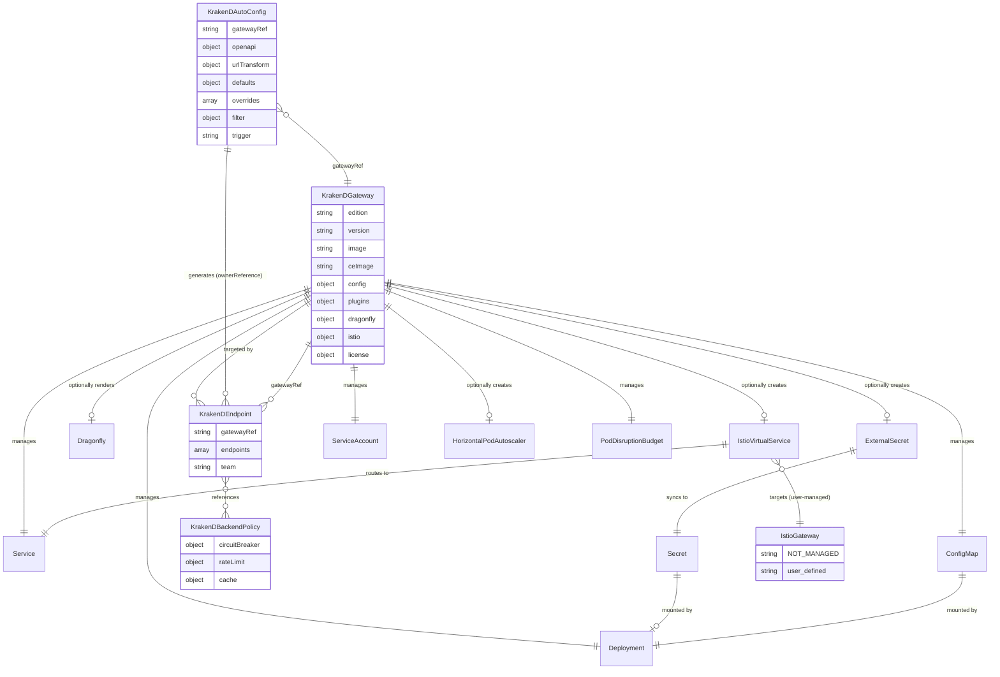
```mermaid
erDiagram
    KrakenDGateway ||--o{ KrakenDEndpoint : "targeted by"
    KrakenDGateway ||--o| Dragonfly : "optionally renders"
    KrakenDGateway ||--o| IstioVirtualService : "optionally creates"
    KrakenDGateway ||--o| ExternalSecret : "optionally creates"
    KrakenDGateway ||--|| Deployment : "manages"
    KrakenDGateway ||--|| Service : "manages"
    KrakenDGateway ||--|| ConfigMap : "manages"
    KrakenDGateway ||--|| ServiceAccount : "manages"
    KrakenDGateway ||--o| HorizontalPodAutoscaler : "optionally creates"
    KrakenDGateway ||--|| PodDisruptionBudget : "manages"

    KrakenDEndpoint }o--o{ KrakenDBackendPolicy : "references"
    KrakenDEndpoint }o--|| KrakenDGateway : "gatewayRef"

    KrakenDAutoConfig ||--o{ KrakenDEndpoint : "generates (ownerReference)"
    KrakenDAutoConfig }o--|| KrakenDGateway : "gatewayRef"

    ExternalSecret ||--|| Secret : "syncs to"
    Secret ||--o| Deployment : "mounted by"
    ConfigMap ||--|| Deployment : "mounted by"

    IstioVirtualService }o--|| IstioGateway : "targets (user-managed)"
    IstioVirtualService ||--|| Service : "routes to"

    KrakenDGateway {
        string edition
        string version
        string image
        string ceImage
        object config
        object plugins
        object dragonfly
        object istio
        object license
    }

    KrakenDEndpoint {
        string gatewayRef
        array endpoints
        string team
    }

    KrakenDBackendPolicy {
        object circuitBreaker
        object rateLimit
        object cache
    }

    KrakenDAutoConfig {
        string gatewayRef
        object openapi
        object urlTransform
        object defaults
        array overrides
        object filter
        string trigger
    }

    IstioGateway {
        string NOT_MANAGED
        string user_defined
    }
```

### Ownership Model

| Resource | Owner | Lifecycle |
|---|---|---|
| **KrakenDGateway** | User | User creates/updates/deletes |
| **KrakenDEndpoint** | User (teams) or KrakenDAutoConfig | User creates/updates/deletes; or auto-generated by autoconfig controller with ownerReference to KrakenDAutoConfig |
| **KrakenDBackendPolicy** | User (platform team) | User creates/updates/deletes |
| **KrakenDAutoConfig** | User | User creates/updates/deletes; owns generated KrakenDEndpoints via ownerReference |
| **Deployment** | KrakenDGateway | Operator-managed; garbage-collected via ownerReference |
| **Service** | KrakenDGateway | Operator-managed; garbage-collected via ownerReference |
| **ConfigMap** | KrakenDGateway | Operator-managed; garbage-collected via ownerReference |
| **ServiceAccount** | KrakenDGateway | Operator-managed; garbage-collected via ownerReference |
| **HorizontalPodAutoscaler** | KrakenDGateway | Operator-managed (when `autoscaling` is set); the operator sets Deployment `spec.replicas` only when creating it (to `minReplicas`) |
| **PodDisruptionBudget** | KrakenDGateway | Operator-managed; garbage-collected via ownerReference |
| **Dragonfly CR** | KrakenDGateway | Operator-managed (when `dragonfly.enabled=true`); Dragonfly Operator reconciles into StatefulSet, Service, PVC |
| **ExternalSecret** | KrakenDGateway | Operator-managed (when `license.externalSecret.enabled=true`) |
| **Secret (LICENSE)** | ExternalSecret / User | External Secrets Operator, or user-managed |
| **Istio VirtualService** | KrakenDGateway | Operator-managed (when `istio.enabled=true`) |
| **Istio Gateway** | **User** | **NOT managed by operator** — referenced only |

When a feature is disabled, the gateway deletes the child it created for it
(HPA, Dragonfly, ExternalSecret, VirtualService) under its deterministic
name, only if the gateway is its controller, and removes that feature's
conditions.

---

## 5. Reconciliation Data Flow

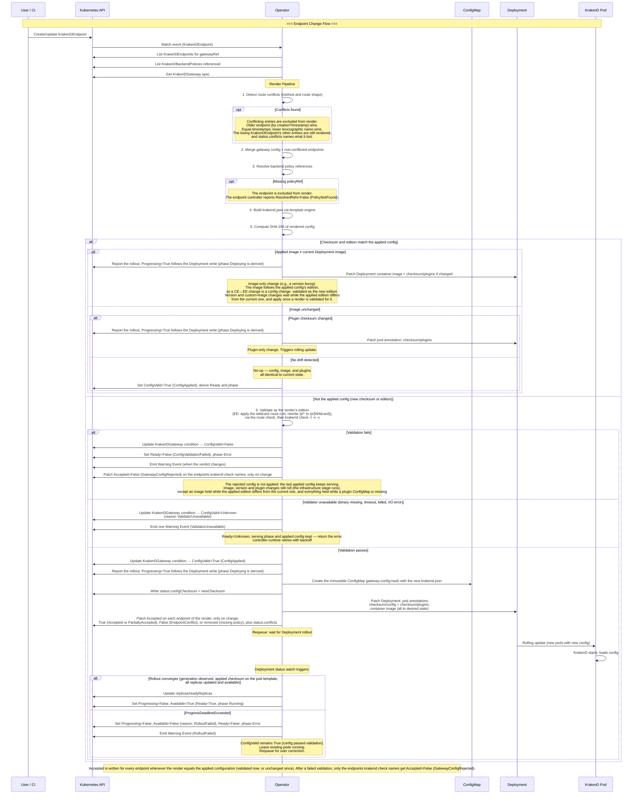
```mermaid
sequenceDiagram
    participant User as User / CI
    participant K8s as Kubernetes API
    participant Op as Operator
    participant CM as ConfigMap
    participant Dep as Deployment
    participant Pod as KrakenD Pod

    Note over User,Pod: === Endpoint Change Flow ===

    User->>K8s: Create/Update KrakenDEndpoint
    K8s->>Op: Watch event (KrakenDEndpoint)
    Op->>K8s: List KrakenDEndpoints for gatewayRef
    Op->>K8s: List KrakenDBackendPolicies referenced
    Op->>K8s: Get KrakenDGateway spec

    Note over Op: Render Pipeline
    Op->>Op: 1. Detect route conflicts (method and route shape)

    opt Conflicts found
        Note over Op: Conflicting entries are excluded from render.<br/>Older endpoint (by creationTimestamp) wins.<br/>Equal timestamps: lower lexicographic name wins.<br/>The losing KrakenDEndpoint's other entries are still rendered,<br/>and status.conflicts names what it lost.
    end

    Op->>Op: 2. Merge gateway config + non-conflicted endpoints
    Op->>Op: 3. Resolve backend policy references

    opt Missing policyRef
        Note over Op: The endpoint is excluded from render.<br/>The endpoint controller reports ResolvedRefs=False (PolicyNotFound).
    end

    Op->>Op: 4. Build krakend.json via template engine
    Op->>Op: 5. Compute SHA-256 of rendered config

    alt Checksum and edition match the applied config
        alt Applied image ≠ current Deployment image
            Op->>K8s: Report the rollout, Progressing=True follows the Deployment write (phase Deploying is derived)
            Op->>Dep: Patch Deployment container image + checksum/plugins if changed
            Note over Op: Image-only change (e.g., a version bump).<br/>The image follows the applied config's edition,<br/>so a CE↔EE change is a config change, validated as the new edition.<br/>Version and custom-image changes wait while the applied edition differs<br/>from the current one, and apply once a render is validated for it.
        else Image unchanged
            alt Plugin checksum changed
                Op->>K8s: Report the rollout, Progressing=True follows the Deployment write (phase Deploying is derived)
                Op->>Dep: Patch pod annotation: checksum/plugins
                Note over Op: Plugin-only change. Triggers rolling update.
            else No drift detected
                Note over Op: No-op — config, image, and plugins<br/>all identical to current state.
                Op->>K8s: Set ConfigValid=True (ConfigApplied), derive Ready and phase
            end
        end
    else Not the applied config (new checksum or edition)
        Op->>Op: 6. Validate as the render's edition<br/>(EE: apply the wildcard route rule, rewrite /p/* to /p/{Wildcard}),<br/>via the route check, then krakend check -t -n -c

        alt Validation fails
            Op->>K8s: Update KrakenDGateway condition → ConfigValid=False
            Op->>K8s: Set Ready=False (ConfigValidationFailed), phase Error
            Op->>K8s: Emit Warning Event (when the verdict changes)
            Op->>K8s: Patch Accepted=False (GatewayConfigRejected) on the endpoints krakend check names, only on change
            Note over Op: The rejected config is not applied: the last applied config keeps serving.<br/>Image, version and plugin changes still roll (the infrastructure stage runs),<br/>except an image held while the applied edition differs from the current one, and everything held while a plugin ConfigMap is missing
        else Validator unavailable (binary missing, timeout, killed, I/O error)
            Op->>K8s: Update KrakenDGateway condition → ConfigValid=Unknown<br/>(reason ValidatorUnavailable)
            Op->>K8s: Emit one Warning Event (ValidatorUnavailable)
            Note over Op: Ready=Unknown, serving phase and applied config kept — return the error,<br/>controller-runtime retries with backoff
        else Validation passes
            Op->>K8s: Update KrakenDGateway condition → ConfigValid=True (ConfigApplied)
            Op->>K8s: Report the rollout, Progressing=True follows the Deployment write (phase Deploying is derived)
            Op->>CM: Create the immutable ConfigMap gateway-config-hash with the new krakend.json
            Op->>K8s: Write status.configChecksum = newChecksum
            Op->>Dep: Patch Deployment: pod annotations<br/>checksum/config + checksum/plugins,<br/>container image (all to desired state)
            Op->>K8s: Patch Accepted on each endpoint of the render, only on change:<br/>True (Accepted or PartiallyAccepted), False (EndpointConflict), or removed (missing policy), plus status.conflicts
            Note over Op: Requeue: wait for Deployment rollout
            Dep->>Pod: Rolling update (new pods with new config)
            Pod->>Pod: KrakenD starts, loads config
            Note over Op: Deployment status watch triggers:

            alt Rollout converges (generation observed, applied checksum on the pod template,<br/>all replicas updated and available)
                Op->>K8s: Update replicas/readyReplicas
                Op->>K8s: Set Progressing=False, Available=True (Ready=True, phase Running)
            else ProgressDeadlineExceeded
                Op->>K8s: Set Progressing=False, Available=False (reason: RolloutFailed), Ready=False, phase Error
                Op->>K8s: Emit Warning Event (RolloutFailed)
                Note over Op: ConfigValid remains True (config passed validation).<br/>Leave existing pods running.<br/>Requeue for user correction.
            end
        end
    end
    Note over Op: Accepted is written for every endpoint whenever the render equals the applied configuration (validated now, or unchanged since). After a failed validation, only the endpoints krakend check names get Accepted=False (GatewayConfigRejected).
```

### Reconciliation Triggers

| Event | Controller | Action |
|---|---|---|
| KrakenDGateway created | Gateway controller | The first reconcile writes one status with the derived phase (no separate `Pending` write). The config stage renders, validates and publishes the first config ConfigMap (`<gateway>-config-<hash>`); the infrastructure stage creates the ServiceAccount, Service and PDB, the Deployment once a config has been applied, and, when configured, the HPA, post-restart Job, Dragonfly CR, VirtualService and ExternalSecret. The endpoint controller's gateway watch re-resolves the references of endpoints with a matching `gatewayRef`, which re-attaches `Detached` endpoints. |
| KrakenDGateway updated | Gateway controller | Re-render config, update child resources, rolling restart |
| KrakenDGateway deleted | Kubernetes GC | ownerReference cascade deletes all child resources. A KrakenDGateway with a deletionTimestamp is not reconciled: garbage collection removes its children, and the operator does not recreate them. |
| KrakenDEndpoint created, spec changed, or its `Accepted` changed | Endpoint controller | Resolve gateway and policy references into `ResolvedRefs`; derive `Ready` and `phase` from `ResolvedRefs` and `Accepted`; patch status (optimistic lock) only when it changed. The gateway controller re-renders the target gateway on spec changes and records `Accepted` on every endpoint of an applied render. A resolved conflict flips `Accepted` back to `True`. |
| KrakenDBackendPolicy created/updated/deleted | Policy controller | Set `Ready` from the policy's fields and `observedGeneration`. The gateway controller re-renders every gateway with endpoints referencing the policy. The endpoint controller re-resolves references only when the policy is created or deleted. Deleting a policy that endpoints still reference is rejected by the admission webhook; if it is deleted anyway (for example when the webhook is bypassed), each referencing endpoint gets `ResolvedRefs=False`/`PolicyNotFound` and phase `Invalid`, and the gateway excludes the endpoint from the rendered config and removes its `Accepted` condition. `referencedBy` is recounted when an endpoint is created, deleted, or has its spec changed. |
| KrakenDAutoConfig created, or spec generation/label/annotation changed | AutoConfig controller | Fetch OpenAPI spec from configured source, parse operations, apply URL transforms and filters, and converge owned KrakenDEndpoint resources to the desired state (create/update/delete). A status-only update (the phase/condition writes the reconciler itself makes) does not re-trigger this — only generation, label, and annotation changes do. Generated endpoints trigger the endpoint controller watch → gateway reconciler. |
| KrakenDAutoConfig deleted | Kubernetes GC | All owned KrakenDEndpoints are garbage-collected via ownerReference. The AutoConfig controller doesn't reconcile a terminating AutoConfig, so under foreground deletion it doesn't recreate endpoints as they are collected. |
| Owned KrakenDEndpoint spec changed or deleted, or the `openapi.configMapRef`/CUE definitions ConfigMap changed | AutoConfig controller | Re-run the full pipeline. A generated endpoint that was hand-edited or deleted out of band is restored to the desired spec (endpoint specs are compared by decoded JSON value, so re-encoding/formatting differences alone don't cause a write). |
| AutoConfig resync timer | AutoConfig controller | `trigger: OnChange` AutoConfigs are additionally re-polled every 5 minutes (`defaultResyncInterval`); `trigger: Periodic` AutoConfigs at `spec.periodic.interval`. Every reconcile — resync or watch-triggered — runs the full pipeline; a reconcile that changes nothing writes no status and emits no event. A spec/CUE/unmatched-override/scope failure — including a failed external `$ref` fetch/decode, which now fails closed the same way instead of falling back to the raw spec — retries at `spec.periodic.interval` (`Periodic`) or via exponential backoff capped at 5 minutes (`OnChange`); an endpoint write failure (`EndpointReconcileFailed`) always retries with backoff, on either trigger; a status or endpoint write `Conflict` (this reconcile read a stale cache) requeues quietly a second later with no error, event, or status change. |
| KrakenDGateway or KrakenDBackendPolicy created or deleted | Endpoint controller | Re-resolve references of the endpoints that reference it (`ResolvedRefs` `GatewayNotFound`/`PolicyNotFound` → phase `Detached`/`Invalid`). Gateway and policy updates are ignored: only their existence matters. Re-attachment occurs automatically when the gateway is created again. |
| Secret (LICENSE) created or updated | Gateway controller | Re-evaluate the license inside the reconcile: re-parse X.509 `notAfter` from the Secret and set the `License*` conditions for its stage (below). A renewed license that clears `LicenseExpired`/`LicenseDegraded` re-renders EE and rolls the Deployment back to the EE image; a changed license (any change to the bytes in the Secret, whether or not `notAfter` moves) also changes the pod template's `krakend.io/checksum-license` annotation, so the Deployment rolls and every pod starts with the new license file; an unchanged license rolls nothing. |
| Dragonfly, ExternalSecret or VirtualService owned by a gateway changed or deleted | Gateway controller | Re-run the gateway reconcile, which restores the object and refreshes `DragonflyReady`/`IstioConfigured`. Watched only for kinds whose CRD existed at operator startup; restart the operator after installing one later. |
| Dragonfly CR status updated | Gateway controller | Reflect `DragonflyReady` condition on KrakenDGateway; emit `DragonflyNotReady` Warning event if phase regresses. Watched when the Dragonfly CRD existed at operator startup. |
| Deployment status updated | Gateway controller | Update `status.replicas`, `status.readyReplicas`, `Available` and `Progressing` conditions on KrakenDGateway, from the Deployment the reconcile just wrote (the object CreateOrUpdate returns, not the cache; a pass whose Deployment step failed, such as a stale-object Conflict, leaves `Progressing` and `Available` untouched) or, on a pass that holds the Deployment, from the cached one. `Progressing=True` while the pass created the Deployment, its write changed the pod template, the template is not the wanted one, or old pods remain beside updated ones; a bare generation the Deployment controller has not observed (an HPA scale) does not raise it. The rollout counts as converged only when the Deployment has observed its latest generation (`observedGeneration >= generation`), its pod template carries the applied config checksum, image, plugin checksum and license checksum and mounts the applied config's ConfigMap, and `replicas == updatedReplicas == availableReplicas ==` the desired count; then `Progressing=False`, `Available=True`, and the derived phase becomes `Running`. Until then `Ready` stays `False`, because the cached Deployment can still describe the previous ReplicaSet. If the Deployment reports `Available=False` (for example `MinimumReplicasUnavailable`) and no rollout is in flight, that condition is mirrored into the gateway's `Available`, so `Ready` goes `False` with phase `Error`. If the Deployment reports `ProgressDeadlineExceeded` for the generation it has observed and the wanted template, set `Progressing=False`, `Available=False` (reason: `RolloutFailed`), and emit `RolloutFailed` Warning event; a deadline on an older generation or template is ignored and the `Available=False`/`RolloutFailed` it caused is reset. `ConfigValid` remains `True` (config passed validation). Existing pods are left running to preserve availability. |
| License stage boundary | Gateway controller (requeued at the license's next boundary, at least every 5 min) | The reconcile evaluates the license stage on every run, and requeues itself at the next boundary (start of the warning window, start of the 1 h safety buffer, expiry). Stage `LicenseExpiringSoon` (`now+1h < expiry ≤ now+warningDays`): `LicenseValid=True` (reason: `LicenseExpiringSoon`) and one `LicenseExpiringSoon` Warning event on entering the window. Stage `LicensePreExpiry` (`now < expiry ≤ now+1h`) or expired: `LicenseValid=False` and `LicenseExpired=True` (reason: `LicensePreExpiry` or `LicenseExpired`). With `fallbackToCE=true` it also sets `LicenseDegraded=True` (reason: `LicenseFallbackCE`) and emits one `LicenseFallbackCE` Warning event. The CE render is validated as CE, and the image switches to CE once that render is applied; the gateway controller derives phase `Degraded`. With `fallbackToCE=false` it emits one `LicenseExpiredNoFallback` Warning event and leaves the Deployment running; the gateway controller derives phase `Error` from `LicenseExpired=True` without `LicenseDegraded`. Healthy (`expiry > now+warningDays`): `LicenseValid=True` (reason: `LicenseOK`). Back in a healthy or warning stage while `LicenseExpired` or `LicenseDegraded` is True, both become `False` (reason: `LicenseRestored`), one `LicenseRestored` event is emitted, and the EE render is validated as EE and the EE image returns once it is applied. Events fire on condition transitions only, so a steady state repeats nothing. |

### Reconciliation Queueing

All reconciliation events for the same gateway are **serialized** via the controller-runtime work queue, keyed by the target KrakenDGateway’s `namespace/name`. When multiple KrakenDEndpoints targeting the same gateway are updated simultaneously, the events collapse into a single reconciler run that processes the latest state of all endpoints. This prevents race conditions on the ConfigMap and Deployment, and ensures the rendered config always reflects a consistent snapshot of all endpoint CRDs.

---

## 6. Dragonfly Integration

Dragonfly is a modern, multi-threaded, Redis-compatible in-memory datastore. It provides the Redis protocol compatibility required by KrakenD EE features while delivering significantly higher throughput and lower memory overhead than Redis.

> **Prerequisite:** The [Dragonfly Operator](https://github.com/dragonflydb/dragonfly-operator) (`>= v1.5.0`) must be installed in the cluster before enabling Dragonfly integration. The KrakenD Operator renders a `Dragonfly` CR (`dragonflydb.io/v1alpha1`) and the Dragonfly Operator is responsible for reconciling it into running infrastructure (StatefulSet, Service, PVC, NetworkPolicy, etc.).

### Why Dragonfly over Redis

- **Multi-threaded** — uses all available CPU cores (Redis is single-threaded)
- **Lower memory** — Dragonfly uses ~30% less memory than Redis for equivalent datasets
- **Redis protocol compatible** — drop-in replacement for KrakenD's `redis` connection pool
- **Supports `HEXPIRE`** — required by KrakenD EE Quota (minimum Redis 7.4 equivalent)

### Rendered Dragonfly CR Example

When `dragonfly.enabled=true`, the operator renders the following `Dragonfly` CR with an `ownerReference` back to the KrakenDGateway:

```yaml
apiVersion: dragonflydb.io/v1alpha1
kind: Dragonfly
metadata:
  name: production-gateway-dragonfly
  namespace: api-gateway
  ownerReferences:
    - apiVersion: gateway.krakend.io/v1alpha1
      kind: KrakenDGateway
      name: production-gateway
      uid: <gateway-uid>
      controller: true
      blockOwnerDeletion: true
  labels:
    app.kubernetes.io/name: dragonfly
    app.kubernetes.io/instance: production-gateway-dragonfly
    app.kubernetes.io/part-of: krakend-operator
    app.kubernetes.io/managed-by: krakend-operator
spec:
  replicas: 2
  image: "docker.dragonflydb.io/dragonflydb/dragonfly:v1.25.2"
  resources:
    requests:
      cpu: "250m"
      memory: "512Mi"
    limits:
      cpu: "1"
      memory: "2Gi"
  snapshot:
    cron: "*/30 * * * *"
    persistentVolumeClaimSpec:
      accessModes: ["ReadWriteOnce"]
      resources:
        requests:
          storage: "10Gi"
  authentication:
    passwordFromSecret:
      name: dragonfly-auth
      key: password
  args: []                             # populated from spec.dragonfly.args
```

### Deployment Topology

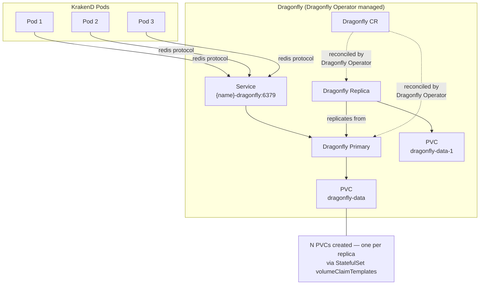
```mermaid
graph TB
    subgraph "KrakenD Pods"
        P1[Pod 1]
        P2[Pod 2]
        P3[Pod 3]
    end

    subgraph "Dragonfly (Dragonfly Operator managed)"
        DF_CR[Dragonfly CR]
        DF_SVC["Service<br/>{name}-dragonfly:6379"]
        DF_PRIMARY[Dragonfly Primary]
        DF_REPLICA[Dragonfly Replica]
        PVC[PVC<br/>dragonfly-data]
        PVC2[PVC<br/>dragonfly-data-1]
    end

    P1 -->|redis protocol| DF_SVC
    P2 -->|redis protocol| DF_SVC
    P3 -->|redis protocol| DF_SVC
    DF_SVC --> DF_PRIMARY
    DF_PRIMARY --> PVC
    DF_REPLICA --> PVC2
    DF_REPLICA -->|replicates from| DF_PRIMARY
    DF_CR -.->|reconciled by<br/>Dragonfly Operator| DF_PRIMARY
    DF_CR -.->|reconciled by<br/>Dragonfly Operator| DF_REPLICA

    note1[N PVCs created — one per replica<br/>via StatefulSet volumeClaimTemplates]
    PVC --- note1
```

### EE Features Requiring Dragonfly/Redis

| Feature | KrakenD Namespace | Description |
|---|---|---|
| Cluster Rate Limiting | `qos/ratelimit/service` | Shared rate limit counters across all KrakenD instances |
| Usage Quota | `governance/quota` | Persistent quota counters (hourly/daily/weekly/monthly/yearly) |
| Token Revocation | `auth/revoker` | Distributed bloom filter for token blacklisting |
| Stateful Rate Limiting | `qos/ratelimit/router` + Redis | Per-client persistent counters across instances |

### Auto-Configuration

When `dragonfly.enabled=true`, the operator:

1. Renders a `Dragonfly` CR (`dragonflydb.io/v1alpha1`) with an `ownerReference` to the KrakenDGateway
2. Sets the Dragonfly service DNS as `{gateway-name}-dragonfly.{namespace}.svc.cluster.local:6379`
3. Derives `redis.connectionPool.addresses` from the Dragonfly Service DNS convention (users should leave `redis.connectionPool.addresses` empty)
4. Injects the EE service-level `redis` namespace: one `connection_pools` entry named `default` (a single address) or one `clusters` entry named `default` (several addresses), which EE components reference with `"connection_name": "default"`.
5. Watches the `Dragonfly` CR status and reports `DragonflyReady` on the KrakenDGateway when the Dragonfly Operator reports the instance as `ready`

> **Note:** Steps 3–4 (redis address derivation and `extra_config` injection) apply whenever the config is rendered, but only an EE binary uses the `redis` namespace: a CE-edition gateway renders it and KrakenD CE ignores it, and a CE fallback strips it and lists it as a dropped feature. Steps 1, 2, and 5 apply whenever `dragonfly.enabled=true`, regardless of edition or CE fallback state, so the Dragonfly instance is available when EE is restored.

> **Password and TLS:** not rendered yet. KrakenD's redis pool is rendered without a password or TLS settings, so `redis.connectionPool.password` and `.tls` do not reach KrakenD, and neither does `dragonfly.authentication.passwordFromSecret` on EE gateways. Dragonfly still requires that password, so KrakenD's connections to it are refused (NOAUTH). The gateway webhook warns when they are set.

### Dragonfly Unavailability Behavior

When Dragonfly becomes unavailable while KrakenD EE is running:

- **Cluster rate limiting** — KrakenD falls back to per-instance in-memory counters (fail-open: requests are not rejected, but rate limits are no longer coordinated across pods)
- **Usage quota** — quota enforcement fails; behavior depends on KrakenD’s `governance/quota` error handling configuration. This should be tested and documented per-deployment.
- **Token revocation** — revocation checks fail; previously-revoked tokens may be accepted until Dragonfly recovers

The operator sets `DragonflyReady=False` and emits a `DragonflyNotReady` warning event. KrakenD pods are **not** restarted — they continue serving traffic with degraded stateful features. Because the Dragonfly Operator manages the actual pods, failover and recovery are handled automatically when `replicas >= 2`.

---

## 7. External Secrets Integration

The operator integrates with [External Secrets Operator (ESO)](https://external-secrets.io/) (`>= v0.10.0`, required for `external-secrets.io/v1` API) to provision the KrakenD EE license from external secret stores without embedding secrets in Kubernetes manifests.

### Flow

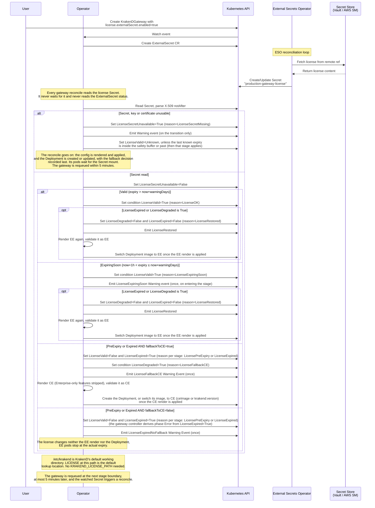
```mermaid
sequenceDiagram
    participant User as User
    participant Op as Operator
    participant K8s as Kubernetes API
    participant ESO as External Secrets Operator
    participant Vault as Secret Store<br/>(Vault / AWS SM)

    User->>K8s: Create KrakenDGateway with<br/>license.externalSecret.enabled=true
    K8s->>Op: Watch event
    Op->>K8s: Create ExternalSecret CR

    Note over ESO: ESO reconciliation loop
    ESO->>Vault: Fetch license from remote ref
    Vault-->>ESO: Return license content
    ESO->>K8s: Create/Update Secret<br/>"production-gateway-license"

    Note over Op: Every gateway reconcile reads the license Secret.<br/>It never waits for it and never reads the ExternalSecret status.
    Op->>K8s: Read Secret, parse X.509 notAfter
    alt Secret, key or certificate unusable
        Op->>K8s: Set LicenseSecretUnavailable=True (reason=LicenseSecretMissing)
        Op->>K8s: Emit Warning event (on the transition only)
        Op->>K8s: Set LicenseValid=Unknown, unless the last known expiry<br/>is inside the safety buffer or past (then that stage applies)
        Note over Op: The reconcile goes on: the config is rendered and applied,<br/>and the Deployment is created or updated, with the fallback decision<br/>recorded last. Its pods wait for the Secret mount.<br/>The gateway is requeued within 5 minutes.
    else Secret read
        Op->>K8s: Set LicenseSecretUnavailable=False
        alt Valid (expiry > now+warningDays)
            Op->>K8s: Set condition LicenseValid=True (reason=LicenseOK)
            opt LicenseExpired or LicenseDegraded is True
                Op->>K8s: Set LicenseDegraded=False and LicenseExpired=False (reason=LicenseRestored)
                Op->>K8s: Emit LicenseRestored
                Op->>Op: Render EE again, validate it as EE
                Op->>K8s: Switch Deployment image to EE once the EE render is applied
            end
        else ExpiringSoon (now+1h < expiry ≤ now+warningDays)
            Op->>K8s: Set condition LicenseValid=True (reason=LicenseExpiringSoon)
            Op->>K8s: Emit LicenseExpiringSoon Warning event (once, on entering the stage)
            opt LicenseExpired or LicenseDegraded is True
                Op->>K8s: Set LicenseDegraded=False and LicenseExpired=False (reason=LicenseRestored)
                Op->>K8s: Emit LicenseRestored
                Op->>Op: Render EE again, validate it as EE
                Op->>K8s: Switch Deployment image to EE once the EE render is applied
            end
        else PreExpiry or Expired AND fallbackToCE=true
            Op->>K8s: Set LicenseValid=False and LicenseExpired=True (reason per stage: LicensePreExpiry or LicenseExpired)
            Op->>K8s: Set condition LicenseDegraded=True (reason=LicenseFallbackCE)
            Op->>K8s: Emit LicenseFallbackCE Warning Event (once)
            Op->>Op: Render CE (Enterprise-only features stripped), validate it as CE
            Op->>K8s: Create the Deployment, or switch its image, to CE (ceImage or krakend:version)<br/>once the CE render is applied
        else PreExpiry or Expired AND fallbackToCE=false
            Op->>K8s: Set LicenseValid=False and LicenseExpired=True (reason per stage: LicensePreExpiry or LicenseExpired)<br/>(the gateway controller derives phase Error from LicenseExpired=True)
            Op->>K8s: Emit LicenseExpiredNoFallback Warning Event (once)
            Note over Op: The license changes neither the EE render nor the Deployment,<br/>EE pods stop at the actual expiry.
        end
    end

    Note over Op: /etc/krakend is KrakenD's default working<br/>directory. LICENSE at this path is the default<br/>lookup location. No KRAKEND_LICENSE_PATH needed.
    Note over Op: The gateway is requeued at the next stage boundary,<br/>at most 5 minutes later, and the watched Secret triggers a reconcile.
```

### Generated ExternalSecret

```yaml
apiVersion: external-secrets.io/v1
kind: ExternalSecret
metadata:
  name: production-gateway-license
  namespace: api-gateway
  ownerReferences:
    - apiVersion: gateway.krakend.io/v1alpha1
      kind: KrakenDGateway
      name: production-gateway
      uid: <gateway-uid>
      controller: true
      blockOwnerDeletion: true
spec:
  refreshInterval: "1h"
  secretStoreRef:
    name: vault-backend
    kind: ClusterSecretStore
  target:
    name: production-gateway-license
    creationPolicy: Owner
    template:
      type: Opaque
      data:
        LICENSE: "{{ .license }}"
  data:
    - secretKey: license
      remoteRef:
        key: secret/data/krakend/license
        property: license
```

### Alternative: Pre-Existing Secret

When `license.secretRef` is used instead of `externalSecret`, the operator skips ExternalSecret creation and directly mounts the referenced Secret. The user is responsible for managing rotation. If the referenced Secret does not exist, the operator sets `LicenseSecretUnavailable=True`, emits a `LicenseSecretMissing` Warning event (once), sets `LicenseValid=Unknown` and requeues within 5 minutes. The gateway phase is not set to `Error` for the missing Secret alone (if the last known expiry has passed and `fallbackToCE` is off, `LicenseExpired=True` still gives phase `Error`): the Deployment and its last fallback decision are kept, and the pods keep the license checksum they already carry, so a missing Secret never rolls them. If the last known expiry (`status.licenseExpiry`) is already inside the 1 h safety buffer or past, the stage verdict applies instead of `Unknown` (`LicenseValid=False`, reason `LicensePreExpiry` or `LicenseExpired`, and the CE fallback when `fallbackToCE` is set). The operator resumes normal license processing once the Secret becomes available.

---

## 8. Istio Integration

When `istio.enabled=true`, the operator creates an Istio VirtualService that routes traffic to the KrakenD Service. The Istio Gateway is **not** created or managed by the operator — it must already exist and is referenced by name in the spec.

> **Prerequisite:** Istio `>= 1.22` is required for the `networking.istio.io/v1` API used by the generated VirtualService.

### Traffic Routing — Without Istio

When `istio.enabled=false`, the operator creates a standard Kubernetes Service (ClusterIP). External traffic reaches KrakenD via any ingress mechanism the cluster provides (Kubernetes Ingress, cloud load balancer, NodePort, etc.). TLS termination is handled by KrakenD itself when `tls.enabled=true`, or by an external load balancer.

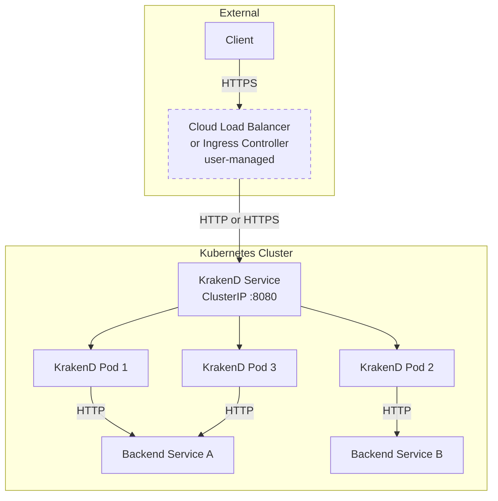
```mermaid
graph TB
    subgraph "External"
        Client[Client]
        LB[Cloud Load Balancer<br/>or Ingress Controller<br/>user-managed]
    end

    subgraph "Kubernetes Cluster"
        SVC[KrakenD Service<br/>ClusterIP :8080]
        P1[KrakenD Pod 1]
        P2[KrakenD Pod 2]
        P3[KrakenD Pod 3]
        BE1[Backend Service A]
        BE2[Backend Service B]
    end

    Client -->|HTTPS| LB
    LB -->|HTTP or HTTPS| SVC
    SVC --> P1
    SVC --> P2
    SVC --> P3
    P1 -->|HTTP| BE1
    P2 -->|HTTP| BE2
    P3 -->|HTTP| BE1

    style LB stroke-dasharray: 5 5
```

#### Key Behaviors Without Istio

1. **TLS on KrakenD (optional)** — when `tls.enabled=true`, KrakenD terminates TLS directly; configure `tls.publicKey`, `tls.privateKey`, and `tls.minVersion` in the spec
2. **`ssl_redirect` as configured** — the operator respects the user's `config.security.sslRedirect` setting
3. **No VirtualService created** — the operator skips all Istio resource creation
4. **Service type** — the Service is always `ClusterIP`; exposing it externally is the user's responsibility (Ingress, LoadBalancer wrapper, etc.)

### Traffic Routing — With Istio

When `istio.enabled=true`, the Istio IngressGateway terminates TLS and routes traffic through an operator-managed VirtualService to the KrakenD Service.

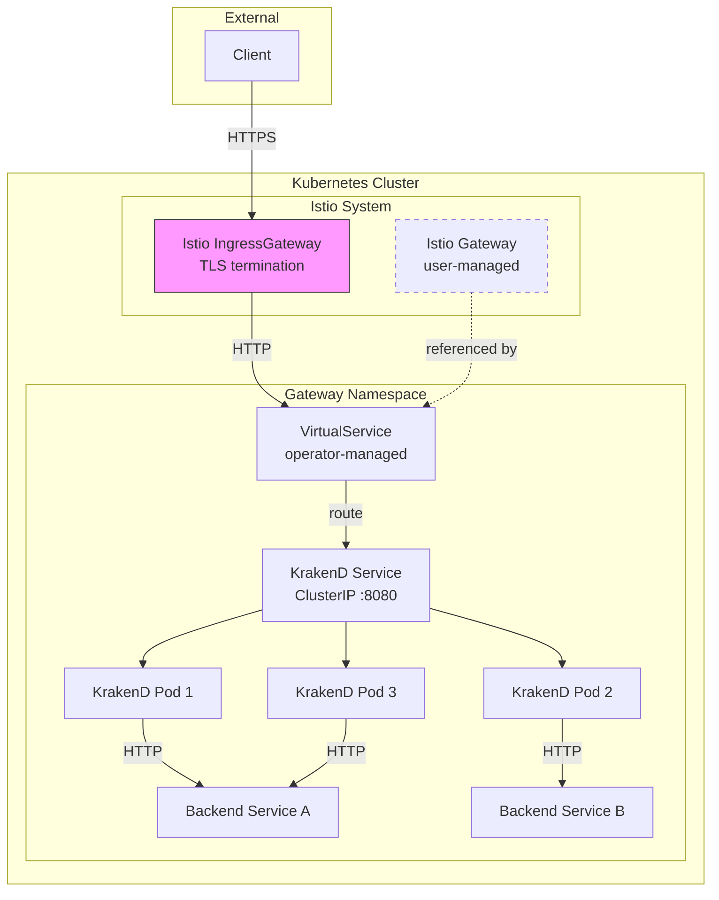
```mermaid
graph TB
    subgraph "External"
        Client[Client]
    end

    subgraph "Kubernetes Cluster"
        subgraph "Istio System"
            IG[Istio Gateway<br/>user-managed]
            IP[Istio IngressGateway<br/>TLS termination]
        end

        subgraph "Gateway Namespace"
            VS[VirtualService<br/>operator-managed]
            SVC[KrakenD Service<br/>ClusterIP :8080]
            P1[KrakenD Pod 1]
            P2[KrakenD Pod 2]
            P3[KrakenD Pod 3]
            BE1[Backend Service A]
            BE2[Backend Service B]
        end
    end

    Client -->|HTTPS| IP
    IP -->|HTTP| VS
    VS -->|route| SVC
    SVC --> P1
    SVC --> P2
    SVC --> P3
    P1 -->|HTTP| BE1
    P2 -->|HTTP| BE2
    P3 -->|HTTP| BE1
    IG -.->|referenced by| VS

    style IG stroke-dasharray: 5 5
    style IP fill:#f9f,stroke:#333
```

### Key Behaviors When Istio Is Enabled

1. **TLS is disabled on KrakenD** — Istio Gateway handles TLS termination; KrakenD listens on plain HTTP (port 8080)
2. **`ssl_redirect` is set to `false`** — KrakenD must not redirect to HTTPS since it receives plain HTTP from the Istio sidecar
3. **`ssl_proxy_headers` is configured** — `{"X-Forwarded-Proto": "https"}` tells KrakenD the original client connection was HTTPS
4. **No `tls` block in KrakenD config** — The operator omits the root-level `tls` key entirely
5. **VirtualService references existing Gateway(s)** — from `spec.istio.virtualService.gateways[]`
6. **The VirtualService is watched when its CRD exists at operator startup**, so edits and deletions are corrected at once. If Istio is installed after the operator, restart the operator.

### Generated VirtualService

```yaml
apiVersion: networking.istio.io/v1
kind: VirtualService
metadata:
  name: production-gateway
  namespace: api-gateway
  ownerReferences:
    - apiVersion: gateway.krakend.io/v1alpha1
      kind: KrakenDGateway
      name: production-gateway
      uid: <gateway-uid>
      controller: true
      blockOwnerDeletion: true
spec:
  hosts:
    - api.example.com
  gateways:
    - istio-system/main-gateway         # user-defined, NOT operator-managed
  http:
    - match:
        - uri:
            prefix: /
      route:
        - destination:
            host: production-gateway.api-gateway.svc.cluster.local
            port:
              number: 8080    # from spec.config.port
      timeout: 30s
```

> **Important:** The default `match: prefix: /` VirtualService will absorb all HTTP traffic for the configured host entering through the referenced Gateway. Each KrakenDGateway should own its own dedicated host(s). If multiple services share the same Gateway and host, customize `spec.istio.virtualService.httpRoutes[].match` with more specific path prefixes to avoid routing conflicts.

### What the Operator Does NOT Do

- Does **not** create, update, or delete Istio Gateway resources
- Does **not** manage TLS certificates for Istio (use cert-manager or Istio's built-in SDS)
- Does **not** configure Istio sidecar injection (managed by Istio's namespace labels)
- Does **not** create DestinationRule, PeerAuthentication, or AuthorizationPolicy resources

---

## 9. License Lifecycle Management

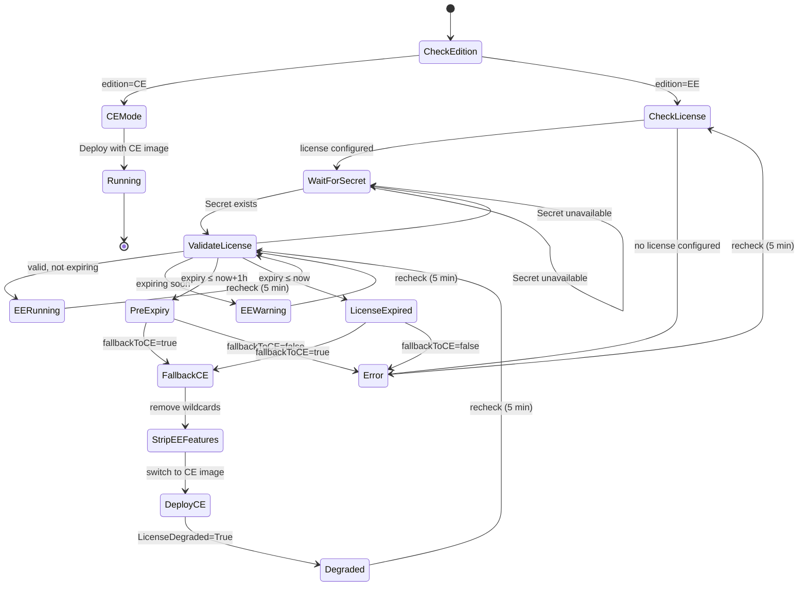
```mermaid
stateDiagram-v2
    direction TB
    [*] --> CheckEdition

    CheckEdition --> CEMode: edition=CE
    CheckEdition --> CheckLicense: edition=EE

    CEMode --> Running: Deploy with CE image
    Running --> [*]

    CheckLicense --> WaitForSecret: license configured
    CheckLicense --> Error: no license configured

    WaitForSecret --> ValidateLicense: Secret exists
    WaitForSecret --> WaitForSecret: Secret unavailable

    ValidateLicense --> EERunning: valid, not expiring
    ValidateLicense --> EEWarning: expiring soon
    ValidateLicense --> PreExpiry: expiry ≤ now+1h
    ValidateLicense --> LicenseExpired: expiry ≤ now
    ValidateLicense --> WaitForSecret: Secret unavailable

    EERunning --> ValidateLicense: recheck (5 min)
    EEWarning --> ValidateLicense: recheck (5 min)

    PreExpiry --> FallbackCE: fallbackToCE=true
    PreExpiry --> Error: fallbackToCE=false
    LicenseExpired --> FallbackCE: fallbackToCE=true
    LicenseExpired --> Error: fallbackToCE=false

    FallbackCE --> StripEEFeatures: remove wildcards
    StripEEFeatures --> DeployCE: switch to CE image
    DeployCE --> Degraded: LicenseDegraded=True

    Error --> CheckLicense: recheck (5 min)
    Degraded --> ValidateLicense: recheck (5 min)
```

**State behavior notes:**

- **PreExpiry** takes precedence over EEWarning when `expiry ≤ now+1h`.
- **EERunning** — Sets `LicenseValid=True` (reason: `LicenseOK`). If `LicenseExpired` or `LicenseDegraded` is True (license-caused only): triggers EE recovery (re-renders EE config, switches to EE image), sets both to `False` (reason: `LicenseRestored`) and emits `LicenseRestored`.
- **EEWarning** — Sets `LicenseValid=True` (reason: `LicenseExpiringSoon`). Emits one `LicenseExpiringSoon` Warning event when the license enters the warning window; later reconciles in the window emit nothing. Recovery is the same as for EERunning.
- **FallbackCE → StripEEFeatures → DeployCE** — CE fallback is executed via the §10 rendering pipeline. The checksum comparison and image-drift check (§10) prevent redundant rolling restarts when config and image are already at the desired CE state. Periodic rechecks that re-enter FallbackCE while the gateway is already running CE are no-ops.
- **DeployCE → Degraded** — Sets `LicenseValid=False` and `LicenseExpired=True` (reason per entry path: `LicensePreExpiry` or `LicenseExpired`) and `LicenseDegraded=True` (reason: `LicenseFallbackCE`).

### License Check Frequency and Safety Buffer

License evaluation runs inside the gateway reconcile, so gateway status has a single writer. The reconcile requeues itself at the license's next stage boundary (warning window, safety buffer, expiry) and at least every **5 minutes**, and the watched license Secret triggers it on change. Because KrakenD EE processes terminate immediately upon license expiry, the operator triggers the CE fallback **1 hour before the actual expiry time** (not at T-0). This safety buffer ensures the rolling deployment to CE completes well before any EE pod would self-terminate. The reconcile writes the License* conditions, `status.licenseExpiry` and the `krakend_operator_license_expiry_seconds` metric, and nothing on the user's KrakenDGateway object; the metric series is removed when the gateway is deleted or terminating.

> **Note:** In steady-state operation, `PreExpiry` fires first (1 hour before T-0). The `LicenseExpired` state is most commonly reached on cold-start (e.g., the operator is deployed into a cluster where the license has already expired), but is also reachable via the `Error → CheckLicense → WaitForSecret → ValidateLicense` recheck path if the gateway was in `Error` state when T-0 passed.

### Error State Behavior

When `fallbackToCE=false` and the license is expired or approaching expiry, the operator transitions to the `Error` state:

1. **Record the failed license** — set `LicenseValid=False` and `LicenseExpired=True` with reason `LicenseExpired` (`expiry ≤ now`) or `LicensePreExpiry` (PreExpiry path). Emit one `LicenseExpiredNoFallback` Warning event, on the transition only. The gateway controller derives phase `Error` from `LicenseExpired=True`
2. **Leave the existing Deployment running** — the operator does not scale down or delete the Deployment. EE pods will self-terminate at the actual license expiry time (T-0), entering `CrashLoopBackOff` as KrakenD refuses to start without a valid license
3. **Continuously re-check** — each reconcile re-evaluates the license, and the gateway is requeued at least every 5 minutes. If a renewed license becomes available, the operator transitions through `CheckLicense` back to `ValidateLicense` and recovers normally

This is a conscious design choice: the operator provides maximum observability (error phase + events + metrics) without destructively interfering with a running workload. Cluster operators are expected to monitor `LicenseExpiredNoFallback` events and take corrective action.

> **Cold start without an existing Deployment:** The license stage never holds the Deployment. Once a config has been validated and applied, the Deployment is created whatever the license says. With `fallbackToCE=true` and an expired or pre-expiry license, it runs the CE render and image from the start and the phase is `Degraded`. With `fallbackToCE=false` it is created from the EE render, the phase is `Error` (`LicenseExpired=True` without `LicenseDegraded`), and its EE pods stop at, or refuse to start after, the license's expiry; a license that cannot be read leaves `LicenseSecretUnavailable=True` and the pods wait for the Secret mount.

### CE Fallback Behavior

When falling back from EE to CE:

1. **Strip every Enterprise-only feature and list it.** The CE
   render drops EE wildcard endpoints (`/prefix/*`) and every Enterprise-only
   `extra_config` namespace at service, endpoint and backend level. The list
   is taken from the KrakenD 2.13 Enterprise documentation, because the CE
   and EE 2.13 binaries embed the same schema and CE lint accepts them all.
   The gateway reports `CEFallbackApplied=True/EEFeaturesStripped` listing
   each removal, and each affected endpoint reports `Accepted` reason
   `EEFeaturesStripped`; docs-only namespaces are dropped without being listed
   on the endpoints, so they never make an endpoint not Ready. On every CE
   render (CE edition or CE fallback) the OpenAPI export init container and
   sidecar are omitted, because the CE binary has no `openapi` command.
2. **Switch container image — only once the CE render is applied.** The CE
   render is validated as CE: verdicts are keyed on (checksum, edition), and
   `status.configEdition` records the edition of the applied config. The
   image follows the applied edition, so while a CE render is rejected the
   pods stay on EE with the EE-validated config. The CE image is
   `spec.ceImage` if set, otherwise `krakend:{spec.version}`;
   `spec.image` (EE override) is ignored during CE fallback. While the
   applied edition differs from the current one (a CE fallback whose render is
   rejected), version and custom-image changes wait too, and take effect once a
   render is validated for the new edition.
3. **Disable Dragonfly-dependent features** — cluster rate limiting, quota, and token revocation won't function without the EE binary, even with Redis available
4. **Set `LicenseValid=False` and `LicenseExpired=True`** — reason `LicensePreExpiry` if entering from the PreExpiry path; reason `LicenseExpired` if entering from the LicenseExpired path
5. **Set status condition** — `LicenseDegraded=True` (reason: `LicenseFallbackCE`) with message explaining the degradation
6. **Emit Kubernetes event** — `Warning` event on the KrakenDGateway for alerting

### EE Recovery (from Degraded or Error back to EE)

When a valid license becomes available again (e.g., Secret updated by ESO with a renewed certificate):

1. **The gateway reconcile detects a valid license** — reads the Secret, parses X.509 `notAfter`, confirms validity
2. **Re-render config from original CRD spec** — the KrakenDGateway and KrakenDEndpoint CRDs retain the full EE configuration (including wildcard endpoints); re-render restores all EE features
3. **Switch container image back to EE** — once the EE render is validated as EE and applied, restore `spec.image` if set (user override); otherwise use `krakend/krakend-ee:{spec.version}`
4. **Rolling deployment** — new EE pods start with the full config and valid license
5. **Clear `LicenseDegraded` and `LicenseExpired`** — set both to `False` (reason: `LicenseRestored`). If recovering to `EERunning` state (`expiry > now+warningDays`), set `LicenseValid=True` (reason: `LicenseOK`). If recovering to `EEWarning` state (`now+1h < expiry ≤ now+warningDays`), set `LicenseValid=True` (reason: `LicenseExpiringSoon`) — the license is still approaching expiry
6. **Emit Normal event** — `LicenseRestored` on the KrakenDGateway

---

## 10. Configuration Rendering Pipeline

The operator renders the final `krakend.json` from CRD state through a deterministic pipeline:

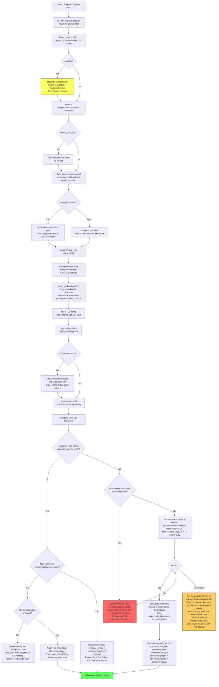
```mermaid
flowchart TD
    A[Collect KrakenDGateway spec] --> B[List all KrakenDEndpoints<br/>matching gatewayRef]
    B --> BA[Detect route conflicts<br/>keyed on method and route shape]
    BA --> BB{conflicts?}
    BB -->|Yes| BC[Record each lost entry<br/>PartiallyAccepted or EndpointConflict<br/>Emit Warning Events]
    BB -->|No| C
    BC --> C[Resolve KrakenDBackendPolicy<br/>references]
    C --> CA{Missing policyRef?}
    CA -->|Yes| CB[Mark affected endpoints<br/>as Invalid]
    CA -->|No| D
    CB --> D[Build internal config model<br/>excluding Conflicted and Invalid endpoints]

    D --> E{dragonfly.enabled?}
    E -->|true| F[Derive redis connection pool<br/>from Dragonfly Service DNS convention]
    E -->|false| FB[Use user-provided<br/>redis.connectionPool.addresses]
    F --> H[Merge service-level extra_config]
    FB --> H

    H --> I[Build endpoints array<br/>from non-conflicted KrakenDEndpoints]
    I --> J[Apply backend policies<br/>merge extraConfig + policyRef<br/>inline extraConfig takes precedence on key collision]
    J --> K[Inject TLS config<br/>if tls.enabled and NOT istio]
    K --> K1[Inject plugin block<br/>if plugins configured]
    K1 --> KA{CE fallback active?}
    KA -->|Yes| KB[Strip wildcard endpoints and Enterprise-only<br/>extra_config, listing each removal]
    KA -->|No| L
    KB --> L[Serialize to JSON<br/>— this is the deploy config]
    L --> M[Compute SHA-256 checksum]
    M --> N{checksum and edition<br/>match the applied config?}

    N -->|Yes| N1{Applied image ≠<br/>current Deployment image?}
    N1 -->|No| N3{checksum/plugins<br/>changed?}
    N3 -->|No| O[No new config: set ConfigValid=True<br/>Republish the ConfigMap if it is missing<br/>Derive Ready and phase]
    N3 -->|Yes| N4[Patch pod annotation: checksum/plugins<br/>Progressing=True follows the Deployment write]
    N4 --> U
    N1 -->|Yes| N2[Patch Deployment container image +<br/>checksum/plugins if changed<br/>Progressing=True follows the Deployment write]
    N2 --> U
    N -->|No| RJ{Same render and edition<br/>already rejected?}
    RJ -->|Yes| S
    RJ -->|No| P[Validate as the render's edition:<br/>EE wildcard rules and the route check in Go,<br/>then krakend check -t -n -c on the copy]

    P --> Q{Verdict?}
    Q -->|Yes| R[Set ConfigValid=True<br/>Create ConfigMap gw-config-hash<br/>Write status.configChecksum and configEdition]
    Q -->|No| S[Set ConfigValid=False<br/>Keep the applied config<br/>Emit a Warning Event only if the verdict changed<br/>Continue with the infrastructure stage]
    Q -->|Unavailable| V[Set ConfigValid=Unknown<br/>reason ValidatorUnavailable<br/>Ready=Unknown, keep the serving phase and applied config<br/>One Warning Event, on entering the state<br/>Continue with the infrastructure stage,<br/>then return the error: retry with backoff]

    R --> T[Patch Deployment: mount the new ConfigMap,<br/>pod annotation: checksum/config +<br/>checksum/plugins + checksum/license + container image]
    T --> U[Kubernetes Rolling Update]

    style S fill:#f66,stroke:#333
    style V fill:#fc6,stroke:#333
    style U fill:#6f6,stroke:#333
    style BC fill:#ff6,stroke:#333
```

### Config stage and infrastructure stage

Each reconcile runs two stages. The config stage (render → validate →
publish) is the only code that decides the applied config
(`status.configChecksum`, with the edition it was validated for in
`status.configEdition`) or writes config content. The infrastructure stage
then always runs. It converges the ServiceAccount, Service, PDB, Deployment,
HPA, post-restart Job and optional resources on the *applied* config, so a
rejected or unjudged render never stops drift correction. The Deployment is
created only once a config has been applied, and is left as it is only while
no ConfigMap holds the applied config or a plugin ConfigMap is missing. The
gateway status is written once, after both stages.

### Conflict reporting

Conflicts are resolved per route entry, keyed on the method and the route
shape (`renderer.ConflictKey`: parameter names erased and the path cleaned),
not the literal path, so `/users/{id}` and `/users/{name}` are one route. The
oldest KrakenDEndpoint's entry is rendered, and between two entries of one
KrakenDEndpoint the earlier spec entry is (the winner is then the endpoint
itself). A KrakenDEndpoint that lost some but not
all of its entries is `Accepted=True/PartiallyAccepted`; one that lost all of
them is `Accepted=False/EndpointConflict`. In both cases `status.conflicts`
lists each lost entry and the KrakenDEndpoint that serves it. The gateway
writes it in the same optimistic-lock status patch as `Accepted`.

### Deterministic Ordering

To ensure consistent JSON output (and avoid unnecessary rolling restarts from non-semantic changes), the operator:

- Sorts endpoints alphabetically by `endpoint` path, then by `method`
- Sorts `extra_config` keys alphabetically
- Sorts backend `host` arrays alphabetically
- Uses canonical JSON serialization (no trailing commas, consistent indentation)

Status is written only when it changes, so a reconcile with nothing to do makes no API write, and a gateway whose config stays rejected settles instead of re-validating on every event. The operator remembers, in memory and per gateway, the render checksum and edition the validator last rejected; it validates again when either changes (any input, or a switch to or from CE fallback) and once after an operator restart.

### Validation Strategy

The operator runs `krakend check -t -n -c` against the rendered configuration before deploying. The KrakenD CE binary must be embedded in the operator's container image (via multi-stage Docker build). Validation is executed by invoking the binary as a subprocess against the rendered JSON file.

The gateway controller does not gather and validate on its own: it uses the same `configcheck.Checker` the admission webhooks use. It reads the gateway's endpoints and their policies through `Checker.Gather`, replaces the CE fallback `Gather` read from status with the verdict of its own license evaluation in the same reconcile, renders, and validates the render through `CheckRendered` (the route check, then `krakend check -t -n`). Admission runs the same checker in lint mode (`krakend check -n`). One pod-wide pool of 3 validation slots serves both, so at most three krakend processes run at once; that is why the operator's memory limit is 512Mi.

> **EE wildcard endpoints and CE validation:** The operator validates with
> the embedded CE binary, whose router refuses unnamed wildcards and cannot
> model EE's. The EE router registers `/p/*` as the catch-all `/p/*Wildcard`
> in its method's tree, so no other route of that method may start with
> `/p/`. For an EE render the validator therefore does two things:
> 1. It applies that rule in Go. A conflict is reported as two
>    `/endpoints/<i>` findings, one per endpoint.
> 2. It checks, with the CE binary, a copy in which each wildcard's trailing
>    `*` is rewritten to the path parameter `{Wildcard}`. This only models the
>    route: EE has no such parameter, so a backend `url_pattern` that
>    references `{Wildcard}` on a wildcard endpoint is rejected.
>
> The copy keeps every endpoint at its index, so findings attribute back to
> CRs. A root `/*` is left as is and refused by the route check below, as EE
> does. No EE license is needed in the operator image.

After those rules, and before `krakend check`, the validator registers every
route of the edition's copy in an in-process gin engine (the gin version
KrakenD 2.13 embeds), in the order the KrakenD runtime registers them. That
reproduces what `krakend check -t` catches, and adds the routes `-t` never
registers and the runtime panics on: the gateway's health endpoint (a custom
`health_path`) and the per-path `OPTIONS` routes `router.auto_options` adds. A
refused route is a verdict, reported as `/endpoints/<i>` findings that name
both endpoints of a clash, so attribution works as for any `krakend check`
finding, and `krakend check` is not run. The check runs for both `Validate`
(`krakend check -t -n`) and `Lint` (`krakend check -n`).

The embedded binary is pinned by digest (`KRAKEND_IMAGE` in the operator's
`Dockerfile`, KrakenD CE 2.13.11), and `configcheck.ValidatorVersion` names its
minor version, 2.13. Admission and the gateway controller validate every gateway
with that binary, whatever its `spec.version`. An integration test runs the
pinned binary against the route check, including that the gin version in the
binary equals the one in `go.mod`, so the pin, `ValidatorVersion` and gin change
together.

Alternatively, for environments where embedding the binary is impractical:

- **Via init container** — a short-lived container running the check command against the mounted ConfigMap
- **Via a Kubernetes Job** — a Job that validates the config and reports success/failure

The embedded-binary approach is preferred for latency and simplicity.

> **Note:** The `-n` flag lints against the JSON schema built into the embedded binary, so validation needs no network access and its verdict changes only with an operator upgrade. EE-only `extra_config` namespaces (e.g., `governance/quota`, `security/policies`) pass lint if structurally valid JSON but are not semantically validated. EE-specific configuration errors may only surface at runtime. This is an accepted limitation — the CE validator still catches structural errors, unknown root keys, and router conflicts.

Each run is limited to 30 seconds. Only a run that completes and exits non-zero is a verdict ("the config is invalid"); a missing binary, a timeout or a killed process means the config was not judged, and the controller retries.

A rejection's krakend check output can be far larger than a condition allows (one bad policy used by many backends), so the `ConfigValid` condition message and the `ConfigValidationFailed` event carry at most 4 KiB: a summary line naming the blamed KrakenDEndpoints, then one line per finding (`namespace/name spec.endpoints[i]: …`; `namespace/name: …` when the endpoint is known but no entry of it matches; or `gateway: …` when the finding names no endpoint), as many whole lines as fit, then `(output truncated, N more lines)`. The operator logs the full output once per rejected input, as `validation rejected the rendered config`.

When validation fails, the rendered config is not applied and the gateway
keeps serving the last applied one; there is no per-endpoint quarantine.
`RenderOutput.Sources` is index-aligned with the rendered `endpoints` array,
so each `krakend check` finding (a `/endpoints/<i>` pointer, or a
`METHOD /path` or `path '…'` in router errors) maps back to its
KrakenDEndpoint and to the entry of its `spec.endpoints` the finding names
(`spec.endpoints[i]`). Those endpoints get `Accepted=False/GatewayConfigRejected`,
and every other endpoint keeps the verdict of the applied config, except
that a `GatewayConfigRejected` no finding names any more is removed. While no
config has ever been applied (confirmed with an uncached read of the
gateway), `Accepted` is removed from every endpoint that no finding names and
that carries it, so a recreated gateway cannot inherit its predecessor's
verdicts. A later pass that renders the same rejected config reuses the
remembered rejection and writes nothing; the findings are rebuilt from it against
the current endpoints, so the entry indices they name are never stale.

---

## 11. Plugin Management

KrakenD supports custom Go plugins (`.so` shared-object files) that extend gateway functionality — custom authentication, request/response modifiers, rate limiting strategies, and more. Rather than requiring plugins to be compiled into a custom KrakenD image, the operator mounts them via Kubernetes volumes, enabling plugin updates independently of the KrakenD image lifecycle.

### How It Works

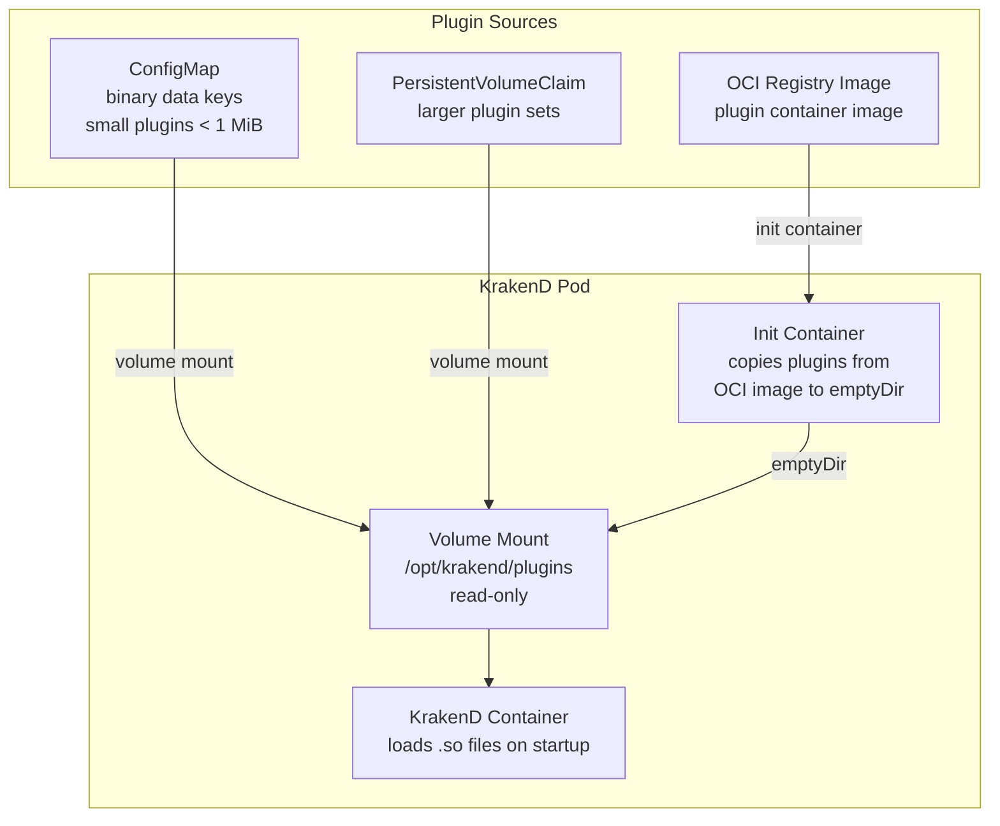
```mermaid
graph TB
    subgraph "Plugin Sources"
        CM_P[ConfigMap<br/>binary data keys<br/>small plugins < 1 MiB]
        PVC_P[PersistentVolumeClaim<br/>larger plugin sets]
        OCI[OCI Registry Image<br/>plugin container image]
    end

    subgraph "KrakenD Pod"
        INIT[Init Container<br/>copies plugins from<br/>OCI image to emptyDir]
        VOL[Volume Mount<br/>/opt/krakend/plugins<br/>read-only]
        KD[KrakenD Container<br/>loads .so files on startup]
    end

    CM_P -->|volume mount| VOL
    PVC_P -->|volume mount| VOL
    OCI -->|init container| INIT
    INIT -->|emptyDir| VOL
    VOL --> KD
```

A `configMapRef` source whose ConfigMap does not exist sets `PluginsResolved=False/ConfigMapNotFound` and holds the Deployment until the ConfigMap exists; the plugin ConfigMap watch reconciles the gateway when it appears.

### Plugin Source Types

| Source | Use Case | Size Limit | Update Mechanism |
|---|---|---|---|
| `configMapRef` | Small plugins (< 1 MiB per ConfigMap) | 1 MiB (Kubernetes limit) | Update ConfigMap → rolling restart via checksum annotation |
| `persistentVolumeClaimRef` | Larger plugin sets, shared across pods | PVC-dependent | Update PVC contents + manually trigger rollout (PVC content changes are not automatically detected by the operator) |
| `imageRef` | CI/CD-built plugin images (OCI artifacts) | Image-dependent | Update image tag → rolling restart via init container image change |

### Volume Assembly

The operator assembles the plugin volume mount from all configured sources using a two-strategy approach:

**Single-source strategy** (only ConfigMap sources, or only a PVC source):
- ConfigMap-only: uses a Kubernetes `projected` volume merging all ConfigMaps flat into the mount path
- PVC-only: mounts the PVC directly at the plugin path

**Multi-source strategy** (any combination of ConfigMap, PVC, and/or OCI sources):
The operator uses an `emptyDir` volume at the plugin mount path and init containers to assemble all plugin files into it:

1. **ConfigMap sources** — an init container copies `.so` files from each projected ConfigMap volume into the emptyDir
2. **PVC sources** — an init container copies `.so` files from the PVC mount into the emptyDir (only one PVC source supported per gateway; the admission webhook rejects multiple PVC sources)
3. **OCI image sources** — an init container pulls the image and copies plugin files into the emptyDir

This strategy avoids the Kubernetes limitation that prevents mounting a `projected` volume and a `persistentVolumeClaim` at the same `mountPath`. KrakenD's plugin loader does not recurse into subdirectories, so all files must be flat in the mount path.

All sources are mounted **read-only** into the KrakenD container. The operator adds a `checksum/plugins` annotation to the pod template (computed from the ConfigMap data hashes and OCI image tags) to trigger rolling restarts when plugins change. PVC content changes are not automatically detected — users must manually trigger a rollout (e.g., by annotating the KrakenDGateway spec) when PVC-hosted plugins are updated.

### KrakenD Plugin Configuration

The operator injects the `plugin` root key into the rendered `krakend.json` when plugins are configured:

```json
{
  "plugin": {
    "pattern": ".so",
    "folder": "/opt/krakend/plugins"
  }
}
```

Individual plugin activation is configured per-endpoint or per-service via `extra_config` in the KrakenDEndpoint or KrakenDGateway CRDs — the operator does not manage which plugins are active, only that the plugin files are available at the expected path.

### Security Considerations

- Plugin `.so` files execute **arbitrary code** inside the KrakenD process. Only mount plugins from trusted sources
- The plugin volume is mounted read-only to prevent runtime modification
- When using `imageRef`, use the `imagePullSecrets` field on the image source to configure registry credentials for private registries
- The `readOnlyRootFilesystem: true` security context is preserved — plugins are mounted via volumes, not written to the container filesystem

---

## 12. Zero-Downtime Deployment Strategy

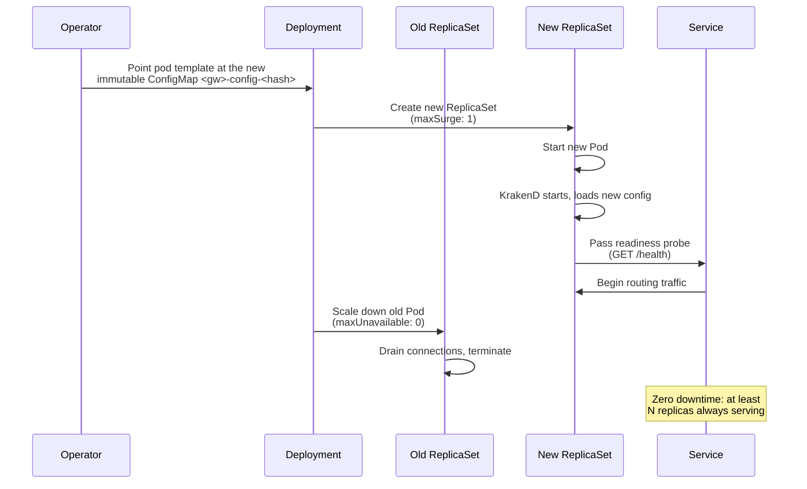
```mermaid
sequenceDiagram
    participant Op as Operator
    participant Dep as Deployment
    participant RS1 as Old ReplicaSet
    participant RS2 as New ReplicaSet
    participant SVC as Service

    Op->>Dep: Point pod template at the new<br/>immutable ConfigMap <gw>-config-<hash>
    Dep->>RS2: Create new ReplicaSet<br/>(maxSurge: 1)
    RS2->>RS2: Start new Pod
    RS2->>RS2: KrakenD starts, loads new config
    RS2->>SVC: Pass readiness probe<br/>(GET /health)
    SVC->>RS2: Begin routing traffic
    Dep->>RS1: Scale down old Pod<br/>(maxUnavailable: 0)
    RS1->>RS1: Drain connections, terminate

    Note over SVC: Zero downtime: at least<br/>N replicas always serving
```

Each applied config revision is an immutable ConfigMap,
`<gw>-config-<first 10 hex of the checksum>`, and the pod template mounts it
by name. The template's `krakend.io/checksum-config` annotation still
carries the full checksum, and the post-restart Job gate keys on it. A
rollout therefore changes which ConfigMap new pods mount and never rewrites
the one old pods mount, so a stalled rollout cannot take down pods that
restart on the previous ReplicaSet.

The license is mounted with `subPath`, which never receives Secret updates,
and KrakenD reads its license at startup. The pod template therefore also
carries `krakend.io/checksum-license`, the SHA-256 of the license bytes the
operator read. It tracks the mounted license, so it is present for every EE gateway with a readable license, CE fallback or not (the license stays mounted under fallback, so a fallback toggle alone never changes the pod template), and absent on a Community gateway.
Changing the license in the Secret changes the annotation, rolls the
Deployment (`Progressing=True`, reason `DeploymentUpdated`, or
`ConfigDeployed` when a config applied during a plugin ConfigMap hold rolls
out with it) and holds `Ready` until the new pods are available. When the
Secret cannot be read, the annotation the Deployment already carries is
kept, so nothing rolls. The post-restart Job's identity does not include the
license, so a renewal does not re-run it.

A config ConfigMap is garbage-collected once nothing can mount it. The
operator keeps the three most recently created revisions, the applied one
included (revisions created in the same second are ordered by name), and any
revision a live ReplicaSet (one with or wanting pods) still mounts.
ReplicaSets are read uncached, and only when there is something to collect.
Old revisions keep whatever the rendered config embeds, credentials included,
so a credential embedded in the rendered config outlives its rotation by up to
two config changes.

### Deployment Configuration

The operator configures the Deployment's rolling update strategy:

```yaml
strategy:
  type: RollingUpdate
  rollingUpdate:
    maxSurge: 1          # add 1 new pod before removing old
    maxUnavailable: 0    # never reduce below desired replicas
```

The pod template must also specify:

```yaml
# spec.template.spec
terminationGracePeriodSeconds: 60   # must exceed max backend timeout + connection drain time
```

### PodDisruptionBudget

To protect against voluntary disruptions (node drains, cluster autoscaler scale-down), the operator creates a `PodDisruptionBudget` for each KrakenD Deployment:

```yaml
apiVersion: policy/v1
kind: PodDisruptionBudget
metadata:
  name: production-gateway
  namespace: api-gateway
  ownerReferences:
    - apiVersion: gateway.krakend.io/v1alpha1
      kind: KrakenDGateway
      name: production-gateway
      uid: <gateway-uid>
      controller: true
      blockOwnerDeletion: true
spec:
  maxUnavailable: 1
  selector:
    matchLabels:
      app.kubernetes.io/instance: production-gateway
      app.kubernetes.io/managed-by: krakend-operator
```

> **Note:** The zero-downtime guarantee requires `replicas >= 2`. With a single replica, `maxUnavailable: 1` permits the pod to be evicted during voluntary disruptions. For production, always set `replicas >= 2`. Alternatively, use `minAvailable: 1` to prevent eviction of single-replica deployments; this blocks node drains until a second replica is added.

### Health Probes

```yaml
livenessProbe:
  httpGet:
    path: /health        # from spec.config.router.healthPath
    port: 8080           # from spec.config.port
  initialDelaySeconds: 5
  periodSeconds: 10
  failureThreshold: 3

readinessProbe:
  httpGet:
    path: /health
    port: 8080           # from spec.config.port
  initialDelaySeconds: 10
  periodSeconds: 5
  failureThreshold: 3

startupProbe:
  httpGet:
    path: /health
    port: 8080           # from spec.config.port
  initialDelaySeconds: 5
  periodSeconds: 3
  failureThreshold: 10              # allows up to 35s for initial startup
```

---

## 13. Security Model

### Pod Security

All KrakenD pods are deployed with a restrictive security context:

```yaml
# Pod-level security context (spec.securityContext)
podSecurityContext:
  runAsNonRoot: true
  runAsUser: 1000
  runAsGroup: 1000
  fsGroup: 1000
  seccompProfile:
    type: RuntimeDefault

# Container-level security context (spec.containers[].securityContext)
containerSecurityContext:
  readOnlyRootFilesystem: true
  allowPrivilegeEscalation: false
  capabilities:
    drop: ["ALL"]
```

Because `readOnlyRootFilesystem: true` prevents writes to the container's filesystem, the operator must mount a writable `emptyDir` at `/tmp` (required by Go's standard library and KrakenD's internal operations):

```yaml
volumes:
  - name: tmp
    emptyDir:
      sizeLimit: "64Mi"
volumeMounts:
  - name: tmp
    mountPath: /tmp
```

### Secret Handling

- The LICENSE file is mounted as a read-only volume from a Kubernetes Secret — never embedded in ConfigMaps
- The operator never logs secret contents or license file data
- ExternalSecret refresh intervals ensure license rotation is picked up automatically

> **Security note:** While `KRAKEND_LICENSE_BASE64` is supported by KrakenD as an alternative injection method, **the file-mount approach is preferred**. Environment variables are exposed via `/proc/PID/environ`, visible to all processes running as the same UID, and may be captured in pod spec audit logs. The operator defaults to the volume-mount strategy.

### Operator Pod Security

The operator's own Deployment should be hardened with the same restrictive security context:

```yaml
# Operator pod security context
podSecurityContext:
  runAsNonRoot: true
  runAsUser: 65532                     # nonroot user (distroless convention)
  runAsGroup: 65532
  fsGroup: 65532
  seccompProfile:
    type: RuntimeDefault

containerSecurityContext:
  readOnlyRootFilesystem: true
  allowPrivilegeEscalation: false
  capabilities:
    drop: ["ALL"]
```

The operator container also requires a writable `/tmp` emptyDir mount (for the embedded `krakend check` binary's temporary files during validation):

```yaml
volumes:
  - name: tmp
    emptyDir:
      sizeLimit: "64Mi"
volumeMounts:
  - name: tmp
    mountPath: /tmp
```

### Network Policy (Recommended)

```yaml
apiVersion: networking.k8s.io/v1
kind: NetworkPolicy
metadata:
  name: krakend-network-policy
spec:
  podSelector:
    matchLabels:
      app.kubernetes.io/managed-by: krakend-operator
      app.kubernetes.io/component: gateway    # applied by the operator's Deployment builder to distinguish KrakenD pods from Dragonfly pods
  policyTypes: [Ingress, Egress]
  ingress:
    - from:
        - namespaceSelector: {}         # allow from all namespaces (via Service)
      ports:
        - port: 8080
    - from:
        - namespaceSelector:
            matchLabels:
              kubernetes.io/metadata.name: monitoring
      ports:
        - port: 9091                    # KrakenD Prometheus exporter port — must match telemetry config
  egress:
    - {}                                # allow all egress (backends, IdP, Dragonfly)
```

---

## 14. Operator RBAC Requirements

The operator uses a two-tier RBAC model:

- **`ClusterRole` (cluster-scoped)** — bound via `ClusterRoleBinding` to the operator’s ServiceAccount. Covers: CRD watching/status updates, leader election leases, and cluster-level resources.
- **Namespaced resources** — the same `ClusterRole` includes permissions for namespaced resources (Deployments, Services, ConfigMaps, etc.). This allows the operator to manage gateways in any namespace. For stricter isolation, a `Role` + `RoleBinding` per gateway namespace can be used instead.

### Core Resources

```yaml
# ClusterRole: krakend-operator-manager
rules:
  # Manage owned resources
  - apiGroups: ["apps"]
    resources: ["deployments"]
    verbs: ["get", "list", "watch", "create", "update", "patch", "delete"]
  - apiGroups: ["apps"]
    resources: ["replicasets"]
    verbs: ["list"]                    # config ConfigMap GC: a live ReplicaSet keeps its ConfigMap; read uncached
  - apiGroups: [""]
    resources: ["services", "configmaps", "serviceaccounts"]
    verbs: ["get", "list", "watch", "create", "update", "patch", "delete"]
  - apiGroups: [""]
    resources: ["secrets"]
    verbs: ["get", "list", "watch"]    # watch needed for license Secret change detection; scope to gateway namespaces via Role if stricter isolation required

  # Dragonfly CRD (rendered by operator, reconciled by Dragonfly Operator)
  - apiGroups: ["dragonflydb.io"]
    resources: ["dragonflies"]
    verbs: ["get", "list", "watch", "create", "update", "patch", "delete"]
  - apiGroups: ["dragonflydb.io"]
    resources: ["dragonflies/status"]
    verbs: ["get"]

  # Watch CRDs
  - apiGroups: ["gateway.krakend.io"]
    resources: ["krakendgateways", "krakendendpoints", "krakendbackendpolicies", "krakendautoconfigs"]
    verbs: ["get", "list", "watch"]
  - apiGroups: ["gateway.krakend.io"]
    resources: ["krakendgateways/status", "krakendendpoints/status", "krakendbackendpolicies/status", "krakendautoconfigs/status"]
    verbs: ["get", "update", "patch"]
  - apiGroups: ["gateway.krakend.io"]
    resources: ["krakendgateways/finalizers", "krakendendpoints/finalizers", "krakendbackendpolicies/finalizers", "krakendautoconfigs/finalizers"]
    verbs: ["update"]                  # kubebuilder convention; finalizers used for pre-deletion cleanup when ownerReference GC is insufficient

  # Autoconfig: create/update/delete generated KrakenDEndpoints
  - apiGroups: ["gateway.krakend.io"]
    resources: ["krakendendpoints"]
    verbs: ["create", "update", "patch", "delete"]

  # Leader election
  - apiGroups: ["coordination.k8s.io"]
    resources: ["leases"]
    verbs: ["get", "list", "watch", "create", "update", "patch", "delete"]

  # Events
  - apiGroups: [""]
    resources: ["events"]
    verbs: ["create", "patch"]

  # HPA (optional)
  - apiGroups: ["autoscaling"]
    resources: ["horizontalpodautoscalers"]
    verbs: ["get", "list", "watch", "create", "update", "patch", "delete"]

  # PodDisruptionBudget
  - apiGroups: ["policy"]
    resources: ["poddisruptionbudgets"]
    verbs: ["get", "list", "watch", "create", "update", "patch", "delete"]
```

### External Secrets (Conditional)

```yaml
  # Only when ExternalSecret integration is enabled
  - apiGroups: ["external-secrets.io"]
    resources: ["externalsecrets"]
    verbs: ["get", "list", "watch", "create", "update", "patch", "delete"]
  - apiGroups: ["external-secrets.io"]
    resources: ["externalsecrets/status"]
    verbs: ["get"]
```

### Istio (Conditional)

```yaml
  # Only when Istio integration is enabled
  - apiGroups: ["networking.istio.io"]
    resources: ["virtualservices"]
    verbs: ["get", "list", "watch", "create", "update", "patch", "delete"]
```

---

## 15. Status and Observability

### Summary condition and columns

Every kind has a `Ready` condition written only by its own controller, a
top-level `status.observedGeneration`, and `status.conditions` keyed by
`type` (`+listType=map`). `kubectl get` shows `Ready` and `Reason` (the
reason of `Ready`); `Phase`, where the kind has one, is derived from the
conditions and shown with `-o wide`.

| Kind | `Ready` is True when |
|---|---|
| KrakenDGateway | the configuration is validated and applied, the Deployment is available and the applied config is rolled out to all replicas, and the EE license (if any) is valid |
| KrakenDEndpoint | `ResolvedRefs` and `Accepted` are True, `Accepted` for the current generation |
| KrakenDAutoConfig | `SpecAvailable` and `Synced` are True |
| KrakenDBackendPolicy | its fields are in range |

A gateway's `status.observedGeneration`, and the `observedGeneration` of its
`Ready` condition, name the generation whose spec the operator has applied in
full. Both stay at their previous value, with the rest of the status written
as usual, while the pass has an infrastructure error (a child resource that
could not be reconciled, or old config ConfigMaps that could not be
collected) or holds the Deployment because no ConfigMap can hold the applied
config although the render is the applied config (a ConfigMap that is not the
gateway's sits at the content-addressed name). The error is returned, so the
gateway is requeued with backoff, and kstatus and Flux report it as in
progress, not current, until the error clears. A rejected config, an
unavailable validator and a missing plugin ConfigMap are verdicts on the
current generation and do not hold it back. The infrastructure stage attempts
every independent child and joins the errors; the post-restart Job, ConfigMap
collection and the deletion of an unwanted HPA wait for a successful
Deployment step.

### Gateway Status Conditions

| Condition | Meaning |
|---|---|
| `Ready` | Summary condition written only by the gateway controller, derived from ConfigValid, PluginsResolved, Available, Progressing, LicenseExpired, LicenseDegraded and CEFallbackApplied (`Unknown` while the validator is unavailable); phase is derived from the same rules |
| `ConfigValid` | Last rendered krakend.json passed validation as the edition it was rendered for: `krakend check -t -n -c`, after the route check (see Validation Strategy), which runs for every edition on the edition's validation copy, and after the EE wildcard route rules for an EE render (`Unknown` with reason `ValidatorUnavailable` while krakend check cannot run) |
| `Available` | The Deployment is available: it mirrors the Deployment's `Available` condition once a rollout is not in flight, and is `False` with reason `RolloutFailed` when the Deployment exceeds its progress deadline for the rollout it is running now (the Deployment has observed its latest generation and carries the wanted template). A fix pushed while a rollout is stuck replaces `RolloutFailed` with `Progressing=True`, and `Available` is reset until the new rollout settles |
| `LicenseValid` | EE license state: `True`/`LicenseOK`, `True`/`LicenseExpiringSoon` inside the warning window, `False`/`LicensePreExpiry` or `False`/`LicenseExpired`, and `Unknown`/`LicenseSecretMissing` while the license cannot be read or parsed. While unreadable, the stage is judged from the last known expiry (`status.licenseExpiry`): once that is inside the safety buffer or past, the stage verdict (`False`) replaces `Unknown` |
| `LicenseDegraded` | Gateway is actively running in CE mode as a fallback because the EE license expired or entered the pre-expiry safety window (**True** when the fallback decision is made, before the CE rollout has finished, and only when `fallbackToCE=true`; `False` with reason `LicenseRestored` after recovery, or `False` with reason `LicenseExpiredNoFallback` when the license expired and `fallbackToCE` is off while the condition was already present; absent otherwise) |
| `CEFallbackApplied` | The applied config is the CE-fallback render (reason `EEFeaturesStripped`); the message lists the Enterprise-only features it removed. Absent otherwise |
| `PluginsResolved` | Every plugin ConfigMap the gateway mounts exists (`ConfigMapsFound`), or `False`/`ConfigMapNotFound` naming the missing ones, while the Deployment is held. Absent without ConfigMap plugin sources |
| `DragonflyReady` | Dragonfly CR status reports `ready` phase (watched from Dragonfly Operator); `False`/`CRDNotInstalled` when the feature is enabled but its CRD is not installed |
| `IstioConfigured` | VirtualService was successfully created/updated; `False`/`CRDNotInstalled` when the feature is enabled but its CRD is not installed |
| `LicenseSecretUnavailable` | `True` while the license cannot be read: the ExternalSecret failed to sync, the referenced Secret (`secretRef`) or its key does not exist, or the certificate does not parse. `LicenseValid` is `Unknown` meanwhile, unless the last known expiry (`status.licenseExpiry`) is already inside the safety buffer or past, in which case the stage verdict applies. `False` with reason `SecretAvailable` once it can be read; `True`/`CRDNotInstalled` when the license comes from an ExternalSecret whose CRD is not installed |
| `LicenseExpired` | License has expired or is inside the 1 h safety buffer (reason `LicenseExpired` or `LicensePreExpiry`), whether or not `fallbackToCE` is set; without `fallbackToCE` (no `LicenseDegraded`) the gateway reports phase `Error`, and its pods self-terminate at T-0. `False` with reason `LicenseRestored` after recovery, and absent otherwise |
| `Progressing` | A rolling deployment is in progress. It is derived from the Deployment the reconcile just wrote, not from the detection of a change: it is `True` when the Deployment was created, the write changed its pod template (annotated or not), the template is not the wanted one, or old pods remain beside updated ones (`updatedReplicas < replicas`). A replica change alone (an HPA scale) is not a rollout. The reason is the detected change (`ConfigDeployed` or `DeploymentUpdated`), else the reason already reported, else `DeploymentUpdated`. It ends (`RolloutComplete`) only when the Deployment has observed the change, its pods carry the applied config checksum, image, plugin checksum and license checksum and mount the applied config's ConfigMap, and every replica is updated and available. A pass that holds the Deployment starts no rollout and never raises it |

### Endpoint Status Conditions

| Condition | Writer | Meaning |
|---|---|---|
| `ResolvedRefs` | endpoint controller | The gateway and every referenced policy exist (`RefsResolved`, `GatewayNotFound`, `PolicyNotFound`) |
| `Accepted` | gateway controller | Part of the gateway's validated configuration (`Accepted`), `PartiallyAccepted` (True; `status.conflicts` lists the lost entries) when a conflict cost it some entries, or `EndpointConflict` (False) when it cost it all of them; removed while a referenced policy is missing; `EEFeaturesStripped` when a CE-fallback render removed Enterprise-only features from it (True while some entry is still served, False when every entry was an EE wildcard; the message lists them); a conflict reason wins over it, and that message appends the removals |
| `Ready` | endpoint controller | Derived by `api/v1alpha1.EndpointReady`: `Unknown`/`Pending` until the gateway accepts the current generation. A docs-only `SchemaNameConflict` on `Accepted` keeps `Ready=True`, with that reason: schema defects never affect whether a route renders or serves |

Both writers patch status with an optimistic lock (`MergeFromWithOptimisticLock`),
so neither can overwrite the other's condition; a writer that lost the race
re-reads and retries.

### Operator Metrics (Prometheus)

| Metric | Type | Description |
|---|---|---|
| `krakend_operator_gateway_info` | Gauge | Gateway metadata labels (edition, version, namespace) |
| `krakend_operator_config_renders_total` | Counter | Total config render attempts |
| `krakend_operator_config_validation_failures_total` | Counter | Validation failures (broken configs blocked) |
| `krakend_operator_rolling_restarts_total` | Counter | Rolling deployments triggered |
| `krakend_operator_license_expiry_seconds` | Gauge | Seconds until EE license expiry (labels: `namespace`, `name`) |
| `krakend_operator_endpoints` | Gauge | Number of KrakenDEndpoints per gateway |
| `krakend_operator_reconcile_duration_seconds` | Histogram | Reconciliation loop latency |
| `krakend_operator_dragonfly_ready` | Gauge | 1 if Dragonfly is ready, 0 otherwise |
| `krakend_operator_gateway_config_valid` | Gauge | 1 while the gateway's newest config passed validation, 0 otherwise (labels: `namespace`, `name`); removed when the gateway is deleted |
| `krakend_operator_autoconfig_synced` | Gauge | 1 after a `KrakenDAutoConfig`'s last reconcile synced successfully, 0 while it is failing (labels: `namespace`, `name`); the series is removed when the AutoConfig is deleted |

Per-gateway series (`namespace`, `name` labels) are removed when the gateway is deleted or starts terminating.

### Kubernetes Events

The operator emits events on the resource a condition or action concerns. Events on a KrakenDEndpoint are `EndpointConflict`, `Accepted` (emitted by the gateway controller), and `GatewayNotFound`, `PolicyNotFound` and `RefsResolved` (emitted by the endpoint controller). Events on a KrakenDBackendPolicy are `InvalidCircuitBreaker`, `InvalidRateLimit` and `Ready`. Events on a KrakenDAutoConfig are the AutoConfig rows (`SpecFetched` through `DuplicateOperationId`). All other rows are emitted on the KrakenDGateway. Condition-transition events (endpoint `ResolvedRefs`, policy `Ready`) fire on the transition only: a Warning when the condition becomes `False` or changes reason, and a Normal event when it recovers.

A gateway event backed by a condition (`RolloutFailed`,
`IstioVirtualServiceCreated`, `DragonflyNotReady`, `DragonflyReady`, the license
events and `CRDNotInstalled`) is recorded only when that condition changes
status or reason. A steady state emits no events. `ConfigValidationFailed` and
`ValidatorUnavailable` fire when the recorded verdict changes.

| Event | Type | Reason |
|---|---|---|
| Config rendered and deployed | Normal | `ConfigDeployed` |
| Config validation failed | Warning | `ConfigValidationFailed` |
| krakend check could not run (retried with backoff) | Warning | `ValidatorUnavailable` |
| License expiring soon | Warning | `LicenseExpiringSoon` |
| License expired or entering pre-expiry safety window, falling back to CE | Warning | `LicenseFallbackCE` |
| License expired or entering pre-expiry safety window, CE fallback not configured | Warning | `LicenseExpiredNoFallback` |
| Dragonfly not ready | Warning | `DragonflyNotReady` |
| Dragonfly ready again | Normal | `DragonflyReady` |
| Dragonfly, Istio or the license ExternalSecret is enabled but its CRD is not installed (on the transition only) | Warning | `CRDNotInstalled` |
| VirtualService created | Normal | `IstioVirtualServiceCreated` |
| A plugin ConfigMap is missing and the Deployment is held (on the transition only) | Warning | `ConfigMapNotFound` |
| Every plugin ConfigMap exists again | Normal | `ConfigMapsFound` |
| The applied config is the CE-fallback render (on the transition only; the message lists the Enterprise-only features removed, or says it uses none) | Warning | `EEFeaturesStripped` |
| Endpoint newly loses all its entries to a route conflict (on the transition only) | Warning | `EndpointConflict` |
| Endpoint newly loses some of its entries to a route conflict (on the transition only) | Warning | `PartiallyAccepted` |
| Previously conflicted (fully or partly) endpoint included again | Normal | `Accepted` |
| Endpoint's gateway does not exist (`ResolvedRefs` False) | Warning | `GatewayNotFound` |
| Endpoint references a policy that does not exist (`ResolvedRefs` False) | Warning | `PolicyNotFound` |
| Endpoint references resolve again | Normal | `RefsResolved` |
| Policy circuit breaker fields out of range (`Ready` False) | Warning | `InvalidCircuitBreaker` |
| Policy rate limit fields out of range (`Ready` False) | Warning | `InvalidRateLimit` |
| Invalid policy corrected | Normal | `Ready` |
| Referenced license Secret missing (`secretRef` path) | Warning | `LicenseSecretMissing` |
| License renewed, EE restored | Normal | `LicenseRestored` |
| OpenAPI spec fetched successfully | Normal | `SpecFetched` |
| OpenAPI spec fetch failed, including a failed external `$ref` fetch/decode | Warning | `SpecFetchFailed` |
| CUE evaluation failed | Warning | `CUEEvaluationFailed` |
| Override operationId not present in the OpenAPI spec (sync fails, last-good endpoints kept) | Warning | `UnmatchedOverride` |
| No base path could be derived for `additionalEndpoints` (sync fails) | Warning | `AdditionalEndpointScopeFailed` |
| Generated endpoints could not be created, updated or deleted (sync fails) | Warning | `EndpointReconcileFailed` |
| CUE evaluation warning (e.g. an operation skipped) | Warning | `CUEEvaluationWarning` |
| An `additionalEndpoints` entry replaced a spec-derived endpoint | Warning | `AdditionalEndpointOverride` |
| Endpoints generated/updated from OpenAPI spec | Normal | `EndpointsGenerated` |
| Duplicate operationId in OpenAPI spec | Warning | `DuplicateOperationId` |
| Deployment rollout exceeded progress deadline | Warning | `RolloutFailed` |

### Admission Validation

The operator should deploy a `ValidatingAdmissionWebhook` with `failurePolicy: Fail` (or use Kubernetes' CEL-based `ValidatingAdmissionPolicy` on clusters >= 1.30 where the API is GA; available as beta in 1.28-1.29) to reject invalid CRs at submission time, before they enter etcd:

> **Operational note:** `failurePolicy: Fail` means webhook pod outages will block CRD mutations cluster-wide. The operator Deployment should run with `replicas >= 2` and a PDB to minimize webhook downtime. For less strict environments, `failurePolicy: Ignore` allows bypass during outages at the cost of deferred validation.

> **Deletion:** updates to an object that is being deleted (it has a `deletionTimestamp`) are admitted when they don't change its spec (for example, removing a finalizer); a spec change is still validated. Rejecting a finalizer removal would leave the object stuck in `Terminating`.

> **Responses:** a rejected field is `422 Invalid` with one status cause per field error, so `kubectl` prints each rejected path. A failed lookup (a gateway, a policy or the endpoint list) is `500 Internal Error`, which clients retry; it is never reported as a rejected field. Every webhook sets `timeoutSeconds: 15`. The webhook configuration in `config/webhook/manifests.yaml` is generated from the `+kubebuilder:webhook` markers in `internal/webhook/webhook.go`, and the Helm chart template carries the same values.

- **KrakenDEndpoint** — reject if `gatewayRef` references a non-existent KrakenDGateway
- **KrakenDEndpoint** — reject if `policyRef` references a non-existent KrakenDBackendPolicy
- **KrakenDEndpoint** — warn (but allow) if an endpoint path+method already exists on the target gateway (conflict detection)
- **KrakenDGateway** — reject if `edition: EE` but neither `license.externalSecret.enabled=true` nor `license.secretRef` is set
- **KrakenDGateway** — reject if both `license.externalSecret.enabled=true` and `license.secretRef` are set (mutually exclusive)
- **KrakenDGateway** — reject if `edition: CE` and either `license.externalSecret.enabled=true` or `license.secretRef` is set (CE requires no license)
- **KrakenDGateway (DELETE)** — not registered: deleting a gateway needs no validation, and with `failurePolicy: Fail` a registration would make gateway and namespace deletion depend on a reachable operator
- **KrakenDBackendPolicy** — validate field ranges (e.g., `circuitBreaker.maxErrors > 0`)
- **KrakenDBackendPolicy (DELETE)** — reject deletion if any KrakenDEndpoint references this policy via `policyRef`; emit a descriptive error listing the referencing endpoints
- **KrakenDAutoConfig** — reject if `gatewayRef` references a non-existent KrakenDGateway
- **KrakenDAutoConfig** — reject if both `openapi.url` and `openapi.configMapRef` are set (mutually exclusive)
- **KrakenDAutoConfig** — reject if neither `openapi.url` nor `openapi.configMapRef` is set
- **KrakenDAutoConfig** — reject if `openapi.configMapRef` is used and `urlTransform.hostMapping` is not provided (no URL to infer backend host from)
- **KrakenDAutoConfig** — reject if `trigger: Periodic` but `periodic.interval` is absent
- **KrakenDAutoConfig** — reject if both `auth.bearerTokenSecret` and `auth.basicAuthSecret` are set (mutually exclusive)
- **KrakenDAutoConfig** / **KrakenDEndpoint** — reject a non-list `documentation/openapi.audience` value inside `extraConfig` (`spec.overrides[].extraConfig`, `spec.defaults.endpoint.extraConfig`, and `spec.additionalEndpoints[].extraConfig` on KrakenDAutoConfig; `spec.endpoints[].extraConfig` on KrakenDEndpoint) — KrakenD's OpenAPI documentation plugin requires a list of strings, and a malformed value would otherwise pass validation here but fail `krakend check -t -n -c`, blocking config updates for every service on that gateway
- **KrakenDGateway** — reject if multiple `plugins.sources[]` entries use `persistentVolumeClaimRef` (only one PVC source supported)

This provides fast feedback to users at `kubectl apply` time rather than waiting for reconciliation.

> **Ordering note:** When applying KrakenDGateway and KrakenDEndpoint resources simultaneously (e.g., `kubectl apply -f config/`), the webhook may reject endpoints if their target gateway has not yet been admitted. Apply KrakenDGateway resources first, then apply KrakenDEndpoints. In CI/CD pipelines, enforce this ordering explicitly (e.g., `kubectl apply -f gateways/` followed by `kubectl apply -f endpoints/`).

---

## 16. OpenAPI Auto-Configuration

The operator includes an auto-configuration service that watches OpenAPI (Swagger) specification endpoints and automatically generates `KrakenDEndpoint` CRDs from the discovered API operations. This replaces manual endpoint authoring for services that publish OpenAPI specs, internalizing and evolving the [CUE](https://github.com/cue-lang/cue)-based transformation approach previously used via [KrakenD-SwaggerParse](https://github.com/MyCarrier-DevOps/KrakenD-SwaggerParse).

### CUE Transformation Engine

The autoconfig pipeline uses CUE as its transformation engine rather than hardcoded Go logic. CUE definitions describe **how** OpenAPI operations map to `KrakenDEndpoint` CRD specs — `gatewayRef`, `endpoint` path, `method`, `backends[]` with host resolution, `inputHeaders`, `inputQueryStrings`, `timeout`, `policyRef`, and `extraConfig`. The CUE output is the operator's CRD structure, not raw KrakenD JSON; the normal rendering pipeline (§10) handles CRD → `krakend.json` conversion. This makes the transformation rules declarative, versionable, and customizable without recompiling the operator.

**Default CUE definitions** are embedded in the operator container image and deployed as a ConfigMap (`krakend-cue-definitions`) by the Helm chart during installation. These defaults encode the transformation logic inspired by KrakenD-SwaggerParse's `endpoints.cue`: iterating OpenAPI paths and operations, building `KrakenDEndpoint` specs with backend host resolution, extracting query/header parameters into `inputHeaders` and `inputQueryStrings`, and populating `extraConfig` with rate-limit and documentation namespaces. The output schema is the `KrakenDEndpointSpec` type — not the KrakenD JSON endpoint format.

**Custom CUE definitions** can be provided by creating a ConfigMap containing `.cue` files and referencing it from the `KrakenDAutoConfig` CR. Custom definitions are **unified** with the defaults — CUE's native constraint system allows users to extend, restrict, or override specific transformation behaviors without replacing the entire definition set. For example, a team can add a custom `extraConfig` injection for all their endpoints, override the default `policyRef`, or customize per-environment host resolution.

The operator evaluates CUE definitions using the embedded `cuelang.org/go/cue` Go library (no external CUE CLI dependency). The evaluation pipeline:

1. **Load default CUE definitions** from the operator's embedded ConfigMap
2. **Load custom CUE definitions** from the user-provided ConfigMap (if referenced)
3. **Unify** defaults + customs + the fetched OpenAPI spec data (imported as CUE values)
4. **Apply per-operation overrides** from the `KrakenDAutoConfig` CR
5. **Evaluate** the unified CUE value to produce concrete `KrakenDEndpointSpec` objects
6. **Validate** the output against the CUE endpoint schema constraints (catches CRD-invalid configurations before creating resources)

> **Why CUE over Go templates or pure Go code?** CUE provides type-safe schema validation, declarative constraints, and hermetic evaluation. Users can customize transformation behavior without writing Go code, and the CUE constraint system catches invalid configurations at evaluation time rather than during reconciliation. CUE's unification model (rather than override/merge semantics) ensures that custom definitions cannot produce output that violates the `KrakenDEndpointSpec` schema constraints.

### KrakenDAutoConfig CRD

A new CRD `KrakenDAutoConfig` defines an OpenAPI spec watcher. Each `KrakenDAutoConfig` resource **owns** the `KrakenDEndpoint` resources it generates via `ownerReference`. Deleting the `KrakenDAutoConfig` cascades to all generated endpoints.

```yaml
apiVersion: gateway.krakend.io/v1alpha1
kind: KrakenDAutoConfig
metadata:
  name: users-service-autoconfig
  namespace: api-gateway
  labels:
    team: platform
    domain: users
spec:
  # Target gateway for generated endpoints
  gatewayRef:
    name: production-gateway

  # OpenAPI spec source
  openapi:
    url: http://user-service.users.svc.cluster.local:8080/swagger/v1/swagger.json
    # --- OR from a ConfigMap ---
    # configMapRef:
    #   name: users-openapi-spec
    #   key: openapi.json
    format: json                       # json or yaml (auto-detected if omitted)
    allowClusterLocal: true            # allow fetching from cluster-internal (RFC 1918) addresses; set false to restrict to public URLs only
    # Optional: authentication for the spec endpoint
    auth:
      bearerTokenSecret:
        name: openapi-fetch-token
        key: token
      # --- OR basic auth ---
      # basicAuthSecret:
      #   name: openapi-basic-auth
      #   usernameKey: username
      #   passwordKey: password

  # CUE transformation definitions
  # The operator ships default CUE definitions (deployed as ConfigMap krakend-cue-definitions
  # by the Helm chart). Custom definitions are unified with defaults — CUE constraints
  # allow extending, restricting, or overriding specific transformation behaviors.
  cue:
    # Optional: custom CUE definitions ConfigMap. When omitted, only the operator's
    # default CUE definitions are used. When provided, custom definitions are unified
    # with defaults (CUE unification, not replacement).
    definitionsConfigMapRef:
      name: users-service-cue-overrides  # ConfigMap containing .cue files as data keys
    # Environment value injected into CUE evaluation via FillPath("_env", ...).
    # Controls per-environment host resolution and other env-specific CUE branches.
    environment: "prod"                  # dev, preprod, prod, etc.

  # URL transformation: rewrite public-facing paths/hosts to internal service addresses
  urlTransform:
    # Optional: explicitly map OpenAPI server URLs to internal cluster DNS.
    # If omitted, the operator derives the backend host from the openapi.url base address
    # (scheme + host + port), replacing any publicly routable server URL in the spec.
    # Explicit mappings take precedence when provided.
    hostMapping:
      - from: "https://api.example.com"
        to: "http://user-service.users.svc.cluster.local:8080"
      - from: "https://staging-api.example.com"
        to: "http://user-service.users-staging.svc.cluster.local:8080"
    # Path prefix manipulation
    pathPrefix:
      strip: "/api/v1"                # remove this prefix from backend urlPattern
      add: ""                          # add this prefix to the KrakenD endpoint path (empty = use OpenAPI paths as-is)

  # Endpoint generation defaults (applied to all generated endpoints unless overridden)
  defaults:
    timeout: "3s"
    cacheTTL: "0s"
    outputEncoding: json
    concurrentCalls: 1
    inputHeaders:
      - Authorization
      - Content-Type
      - Accept
      - Accept-Language
      - X-Request-ID
    inputQueryStrings: ["*"]           # pass all query strings by default
    policyRef:
      name: standard-backend-policy    # applied to every backend in the generated endpoint's backends[] array (see §3.2)

  # Per-operation overrides (keyed by OpenAPI operationId)
  # An override whose operationId is not declared by any operation in the fetched
  # spec fails the sync (status.phase: Error, Synced=False, reason UnmatchedOverride)
  # instead of being silently dropped; existing KrakenDEndpoints are left as they were
  # (last-good) until the override is fixed. For operations with no operationId:
  # spec.defaults applies to every generated operation; for a single operation, add an
  # operationId to the service's OpenAPI spec, replace it with an additionalEndpoints
  # entry (same endpoint+method replaces the spec-derived one), use a custom CUE
  # definitions ConfigMap (spec.cue.definitionsConfigMapRef), or have the service
  # declare `audience` on the operation itself as a list of strings — the
  # default CUE definitions default it to ["public"] when absent and require
  # a list of strings when present (cue/defaults.cue); a non-list value fails
  # the sync (CUEEvaluationFailed) instead of silently defaulting, and needs
  # no override.
  overrides:
    - operationId: getUserById
      timeout: "800ms"
      cacheTTL: "60s"
      extraConfig:
        rateLimit:
          maxRate: 1000
          clientMaxRate: 50
          strategy: ip
    - operationId: deleteUser
      timeout: "5s"
      policyRef:
        name: destructive-ops-policy

  # Filtering: control which operations are included
  filter:
    includePaths: []                   # empty = include all paths
    excludePaths:
      - /internal/*                    # exclude internal endpoints
      - /health
      - /ready
    includeMethods: ["GET", "POST", "PUT", "PATCH", "DELETE"]
    excludeOperationIds: []            # empty = no exclusions
    includeTags: []                    # empty = include all tags; if non-empty, only include operations matching these tags
    excludeTags:
      - internal
      - deprecated

  # Execution policy
  trigger: OnChange                   # OnChange (react to spec/label/annotation changes; also resynced every 5m) or Periodic
  # periodic:
  #   interval: "1h"                   # re-fetch spec on this interval (only when trigger=Periodic)

status:
  phase: Synced                        # derived from Synced: Synced or Error; empty before the first sync (Pending/Fetching/Rendering are never written)
  observedGeneration: 4
  lastSyncTime: "2026-04-03T10:00:00Z" # last sync that changed inputs or endpoints, not a heartbeat
  specChecksum: "sha256:def456..."
  generatedEndpoints: 15
  skippedOperations: 3                 # operations excluded by filters or skipped due to duplicate operationId
  conditions:
    - type: SpecAvailable
      status: "True"
      lastTransitionTime: "2026-04-03T10:00:00Z"
      reason: SpecFetched
      message: "OpenAPI spec fetched successfully"
    - type: Synced
      status: "True"
      lastTransitionTime: "2026-04-03T10:00:00Z"
      reason: Synced
      message: "Generated 15 endpoints"
    - type: Ready
      status: "True"
      lastTransitionTime: "2026-04-03T10:00:00Z"
      reason: Ready
      message: "OpenAPI spec fetched and endpoints in sync"
```

### Architecture

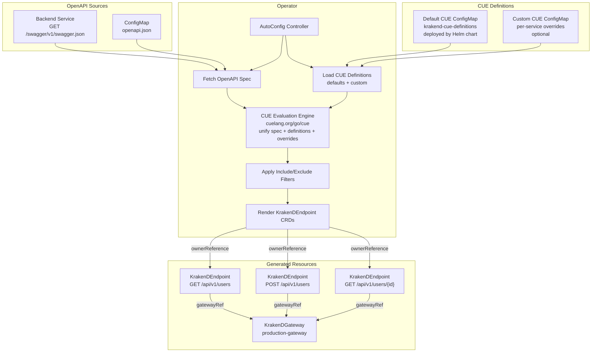
```mermaid
graph TB
    subgraph "OpenAPI Sources"
        SVC_SPEC[Backend Service<br/>GET /swagger/v1/swagger.json]
        CM_SPEC[ConfigMap<br/>openapi.json]
    end

    subgraph "CUE Definitions"
        DEF_CM[Default CUE ConfigMap<br/>krakend-cue-definitions<br/>deployed by Helm chart]
        CUSTOM_CM[Custom CUE ConfigMap<br/>per-service overrides<br/>optional]
    end

    subgraph "Operator"
        AC_CTRL[AutoConfig Controller]
        FETCH[Fetch OpenAPI Spec]
        LOAD_CUE[Load CUE Definitions<br/>defaults + custom]
        CUE_EVAL[CUE Evaluation Engine<br/>cuelang.org/go/cue<br/>unify spec + definitions + overrides]
        FILTER[Apply Include/Exclude Filters]
        RENDER[Render KrakenDEndpoint CRDs]
    end

    subgraph "Generated Resources"
        EP1[KrakenDEndpoint<br/>GET /api/v1/users]
        EP2[KrakenDEndpoint<br/>POST /api/v1/users]
        EP3["KrakenDEndpoint<br/>GET /api/v1/users/{id}"]
        GW[KrakenDGateway<br/>production-gateway]
    end

    SVC_SPEC --> FETCH
    CM_SPEC --> FETCH
    AC_CTRL --> FETCH
    AC_CTRL --> LOAD_CUE
    DEF_CM --> LOAD_CUE
    CUSTOM_CM --> LOAD_CUE
    FETCH --> CUE_EVAL
    LOAD_CUE --> CUE_EVAL
    CUE_EVAL --> FILTER
    FILTER --> RENDER
    RENDER -->|ownerReference| EP1
    RENDER -->|ownerReference| EP2
    RENDER -->|ownerReference| EP3
    EP1 -->|gatewayRef| GW
    EP2 -->|gatewayRef| GW
    EP3 -->|gatewayRef| GW
```

### Execution Model

The autoconfig controller is **watch-driven with a resync backstop**, and every reconcile runs the whole pipeline (fetch → evaluate → filter → generate → converge), so owned endpoints converge to the desired state while the AutoConfig syncs successfully. While it is in `Error`, drift repair stops at the failure until a sync succeeds: a spec fetch failure (including a failed external `$ref` fetch/decode), CUE, unmatched-override, or base-path failure stops the pipeline before any endpoint is touched, and an endpoint write failure stops convergence at that endpoint.

1. **On `KrakenDAutoConfig` creation, or a spec (generation), label, or annotation change** — fetch the OpenAPI spec, load CUE definitions, evaluate CUE, filter, generate, and create/update/delete owned `KrakenDEndpoint` resources to match. Status-only updates (the phase/condition writes the reconciler itself makes) are ignored by the primary watch's predicate, so they cannot re-trigger a reconcile.
2. **On an owned `KrakenDEndpoint` spec change or delete** — the same full pipeline runs, which restores a generated endpoint that was hand-edited or deleted out of band. Endpoint specs are compared by decoded JSON value, not bytes, so formatting/re-encoding differences alone don't produce a write.
3. **On `KrakenDAutoConfig` deletion** — all generated `KrakenDEndpoint` resources are garbage-collected via `ownerReference`. A terminating AutoConfig (`deletionTimestamp` set) is not reconciled: under foreground deletion (`kubectl delete --cascade=foreground`) it lingers while its endpoints are collected, and each endpoint delete re-enqueues it, so converging would recreate them.
4. **On an `openapi.configMapRef` or CUE definitions ConfigMap update** — the controller watches the referenced ConfigMap(s) and re-runs the pipeline.
5. **On a resync** — `trigger: OnChange` AutoConfigs are re-polled every 5 minutes (`defaultResyncInterval`) even with no watch event, so upstream spec changes and out-of-band endpoint drift are converged by the next successful sync; `trigger: Periodic` AutoConfigs resync at `spec.periodic.interval` instead.

A reconcile that finds nothing to change — the common steady-state case — writes no status and emits no event. When something does change, `status.lastSyncTime` and an `EndpointsGenerated` event (`"Generated N endpoints (C created, U updated, D deleted, S skipped)"`) are recorded; `CUEEvaluationWarning`, `DuplicateOperationId`, and `AdditionalEndpointOverride` warning events fire only when the spec/CUE-definitions/generation inputs differ from the last successful sync's, so they don't spam on every resync. A failed sync doesn't record its inputs, so they do repeat on each retry of a failing sync whose inputs changed; a spec fetch failure emits `SpecFetchFailed` instead. `status.phase` no longer transitions through `Fetching`/`Rendering`; those enum values remain for compatibility, but the controller only writes `Synced` or `Error`, and the phase is empty before the first sync.

Retry cadence differs by failure kind. A spec fetch, CUE, unmatched-override, or scope failure — including a failure to fetch or decode an external `$ref` document, which fails the sync closed the same way instead of falling back to the raw spec — retries at `spec.periodic.interval` for `Periodic` or via controller-runtime's exponential backoff for `OnChange`. An endpoint write failure (`EndpointReconcileFailed`) does not follow that split: it always retries with backoff, on either trigger, since it's usually transient and a `Periodic` AutoConfig would otherwise wait a whole interval to recover. A `Conflict` on a status write, or a `Conflict`/`AlreadyExists` on an endpoint write, means this reconcile acted on a stale cached copy — it is not a failure: it requeues quietly one second later with no error log, no event, and no status change, and its input warning events (`CUEEvaluationWarning`, `DuplicateOperationId`, `AdditionalEndpointOverride`) are held back and recorded only once the reconcile's own status write succeeds, so a retry after a lost conflict doesn't re-emit them. The exception is a failed sync whose failure-status write conflicts: the sync failed all the same, so it keeps the failure's own retry (backoff, or `spec.periodic.interval` where that applies) with no event from that attempt, since the one-second requeue would reset controller-runtime's backoff.

To force an immediate reconcile outside the resync interval, change any annotation on the resource — the watch predicate doesn't inspect which one:

```bash
kubectl annotate krakendautoconfig <name> -n <ns> krakend.io/resync="$(date +%s)" --overwrite
```

### CUE Evaluation Detail

The CUE evaluation pipeline replaces the discrete parse → transform → merge stages with a single declarative evaluation that outputs `KrakenDEndpointSpec` objects:

1. **Import OpenAPI spec as CUE data** — the fetched JSON/YAML spec is converted to a CUE value using `cue.Context.CompileBytes()`, placed under a named label (e.g., the service name from the `KrakenDAutoConfig` metadata)
2. **Load default definitions** — the operator's default CUE definitions (from `krakend-cue-definitions` ConfigMap) define the iteration pattern: for each path+verb in the spec, produce a `KrakenDEndpointSpec` struct with `endpoint`, `method`, `backends[]` (host, urlPattern, policyRef), `inputHeaders`, `inputQueryStrings`, `timeout`, and `extraConfig`
3. **Load custom definitions** — if `cue.definitionsConfigMapRef` is set, custom `.cue` files are loaded and unified with defaults. Custom definitions can:
   - Override `#internalHost` mappings per environment (equivalent to KrakenD-SwaggerParse's `swagger_overrides.cue`)
   - Set per-path `enabled`, `rewrite`, `timeout`, `policyRef` overrides
   - Add or restrict `extraConfig` injections on generated endpoints
   - Define custom rate-limit parameters per path or per operation
4. **Apply CR overrides as CUE values** — the `defaults`, `overrides`, and `filter` fields from the `KrakenDAutoConfig` spec are converted to CUE values and unified with the evaluation context
5. **Set environment value** — `cue.environment` is injected into the CUE evaluation context via `FillPath("_env", ...)`, populating a hidden CUE field `_env` that definitions reference for per-environment branches (host resolution, namespace selection, etc.). This uses `FillPath` rather than CUE `@tag()` because the operator evaluates CUE via `cue/cuecontext` (not `cue/load`), and `@tag()` injection is only supported by `cue/load`.
6. **Evaluate and export** — the unified CUE value is evaluated to concrete JSON matching the `KrakenDEndpointSpec` schema, producing an array of endpoint specs. CUE constraint violations (e.g., missing `gatewayRef`, invalid `method`, type mismatches against the CRD schema) surface as evaluation errors, reported in the `KrakenDAutoConfig` status. The generator (§13 in the application architecture) wraps each evaluated spec in a `KrakenDEndpoint` CR with appropriate metadata, labels, and owner references.

> **Relationship to KrakenD-SwaggerParse:** The default CUE definitions encode the same transformation *logic* as KrakenD-SwaggerParse's `endpoints.cue` but target the `KrakenDEndpointSpec` CRD schema rather than raw KrakenD JSON. The iteration pattern (for each path+verb, produce an endpoint), host resolution via `#internalHost` per environment, parameter extraction from OpenAPI `parameters[]`, and per-path override mechanism (`enabled`, `rewrite`, `timeout`, `api_rate_limit`) are preserved. The output structure changes: instead of producing KrakenD JSON fields (`url_pattern`, `input_headers`, `extra_config`), the CUE definitions produce CRD fields (`backends[].urlPattern`, `inputHeaders`, `extraConfig`). The rendering pipeline (§10) handles the CRD → `krakend.json` conversion. The `swagger_overrides.cue` pattern is supported via custom CUE definitions ConfigMaps. The shell-script import pipeline (`import_oas.sh`) is replaced by the operator's HTTP fetcher.

### URL Transformation Pipeline

The URL transformation pipeline converts public-facing OpenAPI paths and server URLs to internal Kubernetes service addresses:

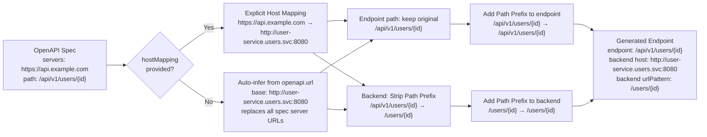
```mermaid
flowchart LR
    A["OpenAPI Spec<br/>servers: https://api.example.com<br/>path: /api/v1/users/{id}"] --> B{"hostMapping<br/>provided?"}
    B -->|Yes| B1["Explicit Host Mapping<br/>https://api.example.com →<br/>http://user-service.users.svc:8080"]
    B -->|No| B2["Auto-infer from openapi.url<br/>base: http://user-service.users.svc:8080<br/>replaces all spec server URLs"]
    B1 --> C_ep["Endpoint path: keep original<br/>/api/v1/users/{id}"]
    B2 --> C_ep
    B1 --> C_be["Backend: Strip Path Prefix<br/>/api/v1/users/{id} → /users/{id}"]
    B2 --> C_be
    C_ep --> D_ep["Add Path Prefix to endpoint<br/>/api/v1/users/{id} → /api/v1/users/{id}"]
    C_be --> D_be["Add Path Prefix to backend<br/>/users/{id} → /users/{id}"]
    D_ep --> E["Generated Endpoint<br/>endpoint: /api/v1/users/{id}<br/>backend host: http://user-service.users.svc:8080<br/>backend urlPattern: /users/{id}"]
    D_be --> E
```

**Host resolution:** When `urlTransform.hostMapping` is provided, each OpenAPI server URL is matched against the `from` values and replaced with the corresponding `to` value. When `hostMapping` is omitted, the operator extracts the base address (scheme + host + port) from `openapi.url` and uses it as the backend host for all generated endpoints, replacing any server URL in the spec. This is the common case — the service serving the OpenAPI spec is typically the same service that handles the API traffic. When `openapi.configMapRef` is used instead of `openapi.url`, `hostMapping` is required (there is no URL to infer from).

The **KrakenD endpoint path** (what clients call) uses the original OpenAPI path, optionally prefixed by `pathPrefix.add`. The **backend urlPattern** (what the backend receives) uses the transformed path after strip/add prefix operations. This separation allows the gateway to present a stable public API while internal routing adapts to service-internal paths.

### Generated Endpoint Naming Convention

Generated `KrakenDEndpoint` names follow the pattern:

```
{autoconfig-name}-{operationId}
```

If no `operationId` is present in the OpenAPI spec, the name is derived from:

```
{autoconfig-name}-{method}-{sanitized-path}
```

Where `sanitized-path` replaces `/` with `-`, removes leading dashes, and converts `{param}` to `param`. Example: `users-autoconfig-get-api-v1-users-id`.

All generated endpoints carry the label `gateway.krakend.io/auto-generated: "true"` and `gateway.krakend.io/autoconfig: {autoconfig-name}` for easy identification and querying.

### Interaction with Manual Endpoints

- Generated endpoints are standard `KrakenDEndpoint` resources and participate in the normal conflict detection pipeline (§5)
- If a manually-created `KrakenDEndpoint` conflicts with a generated one, the standard tie-breaking rules apply (older by `creationTimestamp` wins)
- Users can override generated endpoints by creating manual endpoints with the same method and route shape — the manual endpoint wins if it was created first
- To exclude specific operations from auto-generation, use the `filter.excludeOperationIds` or `filter.excludePaths` fields

### Runtime Model

The autoconfig controller runs as part of the main operator process (same binary, same Deployment). It watches `KrakenDAutoConfig` resources and reconciles them independently of the gateway controller. The controller:

- Uses a separate work queue keyed by `KrakenDAutoConfig` namespace/name
- Does NOT trigger gateway reconciliation directly — generated `KrakenDEndpoint` creates/updates trigger the normal endpoint controller watch, which in turn triggers the gateway reconciler
- Runs with the same RBAC permissions as the gateway controller (it creates `KrakenDEndpoint` resources, which requires `create/update/patch/delete` on `krakendendpoints`)

### SSRF Mitigation

The `openapi.url` field accepts arbitrary HTTP URLs, which introduces a server-side request forgery (SSRF) risk: the operator pod could be directed to fetch cluster-internal endpoints (Kubernetes API, cloud metadata services, etc.). Mitigations:

1. **URL scheme restriction** — the operator only allows `http://` and `https://` schemes; rejects `file://`, `ftp://`, etc.
2. **IP blocklist** — the operator always rejects URLs resolving to loopback addresses (`127.0.0.0/8`, `::1`), link-local addresses (`169.254.0.0/16`, `fe80::/10`), and IPv6 ULA addresses (`fc00::/7` — includes `fd00::/8` covering AWS `fd00:ec2::254`, GCP, and similar provider-assigned metadata endpoints; the `fc00::/8` half is reserved by RFC 4193 but blocked preventively). When `openapi.allowClusterLocal: false`, RFC 1918 private ranges (`10.0.0.0/8`, `172.16.0.0/12`, `192.168.0.0/16`) are also blocked. Resolved addresses MUST be normalized prior to CIDR matching: if an IPv6 address is an IPv4-mapped address (`::ffff:0:0/96`), it must be converted to its IPv4 form before applying the RFC 1918 rules. The default `allowClusterLocal: true` permits fetching from cluster-internal services (the primary use case). Cloud metadata endpoints (`169.254.169.254` and IPv6 equivalents) are always blocked regardless of this setting
3. **DNS resolution validation** — the operator resolves the hostname before making the request and applies the IP blocklist to the resolved address (prevents DNS rebinding)
4. **Redirect validation** — the operator applies the same IP blocklist to HTTP redirect `Location` headers before following them, preventing redirect-based SSRF bypasses. Maximum redirect depth: 5
5. **HTTP timeout** — all spec fetches use a configurable timeout (default: 30 seconds) to prevent resource exhaustion from slow endpoints
6. **RBAC gating** — `KrakenDAutoConfig` creation should be restricted via Kubernetes RBAC to trusted operators/CI systems, not arbitrary namespace users

### Duplicate operationId Handling

If an OpenAPI spec contains duplicate `operationId` values (technically invalid per the OpenAPI specification but common in practice), the autoconfig controller:

1. Uses the **first** occurrence and skips subsequent duplicates
2. Emits a `DuplicateOperationId` Warning event on the `KrakenDAutoConfig` resource
3. Increments the `status.skippedOperations` counter

### Events and Conditions

| Event | Type | Reason |
|---|---|---|
| OpenAPI spec fetched successfully | Normal | `SpecFetched` |
| OpenAPI spec fetch failed, including a failed external `$ref` fetch/decode | Warning | `SpecFetchFailed` |
| CUE evaluation failed | Warning | `CUEEvaluationFailed` |
| Override operationId not present in the OpenAPI spec (sync fails, last-good endpoints kept) | Warning | `UnmatchedOverride` |
| No base path could be derived for `additionalEndpoints` (sync fails) | Warning | `AdditionalEndpointScopeFailed` |
| Generated endpoints could not be created, updated or deleted (sync fails) | Warning | `EndpointReconcileFailed` |
| CUE evaluation warning (e.g. an operation skipped) | Warning | `CUEEvaluationWarning` |
| An `additionalEndpoints` entry replaced a spec-derived endpoint | Warning | `AdditionalEndpointOverride` |
| Endpoints generated/updated | Normal | `EndpointsGenerated` |
| Duplicate operationId in OpenAPI spec | Warning | `DuplicateOperationId` |

| Condition | Meaning |
|---|---|
| `SpecAvailable` | OpenAPI spec was fetched and parsed successfully |
| `Synced` | Generated endpoints are in sync with the latest spec |

---

## 17. Directory Structure

Go project layout following [Standard Go Project Layout](https://github.com/golang-standards/project-layout) conventions. The `operator/` directory is the Go module root; all Go imports, build commands, and `make` targets run from this directory.

```
.
├── architecture/                           # Architecture documentation (not part of Go module)
│   ├── README.md                           # Operator architecture (this document)
│   └── application/
│       └── application-architecture.md     # Application architecture
├── operator/                               # Go module root (all paths below are relative to here)
│   ├── api/
│   │   └── v1alpha1/
│   │       ├── krakendgateway_types.go        # KrakenDGateway CRD types
│   │       ├── krakendendpoint_types.go        # KrakenDEndpoint CRD types
│   │       ├── krakendbackendpolicy_types.go   # KrakenDBackendPolicy CRD types
│   │       ├── krakendautoconfig_types.go      # KrakenDAutoConfig CRD types
│   │       ├── groupversion_info.go            # API group registration
│   │       └── zz_generated.deepcopy.go        # Generated deep copy methods
│   ├── cmd/
│   │   └── main.go                             # Entrypoint
│   ├── internal/
│   │   ├── controller/
│   │   │   ├── krakendgateway_controller.go    # KrakenDGateway reconciler (config and infrastructure stages)
│   │   │   ├── krakendendpoint_controller.go   # KrakenDEndpoint reconciler
│   │   │   ├── krakendbackendpolicy_controller.go # KrakenDBackendPolicy reconciler
│   │   │   ├── krakendautoconfig_controller.go # KrakenDAutoConfig reconciler (OpenAPI watcher)
│   │   │   ├── gateway_config.go               # Config stage: publish, GC and attribute config ConfigMaps
│   │   │   ├── gateway_events.go               # Events on condition transitions
│   │   │   ├── gateway_optional.go             # Optional kinds (Dragonfly, ExternalSecret, VirtualService)
│   │   │   ├── rejection_memo.go               # Remembered rejected render per gateway
│   │   │   └── gateway_license.go              # License evaluation inside the gateway reconcile
│   │   ├── autoconfig/
│   │   │   ├── fetcher.go                      # OpenAPI spec fetcher (HTTP + ConfigMap sources)
│   │   │   ├── cue_evaluator.go                # CUE evaluation engine (cuelang.org/go/cue)
│   │   │   ├── filter.go                       # Include/exclude filter engine
│   │   │   └── generator.go                    # EndpointEntry → KrakenDEndpoint CRD renderer
│   │   ├── renderer/
│   │   │   ├── config.go                       # KrakenD JSON config builder
│   │   │   ├── endpoints.go                    # Endpoint array builder
│   │   │   ├── extra_config.go                 # extra_config namespace builder
│   │   │   ├── plugins.go                      # Plugin volume + krakend.json plugin block builder
│   │   │   ├── attribution.go                  # Attributes krakend check findings to KrakenDEndpoints
│   │   │   ├── eestrip.go                      # Enterprise-only features stripped on CE fallback
│   │   │   ├── eewildcard.go                   # EE wildcard route rules used when validating
│   │   │   └── validator.go                    # krakend check -t -n -c wrapper
│   │   ├── resources/
│   │   │   ├── deployment.go                   # Deployment builder (includes plugin volume assembly)
│   │   │   ├── service.go                      # Service builder
│   │   │   ├── configmap.go                    # Content-addressed config ConfigMap builder
│   │   │   ├── serviceaccount.go               # ServiceAccount builder
│   │   │   ├── pdb.go                          # PodDisruptionBudget builder
│   │   │   ├── hpa.go                          # HorizontalPodAutoscaler builder
│   │   │   ├── dragonfly.go                    # Dragonfly CR builder (dragonflydb.io/v1alpha1)
│   │   │   ├── virtualservice.go               # Istio VirtualService builder
│   │   │   └── externalsecret.go               # ExternalSecret builder
│   │   ├── webhook/
│   │   │   └── validation.go                   # ValidatingAdmissionWebhook handlers
│   │   └── util/
│   │       ├── hash/
│   │       │   └── hash.go                     # SHA-256 config checksumming
│   │       └── license/
│   │           ├── license.go                  # X.509 license parsing
│   │           └── window.go                   # License stages (StageAt, NextChange)
│   ├── config/
│   │   ├── crd/
│   │   │   └── bases/                          # Generated CRD YAML manifests
│   │   ├── cue/
│   │   │   └── defaults/                       # Default CUE transformation definitions (deployed as ConfigMap by Helm)
│   │   │       ├── endpoints.cue               # Core transformation: OpenAPI paths → KrakenDEndpointSpec CRDs
│   │   │       ├── schema.cue                  # KrakenDEndpointSpec output schema constraints
│   │   │       └── defaults.cue                # Default rate limits, headers, timeouts, policyRef, extraConfig
│   │   ├── rbac/                               # RBAC manifests
│   │   ├── webhook/                            # Webhook manifests (ValidatingWebhookConfiguration)
│   │   ├── manager/                            # Operator Deployment manifests
│   │   └── samples/                            # Example CR YAML files
│   ├── test/
│   │   └── e2e/                                # End-to-end tests
│   ├── go.mod
│   ├── go.sum
│   ├── Makefile
│   ├── Dockerfile
│   └── PROJECT                                 # operator-sdk project metadata
└── .github/                                # CI, linting, and AI development instructions
```
