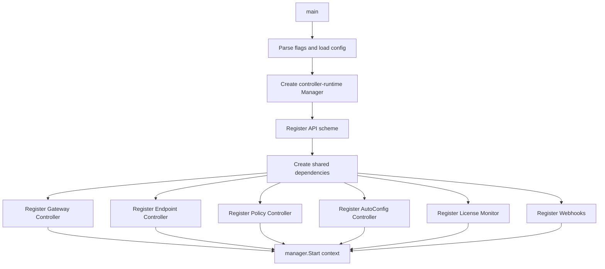
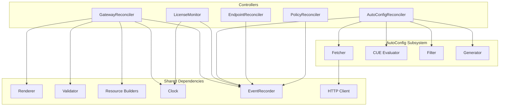
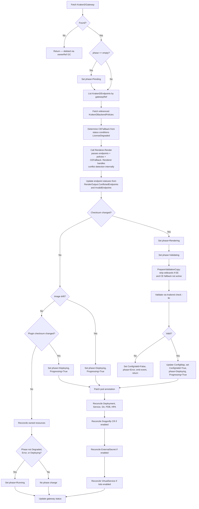
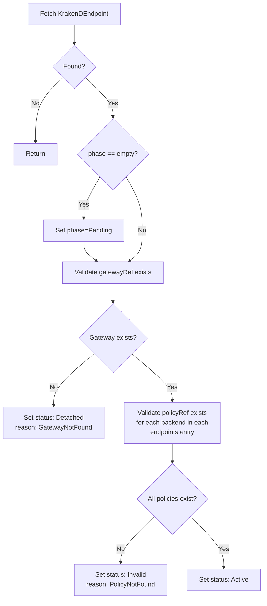
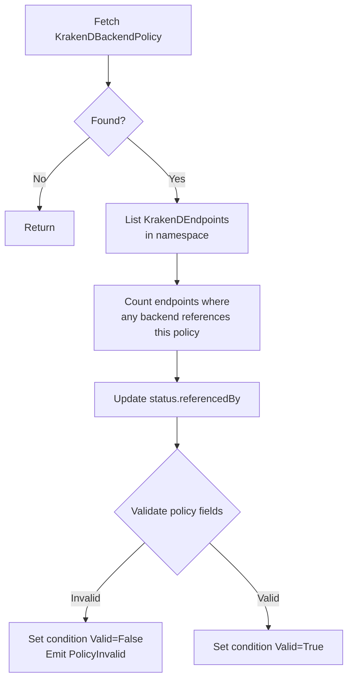
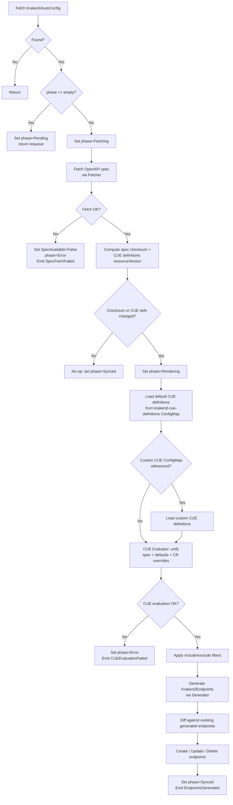
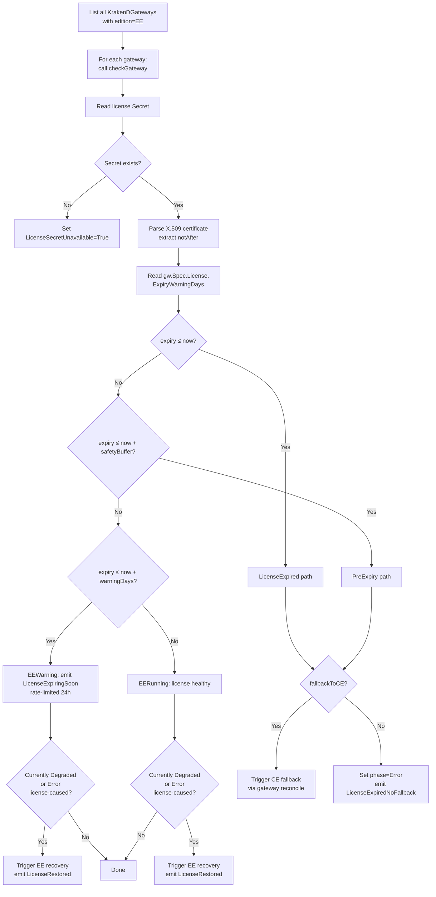
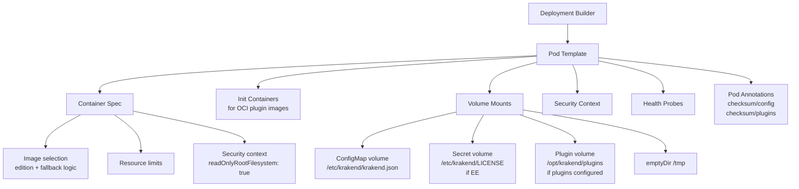
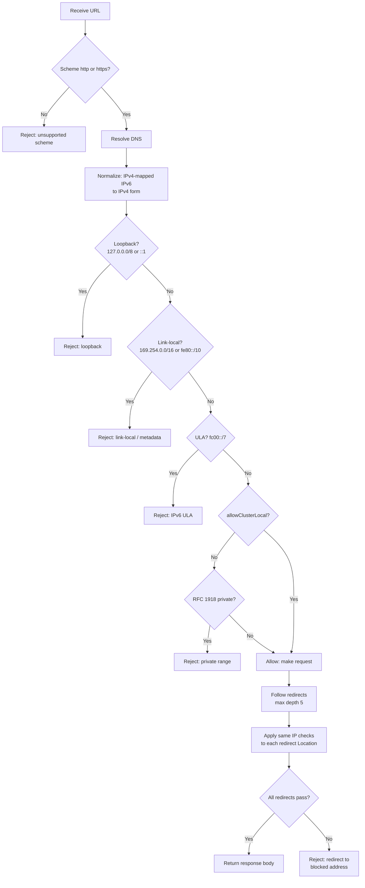
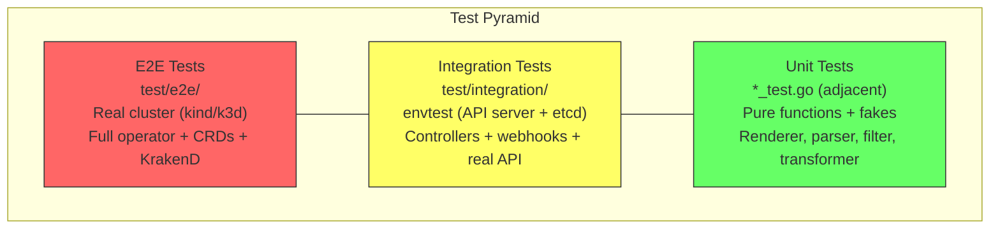

# KrakenD Operator — Application Architecture

> **Version:** 0.1.0-draft
> **Date:** 2026-04-03
> **Status:** Proposal
> **Language:** Go 1.26+
> **Framework:** controller-runtime v0.19+, Kubebuilder v4

This document describes the Go application architecture for the KrakenD Operator. It specifies package structure, interfaces, type hierarchies, reconciliation logic, and testing strategy at the implementation level. Every system, controller, status condition, event, and webhook rule described in the [operator architecture](../operator-architecture.md) is mapped to concrete Go code.

> **Source Root:** All file paths in this document are relative to the `operator/` directory, which is the Go module root. The repository root contains `operator/`, `architecture/`, and `.github/` at the top level.

---

## Table of Contents

1. [Design Principles](#1-design-principles)
2. [Entrypoint](#2-entrypoint)
3. [API Types](#3-api-types)
4. [Controller Architecture](#4-controller-architecture)
5. [Gateway Controller](#5-gateway-controller)
6. [Endpoint Controller](#6-endpoint-controller)
7. [Policy Controller](#7-policy-controller)
8. [AutoConfig Controller](#8-autoconfig-controller)
9. [License Monitor](#9-license-monitor)
10. [Configuration Rendering Pipeline](#10-configuration-rendering-pipeline)
11. [Resource Builders](#11-resource-builders)
12. [Webhook Validation](#12-webhook-validation)
13. [AutoConfig Subsystem](#13-autoconfig-subsystem)
14. [Utility Packages](#14-utility-packages)
15. [Dependency Injection and Interfaces](#15-dependency-injection-and-interfaces)
16. [Error Handling Strategy](#16-error-handling-strategy)
17. [Metrics Implementation](#17-metrics-implementation)
18. [Testing Strategy](#18-testing-strategy)
19. [Build and Packaging](#19-build-and-packaging)

---

## 1. Design Principles

These principles govern all application code. They complement the Go coding standards in `.github/instructions/go.instructions.md`.

| Principle | Application |
|---|---|
| Accept interfaces, return concrete types | All external dependencies (Kubernetes client, HTTP client, command executor, clock) are injected as interfaces. Constructors return concrete structs. |
| Composition over inheritance | Controllers compose renderer, resource builders, and utility packages — no embedded controller base types. |
| Single responsibility | Each package owns one concern: `renderer` builds JSON, `resources` builds Kubernetes objects, `autoconfig` evaluates CUE definitions against OpenAPI specs to produce `KrakenDEndpointSpec` CRDs. |
| Deterministic output | The rendering pipeline produces byte-identical JSON for identical CRD state. Maps are serialized with sorted keys, slices are sorted by defined criteria. |
| Fail fast at boundaries | Webhook validation rejects invalid CRs before they reach etcd. Controllers validate preconditions at the top of `Reconcile()` before mutating cluster state. |
| No global state | No `init()` functions except for scheme registration (standard Kubebuilder convention). All other state is owned by structs wired in `main.go`. |
| Testable by default | Every function that performs I/O accepts an interface parameter. Integration tests use envtest; unit tests use fakes and mocks. |

---

## 2. Entrypoint

**File:** `cmd/main.go`

The entrypoint is responsible for wiring dependencies, registering controllers with the manager, and starting the controller-runtime manager. It contains no business logic.



### Manager Configuration

```go
mgr, err := ctrl.NewManager(ctrl.GetConfigOrDie(), ctrl.Options{
    Scheme:                  scheme,
    Metrics:                 metricsserver.Options{BindAddress: metricsAddr},
    HealthProbeBindAddress:  probeAddr,
    LeaderElection:          true,
    LeaderElectionID:        "krakend-operator-leader",
    LeaderElectionNamespace: leaderElectionNamespace,
})
```

### Shared Dependency Wiring

All controllers receive their dependencies via struct fields set in `main.go`. There is no service locator or dependency injection container.

```go
clock := utilclock.RealClock{}
recorder := mgr.GetEventRecorderFor("krakend-operator")
httpClient := buildSafeHTTPClient()

fetcher := autoconfig.NewHTTPFetcher(httpClient)
cueEval := autoconfig.NewCUEEvaluator()
filter := autoconfig.NewFilter()
generator := autoconfig.NewGenerator()

rend := renderer.New(renderer.Options{})
val := renderer.NewValidator(renderer.ValidatorOptions{
    Executor:   renderer.NewKrakenDExecutor("/usr/local/bin/krakend"),
    BinaryPath: "/usr/local/bin/krakend",
})

gatewayCtrl := &controller.GatewayReconciler{
    Client:    mgr.GetClient(),
    Scheme:    mgr.GetScheme(),
    Recorder:  recorder,
    Renderer:  rend,
    Validator: val,
    Clock:     clock,
}

autoconfigCtrl := &controller.AutoConfigReconciler{
    Client:       mgr.GetClient(),
    Scheme:       mgr.GetScheme(),
    Recorder:     recorder,
    Fetcher:      fetcher,
    CUEEvaluator: cueEval,
    Filter:       filter,
    Generator:    generator,
    Clock:        clock,
}

policyCtrl := &controller.PolicyReconciler{
    Client:   mgr.GetClient(),
    Scheme:   mgr.GetScheme(),
    Recorder: recorder,
}

endpointCtrl := &controller.EndpointReconciler{
    Client:   mgr.GetClient(),
    Scheme:   mgr.GetScheme(),
    Recorder: recorder,
}

licenseMonitor := &controller.LicenseMonitor{
    Client:        mgr.GetClient(),
    Recorder:      recorder,
    LicenseParser: util.NewX509LicenseParser(),
    Clock:         clock,
    CheckInterval: 5 * time.Minute,  // operator architecture §9
    SafetyBuffer:  1 * time.Hour,    // pre-expiry safety window
}
// Register all controllers
for _, ctrl := range []interface{ SetupWithManager(ctrl.Manager) error }{
    gatewayCtrl, endpointCtrl, policyCtrl, autoconfigCtrl,
} {
    if err := ctrl.SetupWithManager(mgr); err != nil {
        setupLog.Error(err, "unable to create controller")
        os.Exit(1)
    }
}
// Register license monitor as a Runnable (not a standard controller)
if err := mgr.Add(licenseMonitor); err != nil {
    setupLog.Error(err, "unable to register license monitor")
    os.Exit(1)
}
```

### Scheme Registration

```go
import (
    gatewayv1alpha1 "github.com/mycarrier-devops/krakend-operator/api/v1alpha1"
    dragonflyv1alpha1 "github.com/dragonflydb/dragonfly-operator/api/v1alpha1"
    esv1 "github.com/external-secrets/external-secrets/apis/externalsecrets/v1"
    istiov1 "istio.io/client-go/pkg/apis/networking/v1"
)

func init() {
    utilruntime.Must(gatewayv1alpha1.AddToScheme(scheme))
    utilruntime.Must(dragonflyv1alpha1.AddToScheme(scheme))
    utilruntime.Must(esv1.AddToScheme(scheme))
    utilruntime.Must(istiov1.AddToScheme(scheme))
}
```

> **Note on `init()`:** Scheme registration in `init()` is the standard Kubebuilder convention and is the only accepted use of `init()` in this project. It registers types with the runtime scheme before `main()` executes. All other initialization happens explicitly in `main()`.

---

## 3. API Types

**Package:** `api/v1alpha1/`
**API Group:** `gateway.krakend.io/v1alpha1`

### Type Files

| File | CRD | Root Type |
|---|---|---|
| `krakendgateway_types.go` | KrakenDGateway | `KrakenDGatewaySpec`, `KrakenDGatewayStatus` |
| `krakendendpoint_types.go` | KrakenDEndpoint | `KrakenDEndpointSpec`, `KrakenDEndpointStatus` |
| `krakendbackendpolicy_types.go` | KrakenDBackendPolicy | `KrakenDBackendPolicySpec`, `KrakenDBackendPolicyStatus` |
| `krakendautoconfig_types.go` | KrakenDAutoConfig | `KrakenDAutoConfigSpec`, `KrakenDAutoConfigStatus` |
| `groupversion_info.go` | — | `SchemeBuilder`, `GroupVersion` |
| `zz_generated.deepcopy.go` | — | Generated `DeepCopyObject()` implementations |

### KrakenDGateway Type Hierarchy

```go
type KrakenDGateway struct {
    metav1.TypeMeta   `json:",inline"`
    metav1.ObjectMeta `json:"metadata,omitempty"`
    Spec              KrakenDGatewaySpec   `json:"spec"`
    Status            KrakenDGatewayStatus `json:"status,omitempty"`
}

type KrakenDGatewaySpec struct {
    Version     string         `json:"version"`
    Edition     Edition        `json:"edition"`               // "CE" or "EE"
    Image       string         `json:"image,omitempty"`        // EE image override
    CEImage     string         `json:"ceImage,omitempty"`      // CE fallback image override
    Replicas    *int32         `json:"replicas,omitempty"`
    Autoscaling *AutoscalingSpec `json:"autoscaling,omitempty"`
    Config      GatewayConfig  `json:"config"`
    TLS         *TLSSpec       `json:"tls,omitempty"`
    License     *LicenseConfig `json:"license,omitempty"`
    Dragonfly   *DragonflySpec `json:"dragonfly,omitempty"`
    Redis       *RedisSpec     `json:"redis,omitempty"`
    Istio       *IstioSpec     `json:"istio,omitempty"`
    Plugins     *PluginsSpec   `json:"plugins,omitempty"`
    Resources   *corev1.ResourceRequirements `json:"resources,omitempty"`
}
```

### Edition Type

```go
// +kubebuilder:validation:Enum=CE;EE
type Edition string

const (
    EditionCE Edition = "CE"
    EditionEE Edition = "EE"
)
```

### Nested Spec Types

Types referenced by `KrakenDGatewaySpec`:

```go
type GatewayConfig struct {
    Port           int32                 `json:"port,omitempty"`           // default 8080
    Timeout        string                `json:"timeout,omitempty"`        // e.g. "3s"
    CacheTTL       string                `json:"cacheTTL,omitempty"`
    OutputEncoding string                `json:"outputEncoding,omitempty"` // json, negotiate, no-op
    DNSCacheTTL    string                `json:"dnsCacheTTL,omitempty"`
    CORS           *CORSConfig           `json:"cors,omitempty"`
    Security       *SecurityConfig       `json:"security,omitempty"`
    Logging        *LoggingConfig        `json:"logging,omitempty"`
    Router         *RouterConfig         `json:"router,omitempty"`
    Telemetry      *TelemetryConfig      `json:"telemetry,omitempty"`
    ExtraConfig    *runtime.RawExtension `json:"extraConfig,omitempty"` // gateway-level extra_config
}

type RouterConfig struct {
    ReturnErrorMsg  bool   `json:"returnErrorMsg,omitempty"`
    HealthPath      string `json:"healthPath,omitempty"` // default "/health"
    AutoOptions     bool   `json:"autoOptions,omitempty"`
    DisableAccessLog bool  `json:"disableAccessLog,omitempty"`
}

// CORSConfig, SecurityConfig, LoggingConfig, TelemetryConfig follow the same pattern.
// Their fields map 1:1 to operator architecture §3.1. Only RouterConfig is shown in full
// here because it is referenced by resource builders (health probes use router.healthPath).

type AutoscalingSpec struct {
    MinReplicas *int32 `json:"minReplicas,omitempty"`
    MaxReplicas int32  `json:"maxReplicas"`
    TargetCPU   *int32 `json:"targetCPUUtilizationPercentage,omitempty"`
}

type TLSSpec struct {
    Enabled    bool   `json:"enabled,omitempty"`
    PublicKey  string `json:"publicKey,omitempty"`  // path to cert PEM
    PrivateKey string `json:"privateKey,omitempty"` // path to key PEM
    MinVersion string `json:"minVersion,omitempty"` // e.g. "TLS13"
}

type LicenseConfig struct {
    ExternalSecret    ExternalSecretLicenseConfig `json:"externalSecret,omitempty"`
    SecretRef         *corev1.SecretKeySelector   `json:"secretRef,omitempty"`
    FallbackToCE      bool                        `json:"fallbackToCE,omitempty"`
    ExpiryWarningDays int                         `json:"expiryWarningDays,omitempty"` // default 30
}

type ExternalSecretLicenseConfig struct {
    Enabled        bool              `json:"enabled,omitempty"`
    SecretStoreRef SecretStoreRef    `json:"secretStoreRef,omitempty"`
    RemoteRef      ExternalRemoteRef `json:"remoteRef,omitempty"`
}

type SecretStoreRef struct {
    Name string `json:"name"`
    Kind string `json:"kind,omitempty"` // SecretStore or ClusterSecretStore
}

type ExternalRemoteRef struct {
    Key      string `json:"key"`
    Property string `json:"property,omitempty"`
}

type DragonflySpec struct {
    Enabled        bool                                        `json:"enabled"`
    Image          string                                      `json:"image,omitempty"`
    Replicas       *int32                                      `json:"replicas,omitempty"`
    Resources      *corev1.ResourceRequirements                `json:"resources,omitempty"`
    Snapshot       *DragonflySnapshotSpec                      `json:"snapshot,omitempty"`
    Args           []string                                    `json:"args,omitempty"`
    Authentication *DragonflyAuthSpec                          `json:"authentication,omitempty"`
}

type DragonflySnapshotSpec struct {
    Cron                      string                                     `json:"cron,omitempty"`
    PersistentVolumeClaimSpec *corev1.PersistentVolumeClaimSpec          `json:"persistentVolumeClaimSpec,omitempty"`
}

type DragonflyAuthSpec struct {
    PasswordFromSecret *corev1.SecretKeySelector `json:"passwordFromSecret,omitempty"`
}

type RedisSpec struct {
    ConnectionPool RedisConnectionPool `json:"connectionPool"`
}

type RedisConnectionPool struct {
    Addresses    []string                  `json:"addresses"`
    Password     *corev1.SecretKeySelector `json:"password,omitempty"`
    PoolSize     int                       `json:"poolSize,omitempty"`
    MinIdleConns int                       `json:"minIdleConns,omitempty"`
    DialTimeout  string                    `json:"dialTimeout,omitempty"`
    ReadTimeout  string                    `json:"readTimeout,omitempty"`
    WriteTimeout string                    `json:"writeTimeout,omitempty"`
    TLS          *RedisTLSConfig           `json:"tls,omitempty"`
}

type RedisTLSConfig struct {
    Enabled    bool   `json:"enabled,omitempty"`
    SecretName string `json:"secretName,omitempty"`
}

type IstioSpec struct {
    Enabled  bool     `json:"enabled"`
    Hosts    []string `json:"hosts,omitempty"`
    Gateways []string `json:"gateways,omitempty"`
}

type PluginsSpec struct {
    Sources []PluginSource `json:"sources"`
}

type PluginSource struct {
    ImageRef                 *OCIImageRef                               `json:"imageRef,omitempty"`
    ConfigMapRef             *ConfigMapKeyRef                           `json:"configMapRef,omitempty"`
    PersistentVolumeClaimRef *corev1.PersistentVolumeClaimVolumeSource  `json:"persistentVolumeClaimRef,omitempty"`
}

type OCIImageRef struct {
    Image            string                          `json:"image"`
    PullPolicy       corev1.PullPolicy               `json:"pullPolicy,omitempty"`
    ImagePullSecrets []corev1.LocalObjectReference    `json:"imagePullSecrets,omitempty"`
}
```

Types referenced by `KrakenDBackendPolicySpec`:

```go
type CircuitBreakerSpec struct {
    Interval        int  `json:"interval"`
    Timeout         int  `json:"timeout"`
    MaxErrors       int  `json:"maxErrors"`
    LogStatusChange bool `json:"logStatusChange,omitempty"`
}

type RateLimitSpec struct {
    MaxRate  int `json:"maxRate"`
    Capacity int `json:"capacity,omitempty"`
}

type CacheSpec struct {
    Shared bool `json:"shared,omitempty"`
}
```

Types referenced by `KrakenDAutoConfigSpec`:

```go
type OpenAPISource struct {
    URL               string           `json:"url,omitempty"`
    ConfigMapRef      *ConfigMapKeyRef `json:"configMapRef,omitempty"`
    Auth              *AuthConfig      `json:"auth,omitempty"`
    AllowClusterLocal bool             `json:"allowClusterLocal,omitempty"`
    Format            SpecFormat       `json:"format,omitempty"` // json, yaml; auto-detected if omitted
}

// +kubebuilder:validation:Enum=json;yaml
type SpecFormat string

const (
    SpecFormatJSON SpecFormat = "json"
    SpecFormatYAML SpecFormat = "yaml"
)

type AuthConfig struct {
    BearerTokenSecret *corev1.SecretKeySelector `json:"bearerTokenSecret,omitempty"`
    BasicAuthSecret   *BasicAuthSecretRef       `json:"basicAuthSecret,omitempty"`
}

type BasicAuthSecretRef struct {
    Name        string `json:"name"`
    UsernameKey string `json:"usernameKey,omitempty"` // default "username"
    PasswordKey string `json:"passwordKey,omitempty"` // default "password"
}

type URLTransformSpec struct {
    HostMapping     []HostMappingEntry `json:"hostMapping,omitempty"`
    StripPathPrefix string             `json:"stripPathPrefix,omitempty"`
    AddPathPrefix   string             `json:"addPathPrefix,omitempty"`
}

type HostMappingEntry struct {
    From string `json:"from"`
    To   string `json:"to"`
}

type EndpointDefaults struct {
    Timeout           *metav1.Duration `json:"timeout,omitempty"`
    CacheTTL          *metav1.Duration `json:"cacheTTL,omitempty"`
    OutputEncoding    string           `json:"outputEncoding,omitempty"`
    ConcurrentCalls   *int32           `json:"concurrentCalls,omitempty"`
    InputHeaders      []string         `json:"inputHeaders,omitempty"`
    InputQueryStrings []string         `json:"inputQueryStrings,omitempty"`
    PolicyRef         *PolicyRef       `json:"policyRef,omitempty"`
}

type OperationOverride struct {
    OperationID string                `json:"operationId"`
    Endpoint    string                `json:"endpoint,omitempty"`
    Method      string                `json:"method,omitempty"`
    Timeout     *metav1.Duration      `json:"timeout,omitempty"`
    CacheTTL    *metav1.Duration      `json:"cacheTTL,omitempty"`
    PolicyRef   *PolicyRef            `json:"policyRef,omitempty"`
    ExtraConfig *runtime.RawExtension `json:"extraConfig,omitempty"`
    Backends    []BackendOverride     `json:"backends,omitempty"`
}

type BackendOverride struct {
    Index       int                   `json:"index"` // 0-based backend index
    ExtraConfig *runtime.RawExtension `json:"extraConfig,omitempty"`
}

type FilterSpec struct {
    IncludePaths        []string `json:"includePaths,omitempty"`
    ExcludePaths        []string `json:"excludePaths,omitempty"`
    IncludeMethods      []string `json:"includeMethods,omitempty"`
    ExcludeOperationIds []string `json:"excludeOperationIds,omitempty"`
    IncludeTags         []string `json:"includeTags,omitempty"`
    ExcludeTags         []string `json:"excludeTags,omitempty"`
}

// +kubebuilder:validation:Enum=OnChange;Periodic
type TriggerType string

const (
    TriggerOnChange TriggerType = "OnChange"
    TriggerPeriodic TriggerType = "Periodic"
)

type PeriodicSpec struct {
    Interval metav1.Duration `json:"interval"`
}
```

### Status Types

Status types use Kubernetes `metav1.Condition` for all conditions described in the operator architecture §15:

```go
type KrakenDGatewayStatus struct {
    Phase              GatewayPhase       `json:"phase,omitempty"`
    ConfigChecksum     string             `json:"configChecksum,omitempty"`
    ObservedGeneration int64              `json:"observedGeneration,omitempty"`
    Conditions         []metav1.Condition `json:"conditions,omitempty"`
    Replicas           int32              `json:"replicas,omitempty"`
    ReadyReplicas      int32              `json:"readyReplicas,omitempty"`
    LicenseExpiry      *metav1.Time       `json:"licenseExpiry,omitempty"`
    ActiveImage        string             `json:"activeImage,omitempty"`
    EndpointCount      int32              `json:"endpointCount,omitempty"`
    DragonflyAddress   string             `json:"dragonflyAddress,omitempty"`
}

// +kubebuilder:validation:Enum=Pending;Rendering;Validating;Deploying;Running;Degraded;Error
type GatewayPhase string

const (
    PhasePending    GatewayPhase = "Pending"
    PhaseRendering  GatewayPhase = "Rendering"
    PhaseValidating GatewayPhase = "Validating"
    PhaseDeploying  GatewayPhase = "Deploying"
    PhaseRunning    GatewayPhase = "Running"
    PhaseDegraded   GatewayPhase = "Degraded"
    PhaseError      GatewayPhase = "Error"
)

// +kubebuilder:validation:Enum=Pending;Active;Invalid;Conflicted;Detached
type EndpointPhase string

const (
    EndpointPhasePending    EndpointPhase = "Pending"
    EndpointPhaseActive     EndpointPhase = "Active"
    EndpointPhaseInvalid    EndpointPhase = "Invalid"
    EndpointPhaseConflicted EndpointPhase = "Conflicted"
    EndpointPhaseDetached   EndpointPhase = "Detached"
)

// +kubebuilder:validation:Enum=Pending;Fetching;Rendering;Synced;Error
type AutoConfigPhase string

const (
    AutoConfigPhasePending   AutoConfigPhase = "Pending"
    AutoConfigPhaseFetching  AutoConfigPhase = "Fetching"
    AutoConfigPhaseRendering AutoConfigPhase = "Rendering"
    AutoConfigPhaseSynced    AutoConfigPhase = "Synced"
    AutoConfigPhaseError     AutoConfigPhase = "Error"
)
```

### Condition Types (Constants)

```go
const (
    ConditionConfigValid              = "ConfigValid"
    ConditionAvailable                = "Available"
    ConditionLicenseValid             = "LicenseValid"
    ConditionLicenseDegraded          = "LicenseDegraded"
    ConditionDragonflyReady           = "DragonflyReady"
    ConditionIstioConfigured          = "IstioConfigured"
    ConditionLicenseSecretUnavailable = "LicenseSecretUnavailable"
    ConditionLicenseExpired           = "LicenseExpired"
    ConditionProgressing              = "Progressing"
    ConditionSpecAvailable            = "SpecAvailable"
    ConditionSynced                   = "Synced"
)
```

### Event Reason Constants

```go
const (
    ReasonConfigDeployed          = "ConfigDeployed"
    ReasonConfigValidationFailed  = "ConfigValidationFailed"
    ReasonLicenseExpiringSoon     = "LicenseExpiringSoon"
    ReasonLicenseFallbackCE       = "LicenseFallbackCE"
    ReasonLicenseExpiredNoFallback = "LicenseExpiredNoFallback"
    ReasonLicenseRestored         = "LicenseRestored"
    ReasonDragonflyNotReady       = "DragonflyNotReady"
    ReasonIstioVSCreated          = "IstioVirtualServiceCreated"
    ReasonEndpointConflict        = "EndpointConflict"
    ReasonLicenseSecretSyncFailed = "LicenseSecretSyncFailed"
    ReasonLicenseSecretMissing    = "LicenseSecretMissing"
    ReasonSpecFetched             = "SpecFetched"
    ReasonSpecFetchFailed         = "SpecFetchFailed"
    ReasonEndpointsGenerated      = "EndpointsGenerated"
    ReasonOperationFiltered       = "OperationFiltered"
    ReasonMissingOperationId      = "MissingOperationId"
    ReasonDuplicateOperationId    = "DuplicateOperationId"
    ReasonRolloutFailed           = "RolloutFailed"
    ReasonCUEEvaluationFailed     = "CUEEvaluationFailed"
)
```

### KrakenDEndpoint Type

```go
type KrakenDEndpointSpec struct {
    GatewayRef GatewayRef     `json:"gatewayRef"`
    Endpoints  []EndpointEntry `json:"endpoints"`
}

type EndpointEntry struct {
    Endpoint     string                  `json:"endpoint"`
    Method       string                  `json:"method"`
    Backends     []BackendSpec           `json:"backends"`
    Timeout      *metav1.Duration        `json:"timeout,omitempty"`
    CacheTTL     *metav1.Duration        `json:"cacheTTL,omitempty"`
    InputHeaders []string                `json:"inputHeaders,omitempty"`
    InputQueryStrings []string           `json:"inputQueryStrings,omitempty"`
    OutputEncoding    string             `json:"outputEncoding,omitempty"`
    ConcurrentCalls   *int32             `json:"concurrentCalls,omitempty"`
    ExtraConfig  *runtime.RawExtension   `json:"extraConfig,omitempty"`
}

type KrakenDEndpointStatus struct {
    Phase              EndpointPhase      `json:"phase,omitempty"`
    ObservedGeneration int64              `json:"observedGeneration,omitempty"`
    EndpointCount      int32              `json:"endpointCount,omitempty"`
    Conditions         []metav1.Condition `json:"conditions,omitempty"`
}
```

### KrakenDBackendPolicy Type

```go
type KrakenDBackendPolicySpec struct {
    CircuitBreaker *CircuitBreakerSpec   `json:"circuitBreaker,omitempty"`
    RateLimit      *RateLimitSpec        `json:"rateLimit,omitempty"`
    Cache          *CacheSpec            `json:"cache,omitempty"`
    Raw            *runtime.RawExtension `json:"raw,omitempty"`
}

type KrakenDBackendPolicyStatus struct {
    ReferencedBy int                `json:"referencedBy,omitempty"`
    Conditions   []metav1.Condition `json:"conditions,omitempty"`
}
```

### KrakenDAutoConfig Type

```go
type KrakenDAutoConfigSpec struct {
    GatewayRef   GatewayRef          `json:"gatewayRef"`
    OpenAPI      OpenAPISource       `json:"openapi"`
    CUE          *CUESpec            `json:"cue,omitempty"`
    URLTransform *URLTransformSpec   `json:"urlTransform,omitempty"`
    Defaults     *EndpointDefaults   `json:"defaults,omitempty"`
    Overrides    []OperationOverride `json:"overrides,omitempty"`
    Filter       *FilterSpec         `json:"filter,omitempty"`
    Trigger      TriggerType         `json:"trigger"`
    Periodic     *PeriodicSpec       `json:"periodic,omitempty"`
}

type CUESpec struct {
    // Optional: custom CUE definitions ConfigMap. When omitted, only the operator's
    // default CUE definitions are used. When provided, custom definitions are unified
    // with defaults (CUE unification, not replacement).
    DefinitionsConfigMapRef *ConfigMapKeyRef `json:"definitionsConfigMapRef,omitempty"`
    // Environment value injected into CUE evaluation via FillPath("_env", ...).
    // Controls per-environment host resolution and other env-specific CUE branches.
    Environment string `json:"environment,omitempty"`
}

type KrakenDAutoConfigStatus struct {
    Phase              AutoConfigPhase    `json:"phase,omitempty"`
    LastSyncTime       *metav1.Time       `json:"lastSyncTime,omitempty"`
    SpecChecksum       string             `json:"specChecksum,omitempty"`
    GeneratedEndpoints int                `json:"generatedEndpoints,omitempty"`
    SkippedOperations  int                `json:"skippedOperations,omitempty"`
    Conditions         []metav1.Condition `json:"conditions,omitempty"`
}
```

### Shared Reference Types

```go
type GatewayRef struct {
    Name      string `json:"name"`
    Namespace string `json:"namespace,omitempty"` // defaults to referencing resource's namespace
}

type PolicyRef struct {
    Name      string `json:"name"`
    Namespace string `json:"namespace,omitempty"` // defaults to referencing resource's namespace
}

type ConfigMapKeyRef struct {
    Name string `json:"name"`
    Key  string `json:"key,omitempty"`
}

type BackendSpec struct {
    Host        []string              `json:"host"`
    URLPattern  string                `json:"urlPattern"`
    Method      string                `json:"method,omitempty"`
    Encoding    string                `json:"encoding,omitempty"`
    Allow       []string              `json:"allow,omitempty"`
    Mapping     map[string]string     `json:"mapping,omitempty"`
    PolicyRef   *PolicyRef            `json:"policyRef,omitempty"`
    ExtraConfig *runtime.RawExtension `json:"extraConfig,omitempty"`
}
```

### Kubebuilder Markers

CRD generation markers are placed on the root types:

```go
// +kubebuilder:object:root=true
// +kubebuilder:subresource:status
// +kubebuilder:resource:shortName=kgw
// +kubebuilder:printcolumn:name="Edition",type=string,JSONPath=`.spec.edition`
// +kubebuilder:printcolumn:name="Version",type=string,JSONPath=`.spec.version`
// +kubebuilder:printcolumn:name="Phase",type=string,JSONPath=`.status.phase`
// +kubebuilder:printcolumn:name="Age",type=date,JSONPath=`.metadata.creationTimestamp`
type KrakenDGateway struct { ... }
```

---

## 4. Controller Architecture

**Package:** `internal/controller/`

All controllers implement the `reconcile.Reconciler` interface from controller-runtime:

```go
type Reconciler interface {
    Reconcile(ctx context.Context, req ctrl.Request) (ctrl.Result, error)
}
```

### Controller Registration Pattern

Each controller exposes a `SetupWithManager` method that configures watches:

```go
func (r *GatewayReconciler) SetupWithManager(mgr ctrl.Manager) error {
    return ctrl.NewControllerManagedBy(mgr).
        For(&v1alpha1.KrakenDGateway{}).
        Owns(&appsv1.Deployment{}).
        Owns(&corev1.Service{}).
        Owns(&corev1.ConfigMap{}).
        Owns(&corev1.ServiceAccount{}).
        Owns(&policyv1.PodDisruptionBudget{}).
        Owns(&autoscalingv2.HorizontalPodAutoscaler{}).
        Owns(&dragonflyv1alpha1.Dragonfly{}).
        Owns(&esv1.ExternalSecret{}).
        Owns(&istiov1.VirtualService{}).
        Watches(
            &v1alpha1.KrakenDEndpoint{},
            handler.EnqueueRequestsFromMapFunc(r.endpointToGateway),
        ).
        Watches(
            &v1alpha1.KrakenDBackendPolicy{},
            handler.EnqueueRequestsFromMapFunc(r.policyToGateways),
        ).
        Watches(
            &corev1.Secret{},
            handler.EnqueueRequestsFromMapFunc(r.licenseSecretToGateway),
        ).
        Complete(r)
}
```

### Controller–Dependency Map



---

## 5. Gateway Controller

**File:** `internal/controller/gateway_controller.go`

The gateway controller is the primary reconciler. It orchestrates the full rendering pipeline (operator architecture §10), manages all owned Kubernetes resources, and handles edition-specific logic.

### Reconciler Struct

```go
type GatewayReconciler struct {
    client.Client
    Scheme    *runtime.Scheme
    Recorder  record.EventRecorder
    Renderer  renderer.Renderer
    Validator renderer.Validator
    Clock     clock.Clock
}
```

### Reconcile Flow

The `Reconcile` method follows the pipeline described in operator architecture §10:



### Key Implementation Details

**Endpoint conflict detection** — The renderer (§10) iterates all `KrakenDEndpoint` resources for the gateway and flattens their `spec.endpoints[]` arrays. It groups entries by `(endpoint, method)` tuples across all CRs. When multiple entries from different `KrakenDEndpoint` resources share the same path and method, all conflicting `KrakenDEndpoint` resources except the oldest (by `creationTimestamp`) are excluded from the rendered config. The renderer returns `ConflictedEndpoints` and `InvalidEndpoints` in `RenderOutput`. The gateway controller then updates the statuses of those endpoints (marking them `Conflicted` or `Invalid`) and emits `Warning` events with reason `EndpointConflict`.

**Policy resolution** — The controller fetches all referenced `KrakenDBackendPolicy` resources before calling `Renderer.Render`, populating `RenderInput.Policies`. The renderer itself has no Kubernetes client dependency — all inputs are passed as parameters. If a policy referenced by a `policyRef` does not exist in the map, the renderer marks the owning endpoint as `Invalid` and excludes it from the rendered config.

**CE fallback determination** — Before calling `Renderer.Render`, the controller reads `gw.Status.Conditions` to determine whether `LicenseDegraded=True`. This value is passed as `RenderInput.CEFallback`, controlling image selection and wildcard endpoint stripping.

**Checksum comparison** — After rendering, the controller compares the new SHA-256 checksum against `status.configChecksum`. If unchanged, it skips ConfigMap update and validation. It still reconciles owned resources (Deployment, Service, etc.) to handle drift.

**Image drift detection** — Even when the config checksum is unchanged, the controller compares the desired container image (determined by edition, CE fallback state, and user overrides) against the current Deployment's container image. A mismatch triggers a Deployment patch to correct the image. This is the mechanism by which CE fallback and EE recovery change the running image.

**Plugin checksum** — Computed from ConfigMap data hashes and OCI image tags. Changes trigger a rolling restart via pod annotation patch, independent of config checksum.

**Phase transitions** — The controller sets `status.phase` to track the gateway through the pipeline:

| Phase | Set When |
|---|---|
| `Pending` | Initial state after CR creation, before first reconcile |
| `Rendering` | Config checksum changed — entering rendering pipeline |
| `Validating` | Running `krakend check -tlc` on the rendered config |
| `Deploying` | ConfigMap updated or Deployment patched — rolling update in progress |
| `Running` | Deployment is fully rolled out (all replicas ready) and not in Degraded/Error |
| `Degraded` | CE fallback is active (`LicenseDegraded=True`) |
| `Error` | Config validation failed, or license expired with `fallbackToCE=false` |

### Watch Triggers

| Source | Event | Controller Action |
|---|---|---|
| KrakenDGateway | Create/Update/Delete | Full reconcile |
| Owned Deployment | Update (status change) | Update replicas/readyReplicas, `Available` condition. On rollout converge: set `Progressing=False`, `phase=Running`. On `ProgressDeadlineExceeded`: set `phase=Error`, `Progressing=False`, `Available=False`, emit `RolloutFailed` |
| Owned Service | Update | Reconcile to correct drift |
| Owned ConfigMap | Update | Reconcile to correct drift |
| Owned Dragonfly CR | Status update | Update `DragonflyReady` condition on gateway; emit `DragonflyNotReady` Warning event on phase regression |
| Owned HPA | Update | Reconcile to correct drift |
| Owned ExternalSecret | Update | Reconcile to correct drift |
| Owned VirtualService | Update | Reconcile to correct drift |
| KrakenDEndpoint (via mapper) | Create/Update/Delete | Enqueue owning gateway — re-render config |
| KrakenDBackendPolicy (via mapper) | Update/Delete | Enqueue all gateways whose endpoints reference this policy |
| License Secret (via mapper) | Update | Enqueue gateway — license monitor may trigger CE fallback/recovery |

### Mapper Functions

```go
func (r *GatewayReconciler) endpointToGateway(
    ctx context.Context, obj client.Object,
) []reconcile.Request {
    ep, ok := obj.(*v1alpha1.KrakenDEndpoint)
    if !ok {
        return nil
    }
    return []reconcile.Request{{
        NamespacedName: types.NamespacedName{
            Name:      ep.Spec.GatewayRef.Name,
            Namespace: ep.Namespace,
        },
    }}
}

func (r *GatewayReconciler) policyToGateways(
    ctx context.Context, obj client.Object,
) []reconcile.Request {
    // List all endpoints in the same namespace as the policy
    var endpoints v1alpha1.KrakenDEndpointList
    if err := r.List(ctx, &endpoints, client.InNamespace(obj.GetNamespace())); err != nil {
        return nil
    }
    seen := map[types.NamespacedName]struct{}{}
    var requests []reconcile.Request
    for i := range endpoints.Items {
        ep := &endpoints.Items[i]
        for _, entry := range ep.Spec.Endpoints {
            for _, be := range entry.Backends {
                if be.PolicyRef != nil && be.PolicyRef.Name == obj.GetName() {
                    nn := types.NamespacedName{
                        Name:      ep.Spec.GatewayRef.Name,
                        Namespace: ep.Namespace,
                    }
                    if _, ok := seen[nn]; !ok {
                        seen[nn] = struct{}{}
                        requests = append(requests, reconcile.Request{NamespacedName: nn})
                    }
                }
            }
        }
    }
    return requests
}
```

### licenseSecretToGateway Mapper

The `licenseSecretToGateway` mapper maps Secret changes to the gateways that reference them:

```go
func (r *GatewayReconciler) licenseSecretToGateway(
    ctx context.Context, obj client.Object,
) []reconcile.Request {
    // List all KrakenDGateways in the Secret's namespace
    // Return reconcile requests for any gateway whose license.secretRef
    // references this Secret's name, or whose ExternalSecret would
    // produce a Secret with this name
    var gateways v1alpha1.KrakenDGatewayList
    if err := r.List(ctx, &gateways, client.InNamespace(obj.GetNamespace())); err != nil {
        return nil
    }
    var requests []reconcile.Request
    for i := range gateways.Items {
        gw := &gateways.Items[i]
        if gw.Spec.License == nil {
            continue
        }
        // Match direct secretRef
        if gw.Spec.License.SecretRef != nil &&
            gw.Spec.License.SecretRef.Name == obj.GetName() {
            requests = append(requests, reconcile.Request{
                NamespacedName: types.NamespacedName{Name: gw.Name, Namespace: gw.Namespace},
            })
            continue
        }
        // Match ExternalSecret-generated Secret (convention: {gateway-name}-license)
        if gw.Spec.License.ExternalSecret.Enabled &&
            obj.GetName() == gw.Name+"-license" {
            requests = append(requests, reconcile.Request{
                NamespacedName: types.NamespacedName{Name: gw.Name, Namespace: gw.Namespace},
            })
        }
    }
    return requests
}
```

### Owned Resource Reconciliation

For each owned resource, the controller follows the **create-or-update** pattern using `controllerutil.CreateOrUpdate`:

```go
dep := &appsv1.Deployment{ObjectMeta: metav1.ObjectMeta{
    Name:      gw.Name,
    Namespace: gw.Namespace,
}}
op, err := controllerutil.CreateOrUpdate(ctx, r.Client, dep, func() error {
    resources.BuildDeployment(dep, gw, configChecksum, pluginChecksum, desiredImage)
    return controllerutil.SetControllerReference(gw, dep, r.Scheme)
})
```

This ensures idempotent reconciliation: the same `Reconcile` call can be retried safely.

---

## 6. Endpoint Controller

**File:** `internal/controller/endpoint_controller.go`

The endpoint controller is lightweight. Its primary purpose is maintaining endpoint status and triggering gateway reconciliation via the mapper.

### Reconciler Struct

```go
type EndpointReconciler struct {
    client.Client
    Scheme   *runtime.Scheme
    Recorder record.EventRecorder
}
```

### Reconcile Flow



The endpoint controller does NOT render config or manage Kubernetes resources. Config rendering is exclusively the gateway controller's responsibility, triggered when the gateway controller's endpoint watch fires.

### SetupWithManager

```go
func (r *EndpointReconciler) SetupWithManager(mgr ctrl.Manager) error {
    return ctrl.NewControllerManagedBy(mgr).
        For(&v1alpha1.KrakenDEndpoint{}).
        Watches(
            &v1alpha1.KrakenDGateway{},
            handler.EnqueueRequestsFromMapFunc(r.gatewayToEndpoints),
        ).
        Complete(r)
}
```

The `gatewayToEndpoints` mapper re-queues all endpoints targeting a gateway when the gateway is updated or deleted (e.g., so endpoints can transition to `Detached` phase if the gateway is removed):

```go
func (r *EndpointReconciler) gatewayToEndpoints(
    ctx context.Context, obj client.Object,
) []reconcile.Request {
    var endpoints v1alpha1.KrakenDEndpointList
    if err := r.List(ctx, &endpoints, client.InNamespace(obj.GetNamespace())); err != nil {
        return nil
    }
    var requests []reconcile.Request
    for i := range endpoints.Items {
        if endpoints.Items[i].Spec.GatewayRef.Name == obj.GetName() {
            requests = append(requests, reconcile.Request{
                NamespacedName: types.NamespacedName{
                    Name:      endpoints.Items[i].Name,
                    Namespace: endpoints.Items[i].Namespace,
                },
            })
        }
    }
    return requests
}
```

---

## 7. Policy Controller

**File:** `internal/controller/policy_controller.go`

The policy controller maintains the `referencedBy` count in policy status and triggers gateway re-renders when policies change.

### Reconciler Struct

```go
type PolicyReconciler struct {
    client.Client
    Scheme   *runtime.Scheme
    Recorder record.EventRecorder
}
```

### Reconcile Flow



The policy controller's reconciliation is straightforward. The `referencedBy` count scans all `KrakenDEndpoint` resources in the namespace and counts how many have at least one `backend[].policyRef.name` matching this policy. The important cross-controller interaction is through the gateway controller's `policyToGateways` mapper: when a policy is updated, all gateways with endpoints referencing that policy are re-queued for re-rendering.

### SetupWithManager

```go
func (r *PolicyReconciler) SetupWithManager(mgr ctrl.Manager) error {
    return ctrl.NewControllerManagedBy(mgr).
        For(&v1alpha1.KrakenDBackendPolicy{}).
        Watches(
            &v1alpha1.KrakenDEndpoint{},
            handler.EnqueueRequestsFromMapFunc(r.endpointToReferencedPolicies),
        ).
        Complete(r)
}
```

The `Watches(&v1alpha1.KrakenDEndpoint{})` ensures that when an endpoint is created, updated, or deleted, the policies it references are re-reconciled to update their `referencedBy` counts:

```go
func (r *PolicyReconciler) endpointToReferencedPolicies(
    ctx context.Context, obj client.Object,
) []reconcile.Request {
    ep, ok := obj.(*v1alpha1.KrakenDEndpoint)
    if !ok {
        return nil
    }
    seen := map[string]struct{}{}
    var requests []reconcile.Request
    for _, entry := range ep.Spec.Endpoints {
        for _, be := range entry.Backends {
            if be.PolicyRef != nil {
                if _, ok := seen[be.PolicyRef.Name]; !ok {
                    seen[be.PolicyRef.Name] = struct{}{}
                    requests = append(requests, reconcile.Request{
                        NamespacedName: types.NamespacedName{
                            Name:      be.PolicyRef.Name,
                            Namespace: ep.Namespace,
                        },
                    })
                }
            }
        }
    }
    return requests
}
```

---

## 8. AutoConfig Controller

**File:** `internal/controller/autoconfig_controller.go`

The autoconfig controller watches `KrakenDAutoConfig` resources and orchestrates the OpenAPI-to-endpoint pipeline described in operator architecture §16. The controller uses CUE as its transformation engine: OpenAPI spec data is unified with CUE definitions to produce `KrakenDEndpointSpec` objects.

### Reconciler Struct

```go
type AutoConfigReconciler struct {
    client.Client
    Scheme       *runtime.Scheme
    Recorder     record.EventRecorder
    Fetcher      autoconfig.Fetcher
    CUEEvaluator autoconfig.CUEEvaluator
    Filter       autoconfig.Filter
    Generator    autoconfig.Generator
    Clock        clock.Clock
}
```

### Reconcile Flow



### Periodic Trigger

When `trigger: Periodic`, the controller returns `ctrl.Result{RequeueAfter: interval}` from `Reconcile`, causing controller-runtime to re-enqueue the resource after the specified interval. The spec checksum check prevents unnecessary endpoint churn when the spec hasn't changed.

### SetupWithManager

```go
func (r *AutoConfigReconciler) SetupWithManager(mgr ctrl.Manager) error {
    return ctrl.NewControllerManagedBy(mgr).
        For(&v1alpha1.KrakenDAutoConfig{}).
        Owns(&v1alpha1.KrakenDEndpoint{}).
        Watches(
            &corev1.ConfigMap{},
            handler.EnqueueRequestsFromMapFunc(r.cueConfigMapToAutoConfig),
        ).
        Complete(r)
}
```

The `Owns(&v1alpha1.KrakenDEndpoint{})` watch ensures that if a generated endpoint is manually deleted, the autoconfig controller re-reconciles and recreates it. The `Watches(&corev1.ConfigMap{})` watch detects changes to CUE definition ConfigMaps (both the default `krakend-cue-definitions` and any custom ConfigMap referenced by `cue.definitionsConfigMapRef`), triggering re-evaluation when definitions change.

---

## 9. License Monitor

**File:** `internal/controller/license_monitor.go`

The license monitor runs as a periodic reconciler independent of the main gateway reconciliation loop, implementing the state machine described in operator architecture §9.

### Design

The license monitor is NOT implemented as a standard controller-runtime reconciler. Instead, it runs as a goroutine started via `manager.Add(runnable)` with a 5-minute tick interval:

```go
type LicenseMonitor struct {
    client.Client
    Recorder        record.EventRecorder
    Clock           clock.Clock
    LicenseParser   util.LicenseParser
    CheckInterval   time.Duration
    SafetyBuffer    time.Duration // default: 1 hour

    mu              sync.Mutex
    lastWarningSent map[types.NamespacedName]time.Time // rate-limit LicenseExpiringSoon to once per 24h
}

// Start implements manager.Runnable
func (m *LicenseMonitor) Start(ctx context.Context) error {
    ticker := m.Clock.NewTicker(m.CheckInterval)
    defer ticker.Stop()
    for {
        select {
        case <-ctx.Done():
            return nil
        case <-ticker.C():
            m.checkAll(ctx)
        }
    }
}
```

`checkAll` lists all EE KrakenDGateways and calls `checkGateway` for each one. `checkGateway(ctx, gw)` implements the per-gateway license state machine below, reading `gw.Spec.License.ExpiryWarningDays` to determine the warning threshold for each gateway individually.

### License Check Logic



### Triggering Gateway Reconciliation

The license monitor does not directly modify Deployments or ConfigMaps. The `checkGateway` method first patches the gateway's **status conditions** (e.g., setting `LicenseDegraded=True`, `LicenseValid=False`, `LicenseExpired=True`) using a status subresource patch. After conditions are set, it calls `triggerReconcile` to patch an annotation on the gateway resource. This annotation update triggers the gateway controller's watch, which re-enqueues the gateway for reconciliation. The gateway controller's reconcile loop then reads the current status conditions (already set by `checkGateway`) and acts accordingly (e.g., reading `LicenseDegraded=True` to determine `CEFallback`).

```go
func (m *LicenseMonitor) triggerReconcile(ctx context.Context, gw *v1alpha1.KrakenDGateway) error {
    // Patch annotation to trigger the gateway controller's watch
    patch := client.MergeFrom(gw.DeepCopy())
    if gw.Annotations == nil {
        gw.Annotations = map[string]string{}
    }
    gw.Annotations["gateway.krakend.io/license-check"] = m.Clock.Now().Format(time.RFC3339)
    return m.Patch(ctx, gw, patch)
}
```

### Event Rate Limiting

The `LicenseExpiringSoon` Warning event is rate-limited to once per 24 hours per gateway. The monitor tracks the last emission time in an in-memory map (keyed by gateway namespace/name). This map is not persisted — on operator restart, the event may fire once more. This is acceptable: duplicate Warning events are harmless and provide an additional signal after restarts.

---

## 10. Configuration Rendering Pipeline

**Package:** `internal/renderer/`

The renderer transforms CRD state into a deterministic `krakend.json` byte slice. It is a pure function with no Kubernetes client dependency — all inputs are passed as parameters.

### Interface

```go
type Renderer interface {
    Render(input RenderInput) (*RenderOutput, error)
}

type RenderInput struct {
    Gateway    *v1alpha1.KrakenDGateway
    Endpoints  []v1alpha1.KrakenDEndpoint
    Policies   map[string]*v1alpha1.KrakenDBackendPolicy // keyed by policy name
    CEFallback bool
    Dragonfly  *DragonflyState // nil if not enabled
}

type DragonflyState struct {
    Enabled     bool
    ServiceDNS  string // e.g., "production-gateway-dragonfly.api-gateway.svc.cluster.local:6379"
}

type RenderOutput struct {
    JSON             []byte
    Checksum         string   // SHA-256 hex
    DesiredImage     string
    PluginChecksum   string
    ConflictedEndpoints []types.NamespacedName
    InvalidEndpoints    []types.NamespacedName
}
```

### Renderer and Validator Construction

```go
type Options struct{} // reserved for future configuration

func New(opts Options) *krakendRenderer {
    return &krakendRenderer{}
}

type ValidatorOptions struct {
    Executor   CommandExecutor
    BinaryPath string
}

func NewValidator(opts ValidatorOptions) *KrakenDValidator {
    return &KrakenDValidator{
        Executor:   opts.Executor,
        BinaryPath: opts.BinaryPath,
    }
}

func NewKrakenDExecutor(binaryPath string) *KrakenDExecutor {
    return &KrakenDExecutor{BinaryPath: binaryPath}
}
```

### Validator Interface

```go
type Validator interface {
    Validate(ctx context.Context, jsonData []byte) error
    PrepareValidationCopy(jsonData []byte, eeWithoutFallback bool) ([]byte, error)
}
```

### Implementation Files

| File | Responsibility |
|---|---|
| `config.go` | Top-level config builder — assembles the root `krakend.json` object |
| `endpoints.go` | Builds the `endpoints` array by flattening all `KrakenDEndpoint.spec.endpoints[]` entries, sorts by path then method |
| `extra_config.go` | Merges `extra_config` namespaces from gateway spec, policies, and endpoint overrides |
| `plugins.go` | Builds the `plugin` root key when plugins are configured. Computes plugin checksum from ConfigMap data hashes and OCI image tags |
| `validator.go` | Wraps `krakend check -tlc` execution via the `CommandExecutor` interface |

### Deterministic Serialization

```go
func serializeJSON(config map[string]any) ([]byte, error) {
    // json.Marshal produces sorted map keys by default in Go
    data, err := json.Marshal(config)
    if err != nil {
        return nil, fmt.Errorf("marshaling config to JSON: %w", err)
    }
    // Pretty-print for readability in ConfigMap
    var buf bytes.Buffer
    if err := json.Indent(&buf, data, "", "  "); err != nil {
        return nil, fmt.Errorf("indenting JSON: %w", err)
    }
    return buf.Bytes(), nil
}
```

Go's `encoding/json` package serializes map keys in sorted order by default (`encoding/json` sorts map keys lexically). Slices (endpoints, hosts, `extra_config` keys) are explicitly sorted before serialization.

### Validation Execution

```go
type CommandExecutor interface {
    Execute(ctx context.Context, name string, args ...string) ([]byte, error)
}

type KrakenDExecutor struct {
    BinaryPath string
}

func (e *KrakenDExecutor) Execute(
    ctx context.Context, name string, args ...string,
) ([]byte, error) {
    cmd := exec.CommandContext(ctx, name, args...)
    return cmd.CombinedOutput()
}

type KrakenDValidator struct {
    Executor   CommandExecutor
    BinaryPath string
}
```

The validator writes the rendered JSON to a temporary file, runs `krakend check -tlc -c <path>`, and returns the result:

```go
func (v *KrakenDValidator) Validate(ctx context.Context, jsonData []byte) error {
    tmpFile, err := os.CreateTemp("", "krakend-config-*.json")
    if err != nil {
        return fmt.Errorf("creating temp file: %w", err)
    }
    tmpName := tmpFile.Name()
    defer os.Remove(tmpName)

    if _, err := tmpFile.Write(jsonData); err != nil {
        tmpFile.Close()
        return fmt.Errorf("writing config to temp file: %w", err)
    }
    if err := tmpFile.Close(); err != nil {
        return fmt.Errorf("closing temp file: %w", err)
    }

    output, err := v.Executor.Execute(ctx, v.BinaryPath, "check", "-tlc", "-c", tmpName)
    if err != nil {
        return &ValidationError{
            Output: string(output),
            Err:    err,
        }
    }
    return nil
}
```

### EE Wildcard Handling

Per operator architecture §10, EE configurations containing wildcard endpoints (`/*`) require special handling during validation:

```go
func (v *KrakenDValidator) PrepareValidationCopy(jsonData []byte, eeWithoutFallback bool) ([]byte, error) {
    if !eeWithoutFallback {
        return jsonData, nil
    }
    // Strip wildcard endpoints from the validation copy
    // The CE validator rejects /* patterns
    var config map[string]any
    if err := json.Unmarshal(jsonData, &config); err != nil {
        return nil, fmt.Errorf("unmarshaling config for validation copy: %w", err)
    }
    endpoints, ok := config["endpoints"].([]any)
    if !ok {
        return jsonData, nil
    }
    var filtered []any
    for _, ep := range endpoints {
        epMap, ok := ep.(map[string]any)
        if !ok {
            continue
        }
        if path, ok := epMap["endpoint"].(string); ok && path == "/*" {
            continue // strip wildcard
        }
        filtered = append(filtered, ep)
    }
    config["endpoints"] = filtered
    return serializeJSON(config)
}
```

### Extra Config Merge Order

**Backend-level `extra_config`** — When multiple sources provide the same `extra_config` namespace key at the backend level:

1. **Inline backend `extraConfig`** (highest precedence — on `KrakenDEndpoint.spec.endpoints[].backends[].extraConfig`)
2. **Policy typed fields** (`circuitBreaker`, `rateLimit`, `cache`) — serialized to their corresponding KrakenD `extra_config` namespace keys (`qos/circuit-breaker`, `qos/ratelimit/router`, etc.)
3. **Policy `raw`** (from referenced `KrakenDBackendPolicy.spec.raw`)

Merge is per-key at the top level of each namespace. Inline backend keys overwrite policy keys (both typed and raw) with the same namespace. This matches the behavior described in operator architecture §3.2.

**Endpoint-level `extra_config`** — Each `EndpointEntry.ExtraConfig` maps directly to the endpoint-level `extra_config` key in the rendered KrakenD JSON. This covers endpoint-scoped features such as `auth/validator` (JWT validation), `qos/ratelimit/router` (per-endpoint rate limiting), and `validation/cel` (CEL request validation). These are rendered as-is from the `ExtraConfig` field — no merge with policy fields occurs at the endpoint level.

---

## 11. Resource Builders

**Package:** `internal/resources/`

Resource builders are pure functions that construct Kubernetes object specs from CRD state. They take a target object pointer and mutate it in place, following the `controllerutil.CreateOrUpdate` mutate-function pattern.

### Builder Functions

| File | Function | Output Resource |
|---|---|---|
| `deployment.go` | `BuildDeployment(dep, gw, configChecksum, pluginChecksum, image)` | `appsv1.Deployment` |
| `service.go` | `BuildService(svc, gw)` | `corev1.Service` |
| `configmap.go` | `BuildConfigMap(cm, gw, jsonData)` | `corev1.ConfigMap` |
| `serviceaccount.go` | `BuildServiceAccount(sa, gw)` | `corev1.ServiceAccount` |
| `pdb.go` | `BuildPDB(pdb, gw)` | `policyv1.PodDisruptionBudget` |
| `hpa.go` | `BuildHPA(hpa, gw)` | `autoscalingv2.HorizontalPodAutoscaler` |
| `dragonfly.go` | `BuildDragonfly(df, gw)` | `dragonflyv1alpha1.Dragonfly` |
| `virtualservice.go` | `BuildVirtualService(vs, gw)` | `istiov1.VirtualService` |
| `externalsecret.go` | `BuildExternalSecret(es, gw)` | `esv1.ExternalSecret` |

### Deployment Builder Detail

The Deployment builder is the most complex resource builder. It assembles:



**Image selection logic:**

```go
func ResolveImage(gw *v1alpha1.KrakenDGateway, ceFallback bool) string {
    if ceFallback {
        if gw.Spec.CEImage != "" {
            return gw.Spec.CEImage
        }
        return fmt.Sprintf("krakend/krakend:%s", gw.Spec.Version)
    }
    if gw.Spec.Image != "" {
        return gw.Spec.Image
    }
    switch gw.Spec.Edition {
    case v1alpha1.EditionEE:
        return fmt.Sprintf("krakend/krakend-ee:%s", gw.Spec.Version)
    default:
        return fmt.Sprintf("krakend/krakend:%s", gw.Spec.Version)
    }
}
```

**Plugin volume assembly:**

```go
func buildPluginVolumes(
    gw *v1alpha1.KrakenDGateway,
) ([]corev1.Volume, []corev1.VolumeMount, []corev1.Container) {
    if gw.Spec.Plugins == nil || len(gw.Spec.Plugins.Sources) == 0 {
        return nil, nil, nil
    }

    sources := gw.Spec.Plugins.Sources
    var hasConfigMap, hasPVC, hasOCI bool
    for _, src := range sources {
        if src.ConfigMapRef != nil {
            hasConfigMap = true
        }
        if src.PersistentVolumeClaimRef != nil {
            hasPVC = true
        }
        if src.ImageRef != nil {
            hasOCI = true
        }
    }

    needsMultiSource := (hasConfigMap && hasPVC) ||
        (hasConfigMap && hasOCI) ||
        (hasPVC && hasOCI) ||
        hasOCI

    if needsMultiSource {
        return buildMultiSourcePluginVolumes(gw)
    }
    return buildSingleSourcePluginVolumes(gw)
}
```

### Rolling Update Strategy

Every Deployment is configured with the zero-downtime strategy from operator architecture §12:

```go
dep.Spec.Strategy = appsv1.DeploymentStrategy{
    Type: appsv1.RollingUpdateDeploymentStrategyType,
    RollingUpdate: &appsv1.RollingUpdateDeployment{
        MaxSurge:       &intstr.IntOrString{Type: intstr.Int, IntVal: 1},
        MaxUnavailable: &intstr.IntOrString{Type: intstr.Int, IntVal: 0},
    },
}
```

### Label Convention

All managed KrakenD gateway resources carry consistent labels:

```go
func StandardLabels(gw *v1alpha1.KrakenDGateway) map[string]string {
    return map[string]string{
        "app.kubernetes.io/name":       "krakend",
        "app.kubernetes.io/instance":   gw.Name,
        "app.kubernetes.io/version":    gw.Spec.Version,
        "app.kubernetes.io/component":  "gateway",
        "app.kubernetes.io/part-of":    "krakend-operator",
        "app.kubernetes.io/managed-by": "krakend-operator",
    }
}
```

The Dragonfly CR uses its own label set matching operator architecture §6:

```go
func DragonflyLabels(gw *v1alpha1.KrakenDGateway) map[string]string {
    return map[string]string{
        "app.kubernetes.io/name":       "dragonfly",
        "app.kubernetes.io/instance":   gw.Name + "-dragonfly",
        "app.kubernetes.io/part-of":    "krakend-operator",
        "app.kubernetes.io/managed-by": "krakend-operator",
    }
}
```

`BuildDragonfly` must use `DragonflyLabels`, not `StandardLabels`, to avoid incorrect `name: krakend` and `component: gateway` labels on the Dragonfly CR.
```

---

## 12. Webhook Validation

**Package:** `internal/webhook/`

The operator deploys a `ValidatingAdmissionWebhook` implementing all rules from operator architecture §15.

### Handler Structure

```go
type GatewayValidator struct {
    client.Client
}

type EndpointValidator struct {
    client.Client
}

type PolicyValidator struct {
    client.Client
}

type AutoConfigValidator struct {
    client.Client
}
```

Each validator implements the `webhook.CustomValidator[T]` generic interface (controller-runtime v0.19+):

```go
// Example: GatewayValidator implements CustomValidator[*v1alpha1.KrakenDGateway]
type CustomValidator[T client.Object] interface {
    ValidateCreate(ctx context.Context, obj T) (admission.Warnings, error)
    ValidateUpdate(ctx context.Context, oldObj, newObj T) (admission.Warnings, error)
    ValidateDelete(ctx context.Context, obj T) (admission.Warnings, error)
}
```

All validators implement `ValidateUpdate` by delegating to the same structural checks as `ValidateCreate` (applied to `newObj`). This ensures updates cannot bypass validation (e.g., changing `gatewayRef` to a non-existent gateway, or adding an invalid `policyRef`).

### Validation Rules

**KrakenDGateway:**

```go
func (v *GatewayValidator) ValidateCreate(
    ctx context.Context, gw *v1alpha1.KrakenDGateway,
) (admission.Warnings, error) {
    var errs field.ErrorList

    // EE requires license configuration
    if gw.Spec.Edition == v1alpha1.EditionEE {
        if gw.Spec.License == nil ||
            (!gw.Spec.License.ExternalSecret.Enabled && gw.Spec.License.SecretRef == nil) {
            errs = append(errs, field.Required(
                field.NewPath("spec", "license"),
                "edition EE requires license.externalSecret.enabled or license.secretRef",
            ))
        }
    }

    // CE must not have license configuration
    if gw.Spec.Edition == v1alpha1.EditionCE && gw.Spec.License != nil {
        if gw.Spec.License.ExternalSecret.Enabled || gw.Spec.License.SecretRef != nil {
            errs = append(errs, field.Forbidden(
                field.NewPath("spec", "license"),
                "CE edition does not require license configuration",
            ))
        }
    }

    // Mutually exclusive license sources
    if gw.Spec.License != nil &&
        gw.Spec.License.ExternalSecret.Enabled && gw.Spec.License.SecretRef != nil {
        errs = append(errs, field.Invalid(
            field.NewPath("spec", "license"),
            "both",
            "externalSecret and secretRef are mutually exclusive",
        ))
    }

    // Only one PVC plugin source allowed
    if gw.Spec.Plugins != nil {
        pvcCount := 0
        for _, src := range gw.Spec.Plugins.Sources {
            if src.PersistentVolumeClaimRef != nil {
                pvcCount++
            }
        }
        if pvcCount > 1 {
            errs = append(errs, field.Invalid(
                field.NewPath("spec", "plugins", "sources"),
                pvcCount,
                "only one PVC plugin source is supported",
            ))
        }
    }

    return nil, errs.ToAggregate()
}
```

**KrakenDEndpoint:**

```go
func (v *EndpointValidator) ValidateCreate(
    ctx context.Context, ep *v1alpha1.KrakenDEndpoint,
) (admission.Warnings, error) {
    var warnings admission.Warnings
    var errs field.ErrorList

    // gatewayRef must exist
    gw := &v1alpha1.KrakenDGateway{}
    if err := v.Get(ctx, types.NamespacedName{
        Name:      ep.Spec.GatewayRef.Name,
        Namespace: ep.Namespace,
    }, gw); err != nil {
        errs = append(errs, field.NotFound(
            field.NewPath("spec", "gatewayRef", "name"),
            ep.Spec.GatewayRef.Name,
        ))
    }

    // policyRef must exist for each backend in each endpoint entry
    for i, entry := range ep.Spec.Endpoints {
        for j, be := range entry.Backends {
            if be.PolicyRef != nil {
                policy := &v1alpha1.KrakenDBackendPolicy{}
                if err := v.Get(ctx, types.NamespacedName{
                    Name:      be.PolicyRef.Name,
                    Namespace: ep.Namespace,
                }, policy); err != nil {
                    errs = append(errs, field.NotFound(
                        field.NewPath("spec", "endpoints").Index(i).Child("backends").Index(j).Child("policyRef", "name"),
                        be.PolicyRef.Name,
                    ))
                }
            }
        }
    }

    // Warn on conflict (but allow)
    var existing v1alpha1.KrakenDEndpointList
    if err := v.List(ctx, &existing, client.InNamespace(ep.Namespace)); err == nil {
        for _, newEntry := range ep.Spec.Endpoints {
            for _, other := range existing.Items {
                if other.Spec.GatewayRef.Name != ep.Spec.GatewayRef.Name {
                    continue
                }
                for _, otherEntry := range other.Spec.Endpoints {
                    if otherEntry.Endpoint == newEntry.Endpoint &&
                        otherEntry.Method == newEntry.Method {
                        warnings = append(warnings, fmt.Sprintf(
                            "endpoint %s %s already exists on gateway %s (defined by %s) — conflict will be resolved by creationTimestamp",
                            newEntry.Method, newEntry.Endpoint, ep.Spec.GatewayRef.Name, other.Name,
                        ))
                    }
                }
            }
        }
    }

    return warnings, errs.ToAggregate()
}
```

**KrakenDBackendPolicy (CREATE/UPDATE):**

```go
func (v *PolicyValidator) ValidateCreate(
    ctx context.Context, policy *v1alpha1.KrakenDBackendPolicy,
) (admission.Warnings, error) {
    var errs field.ErrorList

    if policy.Spec.CircuitBreaker != nil {
        if policy.Spec.CircuitBreaker.MaxErrors <= 0 {
            errs = append(errs, field.Invalid(
                field.NewPath("spec", "circuitBreaker", "maxErrors"),
                policy.Spec.CircuitBreaker.MaxErrors,
                "must be greater than 0",
            ))
        }
    }
    if policy.Spec.RateLimit != nil {
        if policy.Spec.RateLimit.MaxRate <= 0 {
            errs = append(errs, field.Invalid(
                field.NewPath("spec", "rateLimit", "maxRate"),
                policy.Spec.RateLimit.MaxRate,
                "must be greater than 0",
            ))
        }
    }
    return nil, errs.ToAggregate()
}
```

**KrakenDBackendPolicy (DELETE):**

```go
func (v *PolicyValidator) ValidateDelete(
    ctx context.Context, policy *v1alpha1.KrakenDBackendPolicy,
) (admission.Warnings, error) {
    var endpoints v1alpha1.KrakenDEndpointList
    if err := v.List(ctx, &endpoints, client.InNamespace(policy.Namespace)); err != nil {
        return nil, fmt.Errorf("listing endpoints: %w", err)
    }

    var references []string
    for _, ep := range endpoints.Items {
        for _, entry := range ep.Spec.Endpoints {
            for _, be := range entry.Backends {
                if be.PolicyRef != nil && be.PolicyRef.Name == policy.Name {
                    references = append(references, ep.Name)
                    break
                }
            }
        }
    }

    if len(references) > 0 {
        return nil, field.Forbidden(
            field.NewPath("metadata", "name"),
            fmt.Sprintf("policy is referenced by endpoints: %s", strings.Join(references, ", ")),
        )
    }
    return nil, nil
}
```

**KrakenDAutoConfig:**

```go
func (v *AutoConfigValidator) ValidateCreate(
    ctx context.Context, ac *v1alpha1.KrakenDAutoConfig,
) (admission.Warnings, error) {
    var errs field.ErrorList

    // gatewayRef must exist
    gw := &v1alpha1.KrakenDGateway{}
    if err := v.Get(ctx, types.NamespacedName{
        Name:      ac.Spec.GatewayRef.Name,
        Namespace: ac.Namespace,
    }, gw); err != nil {
        errs = append(errs, field.NotFound(
            field.NewPath("spec", "gatewayRef", "name"),
            ac.Spec.GatewayRef.Name,
        ))
    }

    // Mutually exclusive OpenAPI sources
    hasURL := ac.Spec.OpenAPI.URL != ""
    hasCM := ac.Spec.OpenAPI.ConfigMapRef != nil
    if hasURL && hasCM {
        errs = append(errs, field.Invalid(
            field.NewPath("spec", "openapi"),
            "both",
            "url and configMapRef are mutually exclusive",
        ))
    }
    if !hasURL && !hasCM {
        errs = append(errs, field.Required(
            field.NewPath("spec", "openapi"),
            "one of url or configMapRef is required",
        ))
    }

    // configMapRef requires hostMapping
    if hasCM && !hasURL {
        if ac.Spec.URLTransform == nil || len(ac.Spec.URLTransform.HostMapping) == 0 {
            errs = append(errs, field.Required(
                field.NewPath("spec", "urlTransform", "hostMapping"),
                "hostMapping is required when using configMapRef (no URL to infer backend host from)",
            ))
        }
    }

    // Periodic trigger requires interval
    if ac.Spec.Trigger == v1alpha1.TriggerPeriodic {
        if ac.Spec.Periodic == nil || ac.Spec.Periodic.Interval.Duration == 0 {
            errs = append(errs, field.Required(
                field.NewPath("spec", "periodic", "interval"),
                "interval is required when trigger is Periodic",
            ))
        }
    }

    // Mutually exclusive auth methods
    if ac.Spec.OpenAPI.Auth != nil {
        if ac.Spec.OpenAPI.Auth.BearerTokenSecret != nil && ac.Spec.OpenAPI.Auth.BasicAuthSecret != nil {
            errs = append(errs, field.Invalid(
                field.NewPath("spec", "openapi", "auth"),
                "both",
                "bearerTokenSecret and basicAuthSecret are mutually exclusive",
            ))
        }
    }

    return nil, errs.ToAggregate()
}
```

### Webhook Registration

```go
func SetupWebhooks(mgr ctrl.Manager) error {
    if err := ctrl.NewWebhookManagedBy(mgr).
        For(&v1alpha1.KrakenDGateway{}).
        WithValidator(&GatewayValidator{Client: mgr.GetClient()}).
        Complete(); err != nil {
        return err
    }
    // ... repeat for Endpoint, Policy, AutoConfig
    return nil
}
```

---

## 13. AutoConfig Subsystem

**Package:** `internal/autoconfig/`

The autoconfig subsystem implements the OpenAPI-to-endpoint pipeline described in operator architecture §16. The CUE evaluation engine replaces discrete parse/transform/merge stages with a single declarative evaluation that outputs `KrakenDEndpointSpec` objects.

### Fetcher

**File:** `internal/autoconfig/fetcher.go`

```go
type Fetcher interface {
    Fetch(ctx context.Context, source FetchSource) (*FetchResult, error)
}

type FetchSource struct {
    URL               string
    ConfigMapRef      *v1alpha1.ConfigMapKeyRef
    Auth              *v1alpha1.AuthConfig
    AllowClusterLocal bool
}

type FetchResult struct {
    Data     []byte
    Checksum string // SHA-256 of raw bytes
}
```

The fetcher implements SSRF mitigations from operator architecture §16:



**IP normalization for IPv4-mapped IPv6:**

```go
func normalizeIP(ip net.IP) net.IP {
    if v4 := ip.To4(); v4 != nil {
        return v4
    }
    return ip
}
```

**ConfigMap source:** When `configMapRef` is set, the fetcher reads the spec directly from the Kubernetes API via the injected `client.Client`, bypassing HTTP entirely.

### CUE Evaluator

**File:** `internal/autoconfig/cue_evaluator.go`

The CUE evaluator replaces the discrete Parser and Transformer stages. It uses the `cuelang.org/go/cue` Go library to evaluate CUE definitions against OpenAPI spec data, producing `KrakenDEndpointSpec` objects directly.

```go
type CUEEvaluator interface {
    Evaluate(ctx context.Context, input CUEInput) (*CUEOutput, error)
}

type CUEInput struct {
    SpecData       []byte                     // fetched OpenAPI spec (JSON or YAML)
    SpecFormat     v1alpha1.SpecFormat        // json, yaml, or auto-detect
    DefaultDefs    map[string]string          // default CUE definitions (filename → content)
    CustomDefs     map[string]string          // custom CUE definitions (filename → content); may be nil
    Defaults       *v1alpha1.EndpointDefaults // CR-level defaults
    Overrides      []v1alpha1.OperationOverride // per-operationId overrides
    URLTransform   *v1alpha1.URLTransformSpec // host mapping + path prefix config
    Environment    string                     // CUE _env field value (injected via FillPath)
    ServiceName    string                     // label for the spec data in CUE namespace
}

type CUEOutput struct {
    Entries      []v1alpha1.EndpointEntry
    OperationIDs map[string]string   // keyed by "path:method" → operationId; used by Generator for naming and dedup
    Tags         map[string][]string // keyed by "path:method", used for tag-based filtering before final output
    Warnings     []string            // non-fatal CUE evaluation warnings
}
```

**Evaluation pipeline:**

`loadDefinitions` compiles multiple CUE definition files into a single unified `cue.Value`:

```go
func (e *cueEvaluator) loadDefinitions(
    cueCtx *cue.Context, defs map[string]string,
) cue.Value {
    var unified cue.Value
    for filename, content := range defs {
        val := cueCtx.CompileString(content, cue.Filename(filename))
        if !unified.Exists() {
            unified = val
        } else {
            unified = unified.Unify(val)
        }
    }
    return unified
}
```

```go
func (e *cueEvaluator) Evaluate(ctx context.Context, input CUEInput) (*CUEOutput, error) {
    cueCtx := cuecontext.New()

    // 1. Normalize spec data to JSON (cue.Context.CompileBytes only accepts CUE/JSON)
    specJSON, err := e.normalizeToJSON(input.SpecData, input.SpecFormat)
    if err != nil {
        return nil, fmt.Errorf("normalizing spec to JSON: %w", err)
    }

    // 2. Import OpenAPI spec as CUE data
    specValue := cueCtx.CompileBytes(specJSON,
        cue.Filename(input.ServiceName+".json"),
    )
    if specValue.Err() != nil {
        return nil, fmt.Errorf("compiling OpenAPI spec as CUE: %w", specValue.Err())
    }

    // 3. Load default CUE definitions with environment value injection
    // Note: built-in functions (strings, list, etc.) are available by default
    // in cue/cuecontext v0.11.x — no InferBuiltins option needed.
    unified := e.loadDefinitions(cueCtx, input.DefaultDefs)
    // Inject environment value into the hidden CUE field _env.
    // CUE definitions reference _env for per-environment host resolution
    // (e.g., #internalHost[_env]). This uses FillPath rather than CUE build
    // tags (@tag) because the operator uses cue/cuecontext directly, not
    // cue/load which is the only API that supports @tag() injection.
    unified = unified.FillPath(cue.ParsePath("_env"), cueCtx.CompileString(
        fmt.Sprintf("%q", input.Environment),
    ))

    // 4. Load and unify custom definitions (if provided)
    if len(input.CustomDefs) > 0 {
        customValue := e.loadDefinitions(cueCtx, input.CustomDefs)
        unified = unified.Unify(customValue)
    }

    // 5. Unify with spec data, CR overrides, and URL transform config
    unified = unified.FillPath(
        cue.ParsePath(input.ServiceName),
        specValue,
    )
    unified = e.applyOverrides(cueCtx, unified, input)

    // 6. Evaluate to concrete endpoint entries
    if err := unified.Validate(cue.Concrete(true)); err != nil {
        return nil, fmt.Errorf("CUE evaluation failed: %w", err)
    }

    endpointsValue := unified.LookupPath(cue.ParsePath("endpoint"))
    return e.exportEndpointEntries(endpointsValue)
}
```

**Key design points:**

- The default CUE definitions define an `endpoint` output label containing the generated `KrakenDEndpointSpec` objects, keyed by `"path:method"`
- Environment injection via `FillPath("_env", ...)` populates a hidden CUE field that CUE definitions reference for per-environment host resolution (matching KrakenD-SwaggerParse's `#internalHost.dev`/`#internalHost.preprod`/`#internalHost.prod` pattern). This approach is used instead of CUE `@tag()` because the operator evaluates CUE via `cue/cuecontext` (not `cue/load`), and `@tag()` injection is only supported by `cue/load`
- The `urlTransform.hostMapping` from the CR is converted to CUE `#internalHost` constraints; when omitted, the host is auto-inferred from `openapi.url` base address
- CR `overrides` (keyed by `operationId`) are converted to per-path CUE values and unified with the evaluation context, producing the same effect as KrakenD-SwaggerParse's `swagger_overrides.cue` per-path overrides
- CUE constraint violations (type mismatches, missing required fields, conflicts) produce structured errors that map to `KrakenDAutoConfig` status conditions

### Filter

**File:** `internal/autoconfig/filter.go`

```go
type Filter interface {
    Apply(entries []v1alpha1.EndpointEntry, tags map[string][]string, spec v1alpha1.FilterSpec) []v1alpha1.EndpointEntry
}
```

`FilterSpec` is defined in `api/v1alpha1/krakendautoconfig_types.go` (see §3 Nested Spec Types).

Path patterns in `includePaths` and `excludePaths` support trailing `*` as a glob (e.g., `/internal/*` matches `/internal/health` and `/internal/debug/pprof`).

The filter operates on `EndpointEntry` objects (CUE evaluator output) rather than raw `Operation` structs. It matches against the `endpoint` path and `method` fields of each entry.

Tag-based filtering (`includeTags`, `excludeTags`) uses the `tags` map (keyed by `"path:method"`) produced by the CUE evaluator. The CUE definitions extract each operation's OpenAPI tags during evaluation and populate the `CUEOutput.Tags` map. The filter receives this map alongside the entries and uses it to match tag-based include/exclude rules. Tags are not persisted on the `EndpointEntry` type in the CRD.

### Generator

**File:** `internal/autoconfig/generator.go`

```go
type Generator interface {
    Generate(ctx context.Context, input GenerateInput) (*GenerateOutput, error)
}

type GenerateInput struct {
    AutoConfig     *v1alpha1.KrakenDAutoConfig
    Entries        []v1alpha1.EndpointEntry // from CUE evaluator, post-filter
    OperationIDs   map[string]string        // from CUEOutput.OperationIDs; keyed by "path:method"
    GatewayRefName string                   // populates gatewayRef on each generated KrakenDEndpoint
}

type GenerateOutput struct {
    Endpoints         []*v1alpha1.KrakenDEndpoint
    SkippedOperations int
    DuplicateIDs      []string
}
```

The generator wraps each `EndpointEntry` (produced by CUE evaluation and filtering) in a `KrakenDEndpoint` CR with metadata, labels, and owner references. It groups entries by a configurable strategy (default: one CR per entry) and handles naming, duplicate detection, and diff logic.

**Duplicate operationId detection:**

The generator tracks seen operationIds during the naming step. When the same operationId appears on multiple entries, the first occurrence is used for naming (and included in the output), subsequent duplicates are skipped, their operationId is added to `GenerateOutput.DuplicateIDs`, and `SkippedOperations` is incremented. The autoconfig controller emits a `DuplicateOperationId` Warning event for each duplicate and records the count in `status.skippedOperations`.

```go
func (g *endpointGenerator) Generate(ctx context.Context, input GenerateInput) (*GenerateOutput, error) {
    seen := map[string]struct{}{} // keyed by operationId
    // ... for each entry:
    //   - derive operationId from CUE output metadata
    //   - if operationId in seen, skip + record duplicate
    //   - else: add to seen, generate KrakenDEndpoint CR
}
```

**Naming convention:**

```go
func endpointName(autoconfigName, operationID, method, path string) string {
    if operationID != "" {
        return fmt.Sprintf("%s-%s", autoconfigName, sanitizeName(operationID))
    }
    return fmt.Sprintf("%s-%s-%s", autoconfigName, strings.ToLower(method), sanitizePath(path))
}

func sanitizeName(s string) string {
    s = strings.ToLower(s)
    s = strings.Map(func(r rune) rune {
        if (r >= 'a' && r <= 'z') || (r >= '0' && r <= '9') || r == '-' {
            return r
        }
        return '-'
    }, s)
    return strings.Trim(s, "-")
}

func sanitizePath(path string) string {
    path = strings.TrimPrefix(path, "/")
    path = strings.ReplaceAll(path, "/", "-")
    path = strings.ReplaceAll(path, "{", "")
    path = strings.ReplaceAll(path, "}", "")
    return path
}
```

**Labels on generated endpoints:**

```go
labels := map[string]string{
    "gateway.krakend.io/auto-generated": "true",
    "gateway.krakend.io/autoconfig":     ac.Name,
}
```

---

## 14. Utility Packages

**Package:** `internal/util/`

### Hash Utility

**File:** `internal/util/hash.go`

```go
func SHA256Hex(data []byte) string {
    h := sha256.Sum256(data)
    return hex.EncodeToString(h[:])
}

func PluginChecksum(configMaps []corev1.ConfigMap, ociTags []string) string {
    h := sha256.New()
    // Sort ConfigMap names for determinism
    sort.Slice(configMaps, func(i, j int) bool {
        return configMaps[i].Name < configMaps[j].Name
    })
    for _, cm := range configMaps {
        keys := make([]string, 0, len(cm.BinaryData))
        for k := range cm.BinaryData {
            keys = append(keys, k)
        }
        sort.Strings(keys)
        for _, k := range keys {
            h.Write(cm.BinaryData[k])
        }
    }
    sort.Strings(ociTags)
    for _, tag := range ociTags {
        h.Write([]byte(tag))
    }
    return hex.EncodeToString(h.Sum(nil))
}
```

### License Parser

**File:** `internal/util/license.go`

```go
type LicenseParser interface {
    Parse(data []byte) (*LicenseInfo, error)
}

type LicenseInfo struct {
    NotAfter time.Time
    Subject  string
}

type x509LicenseParser struct{}

func NewX509LicenseParser() LicenseParser {
    return &x509LicenseParser{}
}

func (p *x509LicenseParser) Parse(data []byte) (*LicenseInfo, error) {
    block, _ := pem.Decode(data)
    if block == nil {
        return nil, fmt.Errorf("no PEM block found in license data")
    }
    cert, err := x509.ParseCertificate(block.Bytes)
    if err != nil {
        return nil, fmt.Errorf("parsing X.509 certificate: %w", err)
    }
    return &LicenseInfo{
        NotAfter: cert.NotAfter,
        Subject:  cert.Subject.CommonName,
    }, nil
}
```

---

## 15. Dependency Injection and Interfaces

All external dependencies are abstracted behind interfaces, injected via struct fields, and wired in `main.go`.

### Interface Summary

| Interface | Package | Purpose | Production Implementation |
|---|---|---|---|
| `Renderer` | `internal/renderer` | Build `krakend.json` from CRD state | `renderer.configRenderer` |
| `Validator` | `internal/renderer` | Validate rendered config via `krakend check -tlc` | `renderer.KrakenDValidator` |
| `CommandExecutor` | `internal/renderer` | Execute shell commands (krakend check) | `renderer.KrakenDExecutor` |
| `Fetcher` | `internal/autoconfig` | Fetch OpenAPI specs (HTTP + ConfigMap) | `autoconfig.httpFetcher` |
| `CUEEvaluator` | `internal/autoconfig` | Evaluate CUE definitions + OpenAPI spec → `EndpointEntry` objects | `autoconfig.cueEvaluator` |
| `Filter` | `internal/autoconfig` | Include/exclude operations | `autoconfig.operationFilter` |
| `Generator` | `internal/autoconfig` | Endpoint entries → `KrakenDEndpoint` CRDs with metadata | `autoconfig.endpointGenerator` |
| `LicenseParser` | `internal/util` | Parse X.509 license certificates | `util.x509LicenseParser` |
| `clock.Clock` | `k8s.io/utils/clock` | Time abstraction for license checks and periodic reconcile scheduling | `clock.RealClock` |
| `client.Client` | `sigs.k8s.io/controller-runtime` | Kubernetes API client | Manager's cached client |
| `record.EventRecorder` | `client-go/tools/record` | Kubernetes event emission | Manager's event recorder |

### Test Doubles

Each interface has a corresponding test fake in the `*_test.go` files adjacent to the consuming package:

```go
type fakeRenderer struct {
    result *renderer.RenderOutput
    err    error
}

func (f *fakeRenderer) Render(input renderer.RenderInput) (*renderer.RenderOutput, error) {
    return f.result, f.err
}
```

For the Kubernetes client, tests use the controller-runtime `fake.NewClientBuilder()`:

```go
client := fake.NewClientBuilder().
    WithScheme(scheme).
    WithObjects(gateway, endpoint1, endpoint2).
    WithStatusSubresource(&v1alpha1.KrakenDGateway{}).
    Build()
```

---

## 16. Error Handling Strategy

### Error Categories

| Category | Handling | Example |
|---|---|---|
| Transient API errors | Return `error` from `Reconcile` — controller-runtime retries with backoff | Network timeout reading Secret |
| Permanent validation errors | Set status condition, emit event, return `nil` (no retry) | Config fails `krakend check -tlc` |
| Missing prerequisites | Set status condition, return `nil` with `RequeueAfter` | License Secret not yet synced |
| Programming errors | Panic (should never reach production) | Nil pointer on required field that passed webhook validation |

### Error Wrapping Convention

All errors are wrapped with context using `fmt.Errorf` with `%w`:

```go
if err := r.Client.Get(ctx, key, secret); err != nil {
    return ctrl.Result{}, fmt.Errorf("getting license secret %s: %w", key, err)
}
```

### Sentinel Errors

Custom error types are used only where callers need to distinguish error categories:

```go
type ValidationError struct {
    Output string
    Err    error
}

func (e *ValidationError) Error() string {
    return fmt.Sprintf("krakend check validation failed: %s", e.Output)
}

func (e *ValidationError) Unwrap() error { return e.Err }
```

### Status Update Failures

When a status update fails after a successful mutation (e.g., ConfigMap updated but status patch fails), the controller returns the error to trigger a retry. On the next reconcile, the checksum comparison detects no change (ConfigMap is already updated), so the controller skips the mutation and retries only the status update. This ensures eventual consistency without duplicate work.

---

## 17. Metrics Implementation

**Registered in:** `cmd/main.go` via `prometheus.MustRegister`
**Instrumented in:** controller `Reconcile` methods

### Metric Definitions

```go
var (
    configRenders = prometheus.NewCounter(prometheus.CounterOpts{
        Name: "krakend_operator_config_renders_total",
        Help: "Total config render attempts",
    })

    configValidationFailures = prometheus.NewCounter(prometheus.CounterOpts{
        Name: "krakend_operator_config_validation_failures_total",
        Help: "Validation failures (broken configs blocked)",
    })

    rollingRestarts = prometheus.NewCounter(prometheus.CounterOpts{
        Name: "krakend_operator_rolling_restarts_total",
        Help: "Rolling deployments triggered",
    })

    licenseExpiryDays = prometheus.NewGaugeVec(prometheus.GaugeOpts{
        Name: "krakend_operator_license_expiry_days",
        Help: "Days until EE license expiry",
    }, []string{"namespace", "name"})

    endpointCount = prometheus.NewGaugeVec(prometheus.GaugeOpts{
        Name: "krakend_operator_endpoint_count",
        Help: "Number of KrakenDEndpoints per gateway",
    }, []string{"namespace", "name"})

    reconcileDuration = prometheus.NewHistogramVec(prometheus.HistogramOpts{
        Name:    "krakend_operator_reconcile_duration_seconds",
        Help:    "Reconciliation loop latency",
        Buckets: prometheus.DefBuckets,
    }, []string{"namespace", "name"})

    dragonflyReady = prometheus.NewGaugeVec(prometheus.GaugeOpts{
        Name: "krakend_operator_dragonfly_ready",
        Help: "1 if Dragonfly is ready, 0 otherwise",
    }, []string{"namespace", "name"})

    gatewayInfo = prometheus.NewGaugeVec(prometheus.GaugeOpts{
        Name: "krakend_operator_gateway_info",
        Help: "Gateway metadata labels",
    }, []string{"namespace", "name", "edition", "version"})
)
```

### Instrumentation Points

| Metric | Instrumented In | When |
|---|---|---|
| `config_renders_total` | `GatewayReconciler.Reconcile` | After calling `Renderer.Render` |
| `config_validation_failures_total` | `GatewayReconciler.Reconcile` | When `Validator.Validate` returns `ValidationError` |
| `rolling_restarts_total` | `GatewayReconciler.Reconcile` | After patching Deployment pod template |
| `license_expiry_days` | `LicenseMonitor.checkGateway` | After parsing license certificate |
| `endpoint_count` | `GatewayReconciler.Reconcile` | After listing endpoints for gateway |
| `reconcile_duration_seconds` | `GatewayReconciler.Reconcile` | `defer` at top of Reconcile, observing total duration |
| `dragonfly_ready` | `GatewayReconciler.Reconcile` | After checking Dragonfly CR status |
| `gateway_info` | `GatewayReconciler.Reconcile` | After successful reconcile |

---

## 18. Testing Strategy

### Test Pyramid



### Unit Tests

**Location:** `*_test.go` files adjacent to the code they test.

Unit tests cover all pure-function logic with no Kubernetes API dependency:

| Package | Key Test Cases |
|---|---|
| `internal/renderer` | Deterministic JSON output; endpoint sorting; extra_config merge precedence; wildcard stripping; plugin block injection; checksum computation |
| `internal/autoconfig` | SSRF rejection (loopback, link-local, ULA, RFC 1918); IPv4-mapped IPv6 normalization; redirect validation; scheme restriction; default definitions produce valid `EndpointEntry` objects; custom definitions unify with defaults; per-environment host resolution via `_env` field injection; CR override application; CUE constraint violation produces structured error; host auto-inference when hostMapping omitted; path prefix strip/add; tag annotation for filter stage; include/exclude paths; include/exclude methods; include/exclude tags; include/exclude operationIds; glob matching; endpoint name generation (with operationId, without); duplicate operationId handling; label assignment; owner reference wiring |
| `internal/util/hash` | SHA-256 consistency; plugin checksum determinism across ConfigMap/OCI ordering |
| `internal/util/license` | X.509 certificate parsing; PEM decoding; expired cert detection; malformed input |
| `internal/resources` | Deployment spec (security context, volumes, probes, rolling update strategy); Service spec; PDB spec; label assignment; image selection logic |

**Example test structure (renderer):**

```go
func TestRender_DeterministicOutput(t *testing.T) {
    gw := testGateway()
    endpoints := []v1alpha1.KrakenDEndpoint{
        testEndpoint("b-endpoint", "GET", "/api/b"),
        testEndpoint("a-endpoint", "GET", "/api/a"),
    }

    r := renderer.New(renderer.Options{})
    out1, err := r.Render(renderer.RenderInput{
        Gateway:   gw,
        Endpoints: endpoints,
        Policies:  map[string]*v1alpha1.KrakenDBackendPolicy{},
    })
    require.NoError(t, err)

    // Reverse input order — output must be identical
    slices.Reverse(endpoints)
    out2, err := r.Render(renderer.RenderInput{
        Gateway:   gw,
        Endpoints: endpoints,
        Policies:  map[string]*v1alpha1.KrakenDBackendPolicy{},
    })
    require.NoError(t, err)

    assert.Equal(t, out1.Checksum, out2.Checksum)
    assert.Equal(t, out1.JSON, out2.JSON)
}
```

### Integration Tests

**Location:** `test/integration/`

Integration tests use envtest to run a real Kubernetes API server and etcd, testing controller logic end-to-end without a real cluster:

```go
func TestGatewayReconciler_CreatesOwnedResources(t *testing.T) {
    ctx := context.Background()

    gw := &v1alpha1.KrakenDGateway{
        ObjectMeta: metav1.ObjectMeta{Name: "test-gw", Namespace: "default"},
        Spec: v1alpha1.KrakenDGatewaySpec{
            Version: "2.9",
            Edition: v1alpha1.EditionCE,
            Config:  v1alpha1.GatewayConfig{Port: 8080},
        },
    }
    require.NoError(t, k8sClient.Create(ctx, gw))

    // Wait for reconciler to create Deployment
    dep := &appsv1.Deployment{}
    require.Eventually(t, func() bool {
        err := k8sClient.Get(ctx, client.ObjectKeyFromObject(gw), dep)
        return err == nil
    }, 10*time.Second, 250*time.Millisecond)

    // Verify owned resources
    assert.Equal(t, gw.Name, dep.Name)
    assert.True(t, metav1.IsControlledBy(dep, gw))
}
```

**Key integration test scenarios:**

| Scenario | Validates |
|---|---|
| Gateway create → Deployment + Service + ConfigMap + SA + PDB created | Resource builder correctness, owner references |
| Endpoint create → gateway re-reconciles → ConfigMap updated | Endpoint watch, config rendering |
| Endpoint conflict → oldest wins, others marked Conflicted | Conflict detection logic across endpoints[] entries |
| Policy update → all gateways with referencing endpoints re-queued → ConfigMap updated | `policyToGateways` mapper, namespace-scoped list, re-render |
| Policy delete blocked by referencing endpoint | Webhook DELETE validation |
| Policy create/update with invalid field ranges rejected | Webhook CREATE/UPDATE validation |
| Config validation failure → Error phase, no Deployment update | Validation pipeline, error handling |
| License expiry → CE fallback (image + config change) | License monitor integration with gateway controller |
| EE recovery → restored image + full config | License restoration flow |
| Gateway deletion → orphaned endpoints marked Detached | Endpoint controller gateway watch, Detached phase |
| AutoConfig create → generated endpoints | AutoConfig pipeline end-to-end |
| AutoConfig periodic re-sync | RequeueAfter behavior |
| Webhook rejects invalid CRs | All webhook validation rules |

### End-to-End Tests

**Location:** `test/e2e/`

E2E tests run against a real Kubernetes cluster (kind or k3d) with all CRDs installed and the operator running:

```go
func TestE2E_FullGatewayLifecycle(t *testing.T) {
    // 1. Create KrakenDGateway
    // 2. Create KrakenDEndpoints
    // 3. Verify krakend.json ConfigMap contents
    // 4. Verify Deployment is running
    // 5. Verify Service is reachable
    // 6. Update endpoint → config changes, rolling restart
    // 7. Delete endpoint → config changes, rolling restart
    // 8. Delete gateway → all owned resources cleaned up
}
```

### envtest Suite Setup

```go
var (
    testEnv   *envtest.Environment
    k8sClient client.Client
    ctx       context.Context
    cancel    context.CancelFunc
)

func TestMain(m *testing.M) {
    ctx, cancel = context.WithCancel(context.Background())

    testEnv = &envtest.Environment{
        CRDDirectoryPaths: []string{
            filepath.Join("..", "..", "config", "crd", "bases"),
        },
        WebhookInstallOptions: envtest.WebhookInstallOptions{
            Paths: []string{filepath.Join("..", "..", "config", "webhook")},
        },
    }

    cfg, err := testEnv.Start()
    if err != nil {
        panic(err)
    }

    // Register scheme, create client, start manager with controllers
    // ...

    code := m.Run()
    cancel()
    testEnv.Stop()
    os.Exit(code)
}
```

### Coverage Requirements

- **Unit tests:** ≥ 85% line coverage per package
- **Integration tests:** Cover every reconciliation path and webhook rule
- **E2E tests:** Cover the critical user journey (create gateway → add endpoints → update → delete)

---

## 19. Build and Packaging

### Dockerfile

Multi-stage build that embeds the KrakenD CE binary for config validation:

```dockerfile
# Stage 1: Build operator binary
FROM golang:1.26-alpine AS builder
WORKDIR /workspace
COPY go.mod go.sum ./
RUN go mod download
COPY . .
RUN CGO_ENABLED=0 GOOS=linux go build -ldflags="-s -w" -o manager cmd/main.go

# Stage 2: Extract KrakenD CE binary for config validation
ARG KRAKEND_VERSION=2.13
FROM krakend/krakend:${KRAKEND_VERSION} AS krakend

# Stage 3: Final distroless image
FROM gcr.io/distroless/static:nonroot
WORKDIR /
COPY --from=builder /workspace/manager .
COPY --from=krakend /usr/bin/krakend /usr/local/bin/krakend
USER 65532:65532
ENTRYPOINT ["/manager"]
```

### Makefile Targets

```makefile
.PHONY: generate manifests test lint build docker-build

generate:                         ## Run code generators (deepcopy, CRD manifests)
	controller-gen object paths="./api/..."
	controller-gen rbac:roleName=krakend-operator-manager crd webhook \
		paths="./..." output:crd:artifacts:config=config/crd/bases

manifests: generate               ## Generate CRD and RBAC manifests

test:                             ## Run unit + integration tests
	go test -v -race -coverprofile=coverage.out ./...

lint:                             ## Run linter
	golangci-lint run -c .github/.golangci.yml

build:                            ## Build operator binary
	go build -o bin/manager cmd/main.go

docker-build:                     ## Build Docker image
	docker build -t krakend-operator:latest .
```

### Go Module

```
module github.com/mycarrier-devops/krakend-operator

go 1.26

require (
    k8s.io/api v0.31.x
    k8s.io/apimachinery v0.31.x
    k8s.io/client-go v0.31.x
    k8s.io/utils v0.0.0-...
    sigs.k8s.io/controller-runtime v0.19.x
    cuelang.org/go v0.11.x             // CUE evaluation engine for autoconfig
    github.com/dragonflydb/dragonfly-operator/api ...
    github.com/external-secrets/external-secrets/apis ...
    istio.io/client-go ...
    github.com/prometheus/client_golang ...
    github.com/stretchr/testify ...  // test only
)
```
